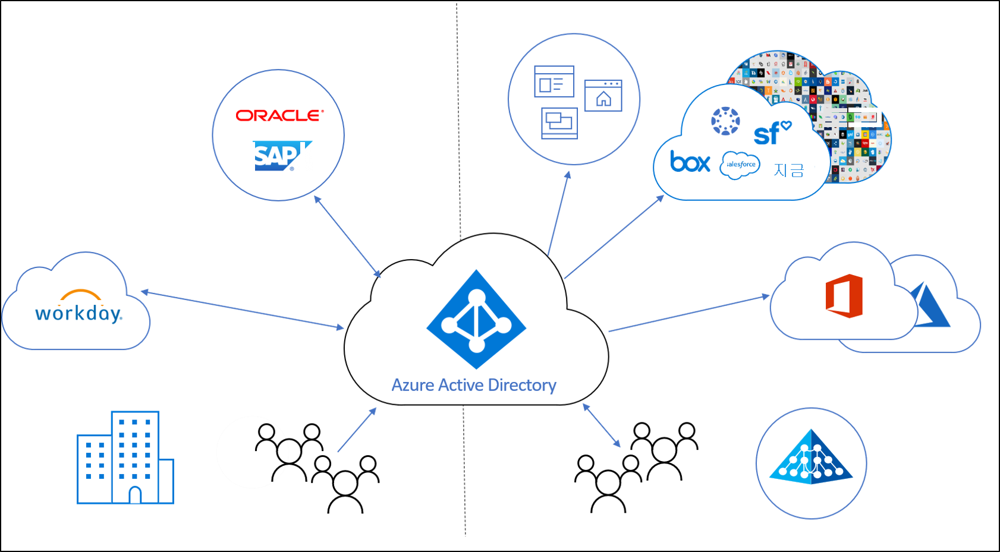
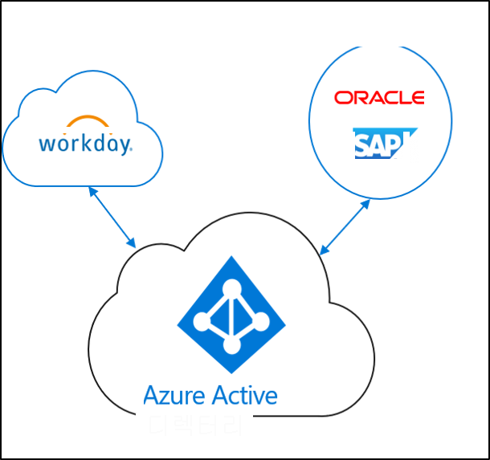

# ID 프로비저닝이란?

오늘날의 비즈니스와 기업에서는 온-프레미스와 클라우드 애플리케이션이 점점 더 많이 혼합되고 있습니다.  사용자는 온-프레미스 및 클라우드 모두에서 애플리케이션에 액세스해야 합니다. 이러한 다양한 애플리케이션(온-프레미스 및 클라우드) 전체에 걸쳐 단일 ID가 있어야 합니다.

프로비저닝은 특정 조건에 따라 개체를 만들고, 개체를 최신 상태로 유지하며, 조건이 더 이상 충족되지 않으면 개체를 삭제하는 프로세스입니다. 예를 들어 새 사용자가 조직에 참여하면 해당 사용자가 HR 시스템에 입력됩니다.  이 시점에서 프로비저닝은 클라우드, Active Directory 및 사용자가 액세스해야 하는 다양한 애플리케이션에서 해당 사용자 계정을 만들 수 있습니다.  이를 통해 사용자는 작업을 시작하고, 하루에 필요한 애플리케이션과 시스템에 액세스할 수 있습니다. 

Azure Active Directory와 관련하여 프로비저닝은 다음과 같은 주요 시나리오로 분류할 수 있습니다.  

- **[HR 기반 프로비저닝](#hr-driven-provisioning)**  
- **[앱 프로비저닝](#app-provisioning)**  
- **[디렉터리 프로비저닝](#directory-provisioning)** 

## HR 기반 프로비저닝

HR에서 클라우드로 프로비저닝하려면 HR 시스템에 있는 정보를 기반으로 하여 개체(사용자, 역할, 그룹 등)를 만들어야 합니다.  

가장 일반적인 시나리오는 새 직원이 회사에 참여할 때 HR 시스템에 입력되는 것입니다.  이 문제가 발생하면 클라우드에 프로비저닝됩니다.  이 경우 Azure AD입니다.  HR에서 프로비저닝하는 경우 다음 시나리오를 처리할 수 있습니다. 

- **새 직원 채용** - 새 직원이 클라우드 HR에 추가되면 Active Directory, Azure Active Directory 그리고 선택적으로 Azure AD에서 지원하는 Microsoft 365 및 기타 SaaS 애플리케이션에서 사용자 계정을 자동으로 만들며, 이메일 주소가 클라우드 HR에 기록되어 저장됩니다.
- **직원 특성 및 프로필 업데이트** - 직원 레코드(예: 이름, 직함 및 관리자)가 클라우드 HR에서 업데이트되면 Active Directory, Azure Active Directory 그리고 선택적으로 Azure AD에서 지원하는 Microsoft 365 및 기타 SaaS 애플리케이션에서 해당 사용자 계정을 자동으로 업데이트합니다.
- **직원 해임** - 직원이 클라우드 HR에서 해임되면 Active Directory, Azure Active Directory 그리고 선택적으로 Azure AD에서 지원하는 Office 365 및 기타 SaaS 애플리케이션에서 해당 사용자 계정을 자동으로 사용하지 않도록 설정됩니다.
- **직원 다시 채용** - 직원이 클라우드 HR에서 다시 채용되면 Active Directory, Azure Active Directory 그리고 선택적으로 Azure AD에서 지원하는 Microsoft 365 및 기타 SaaS 애플리케이션에서 기본 설정에 따라 해당 직원의 이전 계정을 자동으로 다시 활성화하거나 다시 프로비저닝할 수 있습니다.

## 앱 프로비저닝

Azure AD(Azure Active Directory)에서 **[앱 프로비저닝](../app-provisioning/user-provisioning.md)** 이라는 용어는 사용자가 액세스해야 하는 클라우드 애플리케이션에서 사용자 ID와 역할을 자동으로 만드는 것을 의미합니다. 자동 프로비저닝에는 사용자 ID를 생성하는 것 외에도 상태 또는 역할이 변경될 때 사용자 ID의 유지 관리 및 제거가 포함됩니다. 일반적인 시나리오에는 Azure AD 사용자를 [Dropbox](../saas-apps/dropboxforbusiness-provisioning-tutorial.md), [Salesforce](../saas-apps/salesforce-provisioning-tutorial.md), [ServiceNow](../saas-apps/servicenow-provisioning-tutorial.md) 등과 같은 애플리케이션에 프로비저닝하는 것이 포함됩니다.

## 디렉터리 프로비저닝

온-프레미스 프로비저닝에서는 온-프레미스 원본(예: Active Directory)에서 Azure AD로 프로비저닝됩니다.  

가장 일반적인 시나리오는 AD(Active Directory)의 사용자가 Azure AD로 프로비저닝되는 경우입니다.

이는 Azure AD Connect 동기화, Azure AD Connect 클라우드 프로비저닝 및 Microsoft Identity Manager를 통해 수행됩니다. 
 
## 다음 단계 

- [Azure AD Connect 클라우드 동기화란?](what-is-cloud-sync.md)
- [클라우드 프로비저닝 설치](how-to-install.md)