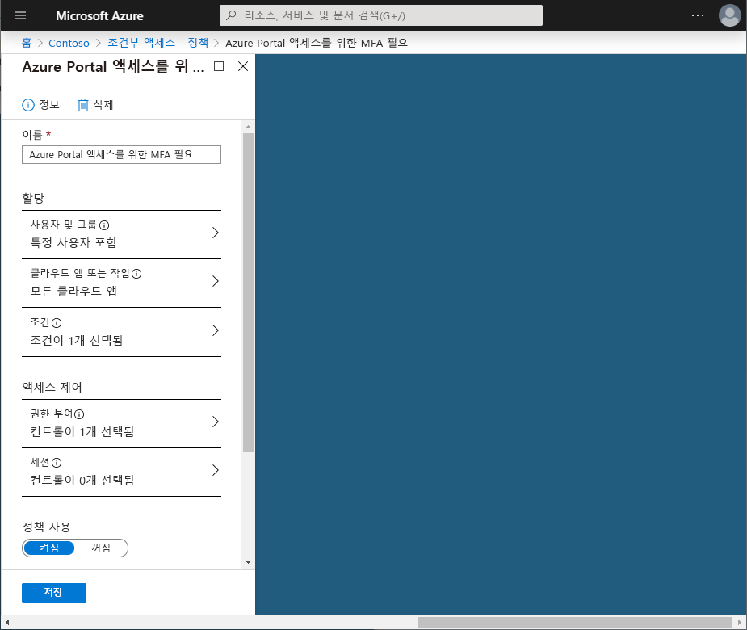

# 빠른 시작: Azure Active Directory 조건부 액세스를 사용하는 특정 앱에 MFA 요구

사용자의 로그인 환경을 간소화하기 위해 사용자가 사용자 이름 및 암호를 사용하여 클라우드 앱에 로그인하도록 허용할 수 있습니다. 그러나 대부분의 환경에는 MFA(Multi-Factor Authentication) 같은 강력한 형태의 계정 확인을 요구해야 하는 앱이 적어도 몇 개씩 있습니다. 이 정책은 조직의 이메일 시스템 또는 HR 앱에 대한 액세스를 예로 들 수 있습니다. Azure AD(Azure Active Directory)에서는 조건부 액세스 정책을 사용하여 이 목표를 달성할 수 있습니다.

이 빠른 시작에서는 해당 환경에서 선택한 클라우드 앱에 다단계 인증을 요구하는 [Azure AD 조건부 액세스 정책](../active-directory-conditional-access-azure-portal.md)을 구성하는 방법을 보여줍니다.

Azure 구독이 아직 없는 경우 시작하기 전에 [체험 계정](https://azure.microsoft.com/free/?WT.mc_id=A261C142F)을 만듭니다.

## 필수 조건

이 빠른 시작의 시나리오를 완료하려면 다음이 필요합니다.

- **Azure AD Premium Edition에 대한 액세스 권한** - Azure AD 조건부 액세스는 Azure AD Premium 기능입니다.
- **Isabella Simonsen이라고 하는 테스트 계정** - 테스트 계정을 만드는 방법을 모르는 경우 [클라우드 기반 사용자 추가](../fundamentals/add-users-azure-active-directory.md#add-a-new-user)를 참조하세요.

이 빠른 시작의 시나리오를 진행하려면 테스트 계정에 대해 사용자별 MFA를 사용하지 않도록 설정해야 합니다. F자세한 내용은 [사용자에 대해 2단계 인증이 필요하도록 설정하는 방법](../authentication/howto-mfa-userstates.md)을 참조하세요.

## 환경 테스트

이 단계의 목표는 조건부 액세스 정책 없이 환경에 대한 인상을 가져오는 것입니다.

**환경을 초기화하려면:**

1. Azure Portal에 Isabella Simonsen으로 로그인합니다.
1. 로그아웃합니다.

## 조건부 액세스 정책 만들기

이 섹션에서는 필요한 조건부 액세스 정책을 만드는 방법을 보여줍니다. 이 빠른 시작의 시나리오에서는 다음을 사용합니다.

- MFA를 요구하는 클라우드 앱의 자리 표시자로 사용할 Azure Portal. 
- 조건부 액세스 정책을 테스트할 샘플 사용자.  

정책에서 다음을 설정합니다.

| 설정 | 값 |
| --- | --- |
| 개요 | Isabella Simonsen |
| 클라우드 앱 | Microsoft Azure 관리 |
| 액세스 권한 부여 | Multi-Factor Authentication 필요 |

**조건부 액세스 정책을 구성하려면:**

1. [Azure Portal](https://portal.azure.com)에 전역 관리자, 보안 관리자 또는 조건부 액세스 관리자 권한으로 로그인합니다.
1. Azure Portal에서 **Azure Active Directory**를 검색하고 선택합니다.

   

1. **Azure Active Directory** 페이지의 **보안** 섹션에서 **조건부 액세스**를 클릭합니다.

   

1. **조건부 액세스** 페이지의 위쪽 도구 모음에서 **새 정책**을 클릭합니다.

   

1. **새로 만들기** 페이지의 **이름** 텍스트 상자에 **Azure Portal에 액세스하려면 MFA 필요**를 입력합니다.

   

1. **할당** 섹션에서 **사용자 및 그룹**을 클릭합니다.

   

1. **사용자 및 그룹** 페이지에서 다음 단계를 수행합니다.

   

   1. **사용자 및 그룹 선택**을 클릭한 다음, **사용자 및 그룹**을 선택합니다.
   1. **선택**을 클릭합니다.
   1. **선택** 페이지에서 **Isabella Simonsen**을 선택한 다음, **선택**을 클릭합니다.
   1. **사용자 및 그룹** 페이지에서 **완료**를 클릭합니다.

1. **클라우드 앱**을 클릭합니다.

   

1. **클라우드 앱** 페이지에서 다음 단계를 수행합니다.

   

   1. **앱 선택**을 클릭합니다.
   1. **선택**을 클릭합니다.
   1. **선택** 페이지에서 **Microsoft Azure 관리**를 선택한 다음, **선택**을 클릭합니다.
   1. **클라우드 앱** 페이지에서 **완료**를 클릭합니다.

1. **액세스 제어** 섹션에서 **허용**을 클릭합니다.

   

1. **허용** 페이지에서 다음 단계를 수행합니다.

   

   1. **액세스 권한 부여**를 선택합니다.
   1. **다단계 인증 필요**를 선택합니다.
   1. **선택**을 클릭합니다.

1. **정책 사용** 섹션에서 **켬**을 클릭합니다.

   

1. **만들기**를 클릭합니다.

## 시뮬레이션된 로그인 평가

조건부 액세스 정책을 구성했으니, 예상대로 작동하는지 확인해야 합니다. 첫 번째 단계로, 조건부 액세스 what if 정책 도구를 사용하여 테스트 사용자 로그인을 시뮬레이션합니다. 이 시뮬레이션은 이 로그인이 정책에 미치는 영향을 평가하고, 시뮬레이션 보고서를 생성합니다.  

**What If** 정책 평가 도구를 초기화하려면 다음을 설정합니다.

- 사용자로 **Isabella Simonsen**
- 클라우드 앱으로 **Microsoft Azure 관리**

**What If**를 클릭하면 다음 내용을 보여주는 시뮬레이션 보고서가 작성됩니다.

- **적용되는 정책** 아래에 **Azure Portal에 액세스하려면 MFA 필요**
- **권한 부여 컨트롤**로 **Multi-Factor Authentication 필요**.

**조건부 액세스 정책을 평가하려면:**

1. [조건부 액세스 - 정책](https://portal.azure.com/#blade/Microsoft_AAD_IAM/ConditionalAccessBlade/Policies) 페이지의 위쪽 메뉴에서 **What If**를 클릭합니다.  

   

1. **사용자**를 클릭하고, **Isabella Simonsen**을 선택하고, **선택**을 클릭합니다.

   

1. 클라우드 앱을 선택하려면 다음 단계를 수행합니다.

   

   1. **클라우드 앱**을 클릭합니다.
   1. **클라우드 앱** 페이지에서 **앱 선택**을 클릭합니다.
   1. **선택**을 클릭합니다.
   1. **선택** 페이지에서 **Microsoft Azure 관리**를 선택한 다음, **선택**을 클릭합니다.
   1. 클라우드 앱 페이지에서 **완료**를 클릭합니다.

1. **What If**를 클릭합니다.

## 조건부 액세스 정책을 테스트합니다.

이전 섹션에서는 시뮬레이션된 로그인을 평가하는 방법을 배웠습니다. 시뮬레이션 외에도, 조건부 액세스 정책이 예상대로 작동하는지 테스트해야 합니다.

정책을 테스트하려면 **Isabella Simonsen** 테스트 계정을 사용하여 [Azure portal](https://portal.azure.com)에 로그인합니다. 계정에 추가 보안 확인을 설정하라고 요구하는 대화 상자가 표시됩니다.

## 리소스 정리

테스트 사용자 및 조건부 액세스 정책이 더 이상 필요 없으면 삭제합니다.

- Azure AD 사용자를 삭제하는 방법을 모르겠으면 [Azure AD에서 사용자 삭제](../fundamentals/add-users-azure-active-directory.md#delete-a-user)를 참조하세요.
- 정책을 삭제하려면 정책을 선택하고, 빠른 실행 도구 모음에서 **삭제**를 클릭합니다.

    

## 다음 단계

> [!div class="nextstepaction"]
> [허용할 사용 약관 필요](require-tou.md)
> [세션 위험이 감지되면 액세스 차단](app-sign-in-risk.md)
