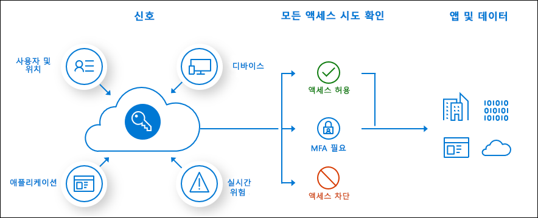

# 조건부 액세스란?

최신 보안 경계는 사용자 및 디바이스 ID를 포함하도록 조직의 네트워크 너머로 확장됩니다. 조직에서는 액세스 제어 결정의 일환으로 이러한 ID 신호를 활용할 수 있습니다. 

조건부 액세스는 Azure Active Directory에서 신호를 주고 결정을 내리고 조직 정책을 적용하기 위해 사용하는 도구입니다. 조건부 액세스는 새로운 ID 중심 제어 평면의 핵심입니다.

가장 간단한 조건부 액세스 정책은 사용자가 리소스에 액세스하려면 작업을 완료해야 하는 if-then 문입니다. 예제: 급여 관리자는 급여 애플리케이션에 액세스하려고 하며, 액세스하려면 다단계 인증을 수행해야 합니다.

관리자는 다음과 같은 두 가지 주요 목표에 직면합니다.

- 사용자가 언제 어디서나 생산성을 높일 수 있도록 지원
- 조직의 자산 보호

조건부 액세스 정책을 사용하면 필요할 때 적절한 액세스 제어를 적용하여 조직의 보안을 유지하고, 필요하지 않을 때에는 사용자가 원하는 대로 하도록 놔둘 수 있습니다.

1단계 인증이 완료된 후 조건부 액세스 정책이 적용됩니다. 조건부 액세스는 DoS(서비스 거부) 공격 같은 시나리오에서 최전방 방어선으로 사용하기 위해 개발된 것은 아니지만, 이러한 이벤트의 신호를 활용하여 액세스를 결정할 수 있습니다.

## 일반적인 신호

정책 결정을 내릴 때 조건부 액세스에서 고려할 수 있는 일반적인 신호는 다음과 같습니다.

- 사용자 또는 그룹 멤버 자격
   - 특정 사용자 및 그룹을 정책 대상으로 지정하여 관리자에게 세분화된 액세스 제어 권한을 제공할 수 있습니다.
- IP 위치 정보
   - 조직에서는 정책을 결정할 때 사용할 수 있는 신뢰할 수 있는 IP 주소 범위를 만들 수 있습니다. 
   - 관리자는 전체 국가의 IP 범위를 지정하여 해당 범위의 트래픽을 차단하거나 허용할 수 있습니다.
- 디바이스
   - 특정 플랫폼이 설치된 디바이스 또는 특정 상태로 표시된 디바이스를 사용하는 사용자는 조건부 액세스 정책을 적용할 때 사용할 수 있습니다.
- 애플리케이션
   - 특정 애플리케이션에 액세스하려는 사용자는 다른 조건부 액세스 정책을 트리거할 수 있습니다. 
- 계산된 실시간 위험 감지
   - Azure AD ID 보호와 신호를 통합하면 조건부 액세스 정책을 통해 위험한 로그인 동작을 식별할 수 있습니다. 그러면 사용자가 암호를 변경하거나 다단계 인증을 수행하도록 요구하는 정책을 적용하여 사용자의 위험도를 낮추거나 관리자가 수동 작업을 수행할 때까지 액세스를 차단할 수 있습니다.
- MCAS(Microsoft Cloud App Security)
   - 사용자 애플리케이션 액세스 및 세션을 실시간으로 모니터링 및 제어하여 클라우드 환경 내에서 수행되는 작업에 대한 액세스를 제어하고 가시성을 높일 수 있습니다.

## 일반적인 결정

- 액세스 차단
   - 가장 제한적인 결정
- 액세스 권한 부여
   - 가장 제한이 적은 결정에서도 다음 옵션 중 하나 이상을 요구할 수 있습니다.
      - Multi-Factor Authentication 필요
      - 디바이스를 준수 상태로 표시해야 함
      - 하이브리드 Azure AD 조인된 디바이스 필요
      - 승인된 클라이언트 앱 필요
      - 앱 보호 정책 필요(미리 보기)

## 일반적으로 적용되는 정책

많은 조직의 일반적인 액세스 관련 문제는 다음과 같은 조건부 액세스 정책으로 해결할 수 있습니다.

- 관리자 역할이 할당된 사용자에게 다단계 인증 요구
- Azure 관리 작업 시 다단계 인증 요구
- 레거시 인증 프로토콜을 사용하려고 시도하는 사용자의 로그인 차단
- Azure Multi-Factor Authentication 등록 시 신뢰할 수 있는 위치 요구
- 특정 위치의 액세스 차단 또는 액세스 권한 부여
- 위험한 로그인 동작 차단
- 특정 애플리케이션에는 조직에서 관리하는 디바이스를 사용하도록 요구

## 라이선스 요구 사항

[!INCLUDE [Active Directory P1 license](../../../includes/active-directory-p1-license.md)]

[Microsoft 365 Business 라이선스](https://docs.microsoft.com/office365/servicedescriptions/microsoft-365-service-descriptions/microsoft-365-business-service-description)가 있는 고객은 조건부 액세스 기능에도 액세스할 수 있습니다. 

## 다음 단계

[단계별로 조건부 액세스 정책 작성](concept-conditional-access-policies.md)

사용자 환경에서 조건부 액세스를 구현하는 방법은 [Azure Active Directory에서 조건부 액세스 배포 계획](plan-conditional-access.md)을 참조하세요.

[ID 보호에 대한 자세한 정보](../identity-protection/overview-v2.md)

[Microsoft Cloud App Security에 대한 자세한 정보](https://docs.microsoft.com/cloud-app-security/what-is-cloud-app-security)

[Microsoft Intune에 대한 자세한 정보](https://docs.microsoft.com/intune/index)