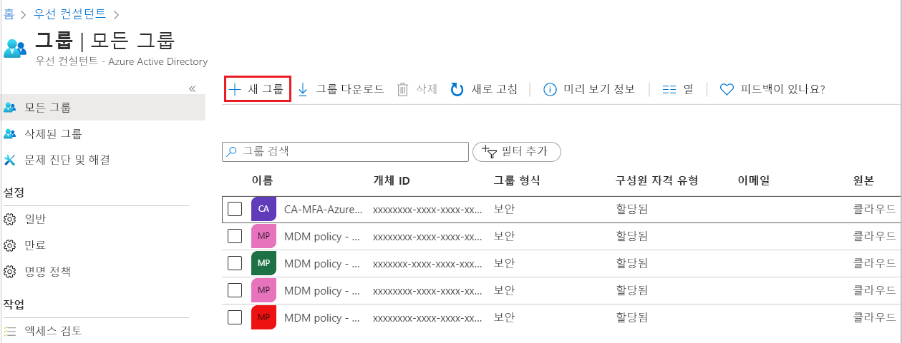
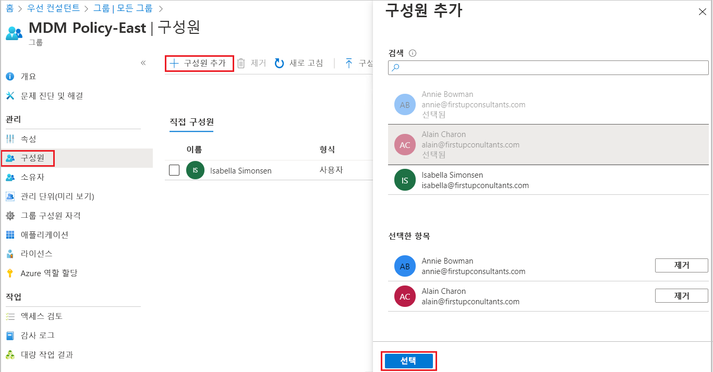

# Azure Active Directory를 사용하여 기본 그룹 만들기 및 멤버 추가
Azure AD(Azure Active Directory) 포털을 사용하여 기본 그룹을 만들 수 있습니다. 이 문서에서 기본 그룹은 리소스 소유자(관리자)에 의해 단일 리소스에 추가되고 해당 리소스에 액세스해야 하는 특정 멤버(직원)를 포함합니다. 동적 멤버 자격 및 규칙 만들기를 포함한 더 복잡한 시나리오의 경우 [Azure Active Directory 사용자 관리 설명서](../enterprise-users/index.yml)를 참조하세요.

## 그룹 및 멤버 자격 유형
그룹 및 멤버 자격 유형에는 여러 가지가 있습니다. 다음 정보는 그룹을 만들 때 사용할 옵션을 결정하는 데 도움이 되도록 각 그룹 및 멤버 자격 유형과 사용 이유에 대해 설명합니다.

### 그룹 유형:
- **보안**. 사용자 그룹의 공유 리소스에 대한 멤버 및 컴퓨터 액세스를 관리하는 데 사용됩니다. 예를 들어 특정 보안 정책의 보안 그룹을 만들 수 있습니다. 이렇게 하면 각 멤버에 개별적으로 권한을 추가할 필요 없이 한 번에 모든 멤버에게 권한 집합을 제공할 수 있습니다. 보안 그룹은 사용자, 디바이스, 그룹 및 서비스 주체를 구성원으로, 사용자 및 사용자 주체를 해당 소유자로 가질 수 있습니다. 리소스의 액세스 관리 방법에 대한 자세한 내용은 [Azure Active Directory 그룹을 사용하여 리소스에 대한 액세스 관리](active-directory-manage-groups.md)를 참조하세요.
- **Microsoft 365**. 공유 사서함, 일정, 파일, SharePoint 사이트 등에 대한 액세스를 멤버에게 부여하여 협업 기회를 제공합니다. 이 옵션을 통해 조직 외부에 있는 사용자에게 그룹에 대한 액세스를 제공할 수 있습니다. Microsoft 365 그룹에는 사용자만 멤버로 지정할 수 있습니다. 사용자와 서비스 주체는 모두 Microsoft 365 그룹의 소유자가 될 수 있습니다. Microsoft 365 그룹에 대 한 자세한 내용은 [Microsoft 365 그룹에 대 한](https://support.office.com/article/learn-about-office-365-groups-b565caa1-5c40-40ef-9915-60fdb2d97fa2)자세한 정보를 참조 하세요.

### 멤버 자격 유형:
- **할당됨.** 특정 사용자를 이 그룹의 멤버로서, 고유한 권한을 가지도록 추가할 수 있습니다. 이 문서에서는 이 옵션을 사용합니다.
- **동적 사용자.** 동적 멤버 자격 규칙을 사용하여 멤버를 자동으로 추가하고 제거할 수 있습니다. 멤버의 특성이 변경되면 시스템은 디렉터리의 동적 그룹 규칙을 확인하여 멤버가 규칙 요구 사항을 충족하는지(추가됨), 아니면 더 이상 규칙 요구 사항을 충족하지 않는지(제거됨) 확인합니다.
- **동적 디바이스.** 동적 그룹 규칙을 사용하여 디바이스를 자동으로 추가하고 제거할 수 있습니다. 디바이스의 특성이 변경되면 시스템은 디렉터리의 동적 그룹 규칙을 확인하여 디바이스가 규칙 요구 사항을 충족하는지(추가됨), 아니면 더 이상 규칙 요구 사항을 충족하지 않는지(제거됨) 확인합니다.

    > [!IMPORTANT]
    > 디바이스 또는 사용자 중 하나의 동적 그룹만 만들 수 있습니다. 또한 디바이스 소유자의 특성을 기반으로 디바이스 그룹을 만들 수는 없습니다. 디바이스 멤버 자격 규칙은 디바이스 특성만 참조할 수 있습니다. 사용자 및 디바이스에 대한 동적 그룹을 만드는 방법에 대한 자세한 내용은 [동적 그룹 만들기 및 상태 확인](../enterprise-users/groups-create-rule.md)을 참조하세요.

## 기본 그룹 만들기 및 멤버 추가
기본 그룹을 만들고 동시에 멤버를 추가할 수 있습니다. 기본 그룹을 만들고 멤버를 추가하려면 다음 절차를 따르십시오.

1. 디렉터리에 대한 글로벌 관리자 계정을 사용하여 [Azure Portal](https://portal.azure.com)에 로그인합니다.

1. **Azure Active Directory** 를 검색하고 선택합니다.

1. **Active Directory** 페이지에서 **그룹** 을 선택한 다음 **새 그룹** 을 선택합니다.

    

1. **새 그룹** 창이 표시되면 필요한 정보를 입력해야 합니다.

    

1. 미리 정의된 **그룹 유형** 을 선택합니다. 그룹 종류에 대한 자세한 내용은 [그룹 및 멤버 자격 형식](#group-types)을 참조하세요.

1. **그룹 이름** 을 만들고 추가합니다. 기억하기 쉽고 의미 있는 그룹 이름을 추가합니다. 이름이 다른 그룹에 이미 사용되고 있는지 확인하는 검사가 수행됩니다. 이름이 이미 사용 중이면 중복된 이름을 지정하지 않도록 그룹 이름을 수정하라는 메시지가 표시됩니다.

1. 그룹에 대한 **그룹 이메일 주소** 를 추가하거나 자동으로 채워진 이메일 주소를 유지합니다.

1. **그룹 설명.** 그룹에 선택적 설명을 추가합니다.

1. 미리 정의된 **멤버 자격 유형(필수)** 을 선택합니다. 멤버 자격 형식에 대한 자세한 내용은 [그룹 및 멤버 자격 형식](#membership-types)을 참조하세요.

1. **만들기** 를 선택합니다. 그룹이 만들어지고 멤버를 추가할 준비가 되었습니다.

1. **그룹** 페이지에서 **멤버** 영역을 선택한 후 **멤버 선택** 페이지에서 그룹에 추가할 멤버를 검색하기 시작합니다.

    

1. 멤버 추가를 마치면 **선택** 을 선택합니다.

    **그룹 개요** 페이지는 현재 그룹에 추가된 멤버 수를 표시하도록 업데이트됩니다.

    

## 환영 이메일 켜기 또는 끄기

동적 또는 정적 구성원 자격을 사용 하 여 새 Microsoft 365 그룹이 만들어지면 그룹에 추가 된 모든 사용자에 게 시작 알림이 전송 됩니다. 사용자 또는 디바이스의 특성이 변경되면 멤버 자격 변경 가능성에 대비하여 조직의 모든 동적 그룹 규칙이 처리됩니다. 그런 다음, 추가된 사용자도 환영 알림을 받습니다. [Exchange PowerShell](/powershell/module/exchange/users-and-groups/Set-UnifiedGroup)에서 이 동작을 끌 수 있습니다. 

## 다음 단계

- [그룹을 사용하여 SaaS 앱에 대한 액세스 관리](../enterprise-users/groups-saasapps.md)
- [PowerShell 명령을 사용하여 그룹 관리](../enterprise-users/groups-settings-v2-cmdlets.md)
