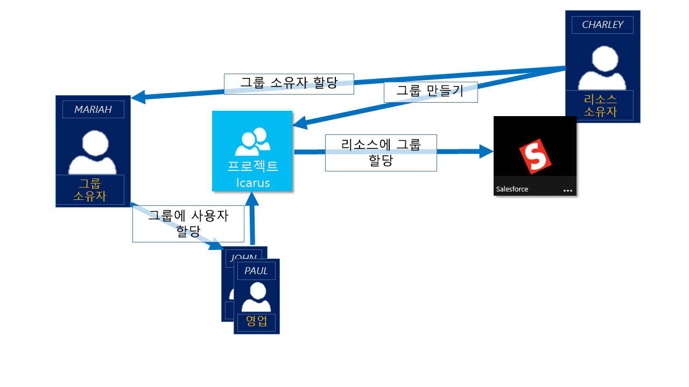
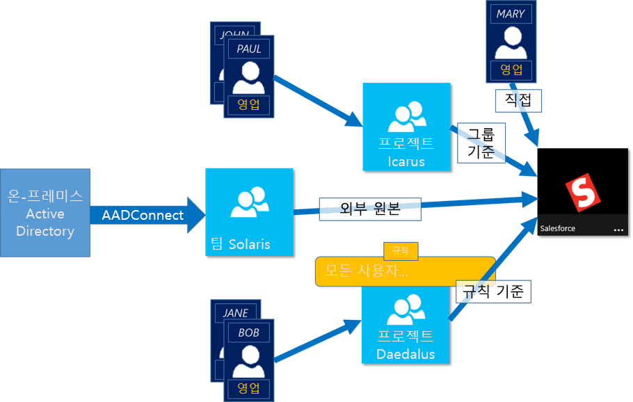

# Azure Active Directory 그룹을 사용하여 앱 및 리소스 액세스 관리
Azure Active Directory (Azure AD)를 사용 하면 그룹을 사용 하 여 클라우드 기반 앱, 온-프레미스 앱 및 리소스에 대 한 액세스를 관리할 수 있습니다. 리소스는 azure ad의 역할을 통해 개체를 관리 하는 권한, SaaS (Software as a Service) 앱, Azure 서비스, SharePoint 사이트 및 온-프레미스 리소스와 같은 조직 외부에 있는 Azure AD 조직의 일부일 수 있습니다.

>[!NOTE]
> Azure Portal에서는 포털에서 관리할 수 없는 멤버 자격 및 그룹 세부 정보를 포함 하는 일부 그룹을 볼 수 있습니다.
>
> - 온-프레미스 Active Directory에서 동기화 된 그룹은 온-프레미스 Active Directory 에서만 관리할 수 있습니다.
> - 메일 그룹 및 메일 사용이 가능한 보안 그룹과 같은 다른 그룹 유형은 Exchange 관리 센터 또는 Microsoft 365 관리 센터 에서만 관리 됩니다. 이러한 그룹을 관리 하려면 Exchange 관리 센터 또는 Microsoft 365 관리 센터에 로그인 해야 합니다.

## Azure AD에서 액세스 관리를 작동 하는 방법

Azure AD는 단일 사용자 또는 전체 Azure AD 그룹에게 액세스 권한을 제공하여 조직의 리소스에 액세스하는 데 유용합니다. 그룹을 사용하면 리소스 소유자(또는 Azure AD 디렉터리 소유자)가 구성원 한 명씩에게 권한을 제공하는 대신 액세스 권한 집합을 그룹의 모든 구성원에게 할당할 수 있습니다. 리소스 또는 디렉터리 소유자는 부서 관리자 또는 기술 지원팀 관리자와 같은 다른 담당자에게 구성원 목록에 대한 관리 권한을 부여하면서, 해당 담당자가 필요에 따라 구성원을 추가하고 제거하도록 할 수 있습니다. 그룹 소유자 관리 방법에 대한 자세한 내용은 [그룹 소유자 관리](active-directory-accessmanagement-managing-group-owners.md)를 참조

## 액세스 권한을 할당하는 방법

사용자에게 리소스 액세스 권한을 할당하는 방법은 다음과 같이 네 가지가 있습니다.

- **직접 할당.** 리소스 소유자는 사용자를 리소스에 직접 할당합니다.

- **그룹 할당.** 리소스 소유자는 Azure AD 그룹을 리소스에 할당하여 자동으로 모든 그룹 구성원에게 리소스에 대한 액세스 권한을 부여합니다. 그룹 구성원 자격은 그룹 소유자 및 리소스 소유자 모두에 의해 관리되고,두 소유자 중 하나가 그룹에서 구성원을 추가하거나 제거할 수 있습니다. 그룹 구성원 자격을 추가하거나 제거하는 방법에 대한 자세한 내용은 [방법: Azure Active Directory 포털을 사용하여 다른 그룹에서 그룹 추가 또는 제거](active-directory-groups-membership-azure-portal.md)를 참조하세요. 

- **규칙 기반 할당.** 리소스 소유자는 그룹을 만들고 규칙을 사용하여 특정 리소스에 할당되는 사용자를 정의합니다. 규칙은 개별 사용자에게 할당되는 특성을 따릅니다. 리소스 소유자는 규칙을 관리하며, 리소스에 대한 액세스를 허용하는 데 필요한 특성 및 값을 결정합니다. 자세한 내용은 [동적 그룹 만들기 및 상태 확인](../users-groups-roles/groups-create-rule.md)을 참조 하세요.

    동적 그룹 만들기 및 사용 방법에 대한 빠른 설명은 이 짧은 비디오를 시청하면 됩니다.

    >[!VIDEO https://channel9.msdn.com/Series/Azure-Active-Directory-Videos-Demos/Azure-AD--Introduction-to-Dynamic-Memberships-for-Groups/player]

- **외부 기관 할당.** 온-프레미스 디렉터리 또는 SaaS 앱 등의 외부 소스에서 액세스가 제공됩니다. 이 상황에서 리소스 소유자가 리소스에 대한 액세스 권한을 제공하는 그룹을 할당한 다음, 외부 소스가 그룹 구성원을 관리합니다.

   

## 사용자는 할당되지 않고 그룹에 조인할 수 있나요?
그룹 소유자는 사용자가 자신의 그룹을 할당하지 않고 조인할 자신의 그룹을 찾도록 할 수 있습니다. 소유자는 조인하는 모든 사용자를 자동으로 수용하거나 승인이 필요하도록 그룹을 설정할 수도 있습니다.

사용자가 그룹에 조인을 요청하면 해당 요청은 그룹 소유자에게 전달됩니다. 필요한 경우 소유자는 요청을 승인할 수 있으며, 사용자는 그룹 구성원 자격을 통보받습니다. 그러나 소유자가 여러 명이고 그 중 한 명이 승인하지 않으면 사용자는 통보는 받지만 그룹에 추가되지는 않습니다. 사용자가 그룹에 조인을 요청하게 하는 방법에 대한 자세한 내용 및 지침은 [사용자가 그룹에 조인을 요청할 수 있도록 Azure AD 설정](../users-groups-roles/groups-self-service-management.md)을 참조

## 다음 단계
그룹을 사용하여 액세스를 관리하는 방법에 대해 어느 정도 소개했으므로 이제 리소스 및 앱을 관리하는 방법을 시작합니다.

- [Azure Active Directory를 사용하여 새 그룹 만들기](active-directory-groups-create-azure-portal.md) 또는 [PowerShell cmdlet를 사용하여 새 그룹 만들기 및 관리](../users-groups-roles/groups-settings-v2-cmdlets.md)

- [그룹을 사용하여 통합 SaaS 앱에 대한 액세스 할당](../users-groups-roles/groups-saasapps.md)

- [Azure AD Connect를 사용하여 Azure에 온-프레미스 그룹 동기화](../hybrid/whatis-hybrid-identity.md)
