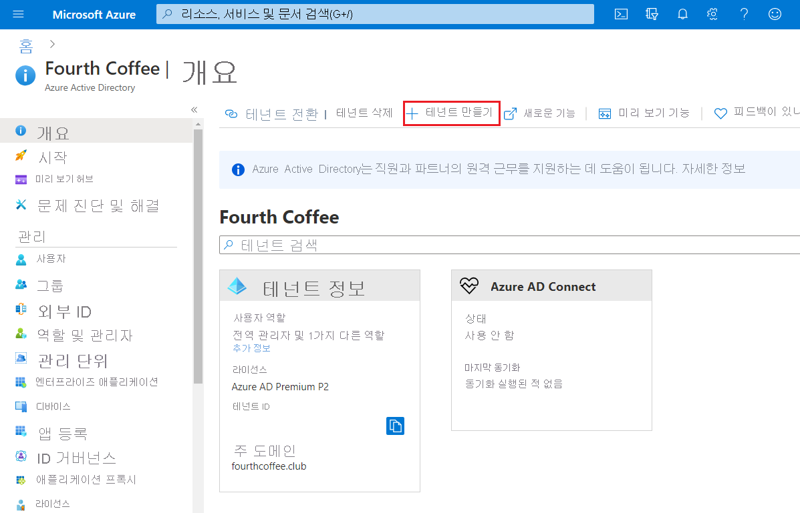

# 방법: Azure Active Directory 포털을 사용하여 사용자 지정 도메인 이름 추가
모든 새로운 Azure AD 테넌트는 *domainname*.onmicrosoft.com이라는 초기 도메인 이름으로 제공됩니다. 초기 도메인 이름을 변경하거나 삭제할 수는 없지만 조직의 이름을 해당 목록에 추가할 수는 있습니다. 사용자 지정 도메인 이름을 추가하면 *alain@contoso.com*과 같이 사용자에게 친숙한 사용자 이름을 만들 수 있습니다.

## 시작하기 전에
사용자 지정 도메인 이름을 추가하기 전에 먼저 도메인 등록 기관을 사용하여 도메인 이름을 만들어여 합니다. 공인된 도메인 등록 기관은 [ICANN-Accredited Registrars](https://www.icann.org/registrar-reports/accredited-list.html)를 참조하십시오.

## Azure AD에서 디렉터리 만들기
도메인 이름을 얻은 후에 첫 번째 Azure AD 디렉터리를 만들 수 있습니다.

1. 디렉터리의 구독 소유자 계정을 사용하여 [Azure Portal](https://portal.azure.com/)에 로그인한 다음, **Azure Active Directory**를 선택합니다.

    

    >[!TIP]
    > Azure AD에서 온-프레미스 Windows Server AD를 페더레이션하려는 경우 Azure AD Connect 도구를 실행하여 디렉터리 동기화를 실행할 때 **내 로컬 Active Directory에서 Single Sign-On하도록 이 도메인을 구성하려고 합니다.** 확인란을 선택해야 합니다. 마법사의 **Azure AD 도메인** 단계에서 온-프레미스 디렉터리와 페더레이션하기 위해 선택한 동일한 도메인 이름을 등록해야 합니다. 마법사의 어떤 단계가 [이 지침에서](../hybrid/how-to-connect-install-custom.md#verify-the-azure-ad-domain-selected-for-federation)와 유사한지를 확인할 수 있습니다. Azure AD Connect 도구가 없는 경우 [여기서 다운로드](http://go.microsoft.com/fwlink/?LinkId=615771)할 수 있습니다.

2. [조직의 새 테넌트 만들기](active-directory-access-create-new-tenant.md#create-a-new-tenant-for-your-organization)의 단계에 따라 새 디렉터리를 만듭니다.

    >[!Important]
    >테넌트를 만든 사용자는 자동으로 해당 테넌트에 대한 글로벌 관리자가 됩니다. 글로벌 관리자는 해당 테넌트에 추가 관리자를 추가할 수 있습니다.

## Azure AD에 사용자 지정 도메인 이름 추가
디렉터리를 만든 후에 사용자 지정 도메인 이름을 추가할 수 있습니다.

1. **사용자 지정 도메인 이름**을 선택한 다음, **사용자 지정 도메인 추가**를 선택합니다.

    

2. 조직의 새 도메인 이름을 **사용자 지정 도메인 이름** 상자(예를 들어, _contoso.com_)에 입력한 다음, **도메인 추가**를 선택합니다.

    확인되지 않은 도메인이 추가되고 **Contoso** 페이지에 해당 DNS 정보가 표시됩니다.

    >[!Important]
    >이 기능이 제대로 작동하려면 .com, .net, 또는 기타 최상위 확장명을 포함해야 합니다.

    

4. DNS 정보를 **Contoso** 페이지에서 복사합니다. 예: MS=ms64983159

    

## DNS 정보를 도메인 등록 기관에 추가
Azure AD에 사용자 지정 도메인 이름을 추가한 후에 해당 도메인 등록 기관으로 돌아가서 복사된 TXT 파일에서 Azure AD DNS 정보를 추가해야 합니다. 도메인에 대해 이 TXT 레코드를 만들면 해당 도메인 이름의 소유권을 "확인합니다".

-  도메인 등록 기관으로 돌아가 복사된 DNS 정보에 기반한 도메인에 대해 새 TXT 레코드를 만들고 **TTL**(time to live)을 60분으로 설정한 다음, 해당 정보를 저장합니다.

    >[!Important]
    >원하는 만큼 많은 도메인 이름을 등록할 수 있습니다. 그러나 각 도메인은 Azure AD에서 자체 TXT 레코드를 가져옵니다. 도메인 등록 기관에 TXT 파일 정보를 입력할 때 주의해야 합니다. 실수로 잘못 입력하거나 중복된 정보를 입력한 경우 다시 시도하기 전에 TTL(60분) 시간이 종료될 때까지 기다려야 합니다.

## 사용자 지정 도메인 이름 확인
사용자 지정 도메인 이름을 등록한 후에 Azure AD에서 해당 도메인 이름이 유효한지 확인해야 합니다. 도메인 등록 기관에서 Azure AD로의 전파는 즉각적으로 발생할 수 있으며 해당 도메인 등록 기관에 따라 며칠이 걸릴 수 있습니다.

### 사용자 지정 도메인 이름을 확인하려면
1. 해당 디렉터리에 대한 글로벌 관리자 계정을 사용하여 [Azure Portal](https://portal.azure.com/)에 로그인합니다.

2. **Azure Active Directory**를 선택한 다음, **사용자 지정 도메인 이름**을 선택합니다.

3. **Fabrikam - 사용자 지정 도메인 이름** 페이지에서 사용자 지정 도메인 이름인 **Contoso**를 선택합니다.

    

4. **Contoso** 페이지에서 **Verify**를 선택하여 사용자 지정 도메인이 제대로 등록되고 Azure AD에 유효한지 확인합니다.

    

## 일반적인 인증 문제
- Azure AD에서 사용자 지정 도메인 이름을 확인할 수 없는 경우 다음 제한 사항을 시도하세요.
    - **1시간 이상 기다렸다가 다시 시도하세요**. Azure AD가 도메인을 확인할 수 있기 전에 DNS 레코드를 전파해야 하고 이 프로세스는 1시간 이상 걸릴 수 있습니다.

    - **DNS 레코드가 올바른지 확인합니다.** 도메인 이름 등록 기관 사이트로 돌아가서 해당 항목이 있는지 확인하고 Azure AD에서 제공한 DNS 항목 정보와 일치하는지 확인합니다.

    등록 기관 사이트의 레코드를 업데이트할 수 없는 경우 항목을 추가하고 그것이 정확한지 확인하는 데 필요한 적절한 권한이 있는 사용자와 해당 항목을 공유해야 합니다.

- **도메인 이름이 이미 다른 디렉터리에서 사용되고 있지 않은지 확인합니다.** 도메인 이름은 하나의 디렉터리에서만 확인할 수 있습니다. 즉, 도메인 이름이 현재 다른 디렉터리에서 확인되면 그 도메인 이름은 새 디렉터리에서도 확인할 수 없습니다. 이 중복 문제를 해결하려면 이전 디렉터리에서 도메인 이름을 삭제해야 합니다. 도메인 이름을 삭제하는 방법에 대한 자세한 정보는 [사용자 지정 도메인 이름 관리](../users-groups-roles/domains-manage.md)를 참조하세요.

- **관리되지 않는 Power BI 테넌트가 없는지 확인합니다.** 사용자가 셀프 서비스 등록을 통해 Power BI를 활성화하고 조직의 관리되지 않는 테넌트를 만든 경우 PowerShell을 사용하여 내부 또는 외부 관리자로 관리를 가져와야 합니다. 관리되지 않는 디렉터리를 가져오는 방법에 대한 자세한 내용은 [Azure Active Directory에서 관리자로 관리되지 않는 디렉터리 가져오기](../users-groups-roles/domains-admin-takeover.md)를 참조하세요.

## 다음 단계

- 다른 글로벌 관리자를 디렉터리에 추가합니다. 자세한 정보는 [역할 및 관리자를 할당하는 방법](active-directory-users-assign-role-azure-portal.md)을 참조하세요.

- 사용자를 도메인에 추가하려면 [사용자를 추가 또는 삭제하는 방법](add-users-azure-active-directory.md)을 참조하세요.

- Azure AD에서 도메인 이름 정보를 관리합니다. 자세한 내용은 [사용자 지정 도메인 이름 관리](../users-groups-roles/domains-manage.md)를 참조하세요.

- Azure Active Directory와 함께 사용하려는 온-프레미스 버전의 Windows Server가 있는 경우 [Azure Active Directory와 온-프레미스 디렉터리 통합](../connect/active-directory-aadconnect.md)을 참조하세요.
