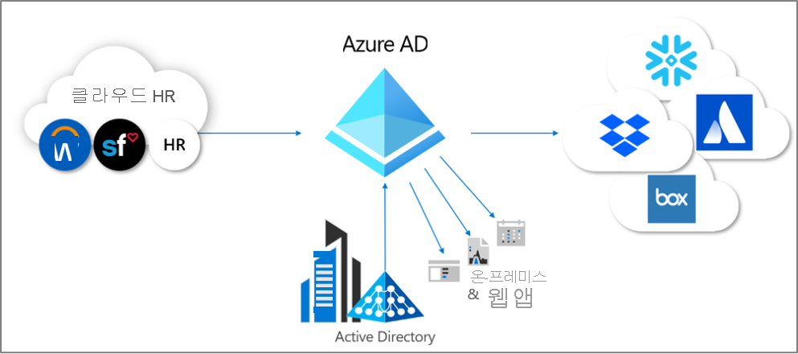
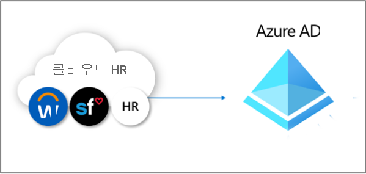
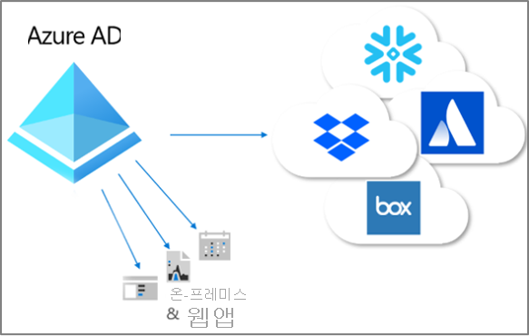

# 프로비저닝이란?

프로비저닝 및 프로비저닝 해제 프로세스는 여러 시스템에서 디지털 ID의 일관성을 보장하는 프로세스입니다.  이러한 프로세스는 일반적으로 [ID 수명 주기 관리](what-is-identity-lifecycle-management.md)의 일부로 활용됩니다.

**프로비저닝** 은 특정 조건에 따라 대상 시스템에서 ID를 만드는 프로세스입니다.  **프로비저닝 해제** 는 조건이 더 이상 충족되지 않을 때 대상 시스템에서 ID를 제거하는 프로세스입니다. **동기화** 는 원본 개체와 대상 개체가 비슷하도록 프로비저닝된 개체를 최신 상태로 유지하는 프로세스입니다.

예를 들어 새 직원이 조직에 참가하면 해당 직원이 HR 시스템에 입력됩니다.  이 시점에서 HR **에서** Azure AD(Azure Active Directory)**로** 프로비저닝하면 Azure AD에서 해당 사용자 계정을 만들 수 있습니다. Azure AD를 쿼리하는 애플리케이션에서 해당 새 직원의 계정을 볼 수 있습니다.  Azure AD를 사용하지 않는 애플리케이션이 있는 경우 Azure AD **에서** 해당 애플리케이션의 데이터베이스 **로** 프로비저닝하면 사용자가 액세스해야 하는 모든 애플리케이션에 액세스할 수 있습니다.  이 프로세스를 통해 사용자는 작업을 시작하고, 첫 번째 작업일에 필요한 애플리케이션과 시스템에 액세스할 수 있습니다.  마찬가지로 HR 시스템에서 부서 또는 고용 상태와 같은 속성이 변경되는 경우 HR 시스템에서 Azure AD로, 더 나아가 다른 애플리케이션 및 대상 데이터베이스로의 업데이트 동기화에서 일관성을 보장합니다.

Azure AD는 현재 세 가지 영역의 자동화된 프로비저닝을 제공합니다.  다음 창이 여기에 포함됩니다.  

- **[HR 기반 프로비저닝](#hr-driven-provisioning)** 을 통해 신뢰할 수 있는 외부 비 디렉터리 레코드 시스템에서 Azure AD로 프로비저닝  
- **[앱 프로비저닝](#app-provisioning)** 을 통해 Azure AD에서 애플리케이션으로 프로비저닝  
- **[디렉터리 간 프로비저닝](#inter-directory-provisioning)** 을 통해 Azure AD와 Active Directory 도메인 서비스 간 프로비저닝 

## HR 기반 프로비저닝

HR에서 Azure AD로 프로비저닝하려면 일반적으로 각 직원을 나타내는 사용자 ID 개체를 만들어야 하지만, 경우에 따라 HR 시스템에 있는 정보를 기반으로 하여 부서 또는 기타 구조를 나타내는 다른 개체도 있습니다.  

가장 일반적인 시나리오는 새 직원이 회사에 참여할 때 HR 시스템에 입력되는 것입니다.  이 작업이 수행되면 새로 고용할 때마다 관리자가 개입할 필요 없이 Azure AD에서 자동으로 새 사용자로 프로비저닝됩니다.  일반적으로 HR에서 프로비저닝하는 경우 처리할 수 있는 시나리오는 다음과 같습니다.

- **새 직원 고용** - 새 직원이 HR 시스템에 추가되면 Active Directory, Azure AD 및 필요에 따라 Azure AD에서 지원하는 다른 애플리케이션의 디렉터리에서 사용자 계정이 자동으로 만들어지고, 이메일 주소가 HR 시스템에 다시 쓰여집니다.
- **직원 특성 및 프로필 업데이트** - 직원 레코드(예: 이름, 직위 또는 관리자)가 해당 HR 시스템에서 업데이트되면 해당 사용자 계정이 Active Directory, Azure AD 및 Azure AD에서 지원하는 다른 애플리케이션에서 자동으로 업데이트됩니다.
- **직원 해고** - 직원이 HR에서 해고되면 해당 사용자 계정이 Active Directory, Azure AD 및 다른 애플리케이션에서 자동으로 로그인하지 못하도록 차단되거나 제거됩니다.
- **직원 재고용** - 직원이 클라우드 HR에서 다시 고용되면 이전 계정이 자동으로 다시 활성화되거나 다시 프로비저닝될 수 있습니다(기본 설정에 따라).

Azure AD를 사용하는 HR 기반 프로비저닝이 적합한 세 가지 배포 옵션은 다음과 같습니다.

1. Workday 또는 SuccessFactors에 대한 단일 구독이 있고 Active Directory를 사용하지 않는 조직의 경우
1. Workday 또는 SuccessFactors에 대한 단일 구독이 있고 Active Directory 및 Azure AD를 모두 사용하는 조직의 경우
1. 여러 HR 시스템 또는 온-프레미스 HR 시스템(예: SAP, Oracle eBusiness 또는 PeopleSoft)을 사용하는 조직의 경우

자세한 내용은 [HR 기반 프로비저닝이란?](what-is-hr-driven-provisioning.md)을 참조하세요.

## 앱 프로비저닝

Azure AD에서 **[앱 프로비저닝](../app-provisioning/user-provisioning.md)** 이라는 용어는 Azure AD 또는 Active Directory와는 다른 고유한 데이터 저장소가 있는 애플리케이션의 경우 사용자가 액세스해야 하는 애플리케이션에서 사용자 ID의 복사본을 자동으로 만드는 것을 의미합니다. 앱 프로비저닝에는 사용자 ID를 만드는 것 외에도 사용자의 상태 또는 역할이 변경됨에 따라 해당 앱에서 사용자 ID를 유지 관리 및 제거하는 작업이 포함됩니다. 일반적인 시나리오에는 Azure AD 사용자를 [Dropbox](../saas-apps/dropboxforbusiness-provisioning-tutorial.md), [Salesforce](../saas-apps/salesforce-provisioning-tutorial.md), [ServiceNow](../saas-apps/servicenow-provisioning-tutorial.md)와 같은 애플리케이션에 프로비저닝하는 것이 포함됩니다. 이러한 각 애플리케이션에는 Azure AD와 다른 고유한 사용자 리포지토리가 있기 때문입니다.

자세한 내용은 [앱 프로비저닝이란?](what-is-app-provisioning.md)을 참조하세요.

## 디렉터리 간 프로비저닝

많은 조직에서 Active Directory와 Azure AD를 모두 사용하며 온-프레미스 파일 서버와 같은 애플리케이션이 Active Directory에 연결되어 있을 수 있습니다.

지금까지 많은 조직에서 HR 기반 프로비저닝을 온-프레미스에 배포했으므로 모든 직원에 대한 사용자 ID가 Active Directory에 이미 있을 수 있습니다.   디렉터리 간 프로비저닝에 대한 가장 일반적인 시나리오는 이미 Active Directory에 있는 사용자가 Azure AD로 프로비저닝되는 경우입니다.  이 프로비저닝은 일반적으로 Azure AD Connect 동기화 또는 Azure AD Connect 클라우드 프로비저닝을 통해 수행됩니다. 

또한 조직은 Azure AD에서 온-프레미스 시스템으로 프로비저닝할 수도 있습니다.  예를 들어 조직에서 게스트를 Azure AD 디렉터리에 가져왔을 수 있지만, 이러한 게스트는 앱 프록시를 통해 온-프레미스 WIA(Windows 통합 인증) 기반 웹 애플리케이션에 액세스해야 합니다.  이를 위해 Azure AD에서 사용자에 대한 온-프레미스 AD 계정을 프로비저닝해야 합니다.

자세한 내용은 [디렉터리 간 프로비저닝이란?](what-is-inter-directory-provisioning.md)을 참조하세요.

 
## 다음 단계 
- [ID 수명 주기 관리란?](what-is-identity-lifecycle-management.md)
- [HR 기반 프로비저닝이란?](what-is-hr-driven-provisioning.md)
- [앱 프로비저닝이란?](what-is-app-provisioning.md)
- [디렉터리 간 프로비저닝이란?](what-is-inter-directory-provisioning.md)