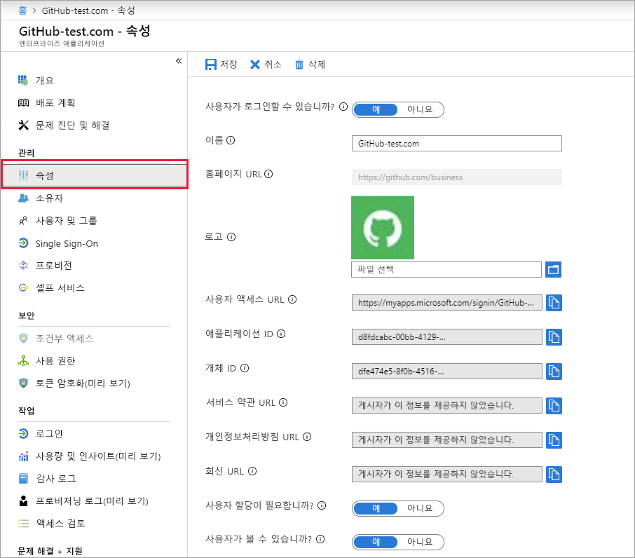

# 빠른 시작: Azure AD(Azure Active Directory) 테넌트의 애플리케이션 속성 구성

이전 빠른 시작에서는 Azure AD(Azure Active Directory) 테넌트에 애플리케이션을 추가했습니다. 애플리케이션을 추가하면 Azure AD 테넌트가 앱의 ID 공급자임을 알 수 있습니다. 이제 앱의 몇 가지 속성을 구성하겠습니다.
 
## 필수 구성 요소

Azure AD 테넌트의 애플리케이션 속성을 구성하려면 다음이 필요합니다.

- 활성 구독이 있는 Azure 계정. [체험 계정을 만듭니다](https://azure.microsoft.com/free/?WT.mc_id=A261C142F).
- 다음 역할 중 하나: 전역 관리자, 클라우드 애플리케이션 관리자, 애플리케이션 관리자 또는 서비스 주체의 소유자.
- 선택 사항: [앱 보기](view-applications-portal.md) 완료.
- 선택 사항: [앱 추가](add-application-portal.md) 완료.

>[!IMPORTANT]
>비 프로덕션 환경을 사용하여 이 빠른 시작의 단계를 테스트합니다.

## 앱 속성 구성

Azure AD 테넌트에 애플리케이션 추가를 마치면 개요 페이지가 나타납니다. 이미 추가된 애플리케이션을 구성하는 경우 첫 번째 빠른 시작을 살펴보세요. 테넌트에 추가된 애플리케이션을 보는 과정을 안내합니다. 

애플리케이션 속성을 편집하려면:

1. Azure AD Portal에서 **엔터프라이즈 애플리케이션**을 선택합니다. 그런 다음, 구성하려는 애플리케이션을 찾아 선택합니다.
1. **관리** 섹션에서 **속성**을 선택하여 편집할 **속성** 창을 엽니다.

    

1. 구성에 사용할 수 있는 옵션을 잠시 살펴봅니다.
    - **사용자가 로그인할 수 있습니까?** 는 애플리케이션에 할당된 사용자가 로그인할 수 있는지 여부를 결정합니다.
    - **사용자 할당이 필요하나요?** 는 애플리케이션에 할당되지 않은 사용자가 로그인할 수 있는지 여부를 결정합니다.
    - **사용자에게 표시되나요?** 는 앱에 할당된 사용자가 [액세스 패널](https://myapps.microsoft.com) 및 Office 365 앱 시작 관리자에서 앱을 볼 수 있는지 여부를 결정합니다. (Office 365 또는 Microsoft 365 웹 사이트의 왼쪽 위 모서리에 있는 와플 메뉴를 참조하세요.)
1. 다음 표를 사용하여 요구 사항에 가장 적합한 옵션을 선택하세요.

   - *할당된* 사용자에 대한 동작:

       | 애플리케이션 속성 | 애플리케이션 속성 | 애플리케이션 속성 | 할당된 사용자 경험 | 할당된 사용자 경험 |
       |---|---|---|---|---|
       | 사용자가 로그인할 수 있습니까? | 사용자 할당이 필요합니까? | 사용자가 볼 수 있습니까? | 할당된 사용자가 로그인할 수 있습니까? | 할당된 사용자가 애플리케이션을 볼 수 있습니까?* |
       | 예 | 예 | 예 | 예 | 예  |
       | 예 | 예 | 예  | 예 | 예   |
       | 예 | 예  | 예 | 예 | 예  |
       | 예 | 예  | 예  | 예 | 예   |
       | 예  | 예 | 예 | 예  | 예   |
       | 예  | 예 | 예  | 예  | 예   |
       | 예  | 예  | 예 | 예  | 예   |
       | 예  | 예  | 예  | 예  | 예   |

   - *할당되지 않은* 사용자에 대한 동작:

       | 애플리케이션 속성 | 애플리케이션 속성 | 애플리케이션 속성 | 할당되지 않은 사용자 환경 | 할당되지 않은 사용자 환경 |
       |---|---|---|---|---|
       | 사용자가 로그인할 수 있습니까? | 사용자 할당이 필요합니까? | 사용자가 볼 수 있습니까? | 할당되지 않은 사용자가 로그인할 수 있습니까? | 할당되지 않은 사용자가 애플리케이션을 볼 수 있습니다? * |
       | 예 | 예 | 예 | 예  | 예   |
       | 예 | 예 | 예  | 예  | 예   |
       | 예 | 예  | 예 | 예 | 예   |
       | 예 | 예  | 예  | 예 | 예   |
       | 예  | 예 | 예 | 예  | 예   |
       | 예  | 예 | 예  | 예  | 예   |
       | 예  | 예  | 예 | 예  | 예   |
       | 예  | 예  | 예  | 예  | 예   |

     *사용자가 액세스 패널 및 Office 365 앱 시작 관리자에서 애플리케이션을 볼 수 있습니까?

## 사용자 지정 로고 사용

사용자 지정 로고를 사용하려면:

1. 215 x 215 픽셀 로고를 만들어 .png 형식으로 저장합니다.
1. Azure AD Portal에서 **엔터프라이즈 애플리케이션**을 선택합니다. 그런 다음, 구성하려는 애플리케이션을 찾아 선택합니다.
1. **관리** 섹션에서 **속성**을 선택하여 편집할 **속성** 창을 엽니다. 
1. 아이콘을 선택하여 로고를 업로드합니다.
1. 완료되면 **저장**을 선택합니다.

    

   > [!NOTE]
   > 이 **속성** 창에 표시되는 썸네일은 즉시 업데이트되지 않습니다. **속성** 창을 닫았다가 다시 열면 업데이트된 아이콘을 볼 수 있습니다.

## 다음 단계

애플리케이션 속성을 구성했으므로, Single Sign-On 설정을 계속 진행할 수 있습니다.

- [Single Sign-On 설정](add-application-portal-setup-sso.md)
- [앱 삭제](delete-application-portal.md)