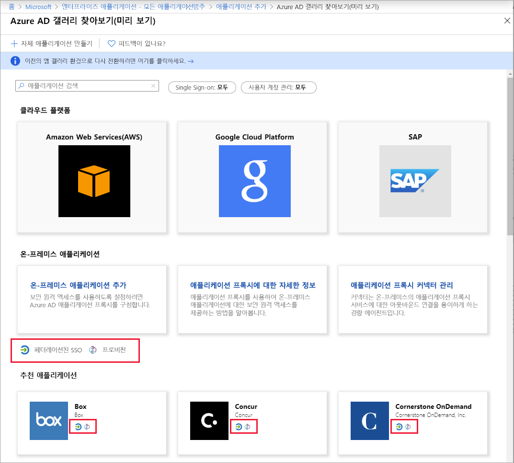

# 빠른 시작: 애플리케이션을 Azure AD(Azure Active Directory) 테넌트에 추가

Azure AD(Azure Active Directory)에는 수천 개의 사전 통합 애플리케이션이 들어 있는 갤러리가 있습니다. 조직에서 사용하는 대부분의 애플리케이션은 이미 갤러리에 있을 수 있습니다.

Azure AD 테넌트에 애플리케이션을 추가하면 다음과 같은 작업을 수행할 수 있습니다.

- 앱의 속성을 구성합니다.
- 조건부 액세스 정책을 사용하여 앱에 대한 사용자 액세스를 관리합니다.
- 사용자가 Azure AD 자격 증명을 사용하여 앱에 로그인할 수 있도록 Single Sign-On을 구성합니다.

## 필수 구성 요소

Azure AD 테넌트에 애플리케이션 추가하려면 다음이 필요합니다.

- 활성 구독이 있는 Azure 계정. [체험 계정을 만듭니다](https://azure.microsoft.com/free/?WT.mc_id=A261C142F).
- 다음 역할 중 하나: 전역 관리자, 클라우드 애플리케이션 관리자, 애플리케이션 관리자 또는 서비스 주체의 소유자.
- (선택 사항: [앱 보기](view-applications-portal.md) 완료).

>[!IMPORTANT]
>이 빠른 시작의 단계를 테스트하기 위해 비-프로덕션 환경을 사용하는 것이 좋습니다.

## Azure AD 테넌트에 앱 추가

Azure AD 테넌트에 애플리케이션을 추가하려면 다음을 수행합니다.

1. [Azure Portal](https://portal.azure.com)의 왼쪽 탐색 패널에서 **Azure Active Directory**를 선택합니다.
2. **Azure Active Directory** 창에서 **엔터프라이즈 애플리케이션**을 선택합니다. **모든 애플리케이션** 창이 열리고 Azure AD 테넌트에 있는 임의의 애플리케이션 샘플이 표시됩니다.
3. **엔터프라이즈 애플리케이션** 창에서 **새 애플리케이션**을 선택합니다. 
    
4. 새 갤러리 미리 보기 환경으로 전환합니다. **애플리케이션 페이지 추가** 맨 위에 있는 배너에서 **여기를 클릭하여 새롭고 향상된 앱 갤러리 사용해 보기** 링크를 선택합니다.
5. **Azure AD 갤러리 찾아보기(미리 보기)** 창이 열리고 클라우드 플랫폼, 온-프레미스 애플리케이션 및 추천 애플리케이션에 대한 타일이 표시됩니다. **추천 애플리케이션** 섹션에 나열된 애플리케이션에는 페더레이션된 SSO(Single Sign-On) 및 프로비저닝을 지원하는지 여부를 나타내는 아이콘이 있습니다. 
    
6. 추가하려는 애플리케이션의 갤러리를 찾아보거나 검색 상자에 해당 이름을 입력하여 애플리케이션을 검색할 수 있습니다. 그런 다음, 결과에서 애플리케이션을 선택합니다. 
7. 다음 단계는 애플리케이션 개발자가 SSO(Single Sign-On)를 구현하는 방법에 따라 달라집니다. 앱 개발자는 네 가지 방법으로 Single Sign-On을 구현할 수 있습니다. 네 가지 방법은 SAML, OpenID Connect, 암호 및 Linked입니다. 앱을 추가하는 경우 스크린샷에 표시된 것처럼 특정 SSO 구현을 사용하는 앱만 필터링하고 표시하도록 선택할 수 있습니다. 예를 들어 SSO를 구현하는 인기 있는 표준은 SAML(Security Assertion Markup Language)이라고 합니다. 널리 사용되는 다른 표준은 OIDC(OpenId Connect)라고 합니다. 이러한 표준을 사용하여 SSO를 구성하는 방법은 서로 다르므로 추가하는 앱에서 구현하는 SSO 유형을 기록해 둡니다.

    :::image type="content" source="media/add-application-portal/sso-types.png" alt-text="SSO 유형 선택기를 표시하는 스크린샷" lightbox="media/add-application-portal/sso-types.png":::

    - 앱 개발자가 SSO에 **OIDC 표준**을 사용한 경우 **가입**을 선택합니다. 설정 페이지가 나타납니다. 다음으로 OIDC 기반 Single Sign-On 설정에 대한 빠른 시작으로 이동합니다.
    :::image type="content" source="media/add-application-portal/sign-up-oidc-sso.png" alt-text="SSO 유형 선택기를 표시하는 스크린샷":::

    - 앱 개발자가 SSO에 **SAML 표준**을 사용한 경우 **만들기**를 선택합니다. 시작 페이지가 열리고 조직의 애플리케이션을 구성하는 옵션이 제공됩니다. 양식에서 조직의 요구에 맞게 애플리케이션 이름을 편집할 수 있습니다. 다음으로 SAML 기반 Single Sign-On 설정에 대한 빠른 시작으로 이동합니다.
    :::image type="content" source="media/add-application-portal/create-application.png" alt-text="SSO 유형 선택기를 표시하는 스크린샷":::

> [!IMPORTANT]
> SAML 기반 및 OIDC 기반 SSO 구현 간에는 몇 가지 주요 차이점이 있습니다. SAML 기반 앱을 사용하면 동일한 앱의 여러 인스턴스를 추가할 수 있습니다. 예를 들어 GitHub1, GitHub2 등입니다. OIDC 기반 앱의 경우 앱의 인스턴스를 하나만 추가할 수 있습니다. 이미 OIDC 기반 앱을 추가하고 동일한 앱을 다시 추가하고 동의를 두 번 입력하는 경우 테넌트에서 다시 추가되지 않습니다.

찾고 있는 애플리케이션이 갤러리에 없는 경우 **자체 애플리케이션 만들기** 링크를 선택한 다음, **애플리케이션으로 어떤 작업을 하고 싶은가요?** 에서 **갤러리에 없는 다른 애플리케이션 통합**을 선택합니다. Microsoft는 이미 많은 애플리케이션 개발자와 협력하여 Azure AD와 작동하도록 미리 구성했습니다. 미리 구성된 앱이 갤러리에 표시됩니다. 그러나 추가하려는 앱이 나열되지 않은 경우 새 일반 앱을 만든 다음, 직접 구성하거나 앱을 만든 개발자의 지침을 사용하여 구성할 수 있습니다.

애플리케이션 추가를 마쳤습니다. 다음 빠른 시작에서는 애플리케이션의 로고를 변경하고 다른 속성을 편집하는 방법을 보여줍니다.

> [!TIP]
> Graph API를 사용하여 앱 관리를 자동화할 수 있습니다. [Microsoft Graph API를 사용하여 앱 관리 자동화](https://docs.microsoft.com/graph/application-saml-sso-configure-api)를 참조하세요.

## 리소스 정리

이 빠른 시작 시리즈를 더 이상 사용하지 않을 생각이면 앱을 삭제하여 테스트 테넌트를 정리하는 것이 좋습니다. 앱 삭제에 대한 내용은 이 시리즈의 마지막 빠른 시작에서 다룹니다. [앱 삭제](delete-application-portal.md)를 참조하세요.

## 다음 단계

앱을 구성하는 방법에 대한 다음 문서를 진행하세요.
> [!div class="nextstepaction"]
> [앱 구성](add-application-portal-configure.md)
