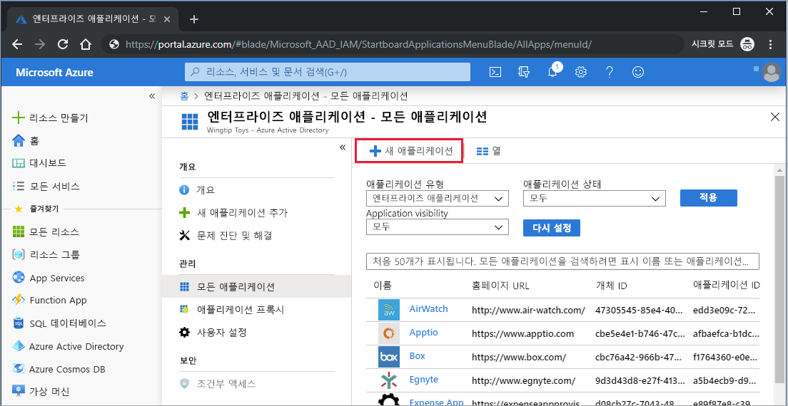

# 빠른 시작: Azure Active Directory 테넌트에 애플리케이션 추가

Azure AD(Azure Active Directory)에는 수천 개의 사전 통합 애플리케이션이 들어 있는 갤러리가 있습니다. 조직에서 사용하는 애플리케이션 중 일부는 이 갤러리에 있을 것입니다. 이 빠른 시작에서는 Azure Portal을 사용하여 Azure AD(Azure Active Directory) 테넌트에 갤러리 애플리케이션을 추가합니다. 
 
Azure AD 테넌트에 애플리케이션을 추가하면 다음과 같은 작업을 수행할 수 있습니다.

- 조건부 액세스 정책을 사용하여 애플리케이션에 대한 사용자 액세스를 관리합니다.
- Azure AD 계정을 사용하여 애플리케이션에 Single Sign-On 하도록 사용자를 구성합니다.

## 시작하기 전에

테넌트에 애플리케이션을 추가하려면 다음이 필요합니다.

- Azure AD 구독
- Single Sign-on이 설정된 애플리케이션 구독

[Azure Portal](https://portal.azure.com)에 Azure AD 테넌트의 글로벌 관리자, 클라우드 응용 프로그램 관리자 또는 응용 프로그램 관리자로 로그인합니다.

이 자습서의 단계를 테스트하려면 비-프로덕션 환경을 사용하는 것이 좋습니다. Azure AD 비-프로덕션 환경이 없으면 [1개월 평가판](https://azure.microsoft.com/pricing/free-trial/)을 받을 수 있습니다.

## Azure AD 테넌트에 애플리케이션 추가

Azure AD 테넌트에 갤러리 애플리케이션을 추가하려면:

1. [Azure Portal](https://portal.azure.com)의 왼쪽 탐색 창에서 **Azure Active Directory**를 클릭합니다. 

2. **Azure Active Directory** 블레이드에서 **엔터프라이즈 응용 프로그램**을 클릭합니다. 

    

3. Azure AD 테넌트에 있는 임의의 애플리케이션 샘플을 보여주는 **모든 애플리케이션** 블레이드가 열립니다. 

    

4. **모든 응용 프로그램** 블레이드 맨 위에서 **새 응용 프로그램**을 클릭합니다.

    

5. 갤러리의 애플리케이션 목록을 보려면 **범주**를 사용하는 것이 더 쉽습니다. **주요 애플리케이션** 아래의 아이콘은 갤러리 애플리케이션의 임의의 샘플이기 때문입니다. 

    

    더 많은 애플리케이션을 보려면 **자세히 보기**를 클릭합니다. 갤러리에 애플리케이션 수천 개가 있으므로 이 검색 방법을 권장하지 않습니다.

6. 애플리케이션을 검색하려면 **갤러리에서 추가** 아래에서 추가할 애플리케이션 이름을 입력합니다. 결과에서 애플리케이션을 선택하고 **추가**를 클릭합니다. 다음 예제는 GitHub.com 검색 후 나타나는 **앱 추가** 양식을 보여줍니다.

    

6. 애플리케이션별 양식에서 속성 정보를 변경할 수 있습니다. 예를 들어 조직의 요구에 맞게 애플리케이션 이름을 편집할 수 있습니다. 이 예에서는 이름으로 **GitHub-test**를 사용합니다.

8. 속성 변경을 마쳤으면 **추가**를 클릭합니다.

9. 시작 페이지가 열리고 조직의 애플리케이션을 구성하는 옵션이 제공됩니다. 

    

애플리케이션 추가를 마쳤습니다. 편하게 휴식을 취하세요.  그 다음 섹션에서는 애플리케이션의 로고를 변경하고 다른 속성을 편집하는 방법을 보여줍니다.

## Azure AD 테넌트 애플리케이션 찾기

여러분이 잠시 자리를 비웠다가 애플리케이션을 계속 구성하기 위해 돌아왔다고 가정해 봅시다. 가장 먼저 할 일은 애플리케이션을 찾는 것입니다.

1. **[Azure Portal](https://portal.azure.com)** 의 왼쪽 탐색 창에서 **Azure Active Directory**를 클릭합니다. 

2. Azure Active Directory 블레이드에서 **엔터프라이즈 애플리케이션**을 클릭합니다. 

3. **응용 프로그램 종류** 드롭다운 메뉴에서 **모든 응용 프로그램**을 선택하고 **적용**을 클릭합니다. 보기 옵션에 대한 자세한 내용은 [테넌트 애플리케이션 보기](view-applications-portal.md)를 참조하세요.

4. 이제 Azure AD 테넌트에서 모든 애플리케이션 목록을 볼 수 있습니다.  목록은 임의의 샘플입니다. 더 많은 애플리케이션을 보려면 **자세히 보기**를 한 번 이상 클릭합니다. 

5. 테넌트의 애플리케이션을 신속하게 찾으려면 검색 상자에 애플리케이션 이름을 입력하고 **적용**을 클릭합니다. 이 예제에서는 앞에서 추가한 GitHub-test 애플리케이션을 찾습니다.

    

## 사용자 로그인 속성 구성

애플리케이션을 찾았으니, 애플리케이션을 열고 속성을 구성할 수 있습니다.

애플리케이션 속성을 편집하려면

1. 애플리케이션을 클릭하여 엽니다.
2. **속성**을 클릭하여 편집할 속성 블레이드를 엽니다.

    

3. 잠시 로그인 옵션을 살펴보면서 이해합니다. **사용자가 로그인할 수 있습니까**, **사용자 할당 필요** 및 **사용자에게 표시** 옵션에 따라 응용 프로그램에 할당된 또는 할당되지 않은 사용자가 로그인할 수 있는지 여부가 결정됩니다.  사용자가 액세스 패널에서 애플리케이션을 볼 수 있는지 여부도 결정합니다. 

    - **사용자가 로그인할 수 있습니까**는 응용 프로그램에 할당된 사용자가 로그인할 수 있는지 여부를 결정합니다.
    - **사용자 할당 필요**는 응용 프로그램에 할당되지 않은 사용자가 로그인할 수 있는지 여부를 결정합니다.
    - **사용자에게 표시**는 앱에 할당된 사용자가 액세스 패널 및 O365 시작 관리자에서 앱을 볼 수 있는지 여부를 결정합니다. 

4. 다음 표를 사용하여 요구 사항에 가장 적합한 옵션을 선택하세요. 

     - **할당된** 사용자에 대한 동작:

       | 애플리케이션 속성 설정 | | | 할당된 사용자 경험 | |
       |---|---|---|---|---|
       | 사용자가 로그인할 수 있습니까? | 사용자 할당이 필요합니까? | 사용자가 볼 수 있습니까? | 할당된 사용자가 로그인할 수 있습니까? | 할당된 사용자가 애플리케이션을 볼 수 있습니까?* |
       | 예 | 예 | 예 | 예 | 예  |
       | 예 | 예 | no  | 예 | no   |
       | 예 | no  | 예 | 예 | 예  |
       | 예 | no  | no  | 예 | no   |
       | no  | 예 | 예 | no  | no   |
       | no  | 예 | no  | no  | no   |
       | no  | no  | 예 | no  | no   |
       | no  | no  | no  | no  | no   |

     - **할당되지 않은** 사용자에 대한 동작:
  
       | 애플리케이션 속성 설정 | | | 할당되지 않은 사용자 환경 | |
       |---|---|---|---|---|
       | 사용자가 로그인할 수 있습니까? | 사용자 할당이 필요합니까? | 사용자가 볼 수 있습니까? | 할당되지 않은 사용자가 로그인할 수 있습니까? | 할당되지 않은 사용자가 애플리케이션을 볼 수 있습니다? * |
       | 예 | 예 | 예 | no  | no   |
       | 예 | 예 | no  | no  | no   |
       | 예 | no  | 예 | 예 | no   |
       | 예 | no  | no  | 예 | no   |
       | no  | 예 | 예 | no  | no   |
       | no  | 예 | no  | no  | no   |
       | no  | no  | 예 | no  | no   |
       | no  | no  | no  | no  | no   |

    *사용자가 액세스 패널 및 Office 365 앱 시작 관리자에서 애플리케이션을 볼 수 있습니까?

## 사용자 지정 로고 사용

사용자 지정 로고를 사용하려면:

1. 215 x 215 픽셀 로고를 만들고, PNG 형식으로 저장합니다.
2. 이미 애플리케이션을 찾았으니, 해당 애플리케이션을 클릭합니다.
2. 왼쪽 블레이드에서 **속성**을 클릭합니다.
4. 로고를 업로드합니다.
5. 작업을 완료하면 **저장**을 클릭합니다.

    

## 다음 단계

이 빠른 시작에서는 Azure AD 테넌트에 갤러리 애플리케이션을 추가하는 방법을 배웠습니다. 애플리케이션의 속성을 편집하는 방법을 알아보았습니다. 

이제 애플리케이션에 Single Sign-On을 구성할 준비가 완료되었습니다. 

> [!div class="nextstepaction"]
> [Single Sign-on 구성](configure-single-sign-on-portal.md)

