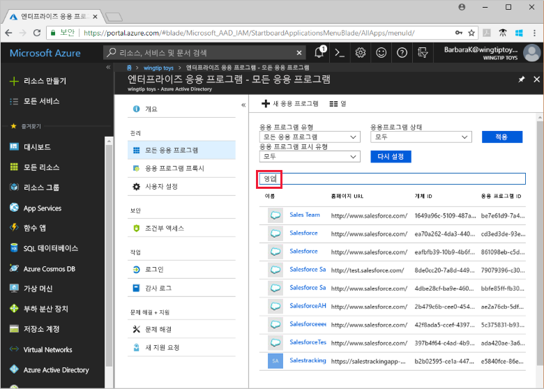

# 빠른 시작: ID 관리를 위해 Azure AD(Azure Active Directory) 테넌트를 사용하는 애플리케이션 목록 보기

조직에서 사용하는 애플리케이션의 IAM(Identity and Access Management) 시스템으로 Azure AD를 사용하세요. 이 빠른 시작에서는 Azure AD 테넌트를 IdP(ID 공급자)로 사용하도록 이미 설정된 애플리케이션(앱이라고도 함)을 확인합니다.

## 필수 구성 요소

Azure AD 테넌트에 등록된 애플리케이션을 보려면 다음이 필요합니다.

- 활성 구독이 있는 Azure 계정. [체험 계정을 만듭니다](https://azure.microsoft.com/free/?WT.mc_id=A261C142F).

>[!IMPORTANT]
>이 빠른 시작의 단계를 테스트할 때 비-프로덕션 환경을 사용하는 것이 좋습니다.

## 테넌트에서 애플리케이션 목록 찾기

Azure AD 테넌트에 등록된 애플리케이션은 Azure Portal의 **엔터프라이즈 앱** 섹션에서 볼 수 있습니다.

테넌트에 등록된 애플리케이션을 보려면 다음을 수행합니다.

1. [Azure Portal](https://portal.azure.com)에 로그인합니다.
2. 왼쪽 탐색 패널에서 **Azure Active Directory**를 선택합니다.
3. **Azure Active Directory** 창에서 **엔터프라이즈 애플리케이션**을 선택합니다.
4. **애플리케이션 종류** 드롭다운 메뉴에서 **모든 애플리케이션**을 선택하고 **적용**을 선택합니다. 테넌트 애플리케이션의 무작위 샘플이 나타납니다.
5. 더 많은 애플리케이션을 보려면 목록 아래에서 **추가 로드**를 클릭합니다. 테넌트에 많은 애플리케이션이 있는 경우 목록을 스크롤하는 것보다 특정 애플리케이션을 검색하는 것이 더 쉬울 수 있습니다. 특정 애플리케이션에 대한 검색은 이 빠른 시작의 뒷부분에서 설명합니다.

## 보기 옵션 선택

원하는 항목에 따라 옵션을 선택합니다.

1. **애플리케이션 종류**, **애플리케이션 상태** 및 **애플리케이션 표시**에 따라 애플리케이션을 볼 수 있습니다.
2. **애플리케이션 종류** 아래에서 다음 옵션 중 하나를 선택합니다.
    - **엔터프라이즈 애플리케이션**은 Microsoft 이외의 애플리케이션을 보여줍니다.
    - **Microsoft 애플리케이션**은 Microsoft 애플리케이션을 보여줍니다.
    - **모든 애플리케이션**은 Microsoft 애플리케이션과 Microsoft 이외의 애플리케이션을 모두 보여줍니다.
3. **애플리케이션 상태**에서 **모두**, **사용 안 함** 또는 **사용**을 선택합니다. **모두** 옵션은 사용하도록 설정된 애플리케이션과 사용하지 않도록 설정된 애플리케이션을 모두 포함합니다.
4. **애플리케이션 표시** 아래에서 **모두** 또는 **숨겨진**을 선택합니다. **숨겨진** 옵션은 테넌트에 있지만 사용자에게 보이지 않는 애플리케이션을 표시합니다.
5. 원하는 옵션을 선택한 후 **적용**을 선택합니다.

## 애플리케이션 검색

특정 애플리케이션을 검색하려면:

1. **애플리케이션 종류** 메뉴에서 **모든 애플리케이션**을 선택하고 **적용**을 선택합니다.
2. 찾으려는 애플리케이션의 이름을 입력합니다. 애플리케이션이 Azure AD 테넌트에 추가되면 검색 결과에 나타납니다. 이 예제는 GitHub가 테넌트 애플리케이션에 추가되지 않은 것을 보여줍니다.
    
3. 애플리케이션 이름의 처음 몇 글자를 입력해 보세요. 이 예제는 **Sales**로 시작하는 모든 애플리케이션을 보여줍니다.
    

> [!TIP]
> Graph API를 사용하여 앱 관리를 자동화할 수 있습니다. [Microsoft Graph API를 사용하여 앱 관리 자동화](https://docs.microsoft.com/graph/application-saml-sso-configure-api)를 참조하세요.

## 리소스 정리

이 빠른 시작에서는 새 리소스를 만들지 않았으므로 정리할 리소스가 없습니다.

## 다음 단계

앱의 ID 공급자로 Azure AD를 사용하는 방법에 대한 다음 문서를 진행하세요.
> [!div class="nextstepaction"]
> [앱 추가](add-application-portal.md)
