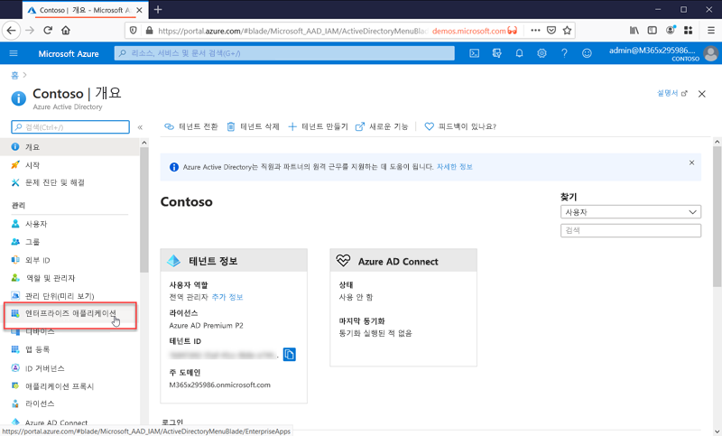
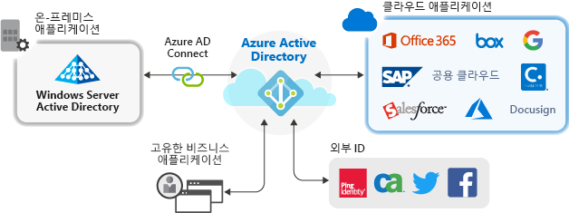

# 애플리케이션 관리란?

Azure AD는 IAM(ID 및 액세스 관리) 시스템입니다. 디지털 ID에 대한 정보를 저장할 수 있는 단일 장소를 제공합니다. 사용자 정보가 저장되는 위치로 Azure AD를 사용하도록 소프트웨어 애플리케이션을 구성할 수 있습니다. 

Azure AD는 애플리케이션과 통합되도록 구성되어야 합니다. 즉, ID용으로 사용하는 앱을 알아야 합니다. Azure AD에서 이러한 앱을 인식하고 이를 처리하는 방법을 애플리케이션 관리라고 합니다.

Azure Active Directory 포털의 관리 섹션에 있는 **엔터프라이즈 애플리케이션** 페이지에서 애플리케이션을 관리합니다.

## IAM(ID 및 액세스 관리) 시스템이란?
애플리케이션은 일부 용도로 사용되는 소프트웨어의 일부입니다. 대부분의 앱은 사용자가 로그인해야 합니다.

중앙 집중식 ID 시스템은 모든 애플리케이션에서 사용할 수 있는 사용자 정보를 저장하는 단일 장소를 제공합니다. 이러한 시스템은 IAM(ID 및 액세스 관리) 시스템이라고 합니다. Azure Active Directory는 Microsoft 클라우드의 IAM 시스템입니다.

>[!TIP]
>IAM 시스템은 사용자 ID를 추적하는 단일 장소를 제공합니다. Azure AD는 Microsoft 클라우드의 IAM 시스템입니다.

## 클라우드 솔루션을 사용하여 애플리케이션을 관리하는 이유는 무엇인가요?

조직에는 사용자가 작업하는 데 사용해야 하는 수백 개의 애플리케이션이 있을 수 있습니다. 사용자는 많은 디바이스 및 위치에서 이러한 애플리케이션에 액세스합니다. 항상 새 애플리케이션이 추가, 개발 및 중단됩니다. 앱과 액세스 포인트가 너무 많기 때문에 이들 모두와 함께 작동하는 ID 솔루션을 사용하는 것이 중요합니다.

>[!TIP]
>Azure AD 앱 갤러리에는 이미 Azure AD를 ID 공급자로 사용하도록 미리 구성된 많은 인기 있는 애플리케이션이 포함되어 있습니다.

## Azure AD는 앱에서 어떻게 작동합니까?

Azure AD는 중간에 위치하며 클라우드 및 온-프레미스 앱에 대한 ID 관리를 제공합니다. 

>[!TIP]
>사용자를 회사 HR 시스템에 추가할 때 Azure AD에 자동으로 추가되도록 [사용자 프로비저닝을 자동화](../app-provisioning/user-provisioning.md)하여 관리 비용을 절감합니다. 

## 어떤 유형의 애플리케이션을 Azure AD와 통합할 수 있나요?

거의 모든 앱에 대한 ID 시스템으로서 Azure AD를 사용할 수 있습니다. 이미 많은 앱이 미리 구성되어 있으며 최소한의 노력으로 설정할 수 있습니다. 이러한 미리 구성된 앱은 [Azure AD 앱 갤러리](/azure/active-directory/saas-apps/)에 게시됩니다. 

앱이 아직 갤러리에 없는 경우 대부분의 앱을 Single Sign-On에 대해 수동으로 구성할 수 있습니다. Azure AD는 몇 가지 SSO 옵션을 제공합니다. 가장 널리 사용되는 것은 SAML 기반 SSO와 OIDC 기반 SSO입니다. SSO를 사용하도록 앱을 통합하는 방법에 대한 자세한 내용은 [Single Sign-On 옵션](sso-options.md)을 참조하세요. 

조직에서 온-프레미스 앱을 사용합니까? 앱 프록시를 사용하여 통합할 수 있습니다. 자세한 내용은 [Azure AD의 애플리케이션 프록시를 통해 온-프레미스 애플리케이션에 원격 액세스 제공](application-proxy.md)을 참조하세요.

>[!TIP]
>고유한 기간 업무 애플리케이션을 빌드할 경우 Azure AD와 통합하여 Single Sign-On을 지원할 수 있습니다. Azure AD용 앱을 개발하는 방법에 대한 자세한 내용은 [Microsoft ID 플랫폼](..//develop/v2-overview.md)을 참조하세요.

## 조건부 액세스 정책을 사용하여 위험 관리

Azure AD SSO(Single Sign-On)를 [조건부 액세스](../conditional-access/concept-conditional-access-cloud-apps.md)와 연결하면 애플리케이션 액세스에 대한 높은 수준의 보안이 제공됩니다. 조건부 액세스 정책은 설정한 조건에 따라 앱을 세부적으로 제어할 수 있습니다. 

## Single Sign-On으로 생산성 개선

SSO(Single Sign-On)는 Microsoft 365와 사용자가 사용하는 다른 모든 앱 간에 통합된 사용자 환경을 제공합니다. 더 이상 사용자 이름과 암호를 계속 입력할 필요가 없습니다.

Single Sign-On에 대한 자세한 내용은 [Single Sign-On이란?](what-is-single-sign-on.md)을 참조하세요.

## 거버넌스 및 규정 준수 처리

SIEM(보안 인시던트 및 이벤트 모니터링) 도구를 사용하는 보고서를 통해 앱을 모니터링합니다. 포털 또는 API에서 보고서에 액세스할 수 있습니다. 애플리케이션에 액세스할 수 있는 사용자를 프로그래밍 방식으로 감사하고 액세스 검토를 통해 비활성 사용자에 대한 액세스를 제거합니다.

## 비용 관리

Azure AD로 마이그레이션하면 비용을 절약하고 온-프레미스 인프라를 관리하는 번거로움을 제거할 수 있습니다. 또한 Azure AD는 애플리케이션에 대한 셀프 서비스 액세스를 제공하므로 관리자와 사용자의 시간이 절약됩니다. Single Sign-On을 사용하면 애플리케이션별 암호가 필요 없습니다. 한 번 로그온하는 이 기능을 사용하면 애플리케이션의 암호 재설정 및 암호 검색 시 손실된 생산성에 관련된 비용이 절약됩니다.

인적 자원에 중점을 둔 애플리케이션 또는 사용자가 많은 기타 애플리케이션의 경우 애플리케이션 프로비저닝을 사용하면 보다 쉽게 수행할 수 있습니다. 앱 프로비저닝은 사용자를 추가하고 제거하는 프로세스를 자동화합니다. 자세한 내용은 [애플리케이션 프로비저닝이란?](../app-provisioning/user-provisioning.md)을 참조하세요.

## 다음 단계

- [애플리케이션 관리에 대한 빠른 시작 시리즈](view-applications-portal.md)
- [애플리케이션 통합 시작](plan-an-application-integration.md)
- [프로비저닝 자동화 방법 알아보기](../app-provisioning/user-provisioning.md)