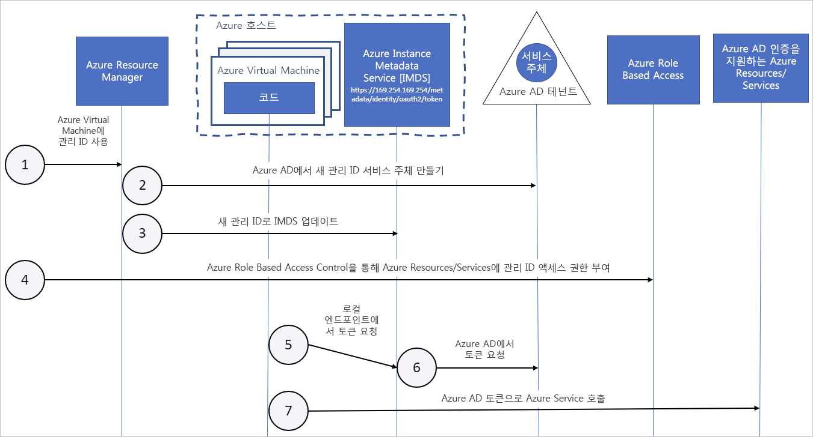

# Azure 리소스에 대한 관리 ID가 Azure 가상 머신과 함께 작동하는 방법

Azure 리소스용 관리 ID는 Azure Active Directory에서 자동으로 관리되는 ID를 Azure 서비스에 제공합니다. 이 ID를 사용하면 Azure AD 인증을 지원하는 모든 서비스에 인증할 수 있으므로 코드에 자격 증명을 포함할 필요가 없습니다.

이 문서에서는 관리 ID가 Azure VM(가상 머신)과 작동하는 방식에 대해 알아봅니다.

## 작동 방법

내부적으로 관리 ID는 Azure 리소스에만 사용할 수 있는 특수 유형의 서비스 주체입니다. 관리 ID가 삭제되면 해당하는 서비스 주체가 자동으로 제거됩니다.
또한 사용자 할당 ID 또는 시스템 할당 ID를 만들면 MSRP(관리 ID 리소스 공급자)에서 해당 ID에 내부적으로 인증서를 발급합니다. 

코드가 관리 ID를 사용하여 Azure AD 인증을 지원하는 서비스용 액세스 토큰을 요청할 수 있습니다. 서비스 인스턴스가 사용하는 자격 증명 롤링은 Azure에서 처리합니다. 

다음 다이어그램은 관리 서비스 ID가 Azure VM(가상 머신)에서 작동하는 방식을 보여줍니다.

|  속성    | 시스템 할당 관리 ID | 사용자 할당 관리 ID |
|------|----------------------------------|--------------------------------|
| 만들기 |  Azure 리소스(예: Azure 가상 머신 또는 Azure App Service)의 일부로 생성됩니다. | 독립 실행형 Azure 리소스로 생성됩니다. |
| 수명 주기 | 관리 ID를 만드는 데 사용된 Azure 리소스와 공유되는 수명 주기입니다.   부모 리소스를 삭제하면 관리 ID도 삭제됩니다. | 독립적인 수명 주기.   명시적으로 삭제되어야 합니다. |
| Azure 리소스 전체에서 공유 | 공유할 수 없습니다.   단일 Azure 리소스하고만 연결할 수 있습니다. | 공유할 수 있습니다.   동일한 사용자 할당 관리 ID를 둘 이상의 Azure 리소스와 연결할 수 있습니다. |
| 일반 사용 예 | 단일 Azure 리소스 내에 포함된 워크로드입니다.   독립적인 ID가 필요한 워크로드   예를 들어 단일 가상 머신에서 실행되는 애플리케이션 | 여러 리소스에서 실행되며 단일 ID를 공유할 수 있는 워크로드입니다.   프로비전 흐름에 보안 리소스 사전 승인이 필요한 워크로드입니다.   리소스가 자주 재활용되지만 권한이 알관적으로 유지되어야 하는 워크로드입니다.   예를 들어 여러 가상 머신이 동일한 리소스에 액세스해야 하는 워크로드가 있습니다. |

## 시스템 할당 관리 ID

1. Azure Resource Manager가 VM에서 시스템 할당 관리 ID를 사용하도록 설정하라는 메시지를 받습니다.

2. Azure Resource Manager가 Azure AD에 VM ID에 대한 서비스 주체를 만듭니다. 서비스 주체는 구독이 신뢰하는 Azure AD 테넌트에 생성됩니다.

3. Azure Resource Manager는 Instance Metadata Service ID 엔드포인트를 서비스 주체 클라이언트 ID 및 인증서로 업데이트하여 VM에서 ID를 구성합니다.

4. VM에 ID가 생긴 후에는 서비스 주체 정보를 사용하여 Azure 리소스에 대한 VM 액세스 권한을 부여합니다. Azure Resource Manager를 호출 하려면 azure RBAC (역할 기반 액세스 제어)를 사용 하 여 VM 서비스 주체에 적절 한 역할을 할당 합니다. Key Vault를 호출하려면 Key Vault의 특정 비밀 또는 키에 대한 액세스 권한을 코드에 부여합니다.

5. VM에서 실행되는 코드는 Azure Instance Metadata Service 엔드포인트에서 토큰(`http://169.254.169.254/metadata/identity/oauth2/token`)을 요청할 수 있으며, VM 내에서만 액세스할 수 있습니다.
    - 리소스 매개 변수가 토큰을 보낼 대상 서비스를 지정합니다. Azure Resource Manager에 인증하려면 `resource=https://management.azure.com/`을 사용합니다.
    - API 버전 매개 변수는 IMDS 버전을 지정하고, api-version=2018-02-01 이상을 사용합니다.

6. 3단계에서 구성한 클라이언트 ID 및 인증서를 사용하여 5단계에서 지정한 대로 액세스 토큰을 요청하는 Azure AD에 대한 호출이 생성됩니다. Azure AD가 JWT(JSON Web Token) 액세스 토큰을 반환합니다.

7. 코드가 Azure AD 인증을 지원하는 서비스에 대한 호출에서 액세스 토큰을 전송합니다.

## 사용자 할당 관리 ID

1. Azure Resource Manager가 사용자 할당 관리 ID를 만들라는 요청을 받습니다.

2. Azure Resource Manager가 Azure AD에 사용자 할당 관리 ID에 대한 서비스 주체를 만듭니다. 서비스 주체는 구독이 신뢰하는 Azure AD 테넌트에 생성됩니다.

3. Azure Resource Manager는 VM에서 사용자 할당 관리 ID를 구성하라는 요청을 받고 사용자 할당 관리 ID 서비스 주체 클라이언트 ID 및 인증서로 Azure Instance Metadata Service ID 엔드포인트를 업데이트합니다.

4. 사용자 할당 관리 ID가 생성된 후에는 서비스 주체 정보를 사용하여 Azure 리소스에 대한 ID 액세스 권한을 부여합니다. Azure Resource Manager를 호출 하려면 Azure RBAC를 사용 하 여 사용자 할당 id의 서비스 주체에 적절 한 역할을 할당 합니다. Key Vault를 호출하려면 Key Vault의 특정 비밀 또는 키에 대한 액세스 권한을 코드에 부여합니다.

   > [!Note]
   > 이 단계를 3단계 전에 수행할 수도 있습니다.

5. VM에서 실행되는 코드는 Azure Instance Metadata Service ID 엔드포인트에서 토큰(`http://169.254.169.254/metadata/identity/oauth2/token`)을 요청할 수 있으며, VM 내에서만 액세스할 수 있습니다.
    - 리소스 매개 변수가 토큰을 보낼 대상 서비스를 지정합니다. Azure Resource Manager에 인증하려면 `resource=https://management.azure.com/`을 사용합니다.
    - 클라이언트 ID 매개 변수는 토큰이 요청되는 ID를 지정합니다. 이 값은 단일 VM에 사용자 할당 ID가 두 개 이상 있을 때 분명히 하기 위해 필요합니다.
    - API 버전 매개 변수는 Azure Instance Metadata Service 버전을 지정합니다. `api-version=2018-02-01` 이상을 사용하세요.

6. 3단계에서 구성한 클라이언트 ID 및 인증서를 사용하여 5단계에서 지정한 대로 액세스 토큰을 요청하는 Azure AD에 대한 호출이 생성됩니다. Azure AD가 JWT(JSON Web Token) 액세스 토큰을 반환합니다.
7. 코드가 Azure AD 인증을 지원하는 서비스에 대한 호출에서 액세스 토큰을 전송합니다.

## 다음 단계

다음 빠른 시작으로 Azure 리소스에 대한 관리 ID 기능을 시작하세요.

* [Windows VM 시스템 할당 관리 ID를 사용하여 Resource Manager에 액세스](tutorial-windows-vm-access-arm.md)
* [Linux VM 시스템 할당 관리 ID를 사용하여 Resource Manager에 액세스](tutorial-linux-vm-access-arm.md)
