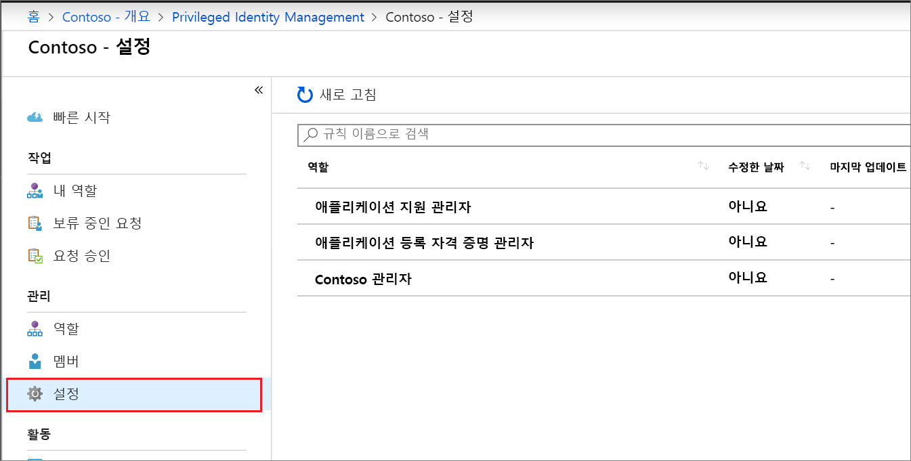
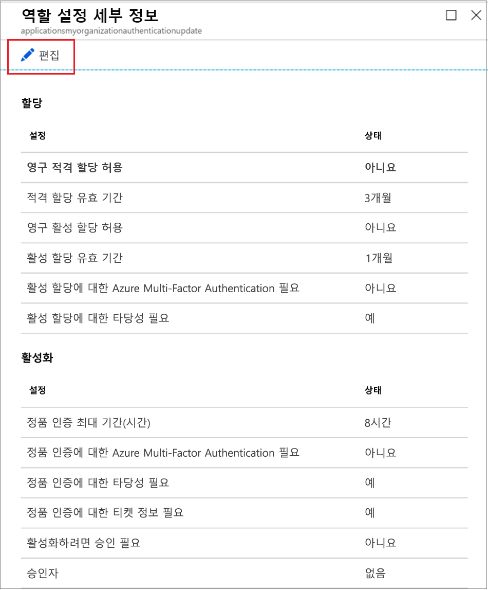
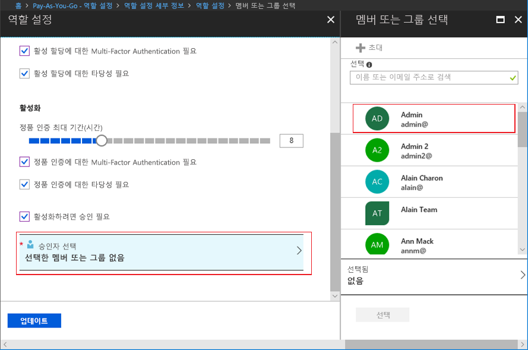

# Privileged Identity Management에서 Azure AD 사용자 지정 역할 구성

권한 있는 역할 관리자는 자신의 사용자 지정 역할에 대한 할당을 활성화하는 사용자와 사용자 지정 역할을 할당하는 다른 애플리케이션 관리자에게 적용되는 역할 설정을 변경할 수 있습니다.

> [!NOTE]
> 미리 보기 기간 중에는 Azure AD 사용자 지정 역할이 기본 제공 디렉터리 역할과 통합되지 않습니다. 이 기능이 일반 공급되면 기본 제공 역할 환경에서 역할 관리가 수행됩니다. 다음 배너가 표시 되는 경우 이러한 역할은 [기본 제공 역할 환경에서](pim-how-to-activate-role.md) 관리 해야 하며이 문서는 적용 되지 않습니다.
>
> 

## 역할 설정 열기

다음 단계에 따라 Azure AD 역할에 대한 설정을 엽니다.

1. 권한 있는 역할 관리자 역할에 할당된 사용자 계정을 사용하여 Azure Portal에서 [Privileged Identity Management](https://portal.azure.com/?Microsoft_AAD_IAM_enableCustomRoleManagement=true&Microsoft_AAD_IAM_enableCustomRoleAssignment=true&feature.rbacv2roles=true&feature.rbacv2=true&Microsoft_AAD_RegisteredApps=demo#blade/Microsoft_Azure_PIMCommon/CommonMenuBlade/quickStart)에 로그인합니다.
1. **Azure AD 사용자 지정 역할(미리 보기)** 을 선택합니다.

    

1. **설정**을 선택하여 **설정** 페이지를 엽니다. 구성하려는 설정에 대한 역할을 선택합니다.
1. **편집**을 선택하여 **역할 설정** 페이지를 엽니다.

    

## 역할 설정

구성할 수 있는 몇 가지 설정이 있습니다.

### 할당 기간

역할 설정을 구성할 때 각 할당 유형(적격 또는 활성)에 대한 두 가지 할당 기간 옵션 중에서 선택할 수 있습니다. 멤버가 Privileged Identity Management에서 역할에 할당된 경우 이러한 옵션은 기본 최대 기간이 됩니다.

이러한 *적격* 할당 기간 옵션 중 하나를 선택할 수 있습니다.

- **영구 적격 할당 허용**: 관리자가 영구 적격 멤버 자격을 할당할 수 있습니다.
- **다음 기간 후에 적격 할당 만료**: 관리자가 적격 할당에 지정 된 시작 및 종료 날짜를 요구할 수 있습니다.

또한 다음 *활성* 할당 기간 옵션 중 하나를 선택할 수 있습니다.

- **영구 활성 할당 허용**: 관리자는 영구 활성 구성원 자격을 할당할 수 있습니다.
- **다음 이후에 활성 할당 만료**: 관리자가 모든 활성 할당에 지정 된 시작 및 종료 날짜를 요구할 수 있습니다.

### Azure Multi-Factor Authentication 필요

Privileged Identity Management는 서로 다른 두 가지 시나리오에 대해 선택적인 Azure Multi-Factor Authentication 적용을 제공합니다.

- **활성 할당에 대한 Multi-Factor Authentication 필요**

  짧은 기간(예: 하루) 동안만 멤버를 역할에 할당하려는 경우 할당된 멤버가 활성화를 요청하는 것이 너무 느릴 수 있습니다. 이 시나리오에서는 사용자가 할당된 순간부터 역할에서 이미 활성 상태이므로 해당 사용자가 자신의 역할 할당을 활성화할 때 Privileged Identity Management에서 다단계 인증을 적용할 수 없습니다. 할당을 수행하는 관리자가 자신이 말하는 당사자가 누구인지 확인하려면 **활성 할당에 대한 Multi-Factor Authentication 필요** 확인란을 선택합니다.

- **활성화 시 Multi-Factor Authentication 필요**

  역할에 할당된 적격 사용자에게 활성화하기 전에 Azure Multi-Factor Authentication에 등록하도록 요구할 수 있습니다. 이 프로세스를 통해 활성화를 요청한 사용자가 합당한 확신이 있는 당사자 본인임을 확인할 수 있습니다. 이 옵션을 적용하면 사용자 계정이 손상되었을 수 있는 상황에서 중요한 역할을 보호할 수 있습니다. 적격 멤버가 활성화하기 전에 Azure Multi-Factor Authentication을 실행하도록 요구하려면 **활성화 시 Multi-Factor Authentication 필요** 확인란을 선택합니다.

자세한 내용은 [Multi-Factor Authentication 및 Privileged Identity Management](pim-how-to-require-mfa.md)를 참조하세요.

### 최대 활성화 기간

**최대 활성화 기간** 슬라이더를 사용하여 역할이 만료되기 전에 활성 상태로 지속되는 최대 시간을 설정합니다. 이 값은 1~24시간일 수 있습니다.

### 근거 필요

멤버가 활성 할당에 대해 또는 활성화될 때 근거를 입력하도록 요구할 수 있습니다. 근거를 요구하려면 **활성 할당에 대한 근거 필요** 또는 **활성화에 대한 근거 필요** 확인란을 선택합니다.

### 활성화할 승인 필요

역할을 활성화하기 위해 승인을 요구하려는 경우 다음 단계를 수행합니다.

1. **활성화하려면 승인이 필요함** 확인란을 선택합니다.
1. **승인자 선택**을 선택하여 **멤버 또는 그룹 선택** 목록을 엽니다.

    

1. 하나 이상의 멤버 또는 그룹을 선택하고 **선택**을 클릭합니다. 하나 이상의 승인자를 선택해야 합니다. 기본 승인자가 없습니다. 선택한 항목이 선택한 승인자 목록에 표시됩니다.
1. 역할 설정이 지정되면 **업데이트**를 선택하여 변경 내용을 저장합니다.

## 다음 단계

- [Azure AD 사용자 지정 역할 활성화](azure-ad-custom-roles-activate.md)
- [Azure AD 사용자 지정 역할 할당](azure-ad-custom-roles-assign.md)
- [Azure AD 사용자 지정 역할 할당 제거 또는 업데이트](azure-ad-custom-roles-update-remove.md)
- [Azure AD의 역할 정의](../users-groups-roles/directory-assign-admin-roles.md)
