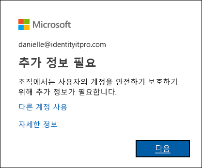

# 2단계 확인 방법 설정 개요

조직에서 2단계 확인을 설정했습니다. 즉, 회사 또는 학교 계정으로 로그인하는 경우 사용자 이름, 암호 및 모바일 디바이스 또는 휴대폰의 조합이 필요합니다. 암호 자체보다 더 안전하므로 조직에서 이 추가 확인을 설정했습니다. 이에 따라 두 가지 인증 형식, 즉 사용자가 알고 있는 인증 형식과 사용자 전용의 인증 형식을 사용합니다. 악의적인 해커가 사용자의 암호를 사용하더라도 사용자의 디바이스가 없을 수 있으므로 2단계 확인은 이들이 사용자로 가장하지 못하도록 방지하는 데 도움이 됩니다.

>[!Important]
>이 콘텐츠는 사용자를 위한 것입니다. 관리자의 경우 [Azure Active Directory 문서](https://docs.microsoft.com/azure/active-directory)에서 Azure AD(Azure Active Directory) 환경을 설정하고 관리하는 방법에 대한 자세한 정보를 찾을 수 있습니다.

## 이 기능의 사용 여부는 누가 결정하나요?

계정 유형에 따라 사용자가 2단계 인증을 사용하도록 조직에서 결정할 수도 있고, 사용자가 직접 결정할 수도 있습니다.

- **회사 또는 학교 계정** 회사 또는 학교 계정(예: alain@contoso.com)을 사용하는 경우 특정 인증 방법과 함께 2단계 인증을 사용해야 하는지 여부는 조직에서 결정합니다. 조직에서 이 기능을 사용해야 한다고 결정했으므로 개별적으로 해제할 수 있는 방법이 없습니다.

- **개인 Microsoft 계정.** 개인 Microsoft 계정에 2단계 인증을 설정하도록 선택할 수 있습니다(예: alain@outlook.com). 2단계 확인 및 개인 Microsoft 계정에 문제가 있는 경우 [Microsoft 계정에 대해 2단계 확인 켜기 또는 끄기](https://support.microsoft.com/help/4028586/microsoft-account-turning-two-step-verification-on-or-off)를 참조하세요. 이 기능을 사용할지 여부를 선택하므로 원할 때마다 설정하거나 해제할 수 있습니다.

## 추가 보안 확인 페이지에 액세스

조직에서 2단계 확인을 설정하면 계정을 안전하게 유지하는 데 도움이 되는 추가 정보를 제공하라는 메시지가 표시됩니다.

### 추가 보안 확인 페이지에 액세스하려면

1. **추가 정보 요구** 프롬프트에서 **다음**을 선택합니다.

    **추가 보안 확인** 페이지가 표시됩니다.

2. **추가 보안 확인** 페이지에서 회사 또는 학교 계정에 로그인한 후 사용자가 누구인지 확인하는 데 사용할 2단계 확인 방법을 결정해야 합니다. 선택 옵션:

    | 연락 방법 | 설명 |
    | --- | --- |
    | 모바일 앱 | <ul><li>**확인 시 알림 수신.** 이 옵션은 스마트폰이나 태블릿의 인증자 앱에 푸시 알림을 보냅니다. 알림을 확인한 후 올바르면 앱에서 **인증**을 선택합니다. 회사 또는 학교에서는 인증 전에 PIN을 입력해야 할 수 있습니다.</li><li>**확인 코드 사용.** 이 모드에서 인증자 앱은 30초마다 업데이트되는 확인 코드를 생성합니다. 로그인 화면에서 최신 확인 코드를 입력합니다. [Android](https://go.microsoft.com/fwlink/?linkid=866594) 및 [iOS](https://go.microsoft.com/fwlink/?linkid=866594) 디바이스의 경우 Microsoft Authenticator 앱을 사용할 수 있습니다.</li></ul> |
    | 인증 전화 | <ul><li>**전화 통화**는 제공한 전화 번호로 자동화된 음성 통화를 신청합니다. 전화를 받고, 휴대폰 키패드에서 #(파운드 키)을 눌러 인증합니다.</li><li>**문자 메시지**는 확인 코드가 포함된 문자 메시지를 종료합니다. 텍스트에 있는 프롬프트에 따라 문자 메시지에 회신하거나 로그인 인터페이스에 제공한 확인 코드를 입력합니다.</li></ul> |
    | 사무실 전화 | 제공한 전화 번호에 자동으로 음성 전화를 겁니다. 전화를 받고, 휴대폰 키패드에서 #(파운드 키)을 눌러 인증합니다. |

## 다음 단계

**추가 보안 확인** 페이지에 액세스하면 2단계 확인 방법을 선택하여 설정해야 합니다.

- [확인 방법으로 모바일 디바이스 설정](multi-factor-authentication-setup-phone-number.md)

- [확인 방법으로 사무실 전화 설정](multi-factor-authentication-setup-office-phone.md)

- [확인 방법으로 Microsoft Authenticator 앱 설정](multi-factor-authentication-setup-auth-app.md)

## 관련 리소스

- [2단계 확인 방법 설정 관리](multi-factor-authentication-end-user-manage-settings.md)

- [앱 암호 관리](multi-factor-authentication-end-user-app-passwords.md)

- [2단계 확인을 사용하여 로그인](multi-factor-authentication-end-user-signin.md)

- [2단계 확인에 대한 도움말 보기](multi-factor-authentication-end-user-troubleshoot.md) 
