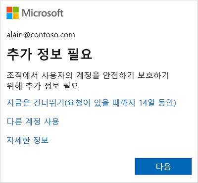
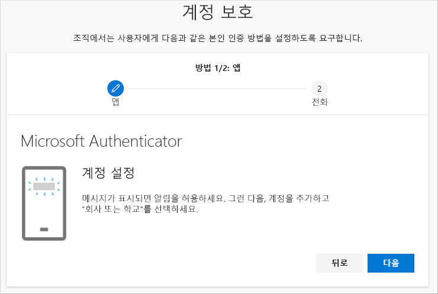
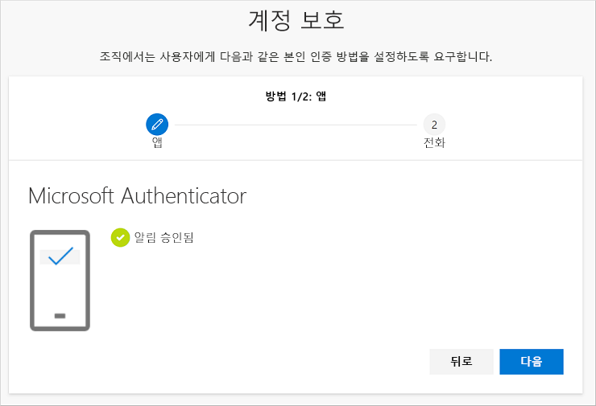
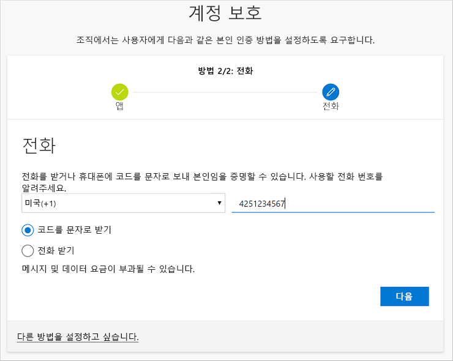
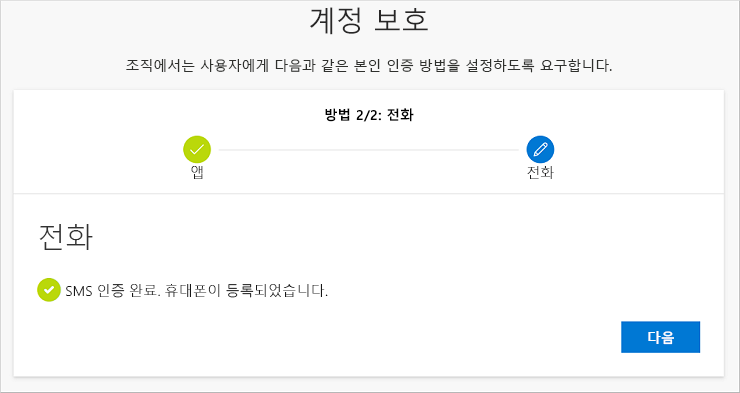
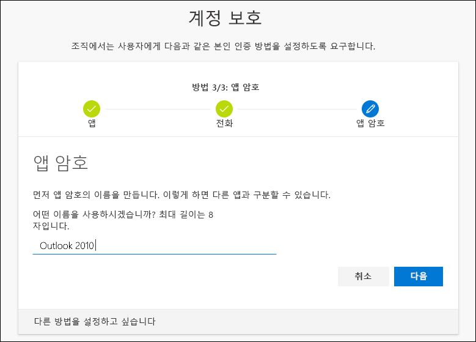
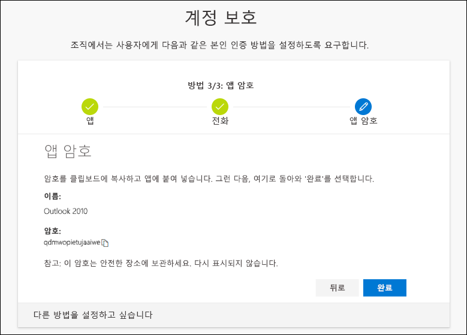
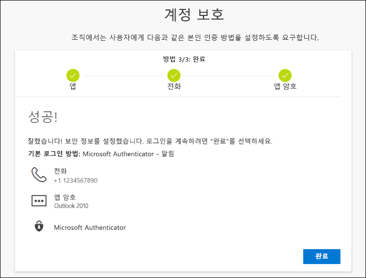

# 로그인 페이지 프롬프트에서 보안 정보(미리 보기) 설정

회사 또는 학교 계정에 로그인하는 즉시 보안 정보를 설정하라는 메시지가 표시되면 다음 단계를 수행할 수 있습니다.

이 메시지는 조직에서 요구하는 보안 정보를 설정하지 않은 경우에만 표시됩니다. 이전에 보안 정보를 설정했지만 변경하려는 경우 다양한 보안 정보 기반 방법 문서의 단계를 수행할 수 있습니다. 자세한 내용은 [보안 정보 개요 추가 또는 업데이트](security-info-add-update-methods-overview.md)를 참조하세요.

[!INCLUDE [preview-notice](../../../includes/active-directory-end-user-preview-notice-security-info.md)]

## 회사 또는 학교 계정에 로그인

회사 또는 학교 계정에 로그인하면 계정에 액세스할 수 있기 전에 추가 정보를 제공하라는 메시지가 표시됩니다.

## 마법사를 사용하여 보안 정보 설정

프롬프트에서 다음 단계에 따라 회사 또는 학교 계정에 대한 보안 정보를 설정합니다.

>[!Important]
>이는 프로세스의 한 예일 뿐입니다. 조직의 요구 사항에 따라 관리자가 이 프로세스 중에 설정해야 하는 다른 인증 방법을 설정했을 수 있습니다. 다음 예에서는 Microsoft Authenticator 앱과 인증 통화 또는 문자 메시지용 휴대폰 번호라는 두 가지 방법을 요구합니다.

1. 프롬프트에서 **다음**을 선택하면 **계정 보안 유지 마법사**가 나타나서 관리자와 조직에서 설정해야 하는 첫 번째 방법을 보여 줍니다. 다음 예는 Microsoft Authenticator 앱을 사용하는 경우입니다.

   > [!Note]
   > Microsoft Authenticator 앱 이외의 인증자 앱을 사용하려면 **다른 인증 앱 사용** 링크를 선택합니다.
   >
   > 조직에서 인증자 앱 이외의 다른 방법을 선택할 수 있게 하려면 **다른 인증 방법 설정 링크**를 선택할 수 있습니다.

    

2. **지금 다운로드**를 선택하여 Microsoft Authenticator 앱을 모바일 디바이스에 다운로드하여 설치하고, **다음**을 선택합니다. 앱을 다운로드하여 설치하는 방법에 대한 자세한 내용은 [Microsoft Authenticator 앱 다운로드 및 설치](user-help-auth-app-download-install.md)를 참조하세요.

    

3. 모바일 디바이스에서 Microsoft Authenticator 앱을 설정하는 동안 **계정 설정** 페이지에 남아 있습니다.

4. Microsoft Authenticator 앱을 열고, 알림을 허용하도록 선택하고(프롬프트되는 경우), 오른쪽 위에 있는 **사용자 지정 및 제어** 아이콘에서 **계정 추가**를 선택한 다음, **회사 또는 학교 계정**을 선택합니다.

    >[!Note]
    >Microsoft Authenticator 앱을 처음으로 설정하는 경우 앱에서 카메라에 액세스할 수 있도록 허용할지(iOS) 아니면 앱에서 사진을 촬영하고 비디오를 녹화할 수 있도록 허용할지(Android) 묻는 메시지를 받을 수 있습니다. 인증자 앱이 카메라에 액세스하여 다음 단계에서 QR 코드의 사진을 찍을 수 있도록 **허용**을 선택해야 합니다. 카메라를 허용하지 않는 경우에도 여전히 인증자 앱을 설정할 수 있지만 코드 정보를 수동으로 추가해야 합니다. 코드를 수동으로 추가하는 방법에 대한 자세한 내용은 [수동으로 앱에 계정 추가](user-help-auth-app-add-account-manual.md)를 참조하세요.

5. 컴퓨터에서 **계정 설정** 페이지로 돌아가서 **다음**을 선택합니다.

    **QR 코드 스캔** 페이지가 나타납니다.

    

6. 5단계에서 회사 또는 학교 계정이 만들어지면 모바일 디바이스에 표시된 Microsoft Authenticator 앱 QR 코드 판독기를 사용하여 제공된 코드를 검사합니다.

    인증 앱은 추가 정보 없이도 회사 또는 학교 계정을 성공적으로 추가해야 합니다. 하지만 QR 코드 판독기에서 코드를 읽을 수 없으면 **QR 이미지를 스캔할 수 없습니까?** 를 선택하고 Microsoft Authenticator 앱에 코드와 URL을 수동으로 입력하면 됩니다. 코드를 수동으로 추가하는 방법에 대한 자세한 내용은 [수동으로 앱에 계정 추가](user-help-auth-app-add-account-manual.md)를 참조하세요.

7. 컴퓨터의 **QR 코드 스캔** 페이지에서 **다음**을 선택합니다.

    계정을 테스트하기 위한 알림이 모바일 디바이스의 Microsoft Authenticator 앱으로 보내집니다.

    

8. Microsoft Authenticator 앱에서 알림을 승인하고, **다음**을 선택합니다.

    

    2단계 인증 또는 암호 재설정을 사용하면 기본적으로 Microsoft Authenticator 앱을 사용하여 사용자의 ID를 확인하도록 보안 정보가 업데이트됩니다.

9. **전화** 설정 페이지에서 문자 메시지 또는 전화 통화를 받을지 여부를 선택하고, **다음**을 선택합니다. 이 예에서는 문자 메시지를 사용하므로 문자 메시지를 받을 수 있는 디바이스에 대한 전화 번호를 사용해야 합니다.

    

    문자 메시지가 전화 번호로 보내집니다. 전화 통화를 받으려는 경우에도 프로세스는 동일합니다. 그러나 문자 메시지 대신 지침이 포함된 전화 통화를 받게 됩니다.

10. 모바일 디바이스로 보낸 문자 메시지에서 제공하는 코드를 입력하고, **다음**을 선택합니다.

    

11. 성공 알림을 검토한 다음, **완료**를 선택합니다.

    

    2단계 인증 또는 암호 재설정을 사용할 때 문자 메시지를 백업 방법으로 사용하여 사용자의 ID를 확인하도록 보안 정보가 업데이트됩니다.

12. **성공** 페이지를 검토하여 보안 정보에 대한 Microsoft Authenticator 앱 및 전화(문자 메시지 또는 전화 통화) 방법을 모두 성공적으로 설정했는지 확인한 다음, **완료**를 선택합니다.

    

    >[!Note]
    >조직에서 앱 암호 사용을 요구하는 경우 이 마법사의 추가 섹션을 확인하여 설정할 수 있습니다. **앱 암호**라는 세 번째 섹션이 표시되는 경우 마법사를 완료하기 전에 이를 채워야 합니다. 앱 암호를 추가하는 방법에 대한 단계는 이 문서의 [앱 암호 관리](#manage-your-app-passwords) 섹션을 참조하세요.

### 앱 암호 관리

Outlook 2010과 같은 특정 앱은 2단계 인증을 지원하지 않습니다. 따라서 조직에서 2단계 인증을 사용하는 경우 앱이 작동하지 않습니다. 이 문제를 해결하려면 사용자의 일반 암호와는 별도로 자동으로 생성된 암호를 만들어 각 비 브라우저 앱과 함께 사용할 수 있습니다.

>[!Note]
>마법사에서 이 옵션이 표시되지 않으면 관리자가 설정하지 않은 것입니다. 설정되지 않았지만 앱 암호를 사용해야 하는 경우 [보안 정보(미리 보기) 페이지에서 앱 암호 설정](security-info-app-passwords.md)의 단계를 따를 수 있습니다.

앱 암호를 사용하는 경우 다음 사항을 고려해야 합니다.

- 앱 암호는 자동으로 생성되며 앱당 한 번만 입력됩니다.

- 사용자당 40개의 암호로 제한되어 있습니다. 해당 제한을 초과한 후 암호를 만들려고 하면 새 암호를 만들기 전에 기존 암호를 삭제할 것인지를 묻는 메시지가 표시됩니다.

- 앱마다가 아닌 디바이스마다 하나의 앱 암호를 사용합니다. 예를 들어 랩톱의 모든 앱에 대해 단일 암호를 만든 다음, 데스크톱의 모든 앱에 대해 다른 단일 암호를 만듭니다.

#### 로그인 마법사에서 앱 암호를 추가하려면

1. 마법사의 이전 섹션을 완료한 후 **다음**을 선택하고 **앱 암호** 섹션을 완료합니다.

2. 암호가 필요한 앱의 이름을 입력(예: `Outlook 2010`)한 다음, **다음**을 선택합니다.

    

3. **앱 암호** 화면에서 암호 코드를 복사하여 앱의 **암호** 영역에 붙여넣습니다(이 예제에서는 Outlook 2010).

    

4. 암호를 복사하여 앱에 붙여넣은 후, 이 마법사로 돌아와서 모든 로그인 방법 정보가 정확한지 확인한 다음, **완료**를 선택합니다.

    

## 다음 단계

- 기본 보안 정보 방법을 변경, 삭제 또는 업데이트하려면 다음을 참조하세요.

    - [인증자 앱에 대한 보안 정보 설정](security-info-setup-auth-app.md)

    - [문자 메시지에 대한 보안 정보 설정](security-info-setup-text-msg.md)

    - [전화 통화에 대한 보안 정보 설정](security-info-setup-phone-number.md)

    - [이메일을 사용하도록 보안 정보 설정(미리 보기)](security-info-setup-email.md)

    - [미리 정의된 보안 질문을 사용하도록 보안 정보 설정](security-info-setup-questions.md)

- 지정한 방법을 사용하여 로그인하는 방법에 대한 자세한 내용은 [로그인 방법](user-help-sign-in.md)을 참조하세요.

- 분실했거나 잊어버린 경우 [암호 재설정 포털](https://passwordreset.microsoftonline.com/)에서 암호를 다시 설정하거나 [회사 또는 학교 암호 재설정](user-help-reset-password.md) 문서의 단계를 수행합니다.

- [Microsoft 계정에 로그인할 수 없는 경우](https://support.microsoft.com/help/12429/microsoft-account-sign-in-cant) 문서에서 로그인 문제에 대한 문제 해결 팁 및 도움말을 확인합니다.
