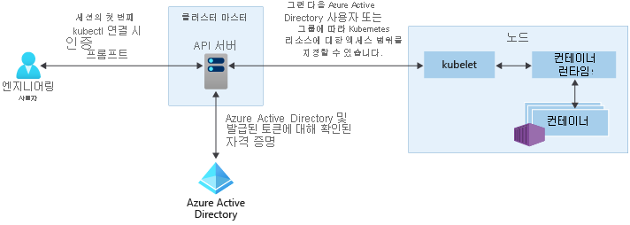

# AKS(Azure Kubernetes Service)의 액세스 및 ID 옵션

Kubernetes 클러스터를 인증하고 보호하는 여러 가지 방법이 있습니다. RBAC(역할 기반 액세스 제어)를 사용하여 필요한 리소스에만 액세스할 수 있는 권한을 사용자 또는 그룹에 부여할 수 있습니다. AKS(Azure Kubernetes Service)를 사용하면 Azure Active Directory를 사용하여 보안 및 권한 구조를 더 강화할 수 있습니다. 이러한 접근 방식은 애플리케이션 워크로드 및 고객 데이터를 보호하는 데 도움이 됩니다.

이 문서에서는 AKS에서 권한을 인증하고 할당하는 데 도움이 되는 핵심 개념을 소개합니다.

- [Kubernetes 서비스 계정](#kubernetes-service-accounts)
- [Azure Active Directory 통합](#azure-active-directory-integration)
- [RBAC(역할 기반 액세스 제어)](#role-based-access-controls-rbac)
- [Roles 및 ClusterRoles](#roles-and-clusterroles)
- [RoleBindings 및 ClusterRoleBindings](#rolebindings-and-clusterrolebindings)

## Kubernetes 서비스 계정

Kubernetes의 기본 사용자 유형 중 하나는 *서비스 계정*입니다. 서비스 계정은 Kubernetes API에서 보유하고 관리합니다. 서비스 계정에 대한 자격 증명은 Kubernetes 비밀로 저장되어 권한 있는 Pod에서 API 서버와 통신하는 데 사용할 수 있습니다. 대부분의 API 요청은 서비스 계정 또는 일반 사용자 계정에 대한 인증 토큰을 제공합니다.

일반 사용자 계정은 서비스 및 프로세스뿐만 아니라 사용자 관리자 또는 개발자에게도 더 일반적인 액세스를 허용합니다. Kubernetes 자체는 일반 사용자 계정과 암호가 저장되는 ID 관리 솔루션을 제공하지 않습니다. 대신, 외부 ID 솔루션이 Kubernetes에 통합될 수 있습니다. AKS 클러스터의 경우 이 통합 ID 솔루션은 Azure Active Directory입니다.

Kubernetes의 ID 옵션에 대한 자세한 내용은 [Kubernetes 인증][kubernetes-authentication]을 참조하세요.

## Azure Active Directory 통합

AKS 클러스터의 보안은 Azure AD(Active Directory) 통합으로 강화될 수 있습니다. 수십 년간의 엔터프라이즈 ID 관리를 기반으로 하여 구축된 Azure AD는 핵심 디렉터리 서비스, 애플리케이션 액세스 관리 및 ID 보호를 결합한 다중 테넌트, 클라우드 기반 디렉터리 및 ID 관리 서비스입니다. Azure AD를 사용하면 온-프레미스 ID를 AKS 클러스터에 통합하여 계정 관리 및 보안을 위한 단일 원본을 제공할 수 있습니다.

Azure AD 통합 AKS 클러스터를 사용하면 네임스페이스 내에서 또는 클러스터 전체에서 Kubernetes 리소스에 대한 액세스 권한을 사용자 또는 그룹에 부여할 수 있습니다. `kubectl` 구성 컨텍스트를 가져오려면 사용자가 [az aks get-credentials][az-aks-get-credentials] 명령을 실행할 수 있습니다. 그러면 사용자가 `kubectl`을 사용하여 AKS 클러스터와 상호 작용할 때 해당 Azure AD 자격 증명을 사용하여 로그인하라는 메시지가 표시됩니다. 이 방법은 사용자 계정 관리 및 암호 자격 증명을 위한 단일 원본을 제공합니다. 사용자는 클러스터 관리자가 정의한 리소스에만 액세스할 수 있습니다.

AKS 클러스터의 Azure AD 인증은 OAuth 2.0 프로토콜에 기반하여 구축된 ID 계층인 OpenID Connect를 사용합니다. OAuth 2.0은 액세스 토큰을 가져와서 보호된 리소스에 액세스하는 메커니즘을 정의하며, OpenID Connect는 OAuth 2.0 권한 부여 프로세스의 확장으로서 인증을 구현합니다. OpenID Connect에 대한 자세한 내용은 [Open ID Connect 설명서][openid-connect]를 참조하세요. AKS 클러스터에서는 OpenID Connect를 통해 Azure AD에서 가져온 인증 토큰을 확인하기 위해 Kubernetes 웹후크 토큰 인증을 사용합니다. 자세한 내용은 [웹후크 토큰 인증 설명서][webhook-token-docs]를 참조하세요.

## RBAC(역할 기반 액세스 제어)

사용자가 수행할 수 있는 작업을 자세히 필터링하기 위해 Kubernetes는 RBAC(역할 기반 액세스 제어)를 사용합니다. 이 제어 메커니즘을 통해 리소스 만들기 또는 수정, 실행 중인 애플리케이션 워크로드에서 로그 보기 등의 작업을 수행할 수 있는 권한을 사용자 또는 사용자 그룹에 할당할 수 있습니다. 이러한 권한은 단일 네임스페이스로 범위가 지정되거나 전체 AKS 클러스터에서 부여할 수 있습니다. Kubernetes RBAC를 사용하여 권한을 정의하는 *역할*을 만든 다음, *역할 바인딩*을 통해 해당 역할을 사용자에게 할당합니다.

자세한 내용은 [RBAC 권한 부여 사용][kubernetes-rbac]을 참조하세요.

### Azure RBAC(역할 기반 액세스 제어)
리소스에 대한 액세스를 제어하기 위한 또 하나의 메커니즘은 Azure RBAC(역할 기반 액세스 제어)입니다. Kubernetes RBAC는 AKS 클러스터 내의 리소스에서 작동하도록 설계되었으며, Azure RBAC는 Azure 구독 내의 리소스에서 작동하도록 설계되었습니다. Azure RBAC를 사용하여 적용할 권한을 설명하는 *역할 정의*를 만듭니다. 그러면 이 역할 정의가 특정 *범위*의 사용자 또는 그룹에 할당됩니다. 이 범위는 개별 리소스, 리소스 그룹 또는 구독 전체일 수 있습니다.

자세한 내용은 [Azure RBAC란?][azure-rbac]을 참조하세요.

## Roles 및 ClusterRoles

Kubernetes RBAC를 사용하여 사용자에게 권한을 할당하기 전에 먼저 해당 권한을 *Role*로 정의합니다. Kubernetes 역할은 권한을 *부여*합니다. *거부* 권한에 대한 개념은 없습니다.

역할은 네임스페이스 내에서 권한을 부여하는 데 사용됩니다. 전체 클러스터 또는 지정된 네임스페이스 외부의 클러스터 리소스에 권한을 부여해야 하는 경우 *ClusterRoles*를 대신 사용할 수 있습니다.

ClusterRole은 리소스에 권한을 부여하는 것과 동일한 방식으로 작동하지만 특정 네임스페이스가 아닌 전체 클러스터의 리소스에 적용할 수 있습니다.

## RoleBindings 및 ClusterRoleBindings

리소스에 권한을 부여하는 역할이 정의되면 *RoleBinding*을 사용하여 해당 Kubernetes RBAC 권한을 할당합니다. AKS 클러스터가 Azure Active Directory와 통합되면 바인딩은 Azure AD 사용자에게 클러스터 내에서 작업을 수행할 수 있는 권한을 부여하는 방법입니다.

역할 바인딩은 지정된 네임스페이스에 대한 역할을 할당하는 데 사용됩니다. 이 방법을 사용하면 사용자가 할당된 네임스페이스의 애플리케이션 리소스에만 액세스할 수 있는 단일 AKS 클러스터를 논리적으로 구분할 수 있습니다. 전체 클러스터 또는 네임스페이스 외부의 리소스에 역할을 바인딩해야 하는 경우 *ClusterRoleBindings*를 대신 사용할 수 있습니다.

ClusterRoleBinding은 사용자에게 역할을 바인딩하는 것과 동일한 방식으로 작동하지만 특정 네임스페이스가 아닌 전체 클러스터의 리소스에 적용할 수 있습니다. 이 방법을 통해 관리자 또는 지원 엔지니어에게 AKS 클러스터의 모든 리소스에 대한 액세스 권한을 부여할 수 있습니다.

## 다음 단계

Azure AD 및 Kubernetes RBAC를 시작하려면 [AKS와 Azure Active Directory 통합][aks-aad]을 참조하세요.

Kubernetes 및 AKS 핵심 개념에 대한 자세한 내용은 다음 문서를 참조하세요.

- [Kubernetes/AKS 클러스터 및 워크로드][aks-concepts-clusters-workloads]
- [Kubernetes/AKS 보안][aks-concepts-security]
- [Kubernetes/AKS 가상 네트워크][aks-concepts-network]
- [Kubernetes/AKS 저장소][aks-concepts-storage]
- [Kubernetes/AKS 크기 조정][aks-concepts-scale]

<!-- LINKS - External -->
[kubernetes-authentication]: https://kubernetes.io/docs/reference/access-authn-authz/authentication
[webhook-token-docs]: https://kubernetes.io/docs/reference/access-authn-authz/authentication/#webhook-token-authentication
[kubernetes-rbac]: https://kubernetes.io/docs/reference/access-authn-authz/rbac/

<!-- LINKS - Internal -->
[openid-connect]: ../active-directory/develop/v1-protocols-openid-connect-code.md
[az-aks-get-credentials]: /cli/azure/aks#az-aks-get-credentials
[azure-rbac]: ../role-based-access-control/overview.md
[aks-aad]: aad-integration.md
[aks-concepts-clusters-workloads]: concepts-clusters-workloads.md
[aks-concepts-security]: concepts-security.md
[aks-concepts-scale]: concepts-scale.md
[aks-concepts-storage]: concepts-storage.md
[aks-concepts-network]: concepts-network.md
