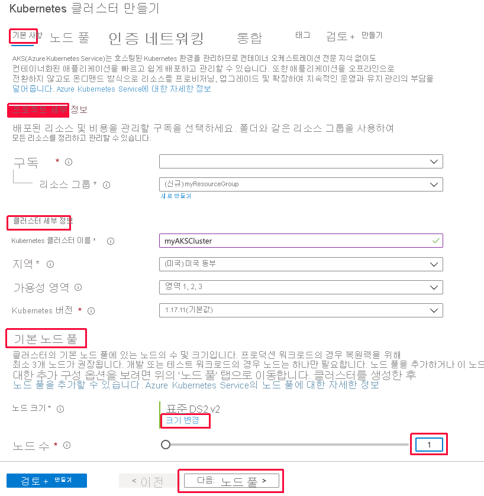
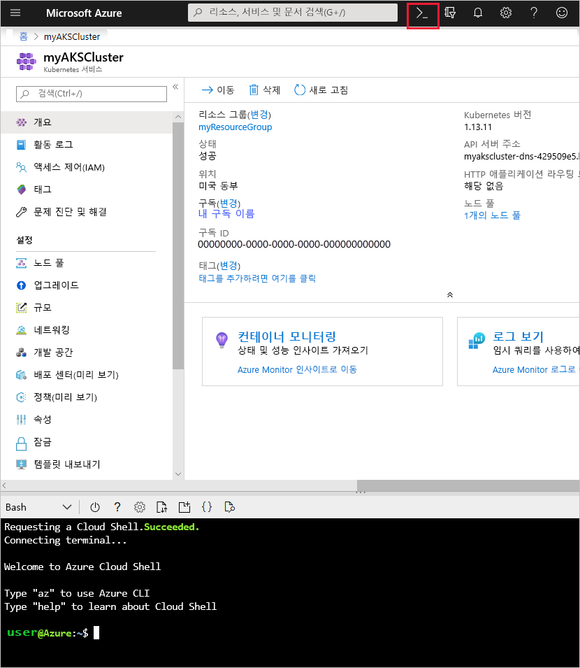
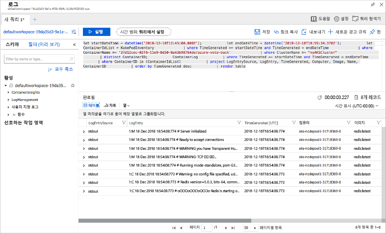

# <a name="quickstart-deploy-an-azure-kubernetes-service-aks-cluster-using-the-azure-portal"></a>빠른 시작: Azure Portal을 사용하여 AKS(Azure Kubernetes Service) 클러스터 배포

AKS(Azure Kubernetes Service)는 클러스터를 빠르게 배포하고 관리할 수 있는 관리형 Kubernetes 서비스입니다. 이 빠른 시작에서는 Azure Portal을 사용하여 AKS 클러스터를 배포합니다. 웹 프런트 엔드 및 Redis 인스턴스를 포함하는 다중 컨테이너 애플리케이션이 클러스터에서 실행됩니다. 그런 다음, 애플리케이션을 실행하는 Pod 및 클러스터의 상태를 모니터링하는 방법이 표시됩니다.


이 빠른 시작에서는 Kubernetes 기본 개념을 이해하고 있다고 가정합니다. 자세한 내용은 [AKS(Azure Kubernetes Service)의 Kubernetes 핵심 개념][kubernetes-concepts]을 참조하세요.

Azure 구독이 아직 없는 경우 시작하기 전에 [체험 계정](https://azure.microsoft.com/free/?WT.mc_id=A261C142F)을 만듭니다.

## <a name="sign-in-to-azure"></a>Azure에 로그인

[https://portal.azure.com](https://portal.azure.com)에서 Azure Portal에 로그인합니다.

## <a name="create-an-aks-cluster"></a>AKS 클러스터 만들기

AKS 클러스터를 만들려면 다음 단계를 완료합니다.

1. Azure Portal 메뉴 또는 **홈** 페이지에서 **리소스 만들기** 를 선택합니다.

2. **컨테이너** >  **Kubernetes Service** 를 선택합니다.

3. **기본** 페이지에서 다음 옵션을 구성합니다.
    - **프로젝트 세부 정보**: Azure **구독** 을 선택한 다음, *myResourceGroup* 같은 Azure **리소스 그룹** 을 선택하거나 만듭니다.
    - **클러스터 세부 정보**: *myAKSCluster* 같은 **Kubernetes 클러스터 이름** 을 입력합니다. AKS 클러스터에 대한 **지역** 및 **Kubernetes 버전** 을 선택합니다.
    - **주 노드 풀**: AKS 노드의 VM **노드 크기** 를 선택합니다. AKS 클러스터를 배포한 후에는 VM 크기를 변경*할 수 없습니다*.
            - 클러스터에 배포할 노드 수를 선택합니다. 이 빠른 시작에서는 **노드 수** 를 *1* 로 설정합니다. 클러스터를 배포한 후에 노드 수를 조정*할 수 있습니다*.
    
    

    완료되면 **다음: 노드 풀** 을 선택합니다.

4. **노드 풀** 페이지에서 기본 옵션을 유지합니다. 화면 아래쪽에서 **다음: 인증** 을 클릭합니다.
    > [!CAUTION]
    > 새 AAD 서비스 주체를 만드는 작업이 전파되고 사용할 수 있게 되기까지 몇 분이 걸릴 수 있으므로, Azure Portal에서 서비스 주체를 찾을 수 없음 오류와 유효성 검사 오류가 발생할 수 있습니다. 이 문제가 발생할 경우 완화하는 방법은 [여기](troubleshooting.md#received-an-error-saying-my-service-principal-wasnt-found-or-is-invalid-when-i-try-to-create-a-new-cluster)를 참조하세요.

5. **인증** 페이지에서 다음 옵션을 구성합니다.
    - **서비스 사용자** 필드를 **(새) 기본 서비스 사용자** 로 유지하여 신규 서비스 사용자를 만듭니다. 또는 기존 서비스 사용자를 사용하도록 *내 서비스 사용자 구성* 을 선택할 수 있습니다. 기존 서비스 사용자를 사용하는 경우 SPN 클라이언트 ID와 비밀을 제공해야 합니다.
    - Kubernetes RBAC(Kubernetes 역할 기반 액세스 제어)에 대한 옵션을 사용하도록 설정합니다. 이렇게 하면 AKS 클러스터에 배포된 Kubernetes 리소스에 대한 액세스를 정밀하게 제어할 수 있습니다.

    또는 서비스 주체 대신 관리 ID를 사용할 수 있습니다. 자세한 내용은 [관리 ID 사용](use-managed-identity.md)을 참조하세요.

기본적으로 *기본* 네트워킹이 사용되며 컨테이너에 대한 Azure Monitor가 활성화됩니다. **검토 + 만들기** 를 클릭한 후 유효성 검사가 완료되면 **만들기** 를 선택합니다.

AKS 클러스터를 만드는 데 몇 분이 걸립니다. 배포가 완료되면 **리소스로 이동** 을 클릭하거나 AKS 클러스터 리소스 그룹(예: *myResourceGroup*)으로 이동하여 AKS 리소스(예: *myAKSCluster*)를 선택합니다. 다음 예제처럼 AKS 클러스터 대시보드가 표시됩니다.


## <a name="connect-to-the-cluster"></a>클러스터에 연결

Kubernetes 클러스터를 관리하려면 [kubectl][kubectl] Kubernetes 명령줄 클라이언트를 사용합니다. `kubectl` 클라이언트는 Azure Cloud Shell에 사전 설치됩니다.

Azure Portal 위쪽에 있는 `>_` 단추를 사용하여 Cloud Shell을 엽니다.



Kubernetes 클러스터에 연결하도록 `kubectl`을 구성하려면 [az aks get-credentials][az-aks-get-credentials] 명령을 사용합니다. 이 명령은 자격 증명을 다운로드하고 Kubernetes CLI가 해당 자격 증명을 사용하도록 구성합니다. 다음 예제는 *myResourceGroup* 이라는 리소스 그룹에서 *myAKSCluster* 라는 클러스터의 자격 증명을 가져옵니다.

```azurecli
az aks get-credentials --resource-group myResourceGroup --name myAKSCluster
```

클러스터에 대한 연결을 확인하려면 [kubectl get][kubectl-get] 명령을 사용하여 클러스터 노드 목록을 반환합니다.

```console
kubectl get nodes
```

다음 예제 출력은 이전 단계에서 만든 단일 노드를 보여줍니다. 노드 상태가 *준비* 인지 확인합니다.

```output
NAME                       STATUS    ROLES     AGE       VERSION
aks-agentpool-14693408-0   Ready     agent     15m       v1.11.5
```

## <a name="run-the-application"></a>애플리케이션 실행

Kubernetes 매니페스트 파일은 어떤 컨테이너 이미지가 실행되는지 등과 같은 클러스터에 대해 원하는 상태를 정의합니다. 이 빠른 시작에서는 Azure Vote 애플리케이션을 실행하는 데 필요한 모든 개체를 만드는 데 매니페스트를 사용합니다. 이 매니페스트는 샘플 Azure Vote Python 애플리케이션과 Redis 인스턴스 각각에 대한 두 개의 [Kubernetes 배포][kubernetes-deployment]를 포함합니다. 두 개의 [Kubernetes Services][kubernetes-service], Redis 인스턴스에 대한 내부 서비스, 인터넷에서 Azure Vote 애플리케이션에 액세스하기 위한 외부 서비스가 만들어집니다.

Cloud Shell에서 편집기를 사용하여 `azure-vote.yaml`(예: `code azure-vote.yaml`, `nano azure-vote.yaml` 또는 `vi azure-vote.yaml`)이라는 파일을 만듭니다. 그런 다음, 다음 YAML 정의에 복사합니다.

```yaml
apiVersion: apps/v1
kind: Deployment
metadata:
  name: azure-vote-back
spec:
  replicas: 1
  selector:
    matchLabels:
      app: azure-vote-back
  template:
    metadata:
      labels:
        app: azure-vote-back
    spec:
      nodeSelector:
        "beta.kubernetes.io/os": linux
      containers:
      - name: azure-vote-back
        image: mcr.microsoft.com/oss/bitnami/redis:6.0.8
        env:
        - name: ALLOW_EMPTY_PASSWORD
          value: "yes"
        resources:
          requests:
            cpu: 100m
            memory: 128Mi
          limits:
            cpu: 250m
            memory: 256Mi
        ports:
        - containerPort: 6379
          name: redis
---
apiVersion: v1
kind: Service
metadata:
  name: azure-vote-back
spec:
  ports:
  - port: 6379
  selector:
    app: azure-vote-back
---
apiVersion: apps/v1
kind: Deployment
metadata:
  name: azure-vote-front
spec:
  replicas: 1
  selector:
    matchLabels:
      app: azure-vote-front
  template:
    metadata:
      labels:
        app: azure-vote-front
    spec:
      nodeSelector:
        "beta.kubernetes.io/os": linux
      containers:
      - name: azure-vote-front
        image: mcr.microsoft.com/azuredocs/azure-vote-front:v1
        resources:
          requests:
            cpu: 100m
            memory: 128Mi
          limits:
            cpu: 250m
            memory: 256Mi
        ports:
        - containerPort: 80
        env:
        - name: REDIS
          value: "azure-vote-back"
---
apiVersion: v1
kind: Service
metadata:
  name: azure-vote-front
spec:
  type: LoadBalancer
  ports:
  - port: 80
  selector:
    app: azure-vote-front
```

[kubectl apply][kubectl-apply] 명령을 사용하여 애플리케이션을 배포하고 YAML 매니페스트의 이름을 지정합니다.

```console
kubectl apply -f azure-vote.yaml
```

다음 예제 출력에는 성공적으로 만들어진 배포 및 서비스가 나와 있습니다.

```output
deployment "azure-vote-back" created
service "azure-vote-back" created
deployment "azure-vote-front" created
service "azure-vote-front" created
```

## <a name="test-the-application"></a>애플리케이션 테스트

애플리케이션이 실행되면 애플리케이션 프런트 엔드를 인터넷에 공개하는 Kubernetes 서비스가 만들어집니다. 이 프로세스를 완료하는 데 몇 분이 걸릴 수 있습니다.

진행 상태를 모니터링하려면 `--watch` 인수와 함께 [kubectl get service][kubectl-get] 명령을 사용합니다.

```console
kubectl get service azure-vote-front --watch
```

처음에는 *azure-vote-front* 서비스에 대한 *EXTERNAL-IP* 가 *보류 중* 으로 표시됩니다.

```output
NAME               TYPE           CLUSTER-IP   EXTERNAL-IP   PORT(S)        AGE
azure-vote-front   LoadBalancer   10.0.37.27   <pending>     80:30572/TCP   6s
```

*EXTERNAL-IP* 주소가 *보류 중* 에서 실제 공용 IP 주소로 변경되면 `CTRL-C`를 사용하여 `kubectl` 감시 프로세스를 중지합니다. 다음 예제 출력은 서비스에 할당된 유효한 공용 IP 주소를 보여줍니다.

```output
azure-vote-front   LoadBalancer   10.0.37.27   52.179.23.131   80:30572/TCP   2m
```

Azure Vote 앱이 실제로 작동하는 모습을 보려면 웹 브라우저를 서비스의 외부 IP 주소로 엽니다.


## <a name="monitor-health-and-logs"></a>상태 및 로그 모니터링

클러스터를 만들 때 컨테이너에 대한 Azure Monitor가 활성화되었습니다. 이 모니터링 기능은 클러스터에서 실행되는 AKS 클러스터와 Pod의 상태 메트릭을 제공합니다.

이 데이터로 Azure Portal을 채우는 데 몇 분 정도 걸릴 수 있습니다. Azure Vote Pod의 현재 상태, 작동 시간 및 리소스 사용량을 보려면 Azure Portal에서 *myAKSCluster* 같은 AKS 리소스로 돌아갑니다. 그런 다음, 다음과 같이 상태에 액세스할 수 있습니다.

1. 왼쪽에 있는 **모니터링** 에서 **인사이트** 를 선택합니다.
1. 상단에서 **+ 필터 추가** 를 클릭합니다.
1. *네임스페이스* 를 속성으로 선택한 다음, *\<All but kube-system\>* 를 선택합니다.
1. **컨테이너** 보기를 선택합니다.

다음 예와 같이 *azure-vote-back* 및 *azure-vote-front* 컨테이너가 표시됩니다.


`azure-vote-front` Pod에 대한 로그를 보려면 컨테이너 목록의 드롭다운에서 **컨테이너 로그 보기** 를 선택합니다. 이러한 로그는 컨테이너의 *stdout* 및 *stderr* 스트림을 포함합니다.



## <a name="delete-cluster"></a>클러스터 삭제

클러스터가 더 이상 필요하지 않은 경우 클러스터 리소스를 삭제합니다. 그러면 연결된 모든 리소스도 삭제됩니다. 이 작업은 Azure Portal의 AKS 클러스터 대시보드에서 **삭제** 단추를 선택하여 완료할 수 있습니다. 또는 Cloud Shell에서 [az aks delete][az-aks-delete] 명령을 사용할 수도 있습니다.

```azurecli
az aks delete --resource-group myResourceGroup --name myAKSCluster --no-wait
```

> [!NOTE]
> 클러스터를 삭제할 때, AKS 클러스터에 사용되는 Azure Active Directory 서비스 주체는 제거되지 않습니다. 서비스 주체를 제거하는 방법에 대한 단계는 [AKS 서비스 주체 고려 사항 및 삭제][sp-delete]를 참조하세요. 관리 ID를 사용하는 경우 ID는 플랫폼에 의해 관리되며 제거할 필요가 없습니다.

## <a name="get-the-code"></a>코드 가져오기

이 빠른 시작에서는 Kubernetes 배포를 만드는 데 미리 생성된 컨테이너 이미지를 사용했습니다. 관련된 애플리케이션 코드, Dockerfile 및 Kubernetes 매니페스트 파일을 GitHub에서 사용할 수 있습니다.

[https://github.com/Azure-Samples/azure-voting-app-redis][azure-vote-app]

## <a name="next-steps"></a>다음 단계

이 빠른 시작에서는 Kubernetes 클러스터를 배포하고, 이 클러스터에 다중 컨테이너 애플리케이션을 배포했습니다.

AKS에 대해 자세히 알아보고 배포 예제에 대한 전체 코드를 연습해 보려면 Kubernetes 클러스터 자습서를 계속 진행합니다.

> [!div class="nextstepaction"]
> [AKS 자습서][aks-tutorial]

<!-- LINKS - external -->
[azure-vote-app]: https://github.com/Azure-Samples/azure-voting-app-redis.git
[kubectl]: https://kubernetes.io/docs/user-guide/kubectl/
[kubectl-apply]: https://kubernetes.io/docs/reference/generated/kubectl/kubectl-commands#apply
[kubectl-get]: https://kubernetes.io/docs/reference/generated/kubectl/kubectl-commands#get
[kubernetes-documentation]: https://kubernetes.io/docs/home/

<!-- LINKS - internal -->
[kubernetes-concepts]: concepts-clusters-workloads.md
[az-aks-get-credentials]: /cli/azure/aks?view=azure-cli-latest#az-aks-get-credentials
[az-aks-delete]: /cli/azure/aks#az-aks-delete
[aks-monitor]: ../azure-monitor/insights/container-insights-overview.md
[aks-network]: ./concepts-network.md
[aks-tutorial]: ./tutorial-kubernetes-prepare-app.md
[http-routing]: ./http-application-routing.md
[sp-delete]: kubernetes-service-principal.md#additional-considerations
[azure-dev-spaces]: ../dev-spaces/index.yml
[kubernetes-deployment]: concepts-clusters-workloads.md#deployments-and-yaml-manifests
[kubernetes-service]: concepts-network.md#services
