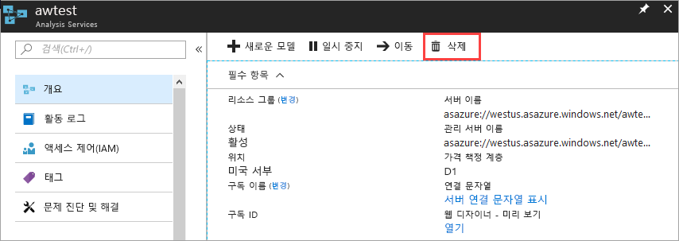

# 빠른 시작: 서버 만들기 - 포털

이 빠른 시작에서는 포털을 사용하여 Azure 구독에 Analysis Services 서버 리소스를 만드는 방법을 설명합니다.

## 사전 요구 사항 

* **Azure 구독**: [Azure 평가판](https://azure.microsoft.com/offers/ms-azr-0044p/)으로 이동하여 계정을 만들 수 있습니다.
* **Azure Active Directory**: 구독이 Azure Active Directory와 연결되어야 합니다. 또한 해당 Azure Active Directory의 계정으로 Azure에 로그인해야 합니다. 자세한 내용은 [인증 및 사용자 권한](analysis-services-manage-users.md)을 참조하세요.

## Azure Portal에 로그인 

[포털에 로그인](https://portal.azure.com)

## 서버 만들기

1. **+ 리소스 만들기** > **분석** > **Analysis Services**를 클릭합니다.

    

2. **Analysis Services**에서 필수 필드를 입력한 다음, **만들기**를 누릅니다.
   
   * **서버 이름**: 서버를 참조하는 데 사용되는 고유한 이름을 입력합니다. 서버 이름은 소문자로 시작하고 3~128자의 소문자 및 숫자를 포함해야 합니다. 공백 및 특수 문자는 허용되지 않습니다.
   * **구독**: 이 서버와 연결할 구독을 선택합니다.
   * **리소스 그룹**: 새 리소스 그룹을 만들거나 기존 리소스 그룹을 선택합니다. 리소스 그룹은 Azure 리소스 컬렉션을 관리할 수 있도록 디자인되었습니다. 자세한 내용은 [리소스 그룹](../azure-resource-manager/management/overview.md)을 참조하세요.
   * **위치**: 이 Azure 데이터 센터 위치는 서버를 호스팅합니다. 가장 큰 사용자 기반에 가장 가까운 위치를 선택합니다.
   * **가격 책정 계층**: 가격 책정 계층을 선택합니다. 테스트하고 샘플 모델 데이터베이스를 설치하려는 경우 체험판 **D1** 계층을 선택합니다. 자세한 내용은 [Azure Analysis Services 가격 책정](https://azure.microsoft.com/pricing/details/analysis-services/)을 참조하세요. 
   * **관리자**: 기본적으로 로그인하는 계정이 됩니다. Azure Active Directory에서 다른 계정을 선택할 수 있습니다.
   * **백업 스토리지 설정**: 선택 사항입니다. [스토리지 계정](../storage/common/storage-introduction.md)이 이미 있는 경우 모델 데이터베이스 백업에 대한 기본값으로 지정할 수 있습니다. [백업 및 복원](analysis-services-backup.md) 설정을 나중에 지정할 수도 있습니다.
   * **스토리지 키 만료**: 선택 사항입니다. 스토리지 키 만료 시간을 지정합니다.

서버를 만드는 데 걸리는 시간은 보통 1분 미만입니다. **포털에 추가**를 선택한 경우 새 서버를 보려면 포털로 이동합니다. 또는 **모든 서비스** > **Analysis Services**로 이동하여 서버가 준비되었는지 확인합니다. 서버는 1200 이상 호환성 수준의 테이블 형식 모델을 지원합니다. 모델 호환성 수준이 Visual Studio 또는 SSMS에서 지정됩니다.

## 리소스 정리

더 이상 필요하지 않은 경우 서버를 삭제합니다. 서버의 **개요**에서 **삭제**를 클릭합니다. 

 

## 다음 단계
이 빠른 시작에서는 Azure 구독에서 서버를 만드는 방법을 알아보았습니다. 이제 서버가 생겼으니, 서버 방화벽을 구성하여(선택 사항) 보안을 강화할 수 있습니다. 또한 포털에서 바로 기본 샘플 데이터 모델을 서버에 추가할 수 있습니다. 샘플 모델이 있으면 model 데이터베이스 역할을 구성하고 클라이언트 연결을 테스트하는 방법을 알아볼 때 유용합니다. 자세히 알아보려면 샘플 모델 추가를 위한 자습서를 계속합니다.

> [!div class="nextstepaction"]
> [빠른 시작: 서버 방화벽 구성 - 포털](analysis-services-qs-firewall.md)   
> [!div class="nextstepaction"]
> [자습서: 서버에 샘플 모델 추가](analysis-services-create-sample-model.md)
