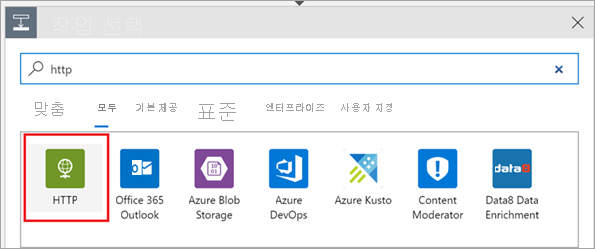
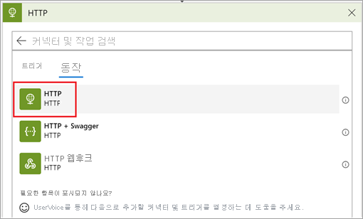
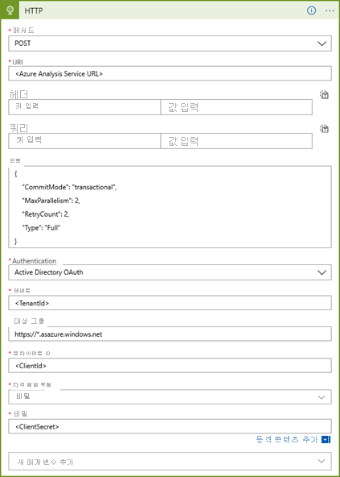

# Logic Apps를 사용하여 새로 고침

논리 앱 및 REST 호출을 사용하면 쿼리 확장에 대한 읽기 전용 복제본의 동기화를 포함하여 Azure Analysis 테이블 형식 모델에서 자동화된 데이터 새로 고침 작업을 수행할 수 있습니다.

Azure 분석 서비스에서 REST API를 사용하는 방법에 대해 자세히 알아보려면 [REST API를 사용한 비동기 새로 고침을](analysis-services-async-refresh.md)참조하십시오.

## 인증

모든 호출은 유효한 Azure Active Directory(OAuth 2) 토큰으로 인증되어야 합니다.  이 문서의 예제에서는 SPN(서비스 주체)을 사용하여 Azure 분석 서비스를 인증합니다. 자세한 내용은 [Azure 포털을 사용하여 서비스 주체 만들기를](../active-directory/develop/howto-create-service-principal-portal.md)참조하세요.

## 논리 앱 디자인

> [!IMPORTANT]
> 다음 예제는 Azure 분석 서비스 방화벽이 비활성화되어 있다고 가정합니다. 방화벽을 사용하도록 설정한 경우 요청 이니시에이터의 공용 IP 주소가 Azure 분석 서비스 방화벽에 화이트리스트에 등록되어야 합니다. 지역별 Azure 논리 앱 IP 범위에 대해 자세히 알아보려면 [Azure 논리 앱에 대한 제한 및 구성 정보를](../logic-apps/logic-apps-limits-and-config.md#configuration)참조하세요.

### 사전 요구 사항

#### SPN(서비스 주체 만들기)

서비스 주체를 만드는 방법에 대해 알아보려면 [Azure portal을 사용하여 서비스 주체 만들기를](../active-directory/develop/howto-create-service-principal-portal.md)참조하십시오.

#### Azure 분석 서비스에서 권한 구성
 
만드는 서비스 주체는 서버에 서버 관리자 권한이 있어야 합니다. 자세히 알아보려면 [서버 관리자 역할에 서비스 사용자 추가](analysis-services-addservprinc-admins.md)를 참조하세요.

### 로직 앱 구성

이 예제에서는 로직 앱이 HTTP 요청을 수신할 때 트리거하도록 설계되었습니다. 이렇게 하면 Azure 데이터 팩터리와 같은 오케스트레이션 도구를 사용하여 Azure 분석 서비스 모델 새로 고침을 트리거할 수 있습니다.

로직 앱을 만든 후 다음을 수행합니다.

1. 논리 앱 디자이너에서 첫 번째 작업을 **HTTP 요청이 수신될 때로 선택합니다.**

   

이 단계는 논리 앱이 저장되면 HTTP POST URL로 채워집니다.

2. 새 단계를 추가하고 **HTTP를**검색합니다.  

   

   

3. **HTTP를** 선택하여 이 작업을 추가합니다.

   

다음과 같이 HTTP 활동을 구성합니다.

|속성  |값  |
|---------|---------|
|**메서드**     |POST         |
|**URI**     | *서버 영역*/서버/*aas 서버 이름*/모델/ 데이터베이스*이름/새로*고침을 https://     예: https:\//westus.asazure.windows.net/servers/myserver/models/AdventureWorks/refreshes|
|**헤더**     |   콘텐츠 유형, 응용 프로그램/json          |
|**본문**     |   요청 본문을 형성하는 방법에 대한 자세한 내용은 [REST API - POST /새로 고침을 사용하여 비동기 새로 고침을](analysis-services-async-refresh.md#post-refreshes)참조하십시오. |
|**인증**     |Active Directory OAuth         |
|**테넌트**     |Azure Active 디렉터리 테넌트ID 채우기         |
|**관객**     |https://*.asazure.windows.net         |
|**클라이언트 ID**     |서비스 주체 이름 ClientID 입력         |
|**자격 증명 유형**     |비밀         |
|**비밀**     |서비스 주체 이름 비밀 입력         |

예제:

이제 논리 응용 프로그램을 테스트합니다.  논리 앱 디자이너에서 **실행 을**클릭합니다.

## Azure 데이터 팩터리에서 논리 앱 사용

논리 앱이 저장되면 **HTTP 요청이 수신된** 경우 활동을 검토한 다음 이제 생성된 **HTTP POST URL을** 복사합니다.  이 URL은 Azure Data Factory에서 논리 앱을 트리거하기 위해 비동기 호출을 하는 데 사용할 수 있는 URL입니다.

다음은 이 작업을 수행하는 Azure 데이터 팩터리 웹 활동의 예입니다.

## 자체 포함 논리 앱 사용

데이터 팩터리와 같은 오케스트레이션 도구를 사용하여 모델 새로 고침을 트리거하지 않으려는 경우 논리 앱을 설정하여 일정에 따라 새로 고침을 트리거할 수 있습니다.

위의 예제를 사용하여 첫 번째 활동을 삭제하고 **일정** 활동으로 바꿉습니다.

이 예제는 **되풀이**를 사용합니다.

활동이 추가되면 간격 및 빈도를 구성한 다음 새 매개 변수를 추가하고 **이 시간에**선택합니다.

원하는 시간을 선택합니다.

논리 앱을 저장합니다.

## 다음 단계

[샘플](analysis-services-samples.md)  
[나머지 API](https://docs.microsoft.com/rest/api/analysisservices/servers)
