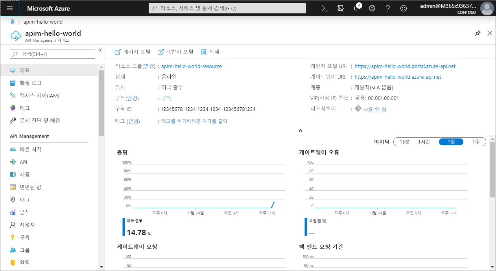
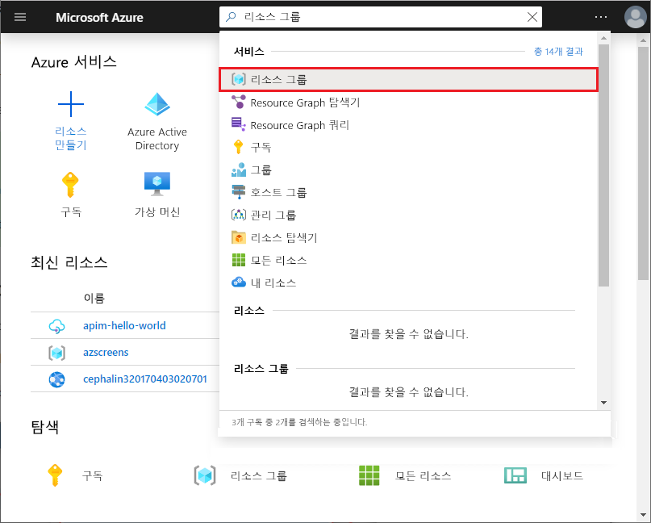

# Create a new Azure API Management service instance

Azure API Management (APIM) helps organizations publish APIs to external, partner, and internal developers to unlock the potential of their data and services. API Management provides the core competencies to ensure a successful API program through developer engagement, business insights, analytics, security, and protection. APIM  enables you to create and manage modern API gateways for existing backend services hosted anywhere. For more information, see the [Overview](api-management-key-concepts.md) topic.

This quickstart describes the steps for creating a new API Management instance using the Azure portal.

[!INCLUDE [quickstarts-free-trial-note](../../includes/quickstarts-free-trial-note.md)]

## Log in to Azure

Log in to the Azure portal at https://portal.azure.com.

## Create a new service

1. In the [Azure portal](https://portal.azure.com/), select **Create a resource** > **Enterprise Integration** > **API management**.

    Alternatively, choose **New**, type `API management` in the search box, and press Enter. Click **Create**.

2. In the **API Management service** window, enter settings.

    

    | Setting                 | Suggested value                               | Description                                                                                                                                                                                                                                                                                                                         |
|-------------------------|-----------------------------------------------|-------------------------------------------------------------------------------------------------------------------------------------------------------------------------------------------------------------------------------------------------------------------------------------------------------------------------------------|
| **Name**                | A unique name for your API Management service | The name can't be changed later. Service name is used to generate a default domain name in the form of *{name}.azure-api.net.* If you would like to use a custom domain name, see [Configure a custom domain](configure-custom-domain.md).   Service name is used to refer to the service and the corresponding Azure resource. |
| **Subscription**        | Your subscription                             | The subscription under which this new service instance will be created. You can select the subscription among the different Azure subscriptions that you have access to.                                                                                                                                                            |
| **Resource Group**      | *apimResourceGroup*                           | You can select a new or existing resource. A resource group is a collection of resources that share lifecycle, permissions, and policies. Learn more [here](../azure-resource-manager/resource-group-overview.md#resource-groups).                                                                                                  |
| **Location**            | *West USA*                                    | Select the geographic region near you. Only the available API Management service regions appear in the drop-down list box.                                                                                                                                                                                                          |
| **Organization name**   | The name of your organization                 | This name is used in a number of places, including the title of the developer portal and sender of notification emails.                                                                                                                                                                                                             |
| **Administrator email** | *admin\@org.com*                               | Set email address to which all the notifications from **API Management** will be sent.                                                                                                                                                                                                                                              |
| **Pricing tier**        | *Developer*                                   | Set **Developer** tier to evaluate the service. This tier is not for production use. For more information about scaling the API Management tiers, see [upgrade and scale](upgrade-and-scale.md).                                                                                                                                    |

3. Choose **Create**.

    > [!TIP]
    > It usually takes between 20 and 30 minutes to create an API Management service. Selecting **Pin to dashboard** makes finding a newly created service easier.

[!INCLUDE [api-management-navigate-to-instance.md](../../includes/api-management-navigate-to-instance.md)]

## Clean up resources

When no longer needed, you can remove the resource group and all related resources by following these steps:

1. In the Azure portal, select **All services**.
2. Input `resource groups` in the search box and click on the result.

    

3. Find your resource group and click on it.
4. Click **Delete resource group**.

    

5. Confirm the deletion by inputting the name of your resource group.
6. Click **Delete**.

## Next steps

> [!div class="nextstepaction"]
> [Import and publish your first API](import-and-publish.md)
