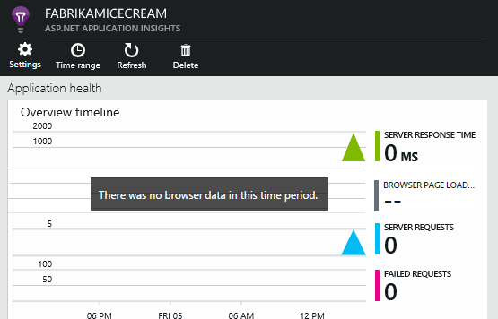

<properties
   pageTitle="Azure 클라우드 서비스용 Application Insights"
   description="Application Insights를 사용하여 웹 및 작업자 역할을 효과적으로 모니터링"
   services="application-insights"
   documentationCenter=""
   authors="soubhagyadash"
   manager="victormu"
   editor="alancameronwills"/>

<tags
   ms.service="application-insights"
   ms.devlang="na"
   ms.tgt_pltfrm="ibiza"
   ms.topic="article"
   ms.workload="tbd"
   ms.date="05/21/2015"
   ms.author="sdash"/>

# Azure 클라우드 서비스용 Application Insights


*Application Insights는 미리 보기 상태입니다.*

[Visual Studio Application Insights][start]를 사용하여 [Microsoft Azure 클라우드 서비스 앱](http://azure.microsoft.com/services/cloud-services/)의 가용성, 성능, 실패 및 사용 현황을 모니터링할 수 있습니다.

<!-- For illustration purposes, we have added Application Insights to this [sample Azure cloud service](sample link). This code is available [here](git link), for you to follow along with the steps below. -->

## 각 역할에 대한 Application Insights 리소스 만들기

Application Insights 리소스는 원격 분석 데이터를 분석하고 표시할 수 있는 위치입니다.

1.  [Azure 포털][portal]에서 새 Application Insights 리소스를 만듭니다. 응용 프로그램 유형으로 ASP.NET 앱을 선택합니다. 

    

2.  계측 키를 복사합니다. 잠시 후 SDK를 구성할 때 필요합니다.

    


일반적으로 각 웹 및 작업자 역할의 데이터에 대해 별도의 리소스를 만드는 것이 좋습니다.

대안으로 모든 역할의 데이터를 한 리소스로 보낼 수는 있지만 각 역할의 결과를 필터링 또는 그룹화할 수 있도록 [기본 속성][apidefaults]을 설정해야 합니다.

## <a name="sdk"></a>각 프로젝트에 SDK 설치


1. Visual Studio에서 데스크톱 앱 프로젝트의 NuGet 패키지를 편집합니다. 

2. 웹 앱용 Application Insights SDK를 설치합니다.

    

    (다른 방법으로 웹 앱에 대한 Application Insights SDK를 선택할 수 있습니다. 이는 일부 기본 제공 성능 카운터 원격 분석을 제공합니다.)

3. Application Insights 리소스에 데이터를 보내도록 SDK를 구성합니다.

    `ApplicationInsights.config`를 열고 이 줄을 삽입합니다.

    `<InstrumentationKey>` *복사한 계측 키* `</InstrumentationKey>`

    Application Insights 리소스에서 복사한 계측 키를 사용합니다.

    또는 [런타임에 키를 설정][apidynamicikey]할 수도 있습니다. 이렇게 설정하면 여러 환경(개발, 테스트, 프로덕션)의 원격 분석을 다른 리소스로 전달할 수 있습니다.

## 앱을 실행합니다.

개발 컴퓨터에서 프로젝트를 디버그 모드로 실행하거나 Azure에 게시합니다. 앱을 잠시 사용하여 원격 분석 데이터를 약간 생성합니다.

## <a name="monitor"></a> 원격 분석 보기

[Azure 포털][portal]로 돌아가 Application Insights 리소스를 찾습니다.


개요 차트에서 데이터를 찾습니다. 처음에는 요소가 1~2개만 표시됩니다. 예:



차트를 클릭하면 더 자세한 메트릭을 볼 수 있습니다. [메트릭에 대해 자세히 알아봅니다.][perf]

이제 응용 프로그램을 게시하고 누적되는 데이터를 관찰합니다.


#### 데이터가 없나요?

* [검색][diagnostic] 타일을 열고 개별 이벤트를 봅니다.
* 응용 프로그램을 사용하여 여러 페이지를 열어 원격 분석을 생성해 봅니다.
* 몇 초 정도 기다렸다가 새로고침을 클릭합니다.
* [문제 해결][qna]을 참조하세요.


## 설치 완료

응용 프로그램의 모든 부분을 완벽하게 살펴보려면 몇 가지 할 일이 더 있습니다.


* [JavaScript SDK를 웹 페이지에 추가][client]하여 페이지 보기 수, 페이지 로드 시간, 스크립트 예외 사항과 같은 브라우저 기반 원격 분석을 가져오고 페이지 스크립트에서 사용자 지정 원격 분석을 작성합니다.
* 데이터베이스 또는 앱에서 사용하는 다른 구성 요소에 따른 문제를 진단하는 종속성 추적을 추가합니다.
 * [Azure 웹 앱 또는 VM에서][azure]
 * [온-프레미스 IIS 서버에서][redfield]
* 즐겨찾는 로깅 프레임워크에서 [로그 추적 캡처][netlogs]
* [사용자 지정 이벤트 및 메트릭을 추적][api]하여 클라이언트나 서버 또는 둘 다에서 응용 프로그램이 어떻게 사용되는지 알아볼 수 있습니다.
* [웹 테스트를 설정][availability]하여 응용 프로그램이 라이브 상태로 유지되며 응답하는지 확인할 수 있습니다.

#### 작업자 역할에 대한 요청 추적

HTTP 요청과 같은 방법으로 요청을 추적하여 작업자 역할에 대한 호출의 성능을 캡처할 수 있습니다. Application Insights에서 요청 원격 분석 유형은 시간을 제한할 수 있고 독립적으로 성공 또는 실패할 수 있는 명명된 서버 쪽 작업의 단위를 측정합니다. HTTP 요청은 SDK에서 자동으로 캡처하지만 사용자 고유의 코드를 삽입하여 작업자 역할에 대한 요청을 추적할 수 있습니다.

다음은 작업자 역할에 대한 일반적인 실행 루프입니다.

```C#

    while (true)
    {
      Stopwatch s1 = Stopwatch.StartNew();
      var startTime = DateTimeOffset.UtcNow;
      try
      {
        // ... get and process messages ...

        s1.Stop();
        telemetryClient.TrackRequest("CheckItemsTable",
            startTime, s1.Elapsed, SUCCESS_CODE, true);
      }
      catch (Exception ex)
      {
        string err = ex.Message;
        if (ex.InnerException != null)
        {
           err += " Inner Exception: " + ex.InnerException.Message;
        }
        s1.Stop();
        telemetryClient.TrackRequest("CheckItemsTable", 
            startTime, s1.Elapsed, FAILURE_CODE, false);
        telemetryClient.TrackException(ex);

        // Don't flood if we have a bug in queue process loop.
        System.Threading.Thread.Sleep(60 * 1000);
      }
    }
```


[api]: app-insights-api-custom-events-metrics.md
[apidefaults]: app-insights-api-custom-events-metrics.md#default-properties
[apidynamicikey]: app-insights-api-custom-events-metrics.md#dynamic-ikey
[availability]: app-insights-monitor-web-app-availability.md
[azure]: app-insights-azure.md
[client]: app-insights-javascript.md
[diagnostic]: app-insights-diagnostic-search.md
[netlogs]: app-insights-asp-net-trace-logs.md
[perf]: app-insights-web-monitor-performance.md
[portal]: http://portal.azure.com/
[qna]: app-insights-troubleshoot-faq.md
[redfield]: app-insights-monitor-performance-live-website-now.md
[start]: app-insights-get-started.md

<!---HONumber=58-->