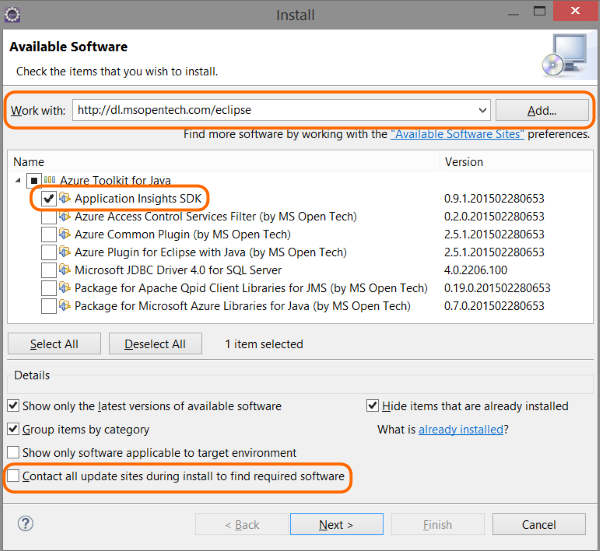
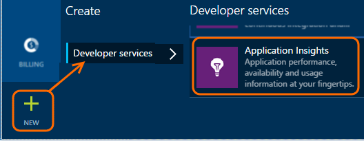
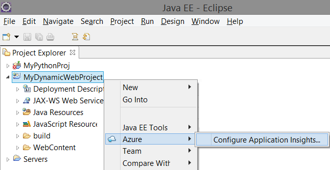
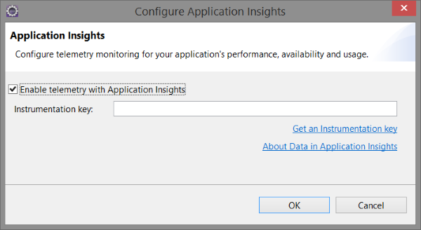
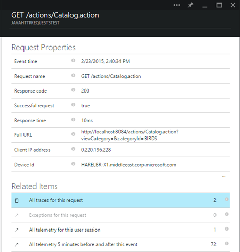

<properties 
	pageTitle="Eclipse에서 Java를 사용하여 Application Insights 시작하기" 
	description="Application Insights를 사용하여 성능 및 사용량 모니터링을 Java 웹 사이트에 추가하기 위해 Eclipse 플러그인을 사용합니다." 
	services="application-insights" 
    documentationCenter="java"
	authors="alancameronwills" 
	manager="keboyd"/>

<tags 
	ms.service="application-insights" 
	ms.workload="tbd" 
	ms.tgt_pltfrm="ibiza" 
	ms.devlang="na" 
	ms.topic="article" 
	ms.date="03/03/2015" 
	ms.author="awills"/>
 
#Eclipse에서 Java를 사용하여 Application Insights 시작하기

Application Insights SDK가 Java 웹 응용 프로그램에서 원격 분석을 전송하므로 사용량 및 성능을 분석할 수 있습니다. Application Insights용 Eclipse 플러그인이 프로젝트에 SDK를 자동으로 설치하므로 기본 원격 분석을 이용할 수 있을 뿐 아니라 사용자 지정 원격 분석 작성에 사용할 수 있습니다.

##필수 조건

현재 플러그인은 Eclipse에서 동적 웹 프로젝트를 위해 동작합니다. ([다른 유형의 Java 프로젝트에 Application Insights를 추가합니다][java].)

필요한 사항:

* Oracle JRE 1.6 이상
* [Microsoft Azure](http://azure.microsoft.com/) 구독. ([무료 평가판](http://azure.microsoft.com/pricing/free-trial/)으로 시작할 수 있음.)
* [Java EE Developers용 Eclipse IDE](http://www.eclipse.org/downloads/), Indigo 이상.
* Windows 7 이상 또는 Windows Server 2008 이상

##Eclipse에 SDK를 설치합니다(한 번).

컴퓨터당 한 번씩만 수행해야 합니다. 이 단계는 SDK를 각 동적 웹 프로젝트에 추가할 수 있는 도구 키트를 설치합니다.

1. Eclipse에서 도움말, 새 소프트웨어 설치를 클릭합니다.

    

2. SDK는 Azure 도구 키트의 http://dl.msopentech.com/eclipse에 있습니다.
3. **모든 업데이트 사이트 문의...**를 선택 취소합니다.

    

각 Java 프로젝트에 대한 나머지 단계를 따릅니다.

##Application Insights 계측 키 가져오기

사용량 및 성능 분석은 Azure 웹 포털의 Azure 리소스에 표시됩니다. 이 단계에서는 응용 프로그램에 대한 Azure 리소스를 설정합니다.

1. [Microsoft Azure 포털](https://portal.azure.com)에 로그인합니다. ([Azure 구독](http://azure.microsoft.com/)이 필요합니다.)
2. 새 Application Insights 리소스 만들기

    
3. Java 웹 응용 프로그램에 대한 응용 프로그램 종류를 설정합니다.

    
4. 새 리소스의 계측 키를 찾습니다. Eclipse에서 프로젝트에 이를 붙여넣어야 합니다.

    

##Java 프로젝트에 SDK 추가

1. 웹 프로젝트의 상황에 맞는 메뉴에서 Application Insights를 추가합니다.

    
2. Azure 포털에서 가져온 계측 키를 붙여넣습니다.

    

키는 원격 분석의 모든 항목과 함께 전송되고 리소스에서 표시하도록 Application Insights에 알려줍니다.

##응용 프로그램을 실행하고 메트릭을 참조하세요.

응용 프로그램을 실행합니다.

Microsoft Azure에서 Application Insights 리소스로 돌아갑니다.

HTTP 요청 데이터가 개요 블레이드에 표시됩니다. (없는 경우 몇 초 정도 기다린 다음 새로고침을 클릭합니다.)

 

차트를 클릭하면 더 자세한 메트릭을 볼 수 있습니다.

[메트릭에 대해 자세히 알아봅니다.][metrics]

 

또한 요청 속성 검토 시 요청 및 예외 사항과 관련된 원격 분석 이벤트를 볼 수 있습니다.
 

##클라이언트쪽 원격 분석

개요 블레이드의 퀵 스타트에서 웹 페이지에 추가할 스크립트를 가져올 수 있습니다.

페이지 보기, 사용자 및 세션 메트릭이 개요 블레이드에 표시됩니다.

[클라이언트쪽 원격 분석 설정에 대해 자세히 알아봅니다.][usage]

##가용성 웹 테스트

Application Insights는 일정한 간격으로 웹 사이트를 테스트하여 잘 실행되며 제대로 응답하는지 확인할 수 있습니다. 개요 블레이드에서 빈 웹 테스트 차트를 클릭하고 공용 URL을 제공합니다.

사이트가 다운되는 경우 응답 시간 차트는 물론 이메일 알림을 얻게 됩니다.

[가용성 웹 테스트에 대한 자세히 알아봅니다.][availability]

##진단 로그

추적에 Logback 또는 Log4J(v1.2 또는 v2.0)를 사용하는 경우 추적 로그를 탐색 및 검색할 수 있는 Application Insights에 추적 로그를 자동으로 전송할 수 있습니다.

[진단 검색에 대해 자세히 알아보기][javalogs]

##사용자 지정 원격 분석 

Java 웹 응용 프로그램에 몇 줄의 코드를 삽입하여 이를 사용하여 해당 작업을 수행하는 사용자를 확인하거나 진단 문제를 지원합니다.

웹 페이지 JavaScript와 서버쪽 Java에 모두 코드를 삽입할 수 있습니다.

[사용자 지정 원격 분석에 대해 자세히 알아보기][track]

##다음 단계

####문제 감지 및 진단

* [웹 클라이언트 원격 분석을 추가][usage]하여 웹 클라이언트에서 성능 원격 분석을 가져올 수 있습니다.
* [웹 테스트를 설정][availability]하여 응용 프로그램이 라이브 상태로 유지되며 응답하는지 확인할 수 있습니다.
* [이벤트 및 로그를 검색][diagnostic]하여 문제를 진단할 수 있습니다.
* [Log4J 또는 Logback 추적 캡처][javalogs]

####사용 현황 추적

* [웹 클라이언트 원격 분석을 추가][usage]하여 페이지 보기 및 기본 사용자 메트릭을 모니터링할 수 있습니다.
* [사용자 지정 이벤트 및 메트릭을 추적][track]하여 클라이언트와 서버에서 응용 프로그램이 어떻게 사용되는지 알아볼 수 있습니다.

<!--Link references-->

[availability]: app-insights-monitor-web-app-availability.md
[diagnostic]: app-insights-diagnostic-search.md
[java]: app-insights-java-get-started.md
[javalogs]: app-insights-java-trace-logs.md
[metrics]: app-insights-metrics-explorer.md
[track]: app-insights-custom-events-metrics-api.md
[usage]: app-insights-web-track-usage.md

<!--HONumber=54-->