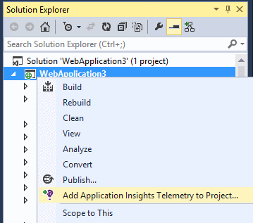

<properties title="Application Insights" pageTitle="Application Insights - start monitoring your app's health and usage" description="Analyze usage, availability and performance of your on-premises or Microsoft Azure web application with Application Insights." metaKeywords="analytics monitoring application insights" authors="awills"  manager="kamrani" />

<tags ms.service="application-insights" ms.workload="tbd" ms.tgt_pltfrm="ibiza" ms.devlang="na" ms.topic="article" ms.date="2014-09-24" ms.author="awills" />

# Application Insights - 앱의 상태 및 사용 현황 모니터링 시작

*Application Insights는 미리 보기 상태입니다.*

Application Insights에서는 라이브 응용 프로그램에 대한 다음 항목을 모니터링할 수 있습니다.

-   **가용성** - 전 세계 어디든지 사용자의 URL을 몇 분마다 테스트합니다.
-   **성능** - 성능 문제와 예외를 검색하고 진단합니다.
-   **사용 현황** - 앱을 보다 효율적으로 개선하기 위해 사용자가 앱을 통해 수행하는 작업을 확인합니다.

구성은 매우 간단하며 결과는 몇 분 내에 확인할 수 있습니다. 현재는 사용자의 자체 서버나 Azure에 설치된 ASP.NET 웹 앱이 지원됩니다.

[Microsoft Azure](http://azure.com)의 계정이 필요합니다(무료 평가 기간 있음).

다음의 두 가지 방법으로 Application Insights를 시작할 수 있습니다.

-   (권장) 응용 프로그램 성능과 사용 현황 모니터링을 위해 [Visual Studio의 프로젝트에 Application Insights를 추가합니다](#add).
-   [웹 사이트를 다시 배포하지 않고 서버에 에이전트를 설치합니다][redfield]. 이렇게 하면 라이브 웹 사이트를 다시 배포하거나 소스 코드를 변경하지 않고도 해당 웹 사이트를 모니터링할 수 있습니다. 이 경우 성능 및 예외 모니터링 기능이 제공되며 사용 현황 모니터링은 나중에 추가할 수 있습니다.

> [WACOM.NOTE] Visual Studio Online에는 보다 광범위한 응용 프로그램 유형을 지원하는 [이전 버전의 Application Insights](http://msdn.microsoft.com/ko-kr/library/dn481095.aspx) 가 포함되어 있습니다. 현재 Microsoft Azure의 일부분으로 Application Insights를 처음부터 다시 빌드하는 중이며 이 문서에서는 새 버전에 대한 정보를 제공합니다.

## 프로젝트에 Application Insights 추가

[Visual Studio 2013 업데이트 3](http://go.microsoft.com/fwlink/?linkid=397827&clcid=0x409) 이상이 필요합니다.

### 새 프로젝트의 경우

Visual Studio 2013에서 새 프로젝트를 만들 때 Application Insights를 선택합니다.

프로젝트를 처음 만드는 경우 Microsoft Azure 미리 보기에 로그인하거나 등록하라는 메시지가 표시됩니다. 해당 계정은 Visual Studio Online 계정과는 별개입니다.

Azure 리소스의 이름을 프로젝트의 이름과 다르게 지정하거나 리소스를 같은 그룹에서 다른 프로젝트로 표시하려면 **설정 구성**을 사용합니다.

*Application Insights 옵션이 표시되지 않는 경우 Visual Studio 2013 업데이트 3을 사용 중이고, 확장 및 업데이트에서 Application Insights Tools를 사용하도록 설정되어 있으며, 웹/Windows 스토어 또는 Windows Phone 프로젝트를 만들고 있는지 확인합니다.*

### ... 기존 프로젝트의 경우

솔루션 탐색기에서 프로젝트를 마우스 오른쪽 단추로 클릭하고 Application Insights 추가를 선택합니다.

*웹 사용 현황 분석을 설정하려면 한 단계를 추가로 수행해야 합니다. 여기서는 먼저 데이터부터 확인하겠습니다.*

### 2. 프로젝트 실행

F5 키를 눌러 응용 프로그램을 실행하고 여러 페이지를 열어 봅니다.

Visual Studio에 수신된 이벤트의 수가 표시됩니다.

### 3. 모니터 데이터 확인

프로젝트에서 Application Insights를 엽니다.

**응용 프로그램 상태** 타일에서 데이터를 찾습니다. 처음에는 요소가 1~2개만 표시됩니다. 예를 들면 다음과 같습니다.

보다 자세한 정보를 확인하려면 원하는 타일을 클릭합니다. 보고서에 표시되는 항목을 변경할 수 있습니다. [응용 프로그램 상태 보고서 구성 방법에 대해 자세히 알아보세요.][perf]

### 4. 웹 사용 현황 분석 설정

Application Insights를 *기존* 웹 프로젝트에 추가한 경우에는 사용 현황 분석 타일에 아무 내용도 표시되지 않습니다. 따라서 한 단계를 추가로 수행해야 합니다.

Application Insights에서 빠른 시작, 웹 사이트 계측을 차례로 선택합니다.

JavaScript 코드를 모니터링할 웹 페이지의 닫는 \</head\> 태그 바로 앞에 복사합니다. ASP.NET 프로젝트에서는 마스터 페이지(대개 `_SiteLayout` 또는 `Views\Shared\_Layout`)에 코드를 복사하면 모든 페이지를 효율적으로 모니터링할 수 있습니다. 코드에는 응용 프로그램의 Application Insights 키가 포함됩니다.

응용 프로그램을 다시 실행하면 **사용 현황 분석**에 데이터가 표시됩니다.

[보다 자세한 정보를 확인하려면 차트를 클릭합니다.][perf]

### 5. 응용 프로그램 배포

응용 프로그램을 배포하고 누적되는 데이터를 관찰합니다.

라이브 응용 프로그램을 만든 후에는 [웹 테스트를 설정][availability]하여 응용 프로그램이 라이브 상태로 유지되는지 확인합니다.

### 포털에서 응용 프로그램의 이름 변경

프로젝트에서 원격 분석을 보내는 리소스를 변경할 수 있습니다.

여기서 '리소스'는 결과가 표시되는 명명된 Application Insights 블레이드입니다. 단일 비즈니스 응용 프로그램 부분을 구성하는 프로젝트가 여러 개인 경우 등에는 그룹 하나에 여러 리소스를 포함할 수 있습니다.

솔루션 탐색기에서 ApplicationInsights.config를 마우스 오른쪽 단추로 클릭하고 **Application Insights 업데이트**를 선택합니다. 그러면 열리는 마법사에서 다른 기존 리소스를 선택하거나 새 리소스를 만들 수 있습니다.

나중에 포털로 돌아가서 이전 리소스를 삭제합니다.

## 비디오

### 소개

> [AZURE.VIDEO application-insights-introduction]

### 시작

> [AZURE.VIDEO getting-started-with-application-insights]

## 다음 단계

[웹 앱 사용 현황 추적][usage]

[웹 응용 프로그램의 성능 모니터링][perf]

[진단 로그 캡처 및 검색][diagnostic]

[문제 해결][qna]

## 자세한 정보

-   [Application Insights - 시작][start]
-   [라이브 웹 서버 모니터링][redfield]
-   [웹 응용 프로그램의 성능 모니터링][perf]
-   [진단 로그 검색][diagnostic]
-   [웹 테스트를 사용한 가용성 추적][availability]
-   [사용 현황 추적][usage]
-   [질문과 대답 및 문제 해결][qna]

<!--Link references-->

[start]: ../app-insights-start-monitoring-app-health-usage/
[redfield]: ../app-insights-monitor-performance-live-website-now/
[perf]: ../app-insights-web-monitor-performance/
[diagnostic]: ../app-insights-search-diagnostic-logs/ 
[availability]: ../app-insights-monitor-web-app-availability/
[usage]: ../app-insights-web-track-usage/
[qna]: ../app-insights-troubleshoot-faq/
