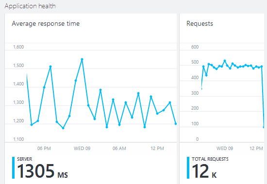
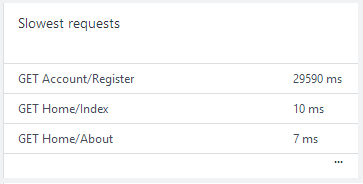
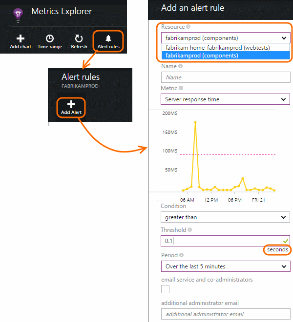

<properties title="Monitor your app's health and usage with Application Insights" pageTitle="Application Insights로 앱 상태 및 사용 현황 모니터링" description="Application Insights를 시작합니다. 온-프레미스 또는 Microsoft Azure 웹 응용 프로그램의 사용량, 가용성 및 성능을 분석합니다." metaKeywords="analytics monitoring application insights" authors="awills"  manager="kamrani" />

<tags ms.service="application-insights" ms.workload="tbd" ms.tgt_pltfrm="ibiza" ms.devlang="na" ms.topic="article" ms.date="2014-11-21" ms.author="awills" />
 
# 웹 응용 프로그램의 성능 모니터링

*Application Insights는 미리 보기 상태입니다.*

응용 프로그램이 정상적으로 작동하는지 확인하고 오류가 발생하는지 신속하게 파악합니다. [Application Insights][start]는 성능 문제 및 예외에 대한 정보와, 이러한 현상에 대한 근본 원인을 확인하고 진단하는 기능을 제공합니다.

Application Insights는 온-프레미스 또는 가상 컴퓨터와 Microsoft Azure 웹 사이트에서 호스트되는 ASP.NET 웹 응용 프로그램을 모니터링할 수 있습니다. 

* [성능 모니터링 설정](#setup)
* [데이터 확인](#view)
* [성능 메트릭의 의미](#metrics)
* [문제 진단](#diagnosis)
* [다음 단계](#next)

## 성능 모니터링 설정

Application Insights를 아직 프로젝트에 추가하지 않은 경우(프로젝트에 ApplicationInsights.config가 없음) 다음 방법 중 하나를 선택하여 작업을 시작합니다.

* [Visual Studio의 앱 프로젝트에 Application Insights 추가][greenbrown] - 권장 방법입니다. 이 방식을 사용하면 수동 성능 모니터링을 수행할 수 있을 뿐 아니라 진단 로깅을 삽입하고 사용 현황을 추적할 수도 있습니다.
* [라이브 웹 사이트의 성능 모니터링][redfield] - 이 방식을 사용하는 경우 응용 프로그램 프로젝트를 업데이트하거나 웹 사이트를 다시 배포하지 않아도 됩니다.
* [Microsoft Azure 웹 사이트의 경우](../insights-how-to-customize-monitoring/)  웹 사이트의 모니터링 렌즈에서 이미 메트릭을 볼 수 있습니다. 

## 보고서 보기

F5 키를 눌러 응용 프로그램을 실행하고 여러 페이지를 열어 봅니다.

Visual Studio에 수신된 이벤트의 수가 표시됩니다.

프로젝트에서 Application Insights를 엽니다.

**응용 프로그램 상태** 타일에서 데이터를 찾습니다. 처음에는 요소가 1~2개만 표시됩니다. 예를 들면 다음과 같습니다.

디버그 모드에서 실행할 때는 파이프라인을 통해 원격 분석이 신속하게 수행되므로 데이터가 몇 초 내에 표시됩니다. 앱을 배포할 때는 데이터가 더 천천히 누적됩니다.

처음에 데이터가 표시되지 않으면 잠시 기다렸다가 새로 고침을 클릭합니다.

### 메트릭 탐색

원하는 타일을 클릭하면 추가 세부 정보와 장기간에 걸친 결과를 확인할 수 있습니다. 예를 들어 요청 타일을 클릭하고 시간 범위를 선택합니다.

차트를 클릭하여 표시되는 메트릭을 선택하거나 새 차트를 추가하고 해당 메트릭을 선택합니다.

> [AZURE.NOTE] 사용 가능한 전체 선택 항목을 확인하려면 **모든 메트릭의 선택을 취소**합니다. 메트릭은 그룹으로 구분되며 그룹 내의 모든 멤버를 선택하면 해당 그룹의 다른 멤버만 표시됩니다.

## 성능 메트릭의 의미 성능 타일 및 보고서

다양한 성능 메트릭을 가져올 수 있습니다. 먼저 응용 프로그램 블레이드에 기본적으로 표시되는 메트릭부터 살펴보겠습니다.

### 요청

지정한 기간에 수신된 HTTP 요청의 수입니다. 이 메트릭을 다른 보고서의 결과와 비교하여 로드의 변화에 따른 앱의 동작 방식을 확인합니다.

HTTP 요청에는 페이지, 데이터 및 이미지에 대한 모든 GET 또는 POST 요청이 포함됩니다.

특정 URL에 대한 요청 수를 가져오려면 타일을 클릭합니다.

### 평균 응답 시간

웹 요청이 응용 프로그램에 도착하는 시점과 응답이 반환되는 시점 사이의 시간을 측정합니다.

점은 이동 평균을 보여 줍니다. 요청 수가 많으면 그래프에서는 요청 수가 크게 늘어나거나 줄어들지 않아도 일부 점이 평균에서 벗어날 수 있습니다.

요청 수의 비정상적인 증가를 확인합니다. 일반적으로는 요청 수가 증가하면 응답 시간은 길어집니다. 그러나 이처럼 요청 수와 응답 시간이 비례하지 않는 경우에는 앱이 사용하는 서비스의 용량 또는 CPU와 같은 리소스 제한에 도달해서 일 수 있습니다.

특정 URL에 대한 요청 시간을 가져오려면 타일을 클릭합니다.

### 가장 느린 요청

성능 튜닝이 필요할 수 있는 요청을 표시합니다.

### 실패한 요청

catch되지 않은 예외를 throw한 요청의 수입니다.

타일을 클릭하면 특정 오류의 세부 정보를 확인할 수 있으며 개별 요청을 선택하면 해당 세부 정보를 볼 수 있습니다. 

오류의 대표 샘플만 개별적으로 조사할 수 있도록 보관됩니다.

### 기타 메트릭

표시할 수 있는 기타 메트릭을 보려면 그래프를 클릭하고 모든 메트릭의 선택을 취소하여 사용 가능한 전체 집합을 표시합니다. (i)를 클릭하면 각 메트릭의 정의가 표시됩니다.

메트릭을 선택하면 같은 차트에 표시할 수 없는 다른 메트릭은 사용하지 않도록 설정됩니다.

## 경고 설정

메트릭의 비정상적인 값에 대한 알림을 메일로 받으려면 경고를 추가합니다. 계정 관리자나 특정 메일 주소로 메일을 보내도록 선택할 수 있습니다.

다른 속성에 앞서 리소스를 설정합니다. 성능 또는 사용 메트릭에 대한 경고를 설정하려면 webtest 리소스를 선택하지 마세요.

임계값을 입력하라는 단위에 주의하세요.

*경고 추가 단추가 보이지 않습니다.* - 읽기 전용 권한이 있기 때문일 수 있습니다. 

## 문제 진단

아래에는 성능 문제를 찾고 진단하기 위한 몇 가지 팁이 나와 있습니다.

* 웹 사이트의 작동이 중단되거나 응답이 잘못되거나 속도가 느려지는 경우 경고를 받도록 [웹 테스트][availability]를 설정합니다. 
* 요청 수를 다른 메트릭과 비교하여 오류 또는 느린 응답이 부하와 관련되어 있는지 확인합니다.
* 코드에서 [추적 문을 삽입 및 검색][diagnostic]하여 문제를 파악합니다.

## 다음 단계

[웹 테스트][availability] - 전 세계에서 웹 요청이 일정한 간격으로 응용 프로그램에 전송되도록 합니다.

[진단 추적 캡처 및 검색][diagnostic] - 추적 호출을 삽입하고 결과를 확인하여 문제를 파악합니다.

[사용 현황 추적][usage] - 사용자의 응용 프로그램 사용 방식을 파악합니다.

[문제 해결][qna] - 문제 해결 정보 및 질문과 대답을 확인합니다.

[AZURE.INCLUDE [app-insights-learn-more](../includes/app-insights-learn-more.md)]

<!--HONumber=35.2-->
