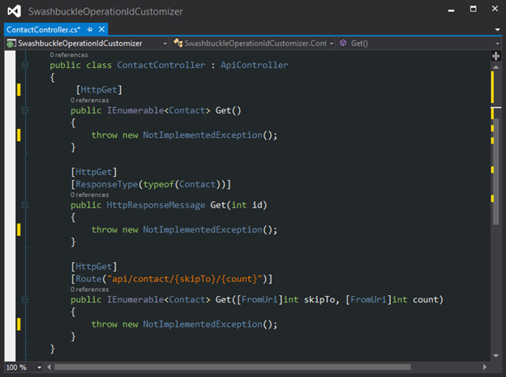

<properties 
	pageTitle="Swashbuckle에서 생성한 작업 식별자 사용자 지정" 
	description="Azure 앱 서비스에서 Swashbuckle에 의해 생성된 Swagger 작업 식별자를 API 앱에 맞게 사용자 지정하는 방법에 대해 알아봅니다." 
	services="app-service\api" 
	documentationCenter=".net" 
	authors="bradygaster" 
	manager="wpickett" 
	editor="jimbe"/>

<tags 
	ms.service="app-service-api" 
	ms.workload="web" 
	ms.tgt_pltfrm="dotnet" 
	ms.devlang="na" 
	ms.topic="article" 
	ms.date="05/16/2015" 
	ms.author="bradyg"/>

# Swashbuckle에서 생성한 작업 식별자 사용자 지정 

## 개요

Swashbuckle은 컨트롤러 이름과 메서드 이름을 연결하여 Swagger 작업 식별자를 생성합니다. 이 패턴은 메서드가 여러 번 오버로드되는 경우 문제가 발생합니다. Swashbuckle에서 중복된 작업 ID를 생성하며 이는 잘못된 Swagger JSON입니다.

예를 들어 다음 컨트롤러 코드를 사용하면 Swashbuckle에서 Contact_Get 작업 ID를 생성합니다.

이 예제의 경우 다음과 같이 메서드에 고유한 이름을 지정하여 문제를 수동으로 해결할 수 있습니다.

* 가져오기
* GetById
* GetPage

대신 고유한 작업 ID를 자동으로 생성하도록 Swashbuckle을 확장할 수 있습니다. 이 문서에서는 이러한 작업 방법을 보여 줍니다.

## Swashbuckle 확장 

다음 단계에서는 Visual Studio API Apps Preview 프로젝트 템플릿에 의해 프로젝트에 포함된 *SwaggerConfig.cs* 파일을 사용하여 Swashbuckle을 사용자 지정하는 방법을 보여 줍니다. 또한 API 앱으로 배포하도록 구성한 Web API 프로젝트에서 Swashbuckle을 사용자 지정할 수도 있습니다.

1. 사용자 지정 `IOperationFilter` 구현 만들기 

	`IOperationFilter` 인터페이스는 Swagger 메타데이터 프로세스의 다양한 측면을 사용자 지정하려는 Swashbuckle 사용자를 위해 확장성 지점을 제공합니다. 다음 코드는 operation-id-generation 동작을 변경하는 한 가지 방법을 보여 줍니다. 이 코드는 매개 변수 이름을 작업 ID 이름에 추가합니다.

		using Swashbuckle.Swagger;
		using System.Web.Http.Description;
		
		namespace ContactsList
		{
		    public class MultipleOperationsWithSameVerbFilter : IOperationFilter
		    {
		        public void Apply(
		            Operation operation,
		            SchemaRegistry schemaRegistry,
		            ApiDescription apiDescription)
		        {
		            if (operation.parameters != null)
		            {
		                operation.operationId += "By";
		                foreach (var parm in operation.parameters)
		                {
		                    operation.operationId += string.Format("{0}",parm.name);
		                }
		            }
		        }
		    }
		}

2. *App_Start\SwaggerConfig.cs* 파일에서 `OperationFilter` 메서드를 호출하여 Swashbuckle에서 새 `IOperationFilter` 구현을 사용하도록 합니다.

		c.OperationFilter<MultipleOperationsWithSameVerbFilter>();

	

	Swashbuckle NuGet 패키지에서 삭제된 *SwaggerConfig.cs* 파일에는 확장성 지점의 주석 처리된 많은 예제가 포함되어 있습니다. 추가 주석은 여기에 나와 있지 않습니다.

	이렇게 변경하면 `IOperationFilter` 구현이 사용되고 고유한 작업 ID가 생성됩니다.
 
	

## 다음 단계

이 문서에서는 고유한 작업 ID를 생성하도록 Swashbuckle을 사용자 지정하는 방법을 알아보았습니다. 자세한 내용은 [GitHub의 Swashbuckle](https://github.com/domaindrivendev/Swashbuckle)을 참조하세요.

<!---HONumber=58-->