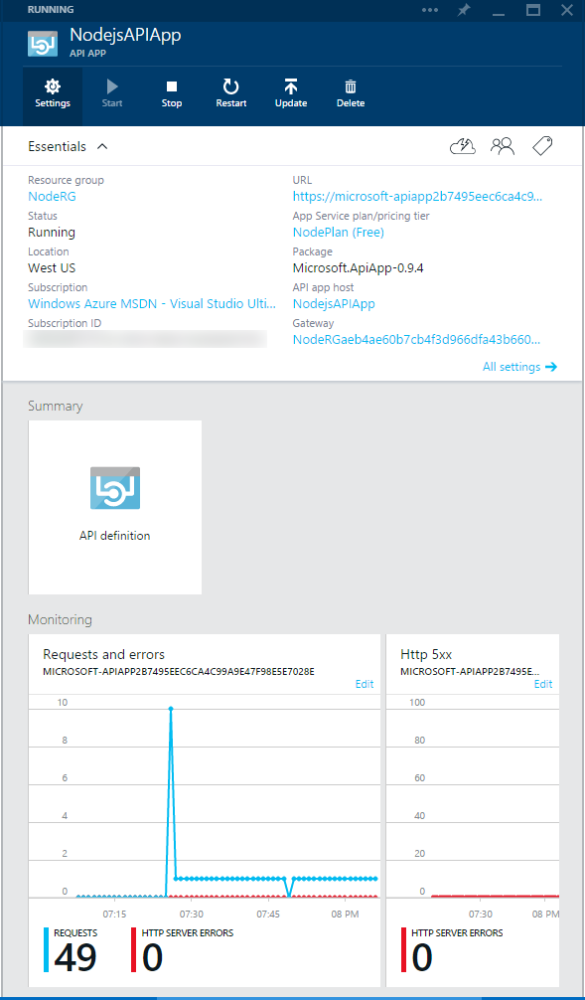

<properties 
	pageTitle="API 앱 관리" 
	description="Azure Preview 포털 및 Visual Studio 서버 탐색기를 사용하여 API 앱을 관리하는 방법을 알아봅니다." 
	services="app-service\api" 
	documentationCenter="" 
	authors="tdykstra" 
	manager="wpickett" 
	editor="jimbe"/>

<tags 
	ms.service="app-service-api" 
	ms.workload="web" 
	ms.tgt_pltfrm="na" 
	ms.devlang="na"
	ms.topic="article" 
	ms.date="04/20/2015" 
	ms.author="tdykstra"/>

# API 앱 관리

이 문서에서는 Azure Preview 포털을 사용하여 인증 구성, 자동 크기 조정 설정 등의 API 앱 관리 작업을 수행하는 방법을 보여 줍니다. 또한 Visual Studio의 서버 탐색기 창에서 일부 관리 작업을 수행하는 방법을 보여 줍니다.

## API 앱 아키텍처 이해

Azure 앱 서비스에서 API 앱은 웹 서비스를 호스트하는 추가 기능이 있는 [웹앱](app-service-web-overview.md)입니다. Azure Preview 포털에는 API 관련 기능을 관리하는 **API 앱** 블레이드와 기본 웹앱을 관리하는 **API 앱 호스트** 블레이드가 있습니다.

하나 이상의 API 앱이 포함된 모든 리소스 그룹에는 *게이트웨이*도 포함되어 있습니다. 게이트웨이는 프록시 역할을 합니다. 즉, 리소스 그룹의 모든 API 앱에 대한 인증 및 기타 관리 기능을 처리합니다. API 앱과 마찬가지로 게이트웨이는 추가 기능이 있는 웹앱이므로 게이트웨이를 관리하기 위한 두 개의 포털 블레이드, 즉 게이트웨이 관련 기능을 관리하는 **게이트웨이** 블레이드와 기본 웹앱을 관리하는 **게이트웨이 호스트** 블레이드가 있습니다.

### API 앱 블레이드 작업 

**API 앱** 블레이드는 다음과 같은 작업에 사용됩니다.

- 액세스 수준 구성 - **설정 \> 응용 프로그램 설정**을 클릭합니다. 기본값은 내부입니다. 즉, 동일한 리소스 그룹에 있는 API 앱에서만 API 앱을 호출할 수 있습니다. 자세한 내용은 [API 앱 보호](app-service-api-dotnet-add-authentication.md)를 참조하세요.   
- 업데이트 정책 구성 - **설정 \> 응용 프로그램 설정**을 클릭합니다. 기본값은 **설정**입니다. 즉, 새 버전의 API 앱이 마켓플레이스에 게시되면 주요 변경 내용이 아닌 경우 API 앱이 새 버전으로 자동으로 업데이트됩니다.  
- API 앱에서 나가는 호출에 대한 인증 구성 - **설정 \> 인증**을 클릭합니다. API 앱에서 인증이 필요한 외부 서비스를 호출한 경우 필요한 구성 값이 여기에 입력됩니다. 예를 들어 Dropbox 커넥터가 Dropbox 서비스에 액세스하려면 클라이언트 ID 및 클라이언트 암호가 필요합니다.
- [RBAC](role-based-access-control-configure.md) 구성 - **설정 \> 사용자**를 클릭합니다. 여기에서 구성한 사용자 액세스는 API 앱 관련 기능에 액세스할 수 있는 사용자만 결정합니다. 웹앱 기능에 대한 RBAC를 구성하려면 **API 앱 호스트** 블레이드를 사용합니다. 일반적으로 API 앱에 대한 RBAC 설정과 API 앱 호스트에 대한 RBAC 설정을 동기화된 상태로 유지할 수 있습니다. API 앱 호스트에는 액세스할 수 없고 API 앱에만 액세스할 수 있는 권한을 제공한 경우 해당 사용자는 **API 앱** 블레이드에서 실제로 API 앱 호스트와 관련된 기능을 사용할 수 없습니다. **API 앱** 블레이드와 **API 앱 호스트** 블레이드 간의 관계는 아래에 설명되어 있습니다.
- API 정의 보기 - **API 앱**에서 노출하는 메서드 목록을 보려면 **요약** 섹션에서 **API 정의**를 클릭합니다.

### API 앱 블레이드와 API 앱 호스트 블레이드의 공통 기능 

**API 앱** 블레이드를 사용하여 기본 웹앱과 관련된 많은 작업을 수행할 수 있습니다. 예를 들어 이 블레이드에서는 API 앱을 호스트하는 웹앱을 중지, 시작 및 다시 시작할 수 있는 단추를 제공합니다. 그러나 이러한 작업은 **API 앱 호스트** 블레이드에서도 수행할 수 있습니다. 이는 두 블레이드에서 동일한 UI의 대부분을 공유하기 때문입니다. **API 앱** 블레이드의 **중지**, **시작** 및 **다시 시작** 단추는 **API 앱 호스트** 블레이드의 **중지**, **시작** 및 **다시 시작** 단추와 효과가 정확히 같습니다. 마찬가지로 **API 앱** 블레이드에서 제공되는 모니터링 정보는 **API 앱 호스트** 블레이드에 표시되는 것과 동일합니다.

**API 앱 호스트** 블레이드와 중복되지 않고 **API 앱** 블레이드에서만 제공되는 기능은 이전 섹션에 나열되어 있습니다.

### API 앱 호스트 블레이드 작업

웹앱에 대해 수행하는 모든 작업에 **API 앱 호스트** 블레이드를 사용할 수 있습니다. 자세한 내용은 [포털에서 웹앱 관리](web-sites-manage.md)를 참조하세요.

### 게이트웨이 블레이드 작업

**게이트웨이** 블레이드는 다음과 같은 작업에 사용됩니다.

- API 앱으로 들어오는 호출에 대한 인증 공급자 구성 - **설정 \> ID**를 클릭합니다. 게이트웨이에서 리소스 그룹의 API 앱을 호출하도록 허용하기 전에 사용자를 인증해야 하는 경우 필요한 구성 값이 여기에 입력됩니다. 자세한 내용은 [Azure 앱 서비스에서 SaaS 커넥터 구성 및 테스트](app-service-api-connnect-your-app-to-saas-connector.md)를 참조하세요. 
- [RBAC](role-based-access-control-configure.md) 구성 - **설정 \> 사용자**를 클릭합니다. API 앱 블레이드와 API 앱 호스트 블레이드에 입력되는 RBAC 구성 간의 관계를 설명하는 위 설명이 게이트웨이 블레이드 및 게이트웨이 호스트 블레이드에 그대로 적용됩니다.

### 게이트웨이 호스트 블레이드 작업

웹앱에 대해 수행하는 모든 작업에 **게이트웨이 호스트** 블레이드를 사용할 수 있습니다. 자세한 내용은 [포털에서 웹앱 관리](web-sites-manage.md)를 참조하세요.

## API 앱 블레이드로 이동 

**API 앱** 블레이드로 이동하는 한 가지 방법은 Azure Preview 포털의 찾아보기 기능을 사용하는 것입니다. 포털 홈 페이지에서 **찾아보기 \> API 앱**을 클릭하여 관리할 수 있는 모든 API 앱을 볼 수 있습니다.

**API 앱** 목록 블레이드에서 행을 클릭하면 포털에 **API 앱** 블레이드가 표시됩니다.

## API 앱 호스트 블레이드로 이동

**API 앱 호스트** 블레이드로 이동하려면 **API 앱** 블레이드에서 **API 앱 호스트**를 클릭합니다.

## 게이트웨이 블레이드로 이동

**게이트웨이** 블레이드로 이동하려면 **API 앱** 블레이드에서 **게이트웨이** 링크를 클릭합니다.
   

## 게이트웨이 호스트 블레이드로 이동

**게이트웨이 호스트** 블레이드로 이동하려면 **게이트웨이** 블레이드에서 **게이트웨이 호스트** 링크를 클릭합니다.
   

## Visual Studio의 서버 탐색기에서 API 앱 액세스

Visual Studio의 서버 탐색기에서 원격 디버깅 세션을 시작하고, 스트리밍 로그를 보고, 포털에서 API 앱 블레이드를 여는 메뉴 항목을 클릭할 수 있습니다.

서버 탐색기에서 API 앱으로 이동하려면 그림과 같이 **Azure \> 앱 서비스 \> [리소스 그룹 이름] \> [API 앱 이름]**을 클릭합니다.

## 요약

이 문서에서는 Azure Preview 포털을 사용하여 API 앱 관리 작업을 수행하는 방법을 보여 주었습니다. 자세한 내용은 [API 앱 정의](app-service-api-apps-why-best-platform.md)를 참조하세요.

<!--HONumber=52-->
