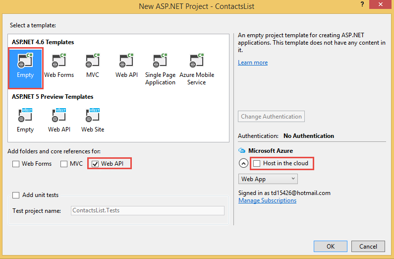
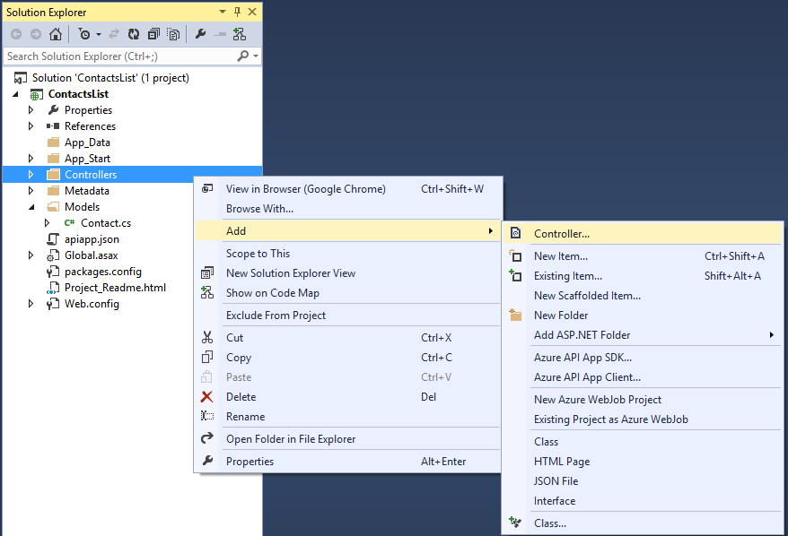
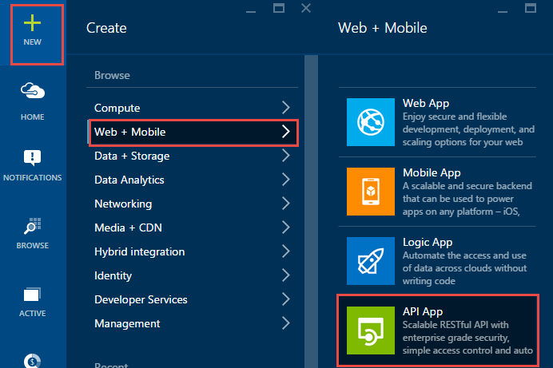
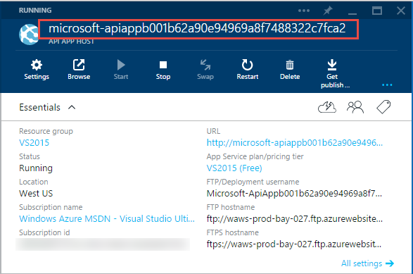
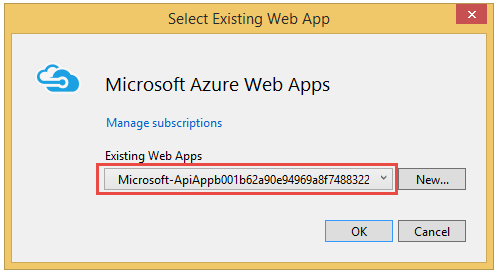
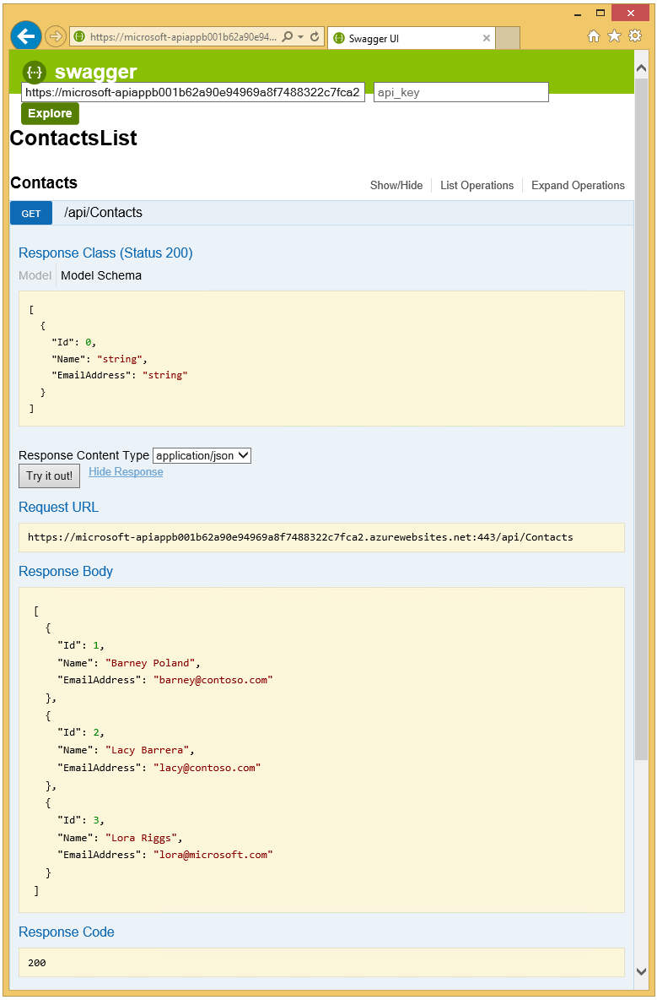

<properties 
	pageTitle="Visual Studio 2015를 사용하여 Azure 앱 서비스에서 ASP.NET API 앱 만들기" 
	description="Visual Studio 2015를 사용하여 Azure 앱 서비스에서 ASP.NET API 앱을 만드는 방법을 알아봅니다." 
	services="app-service\api" 
	documentationCenter=".net" 
	authors="tdykstra" 
	manager="wpickett" 
	editor="jimbe"/>

<tags 
	ms.service="app-service-api" 
	ms.workload="web" 
	ms.tgt_pltfrm="dotnet" 
	ms.devlang="na" 
	ms.topic="article" 
	ms.date="05/19/2015" 
	ms.author="tdykstra"/>

# Visual Studio 2015를 사용하여 Azure 앱 서비스에서 ASP.NET API 앱 만들기

> [AZURE.SELECTOR]
- [Visual Studio 2013](app-service-dotnet-create-api-app.md)
- [Visual Studio 2015 RC](app-service-dotnet-create-api-app-vs2015.md)

## 개요

이 자습서에서는 Visual Studio 2015를 사용하여 ASP.NET Web API 2 프로젝트를 만들고 [Azure 앱 서비스](app-service-value-prop-what-is.md)에서 [API 앱](app-service-api-apps-why-best-platform.md)으로 클라우드에 배포하기 위해 구성하는 방법을 보여 줍니다. 또한 Azure에 프로젝트를 배포합니다. 이 자습서를 마치면 API 앱이 Azure 클라우드에서 실행되게 됩니다.

이 자습서에서는 Visual Studio **솔루션 탐색기**에서 파일 및 폴더로 작업하는 방법을 알고 있다고 가정합니다.

이 자습서는 현재 릴리스된 버전의 ASP.NET Web API에서 작동합니다. ASP.NET MVC 6 API 앱을 만드는 방법은 블로그 게시물 [https://alexanderzeitler.com/articles/Deploying-a-ASP-NET-MVC-6-API-as-Azure-API-App-in-Azure-App-Services/](https://alexanderzeitler.com/articles/Deploying-a-ASP-NET-MVC-6-API-as-Azure-API-App-in-Azure-App-Services/ "Azure 앱 서비스에서 Azure API 앱으로 ASP.NET MVC 6 API 배포")를 참조하세요.

[AZURE.INCLUDE [install-sdk-2015-only](../includes/install-sdk-2015-only.md)]

이 자습서에는 Azure SDK for .NET 버전 2.6 이상이 필요합니다.

## API 앱 프로젝트 만들기 

Visual Studio 2015 RC에는 아직 API 앱 프로젝트가 없으므로 API 앱 프로젝트를 만들려면 Web API 프로젝트 템플릿으로 시작해야 합니다.

1. Visual Studio 2015 RC를 엽니다.

2. **파일 > 새 프로젝트**를 클릭합니다.

3. **템플릿**에서 **웹**을 클릭한 후 **ASP.NET 웹 응용 프로그램** 템플릿을 클릭합니다.

4. 프로젝트의 이름을 *ContactsList*로 지정합니다.

	

5. **확인**을 클릭합니다.

6. **새 ASP.NET 프로젝트** 대화 상자의 **ASP.NET 4.6 템플릿** 아래에서 **빈** 프로젝트 템플릿을 선택합니다.

7. **Web API** 확인란을 선택합니다.

8. **클라우드에서 호스트** 확인란의 선택을 취소합니다.

	

7. **확인**을 클릭합니다.

## NuGet 패키지 추가

기본적으로 API 앱 프로젝트는 Swashbuckle NuGet 패키지에서 제공하는 자동 [Swagger](http://swagger.io/ "공식 Swagger 정보") 메타데이터 생성을 통해 사용하도록 설정됩니다. 패키지를 설치하면 API 테스트 페이지도 기본적으로 사용하도록 설정됩니다.

1. **도구 > NuGet 패키지 관리자 > 패키지 관리자 콘솔**을 클릭합니다.

2. **패키지 관리자 콘솔**에서 다음 명령을 입력합니다

		install-package Swashbuckle

	PMC에 종속성을 확인 중임을 나타내는 메시지가 표시된 후 몇 분 정도 기다려야 할 수 있습니다.

## API 앱 메타데이터 파일 추가

Web API 프로젝트를 API 앱으로 배포할 수 있게 해주는 메타데이터는 *apiapp.json* 파일 및 *Metadata* 폴더(하위 폴더 및 파일 포함)에 포함되어 있습니다. 다음 단계에서는 기본값을 사용하여 이러한 파일을 추가합니다.

자습서의 뒷부분에 있는 [API 앱 메타데이터](#api-app-metadata) 섹션에서는 이 메타데이터를 사용자 지정하는 방법을 설명합니다.

1. 프로젝트 폴더에서 apiapp.json이라는 *.json* 파일을 만들고 새 파일의 내용을 다음 JSON 텍스트로 바꿉니다.

		{
		    "$schema": "http://json-schema.org/schemas/2014-11-01/apiapp.json#",
		    "id": "ContactsList",
		    "namespace": "microsoft.com",
		    "gateway": "2015-01-14",
		    "version": "1.0.0",
		    "title": "ContactsListTitle",
		    "summary": "Summary",
		    "author": "Author",
		    "endpoints": {
		        "apiDefinition": "/swagger/docs/v1",
		        "status": null
		    }
		}

3. 프로젝트 폴더에서 *Metadata*라는 폴더를 만들고 *Metadata* 폴더에 *deploymentTemplates*라는 폴더를 만듭니다.

5. *deploymentTemplates* 폴더에서 *apiappconfig.azureresource.json*이라는 *.json* 파일을 만들고 새 파일의 내용을 JSON 텍스트로 바꿉니다.

		{
		  "$schema": "http://schemas.management.azure.com/schemas/2014-04-01-preview/deploymentTemplate.json#",
		  "contentVersion": "1.0.0.0",
		  "parameters": {
		    "$system": {
		      "type": "Object"
		    }
		  },
		  "resources": []
		}

## Web API 코드 추가

다음 단계에서는 하드 코드된 연락처 목록을 반환하는 단순한 HTTP Get 메서드의 코드를 추가합니다.

1. 프로젝트 폴더에서 *Models* 폴더를 만듭니다.

2. *Contact.cs*라는 클래스 파일을 추가하고 파일 내용을 다음 코드로 바꿉니다.

		namespace ContactsList.Models
		{
			public class Contact
			{
				public int Id { get; set; }
				public string Name { get; set; }
				public string EmailAddress { get; set; }
			}
		}

5. **Controllers** 폴더를 마우스 오른쪽 단추로 클릭하고 **추가 > 컨트롤러**를 선택합니다.

	

6. **스캐폴드 추가** 대화 상자에서 **Web API 2 컨트롤러 - 비어 있음** 옵션을 선택하고 **추가**를 클릭합니다.

	

7. 컨트롤러 이름을 **ContactsController**로 지정하고 **추가**를 클릭합니다.

	

8. *ContactsController.cs* 파일이 생성되면 파일 내용을 다음 코드로 바꿉니다.

		using ContactsList.Models;
		using System;
		using System.Collections.Generic;
		using System.Linq;
		using System.Net;
		using System.Net.Http;
		using System.Threading.Tasks;
		using System.Web.Http;
		
		namespace ContactsList.Controllers
		{
		    public class ContactsController : ApiController
		    {
		        [HttpGet]
		        public IEnumerable<Contact> Get()
		        {
		            return new Contact[]{
						new Contact { Id = 1, EmailAddress = "barney@contoso.com", Name = "Barney Poland"},
						new Contact { Id = 2, EmailAddress = "lacy@contoso.com", Name = "Lacy Barrera"},
	                	new Contact { Id = 3, EmailAddress = "lora@microsoft.com", Name = "Lora Riggs"}
		            };
		        }
		    }
		}

## Web API 테스트

API 테스트 페이지를 보려면 다음 단계를 수행합니다.

1. 로컬에서 앱을 실행(Ctrl-F5)하고 `/swagger`로 이동합니다. 

	

2. **연락처 > 가져오기 > 사용해 보기**를 클릭하면 API가 작동하고 예상 결과를 반환하는 것을 볼 수 있습니다.

	

## Azure에서 API 앱 만들기

1. [Azure Preview 포털](https://portal.azure.com)에서 API 앱을 만듭니다. 

	* **새로 만들기 > 웹 + 모바일 > API 앱**을 클릭합니다.

		

	* **이름**에 ContactsList를 입력합니다.

	* **앱 서비스 계획**에서 **새로 만들기**를 클릭하고 이름(예: **ContactsList**)을 입력합니다.

		앱 서비스 계획에 대한 자세한 내용은 [Azure 앱 서비스 계획의 포괄 개요](azure-web-sites-web-hosting-plans-in-depth-overview.md)를 참조하세요.

	* **가격 책정 계층**을 클릭하여 옵션 목록을 가져온 후 **모두 보기**를 클릭하고 **무료** 가격 책정을 선택합니다.

		유료 가격 책정 계층을 사용할 수도 있지만 이 자습서에는 필요하지 않습니다.

	* **리소스 그룹**에서 **새로 만들기**를 클릭하고 이름(예: ContactsList)을 입력합니다.

		리소스 그룹에 대한 자세한 내용은 [리소스 그룹을 사용하여 Azure 리소스 관리](resource-group-overview.md)를 참조하세요.

	* 둘 이상의 구독이 있는 경우 사용할 구독을 선택합니다.

	* 가까운 위치를 선택합니다.

	* **만들기**를 클릭합니다.

		

2. Azure에서 API 앱 만들기를 마치면(페이지 왼쪽의 **알림** 참조) API 앱의 액세스 수준을 **공용(익명)**으로 설정합니다.

	* **찾아보기 > 리소스 그룹 > [만든 리소스 그룹] > [만든 API 앱]**을 클릭합니다.

	* **설정 > 응용 프로그램 설정**을 클릭합니다.

	* **액세스 수준**을 **공용(익명)**으로 변경합니다.

		
	
2. API 앱을 호스트하는 기본 웹앱의 이름을 기록해 둡니다. Visual Studio 프로젝트를 배포할 때 사용됩니다.

	* **API 앱 호스트**에서 **ContactsList**를 클릭합니다.

		

	* 이름은 **API 앱 호스트** 블레이드의 제목에 있습니다.

		

## Azure에서 새 API 앱에 Web API 프로젝트 배포
 
API 앱은 기본적으로 Azure에서 웹 서비스 기능을 위한 추가 기능을 제공하는 웹앱입니다. Visual Studio 2015 RC에서는 API 앱의 기본 웹앱에 게시하는데, 웹 게시 마법사에 API 앱에 대한 선택 항목이 없기 때문입니다.

2. Visual Studio **솔루션 탐색기**에서 프로젝트를 마우스 오른쪽 단추로 클릭한 후 상황에 맞는 메뉴에서 **게시**를 클릭합니다.

3. **웹 게시** 마법사의 **프로필** 단계에서 **Microsoft Azure 웹앱**을 클릭합니다.

	

4. **기존 웹앱** 드롭다운 목록에서 앞서 기록해 둔 API 앱 이름이 있는 항목을 선택합니다.

	

5. **게시**를 클릭합니다.

	브라우저에서 웹앱 URL이 열리고 "API app has been created" 페이지가 표시됩니다.

6. 브라우저 주소 표시줄에서 URL의 끝에 "swagger/"를 추가합니다. 예를 들면 다음과 같습니다.

		https://microsoft-apiappb001b62a9033493a33748332233fca2.azurewebsites.net/swagger/

	앞서 로컬로 실행할 때 본 것과 동일한 Swagger UI가 표시되지만 이번에는 클라우드에서 실행됩니다.

2. **연락처 > 가져오기 > 사용해 보기**를 클릭하면 API가 작동하고 예상 결과를 반환하는 것을 볼 수 있습니다.

	

[AZURE.INCLUDE [app-service-api-direct-deploy-metadata](../includes/app-service-api-direct-deploy-metadata.md)]

## 다음 단계

Visual Studio 2015 RC를 사용하여 API 앱을 만들고 배포했습니다. API 앱에 대한 추가 설명서는 페이지의 왼쪽(넓은 브라우저 창의 경우) 또는 페이지의 위쪽(좁은 브라우저 창의 경우)에 표시되는 탐색 창의 항목을 참조하세요. 대부분의 API 앱 설명서에는 현재 Visual Studio 2013이 표시되어 있지만 그 중 대부분은 UI가 유사하고 작성하는 코드가 동일하며 포털 UI가 같기 때문에 VS 2015에서 사용할 수 있습니다.

<!---HONumber=58-->