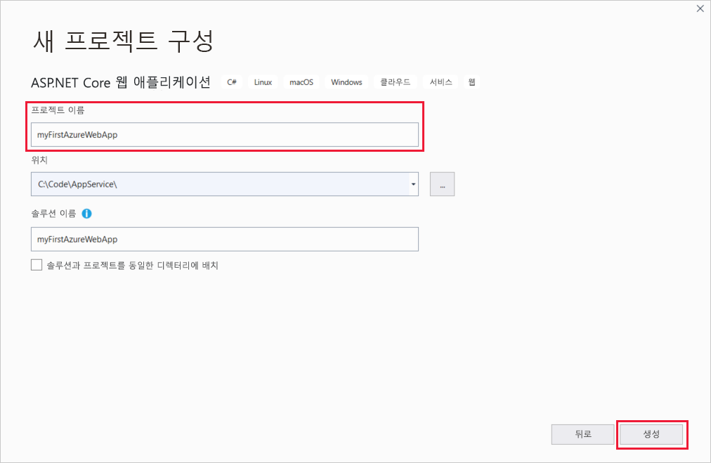
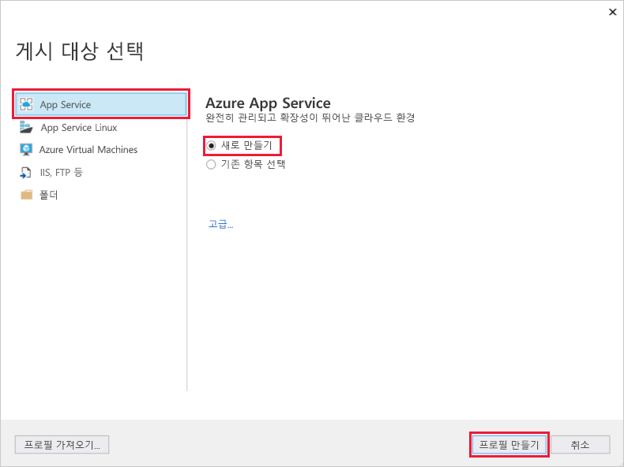
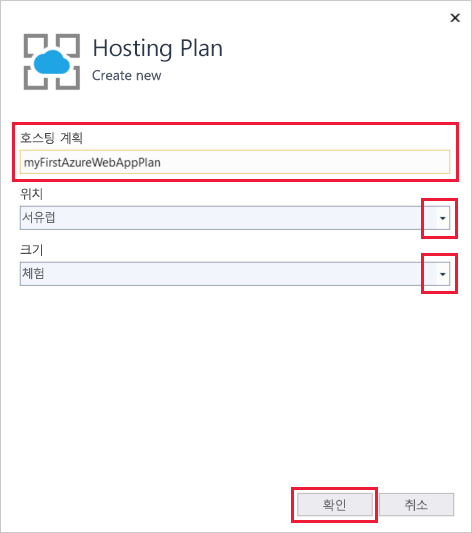
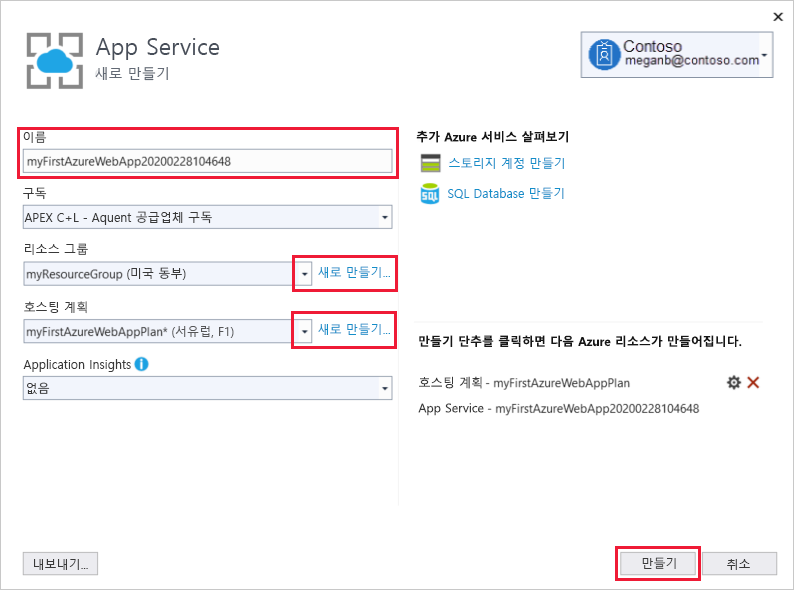
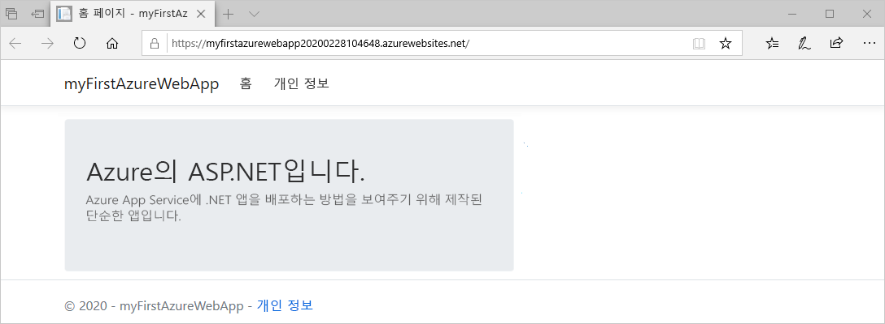
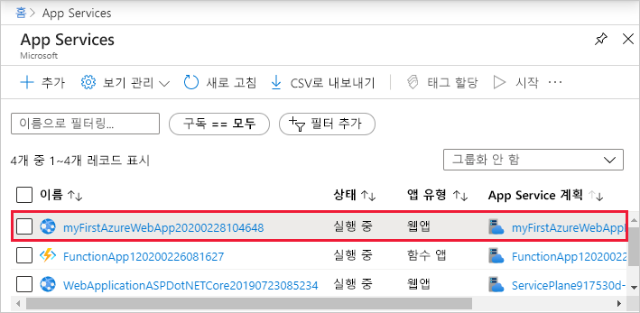
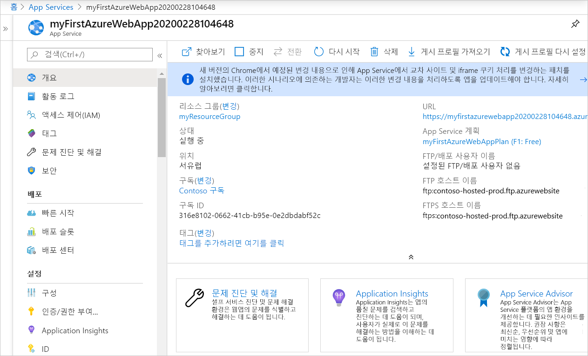

# <a name="quickstart-create-an-aspnet-core-web-app-in-azure"></a>빠른 시작: Azure에서 ASP.NET Core 웹앱 만들기

이 빠른 시작에서는 첫 번째 ASP.NET Core 웹앱을 [Azure App Service](overview.md)에 배포하는 방법을 배웁니다. 

이 빠른 시작을 마치고 나면 App Service 호스팅 계획 및 웹 애플리케이션이 배포된 App Service로 구성된 리소스 그룹이 하나 생깁니다.

## <a name="prerequisites"></a>사전 요구 사항

- 활성 구독이 있는 Azure 계정. [체험 계정을 만듭니다](https://azure.microsoft.com/free/?ref=microsoft.com&utm_source=microsoft.com&utm_medium=docs&utm_campaign=visualstudio).
- 이 빠른 시작에서는 Windows의 App Service에 앱을 배포합니다. _Linux_ 의 App Service에 배포하려면 [Linux의 App Service에서 .NET Core 웹앱 만들기](./containers/quickstart-dotnetcore.md)를 참조하세요.
- **ASP.NET 및 웹 개발** 워크로드가 있는 <a href="https://www.visualstudio.com/downloads/" target="_blank">Visual Studio 2019</a>를 설치합니다.

  Visual Studio 2019를 이미 설치한 경우:

  - **도움말** > **업데이트 확인**을 차례로 선택하여 Visual Studio에서 최신 업데이트를 설치합니다.
  - **도구** > **도구 및 기능 가져오기**를 차례로 선택하여 워크로드를 추가합니다.


## <a name="create-an-aspnet-core-web-app"></a>ASP.NET Core 웹앱 만들기

다음 단계에 따라 Visual Studio에서 ASP.NET Core 웹앱을 만듭니다.

1. Visual Studio를 열고 **새 프로젝트 만들기**를 선택합니다.

1. **새 프로젝트 만들기**에서 **ASP.NET Core 웹 애플리케이션**을 선택하고, 선택한 항목의 언어에 **C#** 이 나열되는지 확인하고, **다음**을 선택합니다.

1. **새 프로젝트 구성**에서 웹 애플리케이션 이름을 *myFirstAzureWebApp*으로 지정한 다음, **만들기**를 선택합니다.

   

1. 모든 유형의 ASP.NET Core 웹앱을 Azure에 배포할 수 있지만, 이 빠른 시작에서는 **웹 애플리케이션** 템플릿을 선택합니다. **인증**을 **인증 없음**으로 설정하고, 그 외의 옵션은 선택하지 않습니다. 그런 다음 **만들기**를 선택합니다.

    
   
1. Visual Studio 메뉴에서 **디버그** > **디버깅하지 않고 시작**을 차례로 선택하여 웹앱을 로컬로 실행합니다.

   

## <a name="publish-your-web-app"></a>웹앱 게시

웹앱을 게시하려면 먼저 앱을 게시할 수 있는 새 App Service를 만들고 구성해야 합니다. 

App Service를 설정하는 과정에서 다음 항목을 만듭니다.

- 서비스에 필요한 모든 Azure 리소스를 포함할 새 [리소스 그룹](https://docs.microsoft.com/azure/azure-resource-manager/management/overview#terminology)
- 앱을 호스팅하는 웹 서버 팜의 위치, 크기 및 기능을 지정하는 새 [호스팅 계획](https://docs.microsoft.com/azure/app-service/overview-hosting-plans)

다음 단계에 따라 App Service를 만들고 웹앱을 게시합니다.

1. **솔루션 탐색기**에서 마우스 오른쪽 단추로 **myFirstAzureWebApp** 프로젝트를 클릭하고, **게시**를 선택합니다. 아직 Visual Studio에서 Azure 계정에 로그인하지 않은 경우 **계정 추가** 또는 **로그인**을 선택합니다. Azure 체험 계정을 만들 수도 있습니다.

1. **게시 대상 선택** 대화 상자에서 **App Service**, **새로 만들기**, **프로필 만들기**를 차례로 선택합니다.

   

1. **App Service: 새로 만들기** 대화 상자에서 기본 이름을 적용하거나 새 이름을 입력하여 앱의 전역적으로 고유한 **이름**을 입력합니다. 유효한 문자는 `a-z`, `A-Z`, `0-9` 및 `-`입니다. 이 **이름**은 `http://<app_name>.azurewebsites.net` 형식으로 웹앱의 URL 접두사로 사용됩니다.

1. **구독**의 경우 나열된 구독을 수락하거나 드롭다운 목록에서 새 구독을 선택합니다.

1. **리소스 그룹**에서 **새로 만들기**를 선택합니다. **새 리소스 그룹 이름**에서 *myResourceGroup*을 입력하고, **확인**을 선택합니다. 

1. **호스팅 계획**에서 **새로 만들기**를 선택합니다. 

1. **호스팅 계획: 새로 만들기** 대화 상자에서 다음 표에 지정된 값을 입력합니다.

   | 설정  | 제안 값 | Description |
   | -------- | --------------- | ----------- |
   | **호스팅 계획**  | *myFirstAzureWebAppPlan* | App Service 플랜의 이름입니다. |
   | **위치**      | *서유럽* | 웹앱이 호스팅된 데이터 센터입니다. |
   | **크기**          | *Free* | [가격 책정 계층](https://azure.microsoft.com/pricing/details/app-service/?ref=microsoft.com&utm_source=microsoft.com&utm_medium=docs&utm_campaign=visualstudio)은 호스팅 기능을 결정합니다. |
   
   

1. **Application Insights**를 *없음*으로 둡니다.

1. **App Service: 새로 만들기** 대화 상자에서 **만들기**를 선택하여 Azure 리소스 만들기를 시작합니다.

   

1. 마법사가 완료되면 **게시**를 선택합니다.

   

   Visual Studio는 ASP.NET Core 웹앱을 Azure에 게시하고, 기본 브라우저에서 앱을 시작합니다. 

   

**축하합니다.** ASP.NET Core 웹앱이 Azure App Service에서 실시간으로 실행되고 있습니다.

## <a name="update-the-app-and-redeploy"></a>앱 업데이트 및 재배포

웹앱을 업데이트하고 다시 배포하려면 다음 단계를 수행합니다.

1. **솔루션 탐색기**의 프로젝트 아래에서 **페이지** > **Index.cshtml**을 차례로 엽니다.

1. 두 개의 `<div>` 태그를 다음 코드로 바꿉니다.

   ```HTML
   <div class="jumbotron">
       <h1>ASP.NET in Azure!</h1>
       <p class="lead">This is a simple app that we've built that demonstrates how to deploy a .NET app to Azure App Service.</p>
   </div>
   ```

1. Azure에 다시 배포하려면 **솔루션 탐색기**에서 **myFirstAzureWebApp** 프로젝트를 마우스 오른쪽 버튼으로 클릭하고 **게시**를 선택합니다.

1. **게시** 요약 페이지에서 **게시**를 선택합니다.

   

게시가 완료되면 Visual Studio가 웹앱의 URL로 브라우저를 시작합니다.



## <a name="manage-the-azure-app"></a>Azure 앱 관리

웹앱을 관리하려면 [Azure Portal](https://portal.azure.com)로 이동하고, **App Services**를 검색하여 선택합니다.


**App Service** 페이지에서 웹앱의 이름을 선택합니다.



웹앱의 **개요** 페이지에는 찾아보기, 중지, 시작, 다시 시작, 삭제와 같은 기본 관리 옵션이 포함되어 있습니다. 왼쪽 메뉴는 앱을 구성하기 위한 추가 페이지를 제공합니다.



[!INCLUDE [Clean-up section](../../includes/clean-up-section-portal.md)]

## <a name="next-steps"></a>다음 단계

이 빠른 시작에서는 Visual Studio를 사용하여 ASP.NET Core 웹앱을 만들고 Azure App Service에 배포했습니다.

다음 문서로 넘어가서 .NET Core 앱을 만들고 SQL Database에 연결하는 방법을 알아보세요.

> [!div class="nextstepaction"]
> [SQL Database를 사용한 ASP.NET Core](app-service-web-tutorial-dotnetcore-sqldb.md)
