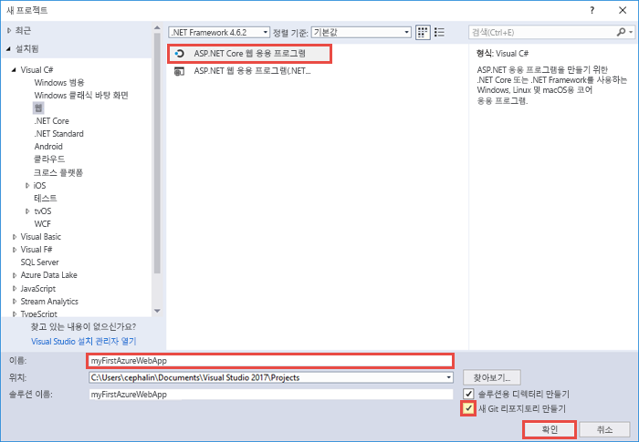
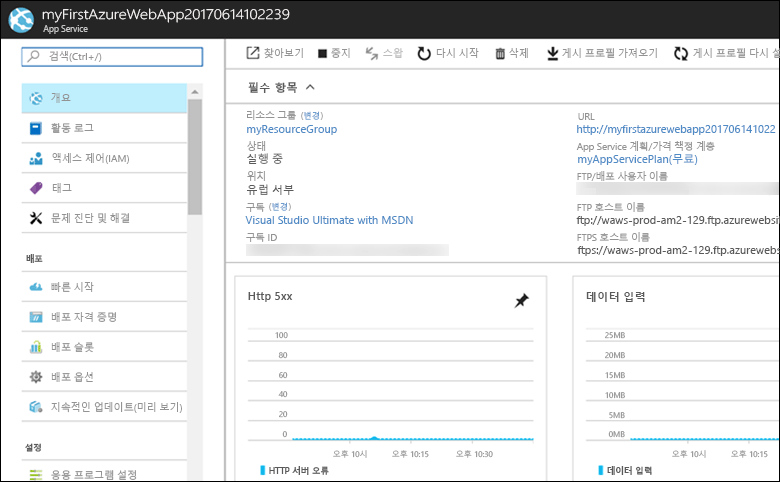

# <a name="create-an-aspnet-core-web-app-in-azure"></a>Azure에서 ASP.NET Core 웹앱 만들기

> [!NOTE]
> 이 문서에서는 Windows의 App Service에 앱을 배포합니다. _Linux_의 App Service에 배포하려면 [Linux의 App Service에서 .NET Core 웹앱 만들기](./containers/quickstart-dotnetcore.md)를 참조하세요.
>
> ASP.NET Framework 앱에 대한 단계를 찾으려면 [Azure에서 ASP.NET Framework 웹앱 만들기](app-service-web-get-started-dotnet-framework.md)를 참조하세요. 
>

[Azure Web Apps](app-service-web-overview.md)는 확장성 있는 자체 패치 웹 호스팅 서비스를 제공합니다.  이 빠른 시작은 첫 번째 ASP.NET Core 웹앱을 Azure Web Apps에 배포하는 방법을 보여 줍니다. 완료되면 배포된 웹 응용 프로그램으로 App Service 계획 및 Azure 웹앱으로 구성된 리소스 그룹을 갖습니다.

[!INCLUDE [quickstarts-free-trial-note](../../includes/quickstarts-free-trial-note.md)]

## <a name="prerequisites"></a>필수 조건

이 자습서를 완료하려면 다음이 필요합니다.

* 다음 워크로드와 함께 <a href="https://www.visualstudio.com/downloads/" target="_blank">Visual Studio 2017</a>을 설치합니다.
    - **ASP.NET 및 웹 배포**
    - **Azure 개발**

    

## <a name="create-an-aspnet-core-web-app"></a>ASP.NET Core 웹앱 만들기

Visual Studio에서 **파일 > 새로 만들기 > 프로젝트**를 선택하여 프로젝트를 만듭니다. 

**새 프로젝트** 대화 상자에서 **Visual C# > 웹 > ASP.NET Core 웹 응용 프로그램**을 선택합니다.

_myFirstAzureWebApp_ 응용 프로그램의 이름을 지정한 다음, **새 Git 리포지토리 만들기**, **확인**을 차례로 선택합니다.
   


모든 종류의 ASP.NET Core 웹앱을 Azure에 배포할 수 있습니다. 이 빠른 시작의 경우 **웹 응용 프로그램** 템플릿을 선택하고 인증이 **인증 없음**으로 설정되어 있는지 확인합니다.
      
**확인**을 선택합니다.


ASP.NET Core 프로젝트가 만들어지면 시작하는 데 도움이 되는 리소스에 대한 다양한 링크를 제공하는 ASP.NET Core 시작 페이지가 표시됩니다. 


메뉴에서 **디버그 > 디버깅하지 않고 시작**을 선택하여 웹앱을 로컬로 실행합니다.


[!INCLUDE [cloud-shell-try-it.md](../../includes/cloud-shell-try-it.md)]

[!INCLUDE [Configure deployment user](../../includes/configure-deployment-user.md)] 

[!INCLUDE [Create resource group](../../includes/app-service-web-create-resource-group.md)] 

[!INCLUDE [Create app service plan](../../includes/app-service-web-create-app-service-plan.md)] 

[!INCLUDE [Create web app](../../includes/app-service-web-create-web-app.md)] 


## <a name="push-to-azure-from-visual-studio"></a>Visual Studio에서 Azure로 푸시

Visual Studio로 돌아가서 **보기** 메뉴에서 **팀 탐색기**를 클릭합니다. **팀 탐색기**가 표시됩니다.

**홈** 보기에서 **설정** > **리포지토리 설정**을 차례로 클릭합니다.


**리포지토리 설정**의 **원격** 섹션에서 **추가**를 선택합니다. **원격 추가** 대화 상자가 표시됩니다.

**이름** 필드를 _Azure_로 설정하고, **가져오기** 필드를 [웹앱 만들기](#create-a-web-app)에서 저장한 URL로 설정합니다. **저장**을 클릭합니다.


이 설정은 `git remote add Azure <URL>` Git 명령과 같습니다.

위쪽의 **홈** 단추를 클릭합니다.

**설정** > **전역 설정**을 차례로 선택합니다. 이름과 이메일 주소가 설정되어 있는지 확인합니다. 필요한 경우 **업데이트**를 선택합니다.

프로젝트를 만들 때 Visual Studio에서 이미 모든 파일을 Git 리포지토리로 커밋했습니다. 이제 파일을 Azure로 푸시하기만 하면 됩니다.

위쪽의 **홈** 단추를 클릭합니다. **동기화** > **작업** > **명령 프롬프트 열기**를 차례로 선택합니다. 

명령 창에서 다음 명령을 입력하고, 메시지가 표시되면 배포 암호를 입력합니다.

```
git push Azure master
```

이 명령을 실행하는 데 몇 분 정도 걸릴 수 있습니다. 실행 시 다음 예와 유사한 정보를 출력합니다.

```
Counting objects: 4, done.
Delta compression using up to 8 threads.
Compressing objects: 100% (4/4), done.
Writing objects: 100% (4/4), 349 bytes | 349.00 KiB/s, done.
Total 4 (delta 3), reused 0 (delta 0)
remote: Updating branch 'master'.
remote: Updating submodules.
remote: Preparing deployment for commit id '9e20345e9c'.
remote: Generating deployment script.
remote: Project file path: .\myFirstAzureWebApp\myFirstAzureWebApp.csproj
remote: Solution file path: .\myFirstAzureWebApp.sln
remote: Generated deployment script files
remote: Running deployment command...
remote: Handling ASP.NET Core Web Application deployment.
remote:   Restoring packages for D:\home\site\repository\myFirstAzureWebApp\myFirstAzureWebApp.csproj...
remote:   Restoring packages for D:\home\site\repository\myFirstAzureWebApp\myFirstAzureWebApp.csproj...
...
remote: Finished successfully.
remote: Running post deployment command(s)...
remote: Deployment successful.
To https://<app_name>.scm.azurewebsites.net/<app_name>.git
 * [new branch]      master -> master
```

## <a name="browse-to-the-app"></a>앱으로 이동

브라우저에서 Azure 웹앱 URL(`http://<app_name>.azurewebsites.net`)로 이동합니다.

이 페이지는 Azure App Service 웹앱으로 실행됩니다.


축하합니다. ASP.NET Core 웹앱이 Azure App Service에서 실시간으로 실행 중입니다.

## <a name="update-the-app-and-redeploy"></a>앱 업데이트 및 다시 배포

**솔루션 탐색기**에서 _Pages/Index.cshtml_을 엽니다.

위쪽 가까이에 `<div id="myCarousel" class="carousel slide" data-ride="carousel" data-interval="6000">` HTML 태그를 찾아서 전체 요소를 다음 코드로 바꿉니다.

```HTML
<div class="jumbotron">
    <h1>ASP.NET in Azure!</h1>
    <p class="lead">This is a simple app that we’ve built that demonstrates how to deploy a .NET app to Azure App Service.</p>
</div>
```

**솔루션 탐색기**에서 _Pages/Index.cshtml_을 마우스 오른쪽 단추로 클릭하고 **커밋**을 클릭합니다. 변경 내용에 대한 커밋 메시지를 입력하고 **모두 커밋**을 클릭합니다.

명령 프롬프트 창으로 돌아가서 코드 변경 내용을 Azure로 푸시합니다.

```bash
git push Azure master
```

배포가 완료되면 `http://<app_name>.azurewebsites.net`으로 다시 이동합니다.


## <a name="manage-the-azure-web-app"></a>Azure 웹앱 관리

웹앱을 관리하려면 <a href="https://portal.azure.com" target="_blank">Azure Portal</a>로 이동합니다.

왼쪽 메뉴에서 **App Services**를 클릭한 다음 Azure 웹앱의 이름을 클릭합니다.


웹앱의 개요 페이지가 표시됩니다. 여기에서 찾아보기, 중지, 시작, 다시 시작, 삭제와 같은 기본 관리 작업을 수행할 수 있습니다. 



왼쪽 메뉴는 앱 구성을 위한 서로 다른 페이지를 제공합니다. 

[!INCLUDE [Clean-up section](../../includes/clean-up-section-portal.md)]

## <a name="next-steps"></a>다음 단계

> [!div class="nextstepaction"]
> [SQL Database를 사용하는 ASP.NET Core](app-service-web-tutorial-dotnetcore-sqldb.md)
