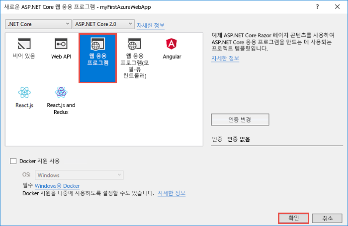
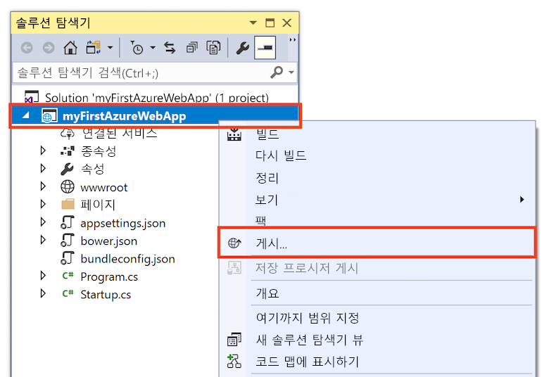
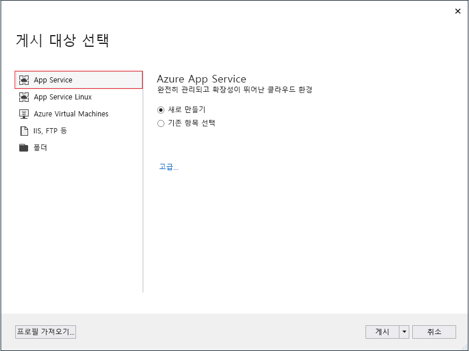
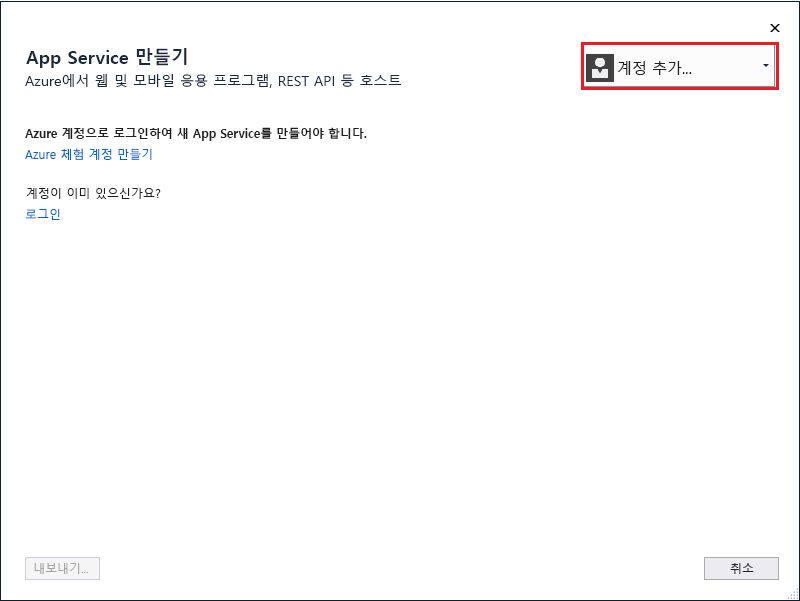
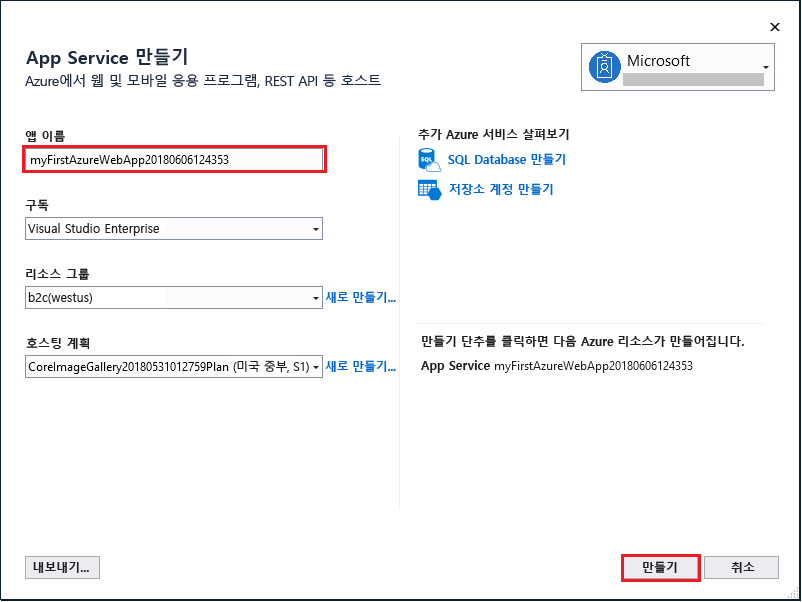
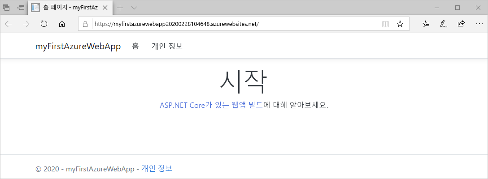
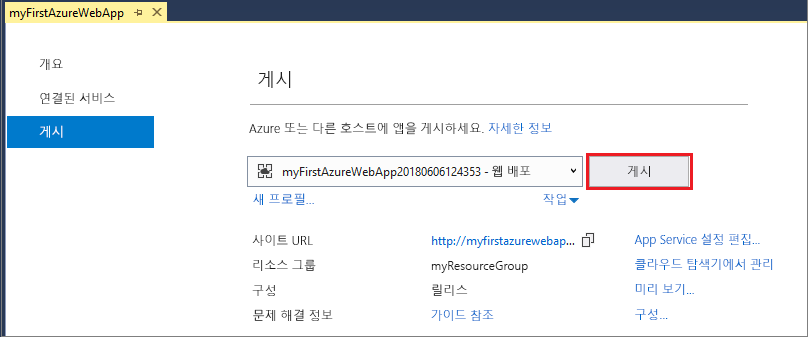

# <a name="create-an-aspnet-core-web-app-in-azure"></a>Azure에서 ASP.NET Core 웹앱 만들기

> [!NOTE]
> 이 문서에서는 Windows의 App Service에 앱을 배포합니다. _Linux_의 App Service에 배포하려면 [Linux의 App Service에서 .NET Core 웹앱 만들기](./containers/quickstart-dotnetcore.md)를 참조하세요.
>

[Azure Web Apps](app-service-web-overview.md)는 확장성 있는 자체 패치 웹 호스팅 서비스를 제공합니다.  이 빠른 시작은 첫 번째 ASP.NET Core 웹앱을 Azure Web Apps에 배포하는 방법을 보여 줍니다. 완료되면 배포된 웹 응용 프로그램으로 App Service 플랜 및 Azure 웹앱으로 구성된 리소스 그룹을 갖습니다.

> [!NOTE]
> ASP.NET Framework 웹앱을 빌드 및 배포하는 방법을 원할 경우 [여기](app-service-web-get-started-dotnet-framework.md)에서 관련 문서를 참조하세요. 
>

[!INCLUDE [quickstarts-free-trial-note](../../includes/quickstarts-free-trial-note.md)]

## <a name="prerequisites"></a>필수 조건

이 자습서를 완료하려면 다음이 필요합니다.

**ASP.NET 및 웹 개발** 워크로드가 있는 <a href="https://www.visualstudio.com/downloads/" target="_blank">Visual Studio 2017</a>을 설치합니다.

Visual Studio가 이미 설치된 경우 **도구** > **도구 및 기능 가져오기**를 클릭하여 Visual Studio에서 워크로드를 추가합니다.

## <a name="create-an-aspnet-core-web-app"></a>ASP.NET Core 웹앱 만들기

Visual Studio에서 **파일 > 새로 만들기 > 프로젝트**를 선택하여 프로젝트를 만듭니다. 

**새 프로젝트** 대화 상자에서 **Visual C# > 웹 > ASP.NET Core 웹 응용 프로그램**을 선택합니다.

응용 프로그램 이름을 _myFirstAzureWebApp_으로 지정한 다음 **확인**을 선택합니다.
   


모든 종류의 ASP.NET Core 웹앱을 Azure에 배포할 수 있습니다. 이 빠른 시작의 경우 **웹 응용 프로그램** 템플릿을 선택하고 인증이 **인증 없음**으로 설정되어 있는지 확인합니다.
      
**확인**을 선택합니다.



메뉴에서 **디버그 > 디버깅하지 않고 시작**을 선택하여 웹앱을 로컬로 실행합니다.


## <a name="publish-to-azure"></a>Azure에 게시

**솔루션 탐색기**에서 **myFirstAzureWebApp** 프로젝트를 마우스 오른쪽 단추로 클릭하고 **게시**를 선택합니다.



**Microsoft Azure App Service**를 선택했는지 확인하고 **게시**를 선택합니다.



그러면 **App Service 만들기** 대화 상자가 열리고 Azure에서 ASP.NET Core 웹앱을 실행하는 데 필요한 모든 Azure 리소스를 만들 수 있습니다.

## <a name="sign-in-to-azure"></a>Azure에 로그인

**App Service 만들기** 대화 상자에서 **계정 추가**를 클릭하고, Azure 구독에 로그인합니다. 이미 로그인한 경우 드롭다운에서 원하는 구독이 포함된 계정을 선택합니다.

> [!NOTE]
> 이미 로그인한 경우 **만들기**를 선택하지 마십시오.
>
   


## <a name="create-a-resource-group"></a>리소스 그룹 만들기

[!INCLUDE [resource group intro text](../../includes/resource-group.md)]

**리소스 그룹** 옆에 있는 **새로 만들기**를 선택합니다.

리소스 그룹의 이름을 **myResourceGroup**으로 지정하고 **확인**을 선택합니다.

## <a name="create-an-app-service-plan"></a>App Service 플랜 만들기

[!INCLUDE [app-service-plan](../../includes/app-service-plan.md)]

**App Service 플랜** 옆에 있는 **새로 만들기**를 선택합니다. 

**App Service 플랜 구성** 대화 상자에서 스크린샷 다음에 나오는 테이블의 설정을 사용합니다.


| 설정 | 제안 값 | 설명 |
|-|-|-|
|App Service 플랜| myAppServicePlan | App Service 계획의 이름입니다. |
| 위치 | 서유럽 | 웹앱이 호스팅된 데이터 센터입니다. |
| 크기 | 무료 | [가격 책정 계층](https://azure.microsoft.com/pricing/details/app-service/?ref=microsoft.com&utm_source=microsoft.com&utm_medium=docs&utm_campaign=visualstudio)은 호스팅 기능을 결정합니다. |

**확인**을 선택합니다.

## <a name="create-and-publish-the-web-app"></a>웹앱 만들기 및 게시

**웹앱 이름**에서 고유한 앱 이름(유효한 문자는 `a-z`, `0-9` 및 `-`)을 입력하거나 자동으로 생성된 고유한 이름을 적용합니다. 웹앱의 URL은 `http://<app_name>.azurewebsites.net`이며, 여기서 `<app_name>`은 웹앱 이름입니다.

**만들기**를 선택하여 Azure 리소스 만들기를 시작합니다.



마법사가 완료되면 Azure에 ASP.NET Core 웹앱을 게시한 다음 기본 브라우저에서 앱을 시작합니다.



[작성 및 게시 단계](#create-and-publish-the-web-app)에서 지정한 웹앱 이름이 `http://<app_name>.azurewebsites.net` 형식의 URL 접두사로 사용됩니다.

축하합니다. ASP.NET Core 웹앱이 Azure App Service에서 실시간으로 실행 중입니다.

## <a name="update-the-app-and-redeploy"></a>앱 업데이트 및 재배포

**솔루션 탐색기**에서 _Pages/Index.cshtml_을 엽니다.

위쪽 가까이에 `<div id="myCarousel" class="carousel slide" data-ride="carousel" data-interval="6000">` HTML 태그를 찾아서 전체 요소를 다음 코드로 바꿉니다.

```HTML
<div class="jumbotron">
    <h1>ASP.NET in Azure!</h1>
    <p class="lead">This is a simple app that we’ve built that demonstrates how to deploy a .NET app to Azure App Service.</p>
</div>
```

Azure에 다시 배포하려면 **솔루션 탐색기**에서 **myFirstAzureWebApp** 프로젝트를 마우스 오른쪽 단추로 클릭하고 **게시**를 선택합니다.

게시 요약 페이지에서 **게시**를 선택합니다.


게시가 완료되면 Visual Studio가 웹앱의 URL로 브라우저를 시작합니다.


## <a name="manage-the-azure-web-app"></a>Azure 웹앱 관리

웹앱을 관리하려면 <a href="https://portal.azure.com" target="_blank">Azure Portal</a>로 이동합니다.

왼쪽 메뉴에서 **App Services**를 클릭한 다음 Azure 웹앱의 이름을 클릭합니다.


웹앱의 개요 페이지가 표시됩니다. 여기에서 찾아보기, 중지, 시작, 다시 시작, 삭제와 같은 기본 관리 작업을 수행할 수 있습니다. 


왼쪽 메뉴는 앱 구성을 위한 서로 다른 페이지를 제공합니다. 

[!INCLUDE [Clean-up section](../../includes/clean-up-section-portal.md)]

## <a name="next-steps"></a>다음 단계

> [!div class="nextstepaction"]
> [SQL Database를 사용하는 ASP.NET Core](app-service-web-tutorial-dotnetcore-sqldb.md)
