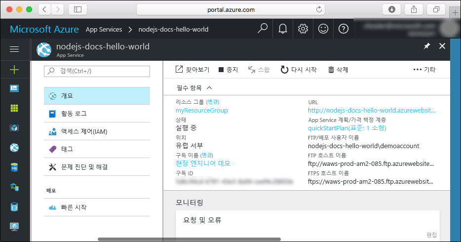

# <a name="create-a-nodejs-web-app-in-azure"></a>Azure에서 Node.js 웹앱 만들기

> [!NOTE]
> 이 문서에서는 Windows의 App Service에 앱을 배포합니다. _Linux_의 App Service에 배포하려면 [Linux의 Azure App Service에서 Node.js 웹앱 만들기](./containers/quickstart-nodejs.md)를 참조하세요.
>

[Azure Web Apps](app-service-web-overview.md)는 확장성 있는 자체 패치 웹 호스팅 서비스를 제공합니다.  이 빠른 시작에서는 Node.js 앱을 Azure Web Apps에 배포하는 방법을 보여 줍니다. [Azure CLI](https://docs.microsoft.com/cli/azure/get-started-with-azure-cli)를 사용하여 웹앱을 만들고 Git을 사용하여 웹앱에 샘플 Node.js 코드를 배포합니다.


Mac, Windows 또는 Linux 컴퓨터를 사용하여 여기서 설명하는 단계를 수행하면 됩니다. 필수 구성 요소가 설치된 후 단계를 완료하는 데는 약 5분 정도 걸립니다.   

> [!VIDEO https://channel9.msdn.com/Shows/Azure-for-Node-Developers/Create-a-Nodejs-app-in-Azure-Quickstart/player]   

[!INCLUDE [quickstarts-free-trial-note](../../includes/quickstarts-free-trial-note.md)]

## <a name="prerequisites"></a>필수 조건

이 빠른 시작을 완료하려면 다음이 필요합니다.

* <a href="https://nodejs.org/" target="_blank">Node.js 및 NPM 설치</a>

## <a name="download-the-sample"></a>샘플 다운로드

[https://github.com/Azure-Samples/nodejs-docs-hello-world/archive/master.zip](https://github.com/Azure-Samples/nodejs-docs-hello-world/archive/master.zip)에서 Node.js 프로젝트 샘플을 다운로드하고 ZIP 보관 파일을 추출합니다.

터미널 창에서 샘플 Node.js 프로젝트의 루트 디렉터리(_index.js_ 포함)로 이동합니다.

## <a name="run-the-app-locally"></a>로컬에서 앱 실행

Node.js HTTP 서버에서 기본 제공을 시작하려면 터미널 창을 열고 `npm start` 스크립트를 사용하여 응용 프로그램을 로컬로 실행합니다.

```bash
npm start
```

웹 브라우저를 열고 `http://localhost:1337`의 샘플 앱으로 이동합니다.

이 페이지에 표시된 샘플 앱에서 **Hello World** 메시지가 표시됩니다.


터미널 창에서 **Ctrl+C**를 눌러 웹 서버를 종료합니다.

[!INCLUDE [Create ZIP file](../../includes/app-service-web-create-zip.md)]

[!INCLUDE [cloud-shell-try-it.md](../../includes/cloud-shell-try-it.md)]

[!INCLUDE [Create resource group](../../includes/app-service-web-create-resource-group.md)] 

[!INCLUDE [Create app service plan](../../includes/app-service-web-create-app-service-plan.md)] 

## <a name="create-a-web-app"></a>웹앱 만들기

Cloud Shell에서 [`az webapp create`](/cli/azure/webapp?view=azure-cli-latest#az_webapp_create) 명령을 사용하여 `myAppServicePlan` App Service 계획에 웹앱을 만듭니다. 

다음 예에서 `<app_name>`을 전역적으로 고유한 앱 이름으로 바꿉니다(유효한 문자는 `a-z`, `0-9` 및 `-`). 런타임은 `NODE|6.9`으로 설정됩니다. 지원되는 모든 런타임을 보려면 [`az webapp list-runtimes`](/cli/azure/webapp?view=azure-cli-latest#az_webapp_list_runtimes)를 실행합니다. 

```azurecli-interactive
# Bash
az webapp create --resource-group myResourceGroup --plan myAppServicePlan --name <app_name> --runtime "NODE|6.9"
# PowerShell
az --% webapp create --resource-group myResourceGroup --plan myAppServicePlan --name <app_name> --runtime "NODE|6.9"
```

웹앱이 만들어지면 Azure CLI에서 다음 예제와 비슷한 출력을 표시합니다.

```json
{
  "availabilityState": "Normal",
  "clientAffinityEnabled": true,
  "clientCertEnabled": false,
  "cloningInfo": null,
  "containerSize": 0,
  "dailyMemoryTimeQuota": 0,
  "defaultHostName": "<app_name>.azurewebsites.net",
  "enabled": true,
  < JSON data removed for brevity. >
}
```

새로 만든 웹앱으로 이동합니다. _&lt;앱 이름>_ 을 고유한 앱 이름으로 바꿉니다.

```bash
http://<app name>.azurewebsites.net
```

새로운 웹앱은 다음과 같아야 합니다.


[!INCLUDE [Deploy ZIP file](../../includes/app-service-web-deploy-zip.md)]

## <a name="browse-to-the-app"></a>앱으로 이동

웹 브라우저를 사용하여 배포된 응용 프로그램으로 이동합니다.

```
http://<app_name>.azurewebsites.net
```

Node.js 샘플 코드는 Azure App Service 웹앱에서 실행 중입니다.


**축하합니다.** App Service에 첫 번째 Node.js 앱을 배포했습니다.

## <a name="update-and-redeploy-the-code"></a>코드 업데이트 및 다시 배포

텍스트 편집기를 사용하여 Node.js 앱에서 `index.js` 파일을 열고 `response.end`에 대한 호출에서 텍스트를 약간 변경합니다.

```nodejs
response.end("Hello Azure!");
```

로컬 터미널 창에서 응용 프로그램의 루트 디렉터리로 이동하고, 업데이트된 프로젝트에 대한 새 ZIP 파일을 만듭니다.

```
# Bash
zip -r myUpdatedAppFiles.zip .

# PowerShell
Compress-Archive -Path * -DestinationPath myUpdatedAppFiles.zip
``` 

[ZIP 파일 업로드](#upload-the-zip-file)와 동일한 단계를 사용하여 새로운 ZIP 파일을 App Service에 배포합니다.

**앱으로 이동** 단계에서 연 브라우저 창으로 다시 전환하고 페이지를 새로 고칩니다.


## <a name="manage-your-new-azure-web-app"></a>새로운 Azure 웹앱 관리

만든 웹앱을 관리하려면 <a href="https://portal.azure.com" target="_blank">Azure Portal</a>로 이동합니다.

왼쪽 메뉴에서 **App Services**를 클릭한 다음 Azure 웹앱의 이름을 클릭합니다.


웹앱의 개요 페이지가 표시됩니다. 여기에서 찾아보기, 중지, 시작, 다시 시작, 삭제와 같은 기본 관리 작업을 수행할 수 있습니다. 



왼쪽 메뉴는 앱 구성을 위한 서로 다른 페이지를 제공합니다. 

[!INCLUDE [cli-samples-clean-up](../../includes/cli-samples-clean-up.md)]

## <a name="next-steps"></a>다음 단계

> [!div class="nextstepaction"]
> [MongoDB를 사용하는 Node.js](app-service-web-tutorial-nodejs-mongodb-app.md)
