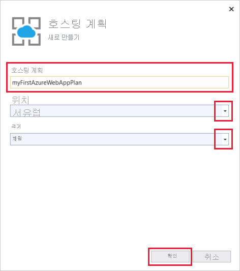
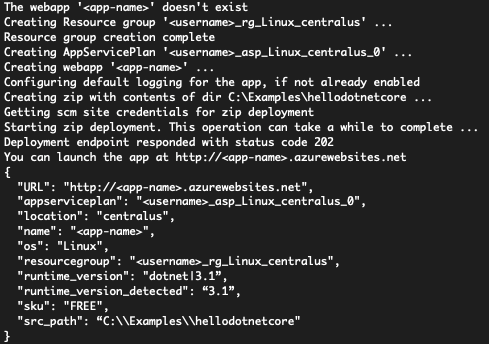

# <a name="quickstart-create-an-aspnet-core-web-app-in-azure"></a>빠른 시작: Azure에서 ASP.NET Core 웹앱 만들기

::: zone pivot="platform-windows"  

이 빠른 시작에서는 첫 번째 ASP.NET Core 웹앱을 만들고 다음에 배포하는 방법을 알아봅니다. <abbr title="웹 애플리케이션, REST API 및 모바일 백 엔드를 호스트하는 HTTP 기반 서비스입니다.">Azure App Service</abbr>. App Service는 .NET 5.0 앱을 지원합니다.

완료하면 Azure를 얻을 수 있습니다. <abbr title="한 단위로 관리할 수 있는 관련 Azure 리소스에 대한 논리적 컨테이너.">리소스 그룹</abbr>, 구성 요소: <abbr title="앱을 호스팅하는 웹 서버 팜의 위치, 크기 및 기능을 지정하는 계획.">App Service 계획</abbr> 및 <abbr title="앱 코드, DNS 호스트 이름, 인증서 및 관련 리소스를 포함하는 웹앱의 표현.">App Service 앱</abbr> 샘플 ASP.NET Core 애플리케이션이 배포됨.

<hr/> 

## <a name="1-prepare-your-environment"></a>1. 환경 준비

- 활성 상태인 **Azure 계정 가져오기** <abbr title="Azure에서 리소스를 관리하는 기본 조직 구조이며 일반적으로 조직 내의 개인 또는 부서와 연결됩니다.">subscription</abbr>. [체험 계정을 만듭니다](https://azure.microsoft.com/free/dotnet/).
- **ASP.NET 및 웹 개발** 워크로드가 있는 **<a href="https://www.visualstudio.com/downloads/" target="_blank">Visual Studio 2019</a>를 설치** 합니다.

<details>
<summary>Visual Studio 2019가 이미 있습니까?</summary>
Visual Studio 2019를 이미 설치한 경우:

<ul>
<li><strong>도움말</strong> &gt; <strong>업데이트 확인</strong>을 차례로 선택하여 Visual Studio에서 <strong>최신 업데이트를 설치</strong>합니다. 최신 업데이트에는 .NET 5.0 SDK가 포함되어 있습니다.</li>
<li><strong>도구</strong> &gt; <strong>도구 및 기능 가져오기</strong>를 차례로 선택하여 <strong>워크로드를 추가</strong>합니다.</li>
</ul>
</details>

<hr/> 

## <a name="2-create-an-aspnet-core-web-app"></a>2. ASP.NET Core 웹앱 만들기

1. Visual Studio를 열고 **새 프로젝트 만들기** 를 선택합니다.

1. **새 프로젝트 만들기** 에서 **ASP.NET Core 웹 애플리케이션** 을 선택하고, 선택한 항목의 언어에 **C#** 이 나열되는지 확인하고, **다음** 을 선택합니다.

1. **새 프로젝트 구성** 에서 웹 애플리케이션 이름을 *myFirstAzureWebApp* 으로 지정한 다음, **만들기** 를 선택합니다.

   

1. .NET 5.0 앱의 경우 드롭다운에서 **ASP.NET Core 5.0** 을 선택합니다. 그렇지 않을 경우 기본값을 사용합니다.

1. 모든 유형의 ASP.NET Core 웹앱을 Azure에 배포할 수 있지만, 이 빠른 시작에서는 **ASP.NET Core 웹앱** 템플릿을 선택합니다. **인증** 을 **인증 없음** 으로 설정하고, 그 외의 옵션은 선택하지 않습니다. 그런 다음 **만들기** 를 선택합니다.

    
   
1. Visual Studio 메뉴에서 **디버그** > **디버깅하지 않고 시작** 을 차례로 선택하여 웹앱을 로컬로 실행합니다.

   

<hr/> 

## <a name="3-publish-your-web-app"></a>3. 웹앱 게시

1. **솔루션 탐색기** 에서 마우스 오른쪽 단추로 **myFirstAzureWebApp** 프로젝트를 클릭하고, **게시** 를 선택합니다. 

1. **게시** 에서 **Azure** 를 선택하고 **다음** 을 클릭합니다.

1. 옵션은 Azure에 이미 로그인했는지 여부와 Azure 계정에 연결된 Visual Studio 계정이 있는지 여부에 따라 달라집니다. **계정 추가** 또는 **로그인** 중 하나를 선택하여 Azure 구독에 로그인합니다. 이미 로그인한 경우 원하는 계정을 선택합니다.

   

1. **App Service 인스턴스** 오른쪽에서 **+** 를 클릭합니다.

   

1. **구독** 의 경우 나열된 구독을 수락하거나 드롭다운 목록에서 새 구독을 선택합니다.

1. **리소스 그룹** 에 대해 **새로 만들기** 를 선택합니다. **새 리소스 그룹 이름** 에서 *myResourceGroup* 을 입력하고, **확인** 을 선택합니다. 

1. **호스팅 계획** 에서 **새로 만들기** 를 선택합니다. 

1. **호스팅 계획: 새로 만들기** 대화 상자에서 다음 표에 지정된 값을 입력합니다.

   | 설정  | 제안 값 |
   | -------- | --------------- |
   | **호스팅 계획**  | *myFirstAzureWebAppPlan* |
   | **위치**      | *서유럽* |
   | **크기**          | *Free* |
   
   

1. **이름** 에 고유한 앱 이름을 입력합니다.

    <details>
        <summary>어떤 문자를 사용할 수 있나요?</summary>
        유효한 문자는 a-z, A-Z, 0-9 및 -입니다. 자동으로 생성된 고유한 이름을 적용할 수 있습니다. 웹앱의 URL은 http://<code>&lt;app-name&gt;.azurewebsites.net</code>이며, 여기서 <code>&lt;app-name&gt;</code>은 앱 이름입니다.
    </details>

1. **만들기** 를 선택하여 Azure 리소스를 만듭니다. 

   

1. 마법사가 Azure 리소스 만들기를 완료할 때까지 기다립니다. **마침** 을 선택하여 마법사를 닫습니다.

1. **게시** 페이지에서 **게시** 를 클릭하여 프로젝트를 배포합니다. 

    <details>
        <summary>Visual Studio는 무엇을 하나요?</summary>
        Visual Studio는 앱을 Azure에 빌드, 패키지 및 게시한 다음, 기본 브라우저에서 앱을 시작합니다.
    </details>

   

<hr/> 

## <a name="4-update-the-app-and-redeploy"></a>4. 앱 업데이트 및 재배포

1. **솔루션 탐색기** 의 프로젝트 아래에서 **페이지** > **Index.cshtml** 을 차례로 엽니다.

1. 전체 `<div>` 태그를 다음 코드로 바꿉니다.

   ```html
   <div class="jumbotron">
       <h1>ASP.NET in Azure!</h1>
       <p class="lead">This is a simple app that we've built that demonstrates how to deploy a .NET app to Azure App Service.</p>
   </div>
   ```

1. Azure에 다시 배포하려면 **솔루션 탐색기** 에서 **myFirstAzureWebApp** 프로젝트를 마우스 오른쪽 버튼으로 클릭하고 **게시** 를 선택합니다.

1. **게시** 요약 페이지에서 **게시** 를 선택합니다.

   <!--  -->

    게시가 완료되면 Visual Studio가 웹앱의 URL로 브라우저를 시작합니다.

    

<hr/> 

## <a name="5-manage-the-azure-app"></a>5. Azure 앱 관리

1. [Azure Portal](https://portal.azure.com)로 이동하고 **App Service** 를 검색하여 선택합니다.

    
    
1. **App Service** 페이지에서 웹앱의 이름을 선택합니다.

    :::image type="content" source="./media/quickstart-dotnetcore/select-app-service.png" alt-text="예제 웹앱이 선택된 App Services 페이지의 스크린샷.":::

1. 웹앱의 **개요** 페이지에는 찾아보기, 중지, 시작, 다시 시작, 삭제와 같은 기본 관리 옵션이 포함되어 있습니다. 왼쪽 메뉴는 앱을 구성하기 위한 추가 페이지를 제공합니다.

    
    
<hr/> 

## <a name="6-clean-up-resources"></a>6. 리소스 정리

1. Azure Portal 메뉴 또는 **홈** 페이지에서 **리소스 그룹** 을 선택합니다. 그런 다음, **리소스 그룹** 페이지에서 **myResourceGroup** 을 선택합니다.

1. **myResourceGroup** 페이지에서 나열된 리소스가 삭제하려는 리소스인지 확인합니다.

1. **리소스 그룹 삭제** 를 선택하고, 텍스트 상자에서 **myResourceGroup** 을 입력하여 확인한 다음, **삭제** 를 선택합니다.

<hr/> 

## <a name="next-steps"></a>다음 단계

다음 문서로 넘어가서 .NET Core 앱을 만들고 SQL Database에 연결하는 방법을 알아보세요.

- [SQL Database를 사용한 ASP.NET Core](tutorial-dotnetcore-sqldb-app.md)
- [ASP.NET Core 앱 구성](configure-language-dotnetcore.md)

::: zone-end  

::: zone pivot="platform-linux"
이 빠른 시작에서는 [.NET Core](/aspnet/core/) 앱을 만드는 방법을 보여줍니다. <abbr title="Linux의 App Service는 Linux 운영 체제를 기반으로 확장성이 높은 자체 패치 웹 호스팅 서비스를 제공합니다.">Linux의 App Service</abbr>. [Azure CLI](/cli/azure/get-started-with-azure-cli)를 사용하여 앱을 만들고 Git을 사용하여 앱에 .NET Core 코드를 배포합니다.

<hr/> 

## <a name="1-prepare-your-environment"></a>1. 환경 준비

- 활성 구독이 있는 **Azure 계정을 가져옵니다**. [체험 계정을 만듭니다](https://azure.microsoft.com/free/dotnet/).
- 최신 <a href="https://dotnet.microsoft.com/download/dotnet-core/3.1" target="_blank">.NET Core 3.1 SDK</a> 또는 <a href="https://dotnet.microsoft.com/download/dotnet/5.0" target="_blank">.NET 5.0 SDK</a>를 **설치** 합니다.
- **<a href="/cli/azure/install-azure-cli" target="_blank">최신 Azure CLI를 설치합니다</a>** .

[문제가 있나요? 알려주세요.](https://aka.ms/DotNetAppServiceLinuxQuickStart)

<hr/> 

## <a name="2-create-the-app-locally"></a>2. 로컬로 앱 만들기

1. `mkdir hellodotnetcore`를 실행하여 디렉터리를 만듭니다.

    ```bash
    mkdir hellodotnetcore
    ```

1. `cd hellodotnetcore`를 실행하여 디렉터리를 변경합니다. 

    ```bash
    cd hellodotnetcore
    ```

1. `dotnet new web`을 실행하여 새로운 .NET Core 앱을 만듭니다.

    ```bash
    dotnet new web
    ```

<hr/> 

## <a name="3-run-the-app-locally"></a>3. 로컬에서 앱 실행하기

1. `dotnet run`을 실행하여 Azure에 배포하면 어떻게 실행되는지 확인합니다.

    ```bash
    dotnet run
    ```
    
1. **웹 브라우저를 열고** `http://localhost:5000`의 앱으로 이동합니다.


[문제가 있나요? 알려주세요.](https://aka.ms/DotNetAppServiceLinuxQuickStart)

<hr/> 

## <a name="4-sign-into-azure"></a>4. Azure에 로그인

`az login`을 실행하여 Azure에 로그인합니다.

```azurecli
az login
```

[문제가 있나요? 알려주세요.](https://aka.ms/DotNetAppServiceLinuxQuickStart)

<hr/> 

## <a name="5-deploy-the-app"></a>5. 앱 배포

1. 로컬 폴더에서 `az webapp up`을 **실행** 합니다. <app_name>을 전역적으로 고유한 앱 이름으로 **바꿉니다**.

    ```azurecli
    az webapp up --sku F1 --name <app-name> --os-type linux
    ```
    
    <details>
    <summary>문제 해결</summary>
    <ul>
    <li><code>az</code> 명령이 인식되지 않는 경우 <a href="#1-prepare-your-environment">환경 준비</a>의 설명대로 Azure CLI가 설치되어 있는지 확인합니다.</li>
    <li><code>&lt;app-name&gt;</code>을 모든 Azure에서 고유한 이름으로 바꿉니다(<em>유효한 문자는 <code>a-z</code>, <code>0-9</code> 및 <code>-</code></em>). 좋은 패턴은 회사 이름과 앱 식별자의 조합을 사용하는 것입니다.</li>
    <li><code>--sku F1</code> 인수는 무료 가격 책정 계층에 웹앱을 만듭니다. 이 인수를 생략하여 더 빠른 프리미엄 계층을 사용합니다. 이 경우 시간당 비용이 발생합니다.</li>
    <li>선택적으로 인수 <code>--location &lt;location-name&gt;</code>을 포함할 수 있습니다. 여기서 <code>&lt;location-name&gt;</code>은 사용 가능한 Azure 지역입니다. Azure 계정에 허용되는 지역 목록은 <a href="/cli/azure/appservice#az-appservice-list-locations"><code>az account list-locations</code></a> 명령을 실행하여 검색할 수 있습니다.</li>
    </ul>
    </details>
    
1. 명령이 완료될 때까지 기다립니다. 이는 몇 분 정도 걸릴 수 있으며 "http://&lt;app-name&gt;.azurewebsites.net에서 앱을 시작할 수 있습니다"가 표시되면 완료된 것입니다.

    <details>
    <summary><code>az webapp up</code>은 무엇을 하나요?</summary>
    <p><code>az webapp up</code> 명령에는 다음 작업이 포함됩니다.</p>
    <ul>
    <li>기본 리소스 그룹 만들기</li>
    <li>기본 App Service 계획을 만듭니다.</li>
    <li>지정된 이름으로 <a href="/cli/azure/webapp#az-webapp-create">App Service 앱을 만듭니다</a>.</li>
    <li>현재 작업 디렉터리에서 앱까지의 <a href="/azure/app-service/deploy-zip">배포 파일을 압축합니다</a>.</li>
    <li>실행되는 동안 리소스 생성, 로깅 및 ZIP 배포에 대한 메시지가 표시됩니다.</li>
    </ul>
    </details>
    
# <a name="net-core-31"></a>[.NET Core 3.1](#tab/netcore31)



# <a name="net-50"></a>[.NET 5.0](#tab/net50)


---

[문제가 있나요? 알려주세요.](https://aka.ms/DotNetAppServiceLinuxQuickStart)

<hr/> 

## <a name="6-browse-to-the-app"></a>6. 앱으로 이동

웹 브라우저를 사용하여 **배포된 애플리케이션으로 이동** 합니다.

```bash
http://<app_name>.azurewebsites.net
```


[문제가 있나요? 알려주세요.](https://aka.ms/DotNetAppServiceLinuxQuickStart)

<hr/> 

## <a name="7-update-and-redeploy-the-code"></a>7. 코드 업데이트 및 다시 배포

1. 로컬 디렉터리에서 **_Startup.cs_ 파일을 엽니다**. 

1. 메서드 호출 `context.Response.WriteAsync`의 텍스트를 **약간 변경합니다**.

    ```csharp
    await context.Response.WriteAsync("Hello Azure!");
    ```
    
1. **변경 내용을 저장합니다**.

1. `az webapp up`을 **실행** 하여 재배포합니다.

    ```azurecli
    az webapp up --os-type linux
    ```
    
    <details>
    <summary>이때 <code>az webapp up</code>은 무엇을 하나요?</summary>
    명령을 처음 실행하면 프로젝트 루트의 <i>.azure/config</i> 파일에 앱 이름, 리소스 그룹 및 App Service 계획이 저장됩니다. 프로젝트 루트에서 이를 다시 실행하면 <i>.azure/config</i>에 저장된 값이 사용되고, App Service 리소스가 이미 존재하는 것이 감지되고, Zip 배포가 다시 수행됩니다.
    </details>
    
1. 배포가 완료되면 이전에 열었던 브라우저 창에서 **새로 고침을 누릅니다**.

    
    
[문제가 있나요? 알려주세요.](https://aka.ms/DotNetAppServiceLinuxQuickStart)

<hr/> 

## <a name="8-manage-your-new-azure-app"></a>8. 새 Azure 앱 관리

1. <a href="https://portal.azure.com" target="_blank">Azure 포털</a>로 이동합니다.

1. 왼쪽 메뉴에서 **App Services** 를 클릭한 다음, Azure 앱의 이름을 클릭합니다.

    :::image type="content" source="./media/quickstart-dotnetcore/portal-app-service-list-up.png" alt-text="선택한 예제 Azure 앱 예제를 보여주는 App Services 페이지의 스크린샷.":::

1. 개요 페이지에서 찾아보기, 중지, 시작, 다시 시작, 삭제와 같은 기본 관리 작업을 수행할 수 있습니다. 왼쪽 메뉴에는 앱을 구성할 수 있는 여러 페이지가 표시됩니다. 

    
    
<hr/> 

## <a name="9-clean-up-resources"></a>9. 리소스 정리

리소스 그룹을 삭제하려면 `az group delete --name myResourceGroup`을 **실행** 합니다.

```azurecli-interactive
az group delete --name myResourceGroup
```

[문제가 있나요? 알려주세요.](https://aka.ms/DotNetAppServiceLinuxQuickStart)

<hr/> 

## <a name="next-steps"></a>다음 단계

- [자습서: SQL Database를 사용하는 ASP.NET Core 앱](tutorial-dotnetcore-sqldb-app.md)
- [ASP.NET Core 앱 구성](configure-language-dotnetcore.md)

::: zone-end
