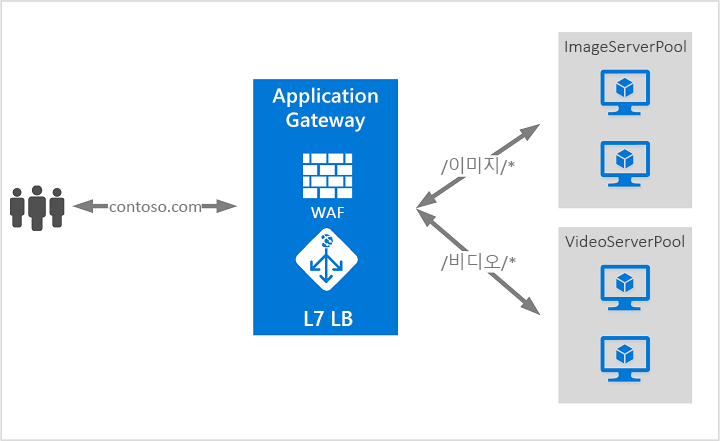

# Azure Application Gateway란?

Azure Application Gateway는 웹 애플리케이션에 대한 트래픽을 관리할 수 있도록 하는 웹 트래픽 부하 분산 장치입니다. 기존 부하 분산 장치는 전송 계층(OSI 계층 4 - TCP 및 UDP)에서 작동하고 원본 IP 주소와 포트를 기반으로 대상 IP 주소와 포트에 트래픽을 라우팅합니다.

Application Gateway는 URI 경로 또는 호스트 헤더와 같은 HTTP 요청의 추가 특성을 기반으로 라우팅 결정을 내릴 수 있습니다. 예를 들어 들어오는 URL을 기반으로 하는 트래픽을 라우팅할 수 있습니다. 따라서 `/images`가 들어오는 URL에 있는 경우 이미지에 대해 구성된 서버(풀 라고도 함)의 특정 집합에 트래픽을 라우팅할 수 있습니다. `/video`가 URL에 있는 경우 해당 트래픽은 비디오에 최적화된 다른 풀로 라우팅됩니다.

이 유형의 라우팅은 애플리케이션 계층(OSI 계층 7) 부하 분산이라고 합니다. Azure Application Gateway는 URL 기반 라우팅 및 기타 작업을 수행할 수 있습니다.

>[!NOTE]
> Azure는 사용자 시나리오를 위한 완전히 관리되는 부하 분산 솔루션 모음을 제공합니다. 고성능, 낮은 대기 시간, 계층 4 부하 분산이 필요한 경우 [Azure Load Balancer란?](../load-balancer/load-balancer-overview.md)을 참조하세요. 글로벌 DNS 부하 분산을 확인하려는 경우 [Traffic Manager란?](../traffic-manager/traffic-manager-overview.md)을 참조하세요. 엔드투엔드 시나리오에서 이러한 솔루션을 조합하여 이점을 얻을 수 있습니다.
>
> Azure 부하 분산 옵션 비교는 [Azure의 부하 분산 옵션 개요](https://docs.microsoft.com/azure/architecture/guide/technology-choices/load-balancing-overview)를 참조하세요.

## 기능

Application Gateway 기능에 대한 자세한 내용은 [Azure Application Gateway 기능](features.md)을 참조하세요.

## 가격 및 SLA

Application Gateway 가격 책정 정보는 [Application Gateway 가격 책정](https://azure.microsoft.com/pricing/details/application-gateway/)을 참조하세요.

Application Gateway SLA 정보는 [Application Gateway SLA](https://azure.microsoft.com/support/legal/sla/application-gateway/v1_2/)를 참조하세요.

## 다음 단계

요구 사항 및 환경에 따라 Azure Portal, Azure PowerShell 또는 Azure CLI 중 하나를 사용하여 테스트 Application Gateway를 만들 수 있습니다.

- [빠른 시작: Azure Application Gateway를 통해 웹 트래픽 보내기 - Azure Portal](quick-create-portal.md)
- [빠른 시작: Azure Application Gateway를 통해 웹 트래픽 보내기 - Azure PowerShell](quick-create-powershell.md)
- [빠른 시작: Azure Application Gateway를 통해 웹 트래픽 보내기 - Azure CLI](quick-create-cli.md)
