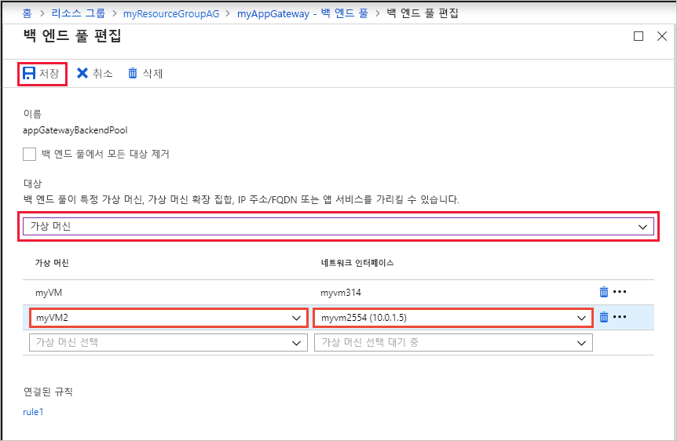

# <a name="quickstart-direct-web-traffic-with-azure-application-gateway---azure-portal"></a>빠른 시작: Azure Application Gateway를 통해 웹 트래픽 보내기 - Azure Portal

Azure Application Gateway를 통해 수신기를 포트에 할당하고, 규칙을 만들고, 백 엔드 풀에 리소스를 추가하여 애플리케이션 웹 트래픽을 특정 리소스로 보낼 수 있습니다.

이 빠른 시작에서는 Azure Portal을 사용하여 백 엔드 풀에 가상 머신 두 개가 있는 애플리케이션 게이트웨이를 신속하게 만드는 방법을 보여줍니다. 그런 다음, 올바르게 작동하는지 테스트합니다.

Azure 구독이 아직 없는 경우 시작하기 전에 [체험 계정](https://azure.microsoft.com/free/?WT.mc_id=A261C142F)을 만듭니다.

## <a name="sign-in-to-azure"></a>Azure에 로그인

[https://portal.azure.com](https://portal.azure.com) 에서 Azure Portal에 로그인합니다.

## <a name="create-an-application-gateway"></a>응용 프로그램 게이트웨이 만들기

가상 네트워크는 사용자가 만든 리소스 간의 통신에 필요합니다. 이 예제에서는 두 개의 서브넷을 만듭니다. 하나는 애플리케이션 게이트웨이용이고, 다른 하나는 백 엔드 서버용입니다. 애플리케이션 게이트웨이를 만드는 동시에 가상 네트워크를 만들 수 있습니다.

1. Azure Portal의 왼쪽 위 모서리에 있는 **리소스 만들기**를 클릭합니다.
2. **네트워킹**을 클릭한 다음, 추천 목록에서 **Application Gateway**를 클릭합니다.

### <a name="basics"></a>기본 사항

1. 애플리케이션 게이트웨이에 대해 다음 값을 입력합니다.

    - *myAppGateway* - 응용 프로그램 게이트웨이의 이름
    - *myResourceGroupAG* - 새 리소스 그룹의 이름

    

2. 다른 설정에 대한 기본값을 적용한 다음, **확인**을 클릭합니다.

### <a name="settings"></a>설정

1. **가상 네트워크 선택**을 클릭하고 **새로 만들기**를 클릭한 다음, 가상 네트워크에 대해 다음 값을 입력합니다.

    - *myVNet* - 가상 네트워크 이름
    - *10.0.0.0/16* - 가상 네트워크 주소 공간
    - *myAGSubnet* - 서브넷 이름
    - *10.0.0.0/24* - 서브넷 주소 범위

    

6. 설정 페이지로 다시 이동하려면 **확인**을 클릭합니다.
7. **프런트 엔드 IP 구성**에서 **IP 주소 형식**이 **공용**으로 설정됐는지 확인하고, **공용 IP 주소**에서 **새로 만들기**기 선택됐는지 확인합니다. 공용 IP 주소 이름으로 *myAGPublicIPAddress*를 입력합니다. 다른 설정에 대한 기본값을 적용한 다음, **확인**을 클릭합니다.

### <a name="summary"></a>요약

요약 페이지에서 설정을 검토한 다음, **확인**을 클릭하여 가상 네트워크, 공용 IP 주소 및 애플리케이션 게이트웨이를 만듭니다. 애플리케이션 게이트웨이가 생성될 때까지 몇 분 정도 걸릴 수 있습니다. 배포가 성공적으로 완료될 때까지 기다렸다가 다음 섹션으로 이동합니다.

## <a name="add-a-subnet"></a>서브넷 추가

1. 왼쪽 메뉴에서 **모든 리소스**를 클릭한 다음, 리소스 목록에서 **myVNet**을 클릭합니다.
2. **서브넷**을 클릭한 다음, **+서브넷**을 클릭합니다.

    

3. 서브넷 이름에 *myBackendSubnet*을 입력한 다음, **확인**을 클릭합니다.

## <a name="create-backend-servers"></a>백 엔드 서버 만들기

이 예제에서는 애플리케이션 게이트웨이에 대한 백 엔드 서버로 사용되는 두 개의 가상 머신을 만듭니다. 또한 가상 머신에 IIS를 설치하여 애플리케이션 게이트웨이가 성공적으로 만들어졌는지 확인합니다.

### <a name="create-a-virtual-machine"></a>가상 머신 만들기

1. Azure Portal에서 **리소스 만들기**를 클릭합니다.
2. **Compute**를 클릭한 다음, 추천 목록에서 **Windows Server 2016 Datacenter**를 선택합니다.
3. 가상 머신에 대해 다음 값을 입력합니다.

    - *myResourceGroupAG* - 리소스 그룹
    - *myVM* - 가상 머신의 이름
    - *azureuser* - 관리자 사용자 이름
    - *Azure123456!* - 암호

   나머지는 기본값으로 두고 **다음: 디스크**를 클릭합니다.
4. 디스크 기본값을 적용하고 **다음: 네트워킹**을 클릭합니다.
5. 가상 네트워크에 대해 **myVNet**이 선택되어 있고 서브넷이 **myBackendSubnet**인지 확인합니다.
6. 나머지는 기본값으로 두고 **다음: 관리**를 클릭합니다.
7. **끄기**를 클릭하여 부팅 진단을 사용하지 않도록 설정합니다. 기타 기본값을 적용하고 **검토 + 만들기**를 클릭합니다.
8. 요약 페이지에서 설정을 검토한 다음, **만들기**를 클릭합니다.
9. 가상 머신 만들기가 완료되기를 기다렸다가 계속합니다.

### <a name="install-iis"></a>IIS 설치

1. 대화형 셸을 열고 **PowerShell**로 설정되어 있는지 확인합니다.

    

2. 다음 명령을 실행하여 가상 머신에 IIS를 설치합니다. 

    ```azurepowershell-interactive
    Set-AzureRmVMExtension `
      -ResourceGroupName myResourceGroupAG `
      -ExtensionName IIS `
      -VMName myVM `
      -Publisher Microsoft.Compute `
      -ExtensionType CustomScriptExtension `
      -TypeHandlerVersion 1.4 `
      -SettingString '{"commandToExecute":"powershell Add-WindowsFeature Web-Server; powershell Add-Content -Path \"C:\\inetpub\\wwwroot\\Default.htm\" -Value $($env:computername)"}' `
      -Location EastUS
    ```

3. 두 번째 가상 머신을 만들고, 방금 완료한 단계를 사용하여 IIS를 설치합니다. Set-AzureRmVMExtension의 이름 및 VMName에 대해 *myVM2*를 입력합니다.

### <a name="add-backend-servers"></a>백 엔드 서버 추가

1. **모든 리소스**를 클릭한 다음, **myAppGateway**를 클릭합니다.
4. **백 엔드 풀**을 클릭합니다. 기본 풀이 애플리케이션 게이트웨이와 함께 자동으로 만들어졌습니다. **appGatewayBackendPool**을 클릭합니다.
5. **대상**에서 **IP 주소 또는 FQDN**을 클릭하고 **Virtual Machine**을 선택합니다.
6. **Virtual Machine**에서 myVM 가상 머신, myVM2 가상 머신 및 이와 연결된 네트워크 인터페이스를 추가합니다.

    

6. **저장**을 클릭합니다.

## <a name="test-the-application-gateway"></a>애플리케이션 게이트웨이 테스트

1. [개요] 화면에서 애플리케이션 게이트웨이에 대한 공용 IP 주소를 찾습니다. **모든 리소스**를 클릭한 다음, **myAGPublicIPAddress**를 클릭합니다.

    

2. 공용 IP 주소를 복사한 다음, 브라우저의 주소 표시줄에 붙여넣습니다.

    

## <a name="clean-up-resources"></a>리소스 정리

더 이상 필요하지 않은 리소스 그룹, 가상 컴퓨터 및 모든 관련 리소스를 삭제합니다. 이렇게 하려면 애플리케이션 게이트웨이가 포함된 리소스 그룹을 선택하고 **삭제**를 클릭합니다.

## <a name="next-steps"></a>다음 단계

> [!div class="nextstepaction"]
> [Azure CLI를 사용하여 응용 프로그램 게이트웨이로 웹 트래픽 관리](./tutorial-manage-web-traffic-cli.md)
