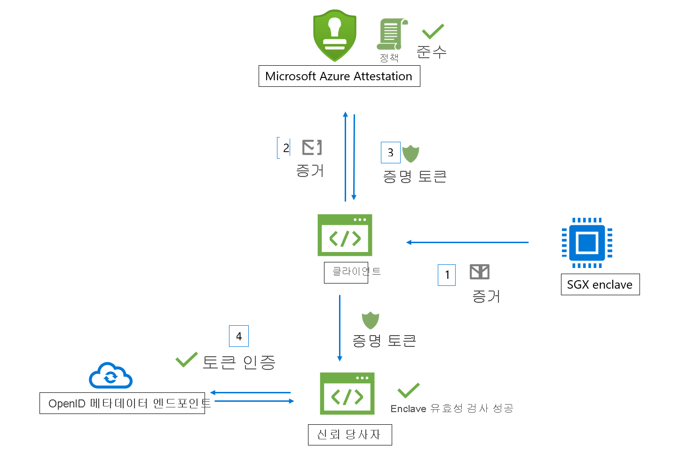
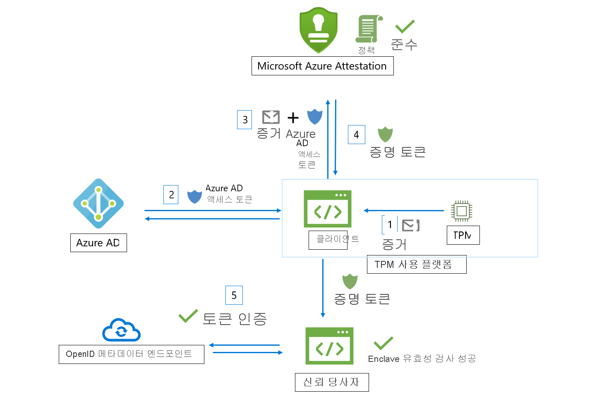

# 워크플로

Microsoft Azure Attestation은 enclaves에서 증거를 수신하고 Azure 보안 기준 및 구성 가능한 정책에 대한 증거를 평가합니다. 성공적으로 확인되면 Azure Attestation은 증명 토큰을 생성하여 enclave를 신뢰할 수 있는지 확인합니다.

Azure Attestation 작업 흐름과 관련된 행위자는 다음과 같습니다.

- **신뢰 당사자**: enclave 유효성을 확인하기 위해 Azure Attestation에 의존하는 구성 요소입니다. 
- **클라이언트**: enclave에서 정보를 수집하고 Azure Attestation에 요청을 보내는 구성 요소입니다. 
- **Azure Attestation**: 클라이언트에서 enclave 증명 정보를 수락하고, 유효성을 검사하고, 증명 토큰을 클라이언트에 반환하는 구성 요소입니다.

## Intel® SGX(Software Guard Extensions) enclave 유효성 검사 워크플로

일반적인 SGX enclave 증명 워크플로(Azure Attestation 사용)의 일반적인 단계는 다음과 같습니다.

1. 클라이언트는 enclave에서 증거를 수집합니다. 증거는 enclave 환경 및 enclave 내에서 실행되는 클라이언트 라이브러리에 대한 정보입니다.
1. 클라이언트에는 Azure Attestation 인스턴스를 참조하는 URI가 있습니다. 클라이언트는 Azure Attestation에 증거를 보냅니다. 공급자에게 제출되는 정확한 정보는 enclave 유형에 따라 달라집니다.
1. Azure Attestation은 제출된 정보의 유효성을 검사하고 구성된 정책에 대해 평가합니다. 검증에 성공하면 Azure Attestation은 증명 토큰을 발급하여 클라이언트에 반환합니다. 이 단계가 실패하면 Azure Attestation은 클라이언트에 오류를 보고합니다. 
1. 클라이언트는 신뢰 당사자에게 증명 토큰을 보냅니다. 신뢰 당사자는 Azure Attestation의 공개 키 메타데이터 엔드포인트를 호출하여 서명 인증서를 검색합니다. 그런 다음, 신뢰 당사자는 증명 토큰의 서명을 확인하고 enclave 신뢰성을 보장합니다. 

> [!Note]
> [2018-09-01-preview](https://github.com/Azure/azure-rest-api-specs/tree/master/specification/attestation/data-plane/Microsoft.Attestation/stable/2018-09-01-preview) API 버전에서 증명 요청을 보내는 경우 클라이언트는 Azure AD 액세스 토큰과 함께 증거를 Azure Attestation에 보내야 합니다.

## TPM(신뢰할 수 있는 플랫폼 모듈) enclave 유효성 검사 워크플로

일반적인 TPM enclave 증명 워크플로(Azure Attestation 사용)의 일반적인 단계는 다음과 같습니다.

1.  디바이스/플랫폼 부팅 시 다양한 부팅 로더 및 부팅 서비스는 TPM에서 지원되며 안전하게 저장된(TCG 로그) 이벤트를 측정합니다.
2.  클라이언트는 증명을 위한 증거 역할을 하는 디바이스 및 TPM 견적에서 TCG 로그를 수집합니다.
3.  클라이언트에는 Azure Attestation 인스턴스를 참조하는 URI가 있습니다. 클라이언트는 Azure Attestation에 증거를 보냅니다. 공급자에게 제출되는 정확한 정보는 플랫폼에 따라 달라집니다.
4.  Azure Attestation은 제출된 정보의 유효성을 검사하고 구성된 정책에 대해 평가합니다. 검증에 성공하면 Azure Attestation은 증명 토큰을 발급하여 클라이언트에 반환합니다. 이 단계가 실패하면 Azure Attestation은 클라이언트에 오류를 보고합니다. 클라이언트와 증명 서비스 간의 통신은 Azure 증명 TPM 프로토콜에 의해 결정됩니다.
5.  그런 다음, 클라이언트는 신뢰 당사자에게 증명 토큰을 보냅니다. 신뢰 당사자는 Azure Attestation의 공개 키 메타데이터 엔드포인트를 호출하여 서명 인증서를 검색합니다. 그런 다음, 신뢰 당사자는 증명 토큰의 서명을 확인하고 플랫폼의 신뢰성을 보장합니다.

## 다음 단계
- [증명 정책을 작성하고 서명하는 방법](author-sign-policy.md)
- [PowerShell을 사용하여 Azure Attestation 설정](quickstart-powershell.md)
