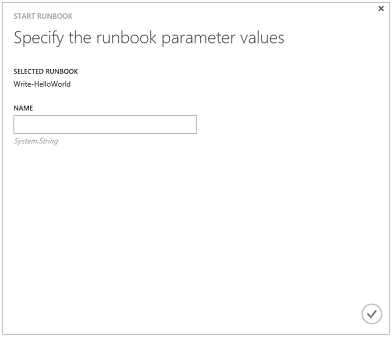

<properties linkid="automation-create-runbook-from-samples" urlDisplayName="Get Started with Azure Automation" pageTitle="Get Started with Azure Automation" metaKeywords="" description="Learn how to import and run an automation job in Azure." metaCanonical="" services="automation" documentationCenter="" title="Get Started with Azure Automation" authors="" solutions="" manager="" editor="" />

Azure 자동화 시작
=================

이 자습서에서는 Microsoft Azure에서 Automation Runbook을 가져오고 실행하는 작업을 단계별로 안내합니다.

Microsoft Azure 자동화를 통해 개발자는 일반적으로 클라우드 환경에서 장시간 동안 수동으로 실행되며 오류가 발생하기 쉬운 자주 반복되는 작업을 자동화할 수 있습니다. 실제로 Windows PowerShell 워크플로인 Runbook을 사용하여 Azure 환경에서 리소스를 만들고, 모니터링하고, 관리하고, 배포할 수 있습니다. 자동화에 대한 자세한 내용은 [자동화 개요 가이드](http://go.microsoft.com/fwlink/p/?LinkId=392861)(영문)를 참조하십시오.

이 자습서에서는 샘플 Runbook을 Azure 자동화로 가져오고, Runbook을 실행한 후 출력을 확인하는 작업을 단계별로 안내합니다.

샘플 및 유틸리티 Runbook
------------------------

Azure 자동화 팀은 자동화를 시작하는 데 도움을 주는 다수의 Runbook 샘플을 만들었습니다. 기본적인 자동화 개념을 다루는 이 샘플은 고유한 Runbook을 작성하는 방법을 배울 수 있도록 돕기 위한 것입니다.

또한 자동화 팀은 대규모 자동화 작업의 구성 요소로 사용할 수 있는 유틸리티 Runbook을 만들었습니다.

> [WACOM.NOTE] 재사용 가능한 모듈식 소형 Runbook을 작성하는 것이 좋습니다. 자동화에 익숙해진 후에는 일반적으로 사용되는 시나리오를 위한 고유한 유틸리티 Runbook을 만드는 것이 좋습니다.

[스크립트 센터](http://go.microsoft.com/fwlink/p/?LinkId=393029)에서 자동화 팀의 샘플 및 유틸리티 Runbook을 보고 다운로드할 수 있습니다.

자동화 커뮤니티 및 피드백
-------------------------

커뮤니티 및 다른 Microsoft 팀의 Runbook은 [스크립트 센터](http://go.microsoft.com/fwlink/?LinkID=391681)에도 게시되어 있습니다.

**피드백 보내기** Runbook 솔루션 또는 PowerShell 통합 모듈을 찾고 있는 경우 스크립트 센터에 스크립트 요청을 게시하십시오. 자동화의 새로운 기능에 대한 아이디어가 있으면 [User Voice](http://feedback.windowsazure.com/forums/34192--general-feedback)(영문)에 게시해 주십시오.

[WACOM.INCLUDE [create-account-note](../includes/create-account-note.md)]

스크립트 센터에서 샘플 Runbook 다운로드
---------------------------------------

1.  [스크립트 센터](http://go.microsoft.com/fwlink/p/?LinkId=393029)로 이동한 후 **Hello World for Azure Automation**(영문)을 클릭합니다.

2.  **다운로드** 옆에 있는 파일 이름 **Write-HelloWorld.ps1**을 클릭한 후 파일을 컴퓨터에 저장합니다.

Azure에 샘플 Runbook 가져오기
-----------------------------

1.  [Azure 관리 포털](http://manage.windowsazure.com)에 로그인합니다.

2.  관리 포털에서 **Create an Automation Account**를 클릭합니다.

    > [WACOM.NOTE] 자동화 계정을 이미 만든 경우 4단계로 건너뛸 수 있습니다.

    

3.  **Add a New Automation Account** 페이지에서 계정 이름을 입력한 후 확인 표시를 클릭합니다.

    

4.  **자동화** 페이지에서 방금 만든 새 계정을 클릭합니다.

    

5.  **Runbook**을 클릭합니다.

    

6.  **가져오기**를 클릭합니다.

    

7.  다운로드한 **Write-HelloWorld.ps1** 스크립트로 이동한 후 확인 표시를 클릭합니다.

    

8.  **Write-HelloWorld**를 클릭합니다.

    

9.  **만든 이**를 클릭한 후 **초안**을 클릭합니다. 이 Runbook의 경우에는 수정할 필요가 없습니다.

    이제 **Write-HelloWorld.ps1**의 콘텐츠를 볼 수 있습니다. 초안 모드에서 Runbook의 콘텐츠를 수정할 수 있습니다.

    

10. **게시**를 클릭하여 프로덕션에 사용할 수 있도록 Runbook의 수준을 올립니다.

    

11. Runbook을 저장하고 게시하라는 메시지가 나타나면 **예**를 클릭합니다.

    

12. **게시됨**을 클릭한 후 **시작**을 클릭합니다.

    

13. **Specify the runbook parameter values** 페이지에서 Write-HelloWorld.ps1 스크립트의 입력 매개 변수로 사용할 **이름**을 입력한 후 확인 표시를 클릭합니다.

    

14. **작업**을 클릭하여 방금 시작한 Runbook 작업의 상태를 확인한 후 **JOB START** 열의 타임스탬프를 클릭하여 작업 요약을 봅니다.

    

15. **요약** 페이지에서 작업의 요약, 입력 매개 변수 및 출력을 볼 수 있습니다.

    

참고 항목
---------

-   [자동화 개요(영문)](http://go.microsoft.com/fwlink/p/?LinkId=392860)
-   [Runbook 작성 가이드(영문)](http://go.microsoft.com/fwlink/p/?LinkID=301740)
-   [자동화 포럼(영문)](http://go.microsoft.com/fwlink/p/?LinkId=390561)

