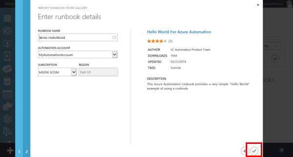
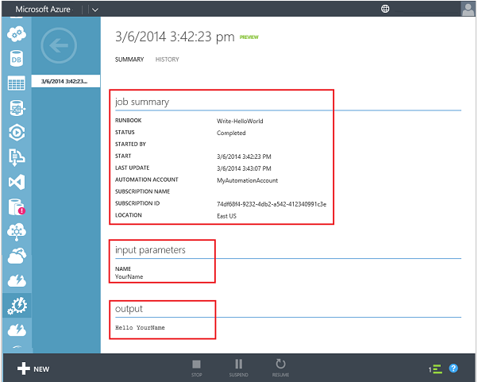

<properties 
	pageTitle="Azure 자동화 시작" 
	description="Azure에서 자동화 작업을 가져오고 실행하는 방법에 대해 알아봅니다." 
	services="automation" 
	documentationCenter="" 
	authors="bwren" 
	manager="stevenka" 
	editor=""/>

<tags 
	ms.service="automation" 
	ms.workload="tbd" 
	ms.tgt_pltfrm="na" 
	ms.devlang="na" 
	ms.topic="article" 
	ms.date="1/13/2015" 
	ms.author="bwren"/>

# Azure 자동화 시작

Microsoft Azure 자동화를 통해 개발자는 일반적으로 클라우드 환경에서 장시간 동안 수동으로 실행되며 오류가 발생하기 쉬운 자주 반복되는 작업을 자동화할 수 있습니다. 실제로 Windows PowerShell 워크플로인 Runbook을 사용하여 Azure 환경에서 리소스를 만들고, 모니터링하고, 관리하고, 배포할 수 있습니다. 자동화에 대한 자세한 내용은 [자동화 개요 설명서](http://go.microsoft.com/fwlink/p/?LinkId=392861)를 참조하세요. 

이 자습서에서는 샘플 "Hello World" Runbook을 Azure 자동화로 가져오고, Runbook을 실행한 후 출력을 확인하는 작업을 단계별로 안내합니다.

>[WACOM.NOTE] [Azure PowerShell cmdlet](http://msdn.microsoft.com/library/jj156055.aspx)을 사용하여 Azure 작업을 자동화하는 방법에 대한 자세한 내용은 <a href="http://azure.microsoft.com/blog/2014/08/27/azure-automation-authenticating-to-azure-using-azure-active-directory/">Azure 자동화: Azure Active Directory를 사용하여 Azure에 인증</a>(영문)을 참조하세요.

## 샘플 및 유틸리티 Runbook

Azure 자동화 팀은 자동화를 시작하는 데 도움을 주는 다수의 Runbook 샘플을 만들었습니다.  기본적인 자동화 개념을 다루는 이 샘플은 고유한 Runbook을 작성하는 방법을 배울 수 있도록 돕기 위한 것입니다.  

또한 자동화 팀은 대규모 자동화 작업의 구성 요소로 사용할 수 있는 유틸리티 Runbook을 만들었습니다.  

>[WACOM.NOTE] 재사용 가능한 모듈식 소형 Runbook을 작성하는 것이 좋습니다. 자동화에 익숙해진 후에는 일반적으로 사용되는 시나리오를 위한 고유한 유틸리티 Runbook을 만드는 것이 좋습니다.  

[스크립트 센터](http://go.microsoft.com/fwlink/p/?LinkId=393029)에서 자동화 팀의 샘플 및 유틸리티 Runbook을 보고 다운로드하거나 [Runbook 갤러리](http://aka.ms/runbookgallery)에서 Runbook을 직접 다운로드할 수 있습니다. 

## 자동화 커뮤니티 및 피드백

커뮤니티 및 다른 Microsoft 팀의 Runbook은 [스크립트 센터](http://go.microsoft.com/fwlink/?LinkID=391681)와 [Runbook 갤러리](http://aka.ms/runbookgallery)에도 게시되어 있습니다. 

<strong>피드백 보내기</strong>  자동화 Runbook 솔루션 또는 통합 모듈을 찾고 있는 경우 스크립트 센터에 스크립트 요청을 게시하세요. 자동화의 새로운 기능에 대한 아이디어가 있으면 [User Voice](http://feedback.windowsazure.com/forums/34192--general-feedback)(영문)에 게시해 주세요.

[WACOM.INCLUDE [create-account-note](../includes/create-account-note.md)]

## 이 자습서의 대략적인 단계

1. [자동화 계정 만들기](#automationaccount)
2. [Runbook 갤러리에서 Runbook 가져오기](#importrunbook)
3. [Runbook 게시](#publishrunbook)
4. [Runbook 시작](#startrunbook)

## 자동화 계정 만들기

1.	[Azure 관리 포털](http://manage.windowsazure.com)에 로그인합니다.

2.	관리 포털에서 **자동화 계정 만들기**를 클릭합니다.

	>[WACOM.NOTE] 자동화 계정을 이미 만든 경우 4단계로 건너뛸 수 있습니다.

	

3.	**새 자동화 계정 추가** 페이지에서 계정 이름을 입력한 후 확인 표시를 클릭합니다.

	

## Runbook 갤러리에서 Runbook 가져오기
 
4.	**자동화** 페이지에서 방금 만든 새 계정을 클릭합니다.
 
	

5.	**Runbook**을 클릭합니다.

	
  
6.	**새로 만들기** > **Runbook** > **갤러리에서**를 클릭합니다.

	

7.  **자습서** 범주를 선택하고 **Hello World for Azure Automation**을 선택합니다. 오른쪽 화살표 단추를 클릭합니다.

	

8.  Runbook의 내용을 검토하고 오른쪽 화살표 단추를 클릭합니다.

	

8.	Runbook의 세부 정보를 검토하고 확인 표시 단추를 클릭합니다.

	

## Runbook 게시 

9.	Runbook 가져오기가 완료되면 **Write-HelloWorld**를 클릭합니다.

	

9.	**만든 이**를 클릭한 후 **초안**을 클릭합니다.  

	초안 모드에서 Runbook의 콘텐츠를 수정할 수 있습니다. 이 Runbook의 경우에는 수정할 필요가 없습니다.

	  
 
10.	**게시**를 클릭하여 프로덕션에 사용할 수 있도록 Runbook의 수준을 올립니다.

	
   
11.	Runbook을 저장하고 게시하라는 메시지가 나타나면 **예**를 클릭합니다.
 
	

## Runbook 시작

12.	**Write-HelloWorld** Runbook을 열어 두고 **시작**을 클릭합니다.

	
 
13.	**Runbook 매개 변수 값 지정** 페이지에서 Write-HelloWorld.ps1 스크립트의 입력 매개 변수로 사용할 **이름**을 입력한 후 확인 표시를 클릭합니다.

	
  
14.	**작업**을 클릭하여 방금 시작한 Runbook 작업의 상태를 확인한 후 **JOB START** 열의 타임스탬프를 클릭하여 작업 요약을 봅니다.

	

15.	**요약** 페이지에서 작업의 요약, 입력 매개 변수 및 출력을 볼 수 있습니다.
 
	

# Runbook에서 Azure 서비스 관리 
위의 예제에서는 Azure 서비스를 관리하지 않는 단순한 Runbook을 보여 줍니다. [Azure cmdlet](http://msdn.microsoft.com/library/jj156055.aspx)을 사용하려면 Azure에 대한 인증이 필요합니다. Azure 자동화를 통해 관리하도록 Azure 구독을 구성하려면 [Azure 자동화: Azure Active Directory를 사용하여 Azure에 인증](http://azure.microsoft.com/blog/2014/08/27/azure-automation-authenticating-to-azure-using-azure-active-directory/)(영문)에 나와 있는 지침을 수행하면 됩니다.

# 참고 항목

- [자동화 개요](http://go.microsoft.com/fwlink/p/?LinkId=392860)
- [Runbook 작성 가이드](http://go.microsoft.com/fwlink/p/?LinkID=301740)
- [자동화 포럼](http://go.microsoft.com/fwlink/p/?LinkId=390561)(영문)
- [Azure 자동화: Azure Active Directory를 사용하여 Azure에 인증](http://azure.microsoft.com/blog/2014/08/27/azure-automation-authenticating-to-azure-using-azure-active-directory/)(영문)

<!--HONumber=35.2-->

<!--HONumber=46--> 
