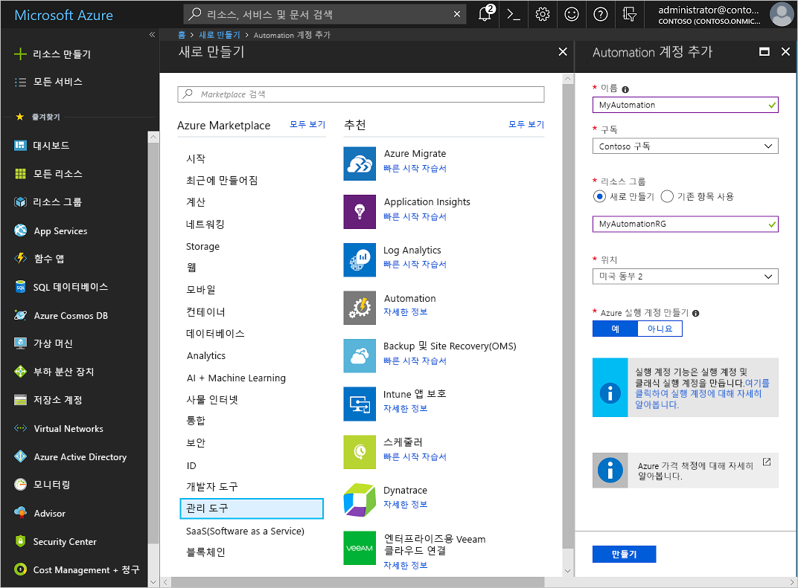
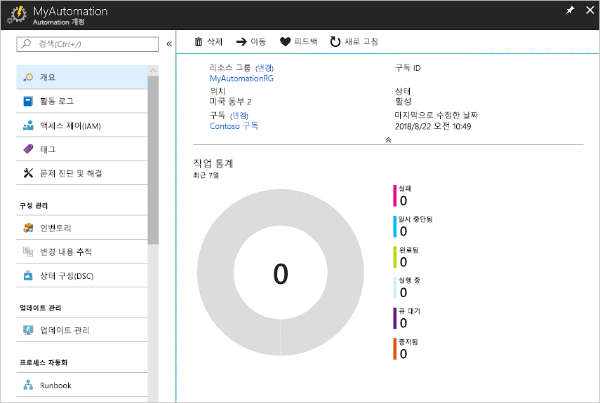
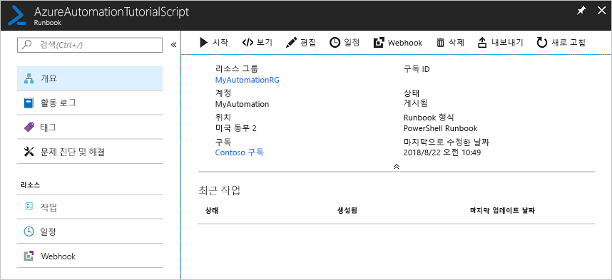
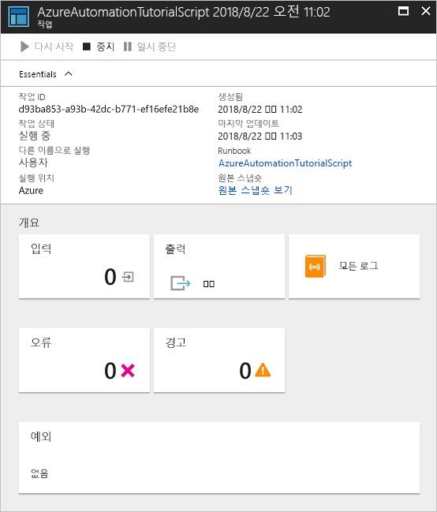

# Azure Automation 계정 만들기

Azure Automation 계정은 Azure 포털을 통해 만들 수 있습니다. 이 방법은 Automation 계정 및 관련 리소스를 만들고 구성하기 위한 브라우저 기반 사용자 인터페이스를 제공합니다. 이 빠른 시작에서는 Automation 계정을 만들고 계정에서 Runbook을 실행하는 방법을 안내합니다.

Azure 구독이 아직 없는 경우 시작하기 전에 [Azure 체험 계정](https://azure.microsoft.com/free/?WT.mc_id=A261C142F)을 만듭니다.

## Azure에 로그인

 https://portal.azure.com 에서 Azure에 로그인

## Automation 계정 만들기

1. Azure의 왼쪽 위 모서리에서 **리소스 만들기** 단추를 클릭합니다.

1. **관리 도구**를 선택한 다음, **Automation**을 선택합니다.

1. 계정 정보를 입력합니다. Azure에 대한 인증을 간소화하는 아티팩트를 자동으로 사용하도록 설정하기 위해 **Azure 실행 계정 만들기**에서 **예**를 선택합니다. Automation 계정을 만들 때 이름을 선택한 후에는 변경할 수 없습니다. *Automation 계정 이름은 하위 지역 및 리소스 그룹별로 고유합니다. 삭제된 Automation 계정에 대한 이름을 즉시 사용할 수 있습니다.* 하나의 Automation 계정으로 해당 테넌트의 모든 영역과 구독 전반의 리소스를 관리할 수 있습니다. 완료되면 **만들기**를 클릭하여 Automation 계정 배포를 시작합니다.

      

    > [!NOTE]
    > Automation Account를 배포할 수 있는 위치의 업데이트된 목록을 보려면 [지역별 사용 가능한 제품](https://azure.microsoft.com/en-us/global-infrastructure/services/?products=automation&regions=all)을 참조하세요.

1. 배포가 완료되면 **모든 서비스**를 클릭하고, **Automation 계정**을 선택하고, 만든 Automation 계정을 선택합니다.

    

## Runbook 실행

자습서 Runbook 중 하나를 실행합니다.

1. **프로세스 자동화** 아래에서 **Runbook**을 클릭합니다. Runbook 목록이 표시됩니다. 기본적으로 몇 가지 자습서 Runbook을 계정에서 사용할 수 있습니다.

    

1. **AzureAutomationTutorialScript** Runbook을 선택합니다. Runbook 개요 페이지가 열립니다.

    

1. **시작**을 클릭하고 **Runbook 시작** 페이지에서 **확인**을 클릭하여 Runbook을 시작합니다.

    

1. **작업 상태**가 **실행 중**이 되면 **출력** 또는 **모든 로그**를 클릭하여 Runbook 작업 출력을 확인합니다. 이 자습서 Runbook의 경우 출력은 Azure 리소스 목록입니다.

## 다음 단계

이 빠른 시작에서는 Automation 계정을 배포하고, Runbook 작업을 시작하고, 작업 결과를 확인했습니다. Azure Automation에 대한 자세한 내용을 알아보려면 첫 번째 Runbook을 만드는 빠른 시작으로 계속 진행하세요.

> [!div class="nextstepaction"]
> [Automation 빠른 시작 - Runbook 만들기](./automation-quickstart-create-runbook.md)

