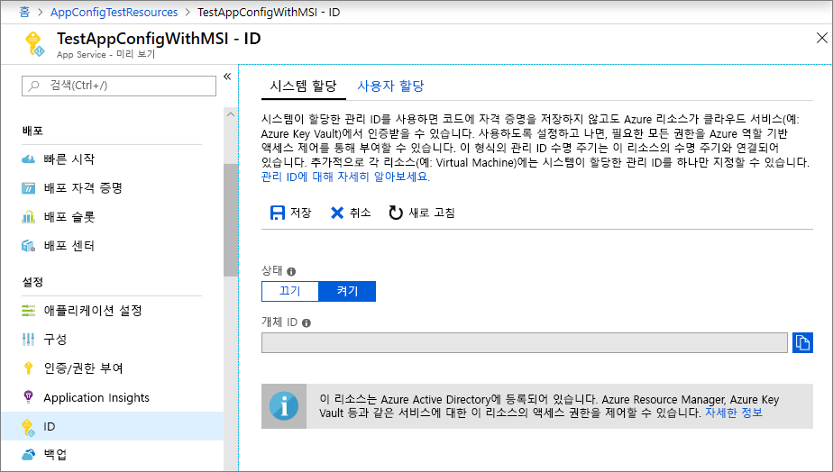

# <a name="tutorial-integrate-with-azure-managed-identities"></a>자습서: Azure 관리 ID와 통합

Azure Active Directory [관리 ID](https://docs.microsoft.com/azure/active-directory/managed-identities-azure-resources/overview)를 사용하면 클라우드 애플리케이션에 대한 비밀 관리를 간소화할 수 있습니다. 관리 ID를 사용하면 실행되는 Azure 컴퓨팅 서비스에 대해 만들어진 서비스 주체를 사용하도록 코드를 설정할 수 있습니다. Azure Key Vault 또는 로컬 연결 문자열에 저장된 별도의 자격 증명 대신 관리 ID를 사용합니다. 

Azure App Configuration과 .NET Core, .NET 및 Java Spring 클라이언트 라이브러리에는 MSI(관리 서비스 ID) 지원이 기본적으로 제공됩니다. MSI는 사용할 필요가 없지만 사용하는 경우 비밀이 포함된 액세스 토큰이 필요하지 않습니다. 코드에 액세스하려면 앱 구성 저장소에 대한 서비스 엔드포인트만 알고 있어야 합니다. 이 URL은 비밀을 공개하지 않으면서 코드에 직접 포함시킬 수 있습니다.

이 자습서에서는 MSI를 활용하여 App Configuration에 액세스하는 방법을 보여줍니다. 빠른 시작에 소개된 웹앱을 기반으로 합니다. 계속 진행하기 전에 먼저 [App Configuration을 사용하여 ASP.NET Core 앱 만들기](./quickstart-aspnet-core-app.md)를 완료합니다.

이 자습서의 단계는 임의의 코드 편집기를 사용하여 수행할 수 있습니다. [Visual Studio Code](https://code.visualstudio.com/)는 Windows, macOS 및 Linux 플랫폼에서 사용할 수 있는 훌륭한 옵션입니다.

이 자습서에서는 다음 방법에 대해 알아봅니다.

> [!div class="checklist"]
> * App Configuration에 대한 관리 ID 액세스 권한을 부여합니다.
> * App Configuration에 연결할 때 관리 ID를 사용하도록 앱을 구성합니다.

## <a name="prerequisites"></a>필수 조건

이 자습서를 완료하려면 다음 항목이 필요합니다.

* [.NET Core SDK](https://www.microsoft.com/net/download/windows)
* [Azure Cloud Shell 구성](https://docs.microsoft.com/azure/cloud-shell/quickstart)

[!INCLUDE [quickstarts-free-trial-note](../../includes/quickstarts-free-trial-note.md)]

## <a name="add-a-managed-identity"></a>관리형 ID 추가

포털에서 관리 ID를 설정하려면 먼저 애플리케이션을 정상적으로 만든 다음, 해당 기능을 사용하도록 설정합니다.

1. 평소와 같이 [Azure Portal](https://aka.ms/azconfig/portal)에서 앱을 만듭니다. 포털에서 이동합니다.

2. 왼쪽 창에서 **설정** 그룹까지 아래로 스크롤하고 **ID**를 선택합니다.

3. **시스템 할당** 탭에서 **상태**를 **켜기**로 전환하고 **저장**을 선택합니다.

    

## <a name="grant-access-to-app-configuration"></a>App Configuration에 대한 액세스 권한 부여

1. [Azure Portal](https://aka.ms/azconfig/portal)에서 **모든 리소스**를 선택하고, 빠른 시작에서 만든 앱 구성 저장소를 선택합니다.

2. **액세스 제어(IAM)** 를 선택합니다.

3. **액세스 권한 확인** 탭의 **역할 할당 추가** 카드 UI에서 **추가**를 선택합니다.

4. **역할** 아래에서 **기여자**를 선택합니다. **다음에 대한 액세스 할당**의 **시스템이 할당한 관리 ID** 아래에서 **App Service**를 선택합니다.

5. **구독** 아래에서 Azure 구독을 선택합니다. 앱의 App Service 리소스를 선택합니다.

6. **저장**을 선택합니다.

    

## <a name="use-a-managed-identity"></a>관리 ID 사용

1. *appsettings.json*을 열고 다음 스크립트를 추가합니다. *<service_endpoint>*(대괄호 포함)를 앱 구성 저장소의 URL로 바꿉니다.

    ```json
    "AppConfig": {
        "Endpoint": "<service_endpoint>"
    }
    ```

2. *Program.cs*를 열고 `config.AddAzureAppConfiguration()` 메서드를 대체하여 `CreateWebHostBuilder` 메서드를 업데이트합니다.

    ```csharp
    public static IWebHostBuilder CreateWebHostBuilder(string[] args) =>
        WebHost.CreateDefaultBuilder(args)
            .ConfigureAppConfiguration((hostingContext, config) =>
            {
                var settings = config.Build();
                config.AddAzureAppConfiguration(o => o.ConnectWithManagedIdentity(settings["AppConfig:Endpoint"]));
            })
            .UseStartup<Startup>();
    ```

[!INCLUDE [Prepare repository](../../includes/app-service-deploy-prepare-repo.md)]

[!INCLUDE [cloud-shell-try-it](../../includes/cloud-shell-try-it.md)]

## <a name="deploy-from-local-git"></a>로컬 Git에서 배포

Kudu 빌드 서버를 사용하여 앱에 로컬 Git 배포를 사용하도록 설정하는 가장 쉬운 방법은 Azure Cloud Shell을 사용하는 것입니다.

### <a name="configure-a-deployment-user"></a>배포 사용자 구성

[!INCLUDE [Configure a deployment user](../../includes/configure-deployment-user-no-h.md)]

### <a name="enable-local-git-with-kudu"></a>Kudu로 로컬 Git을 사용하도록 설정

Kudu 빌드 서버를 사용하여 앱에 로컬 Git 배포를 사용하도록 설정하려면 Cloud Shell에서 [`az webapp deployment source config-local-git`](/cli/azure/webapp/deployment/source?view=azure-cli-latest#az-webapp-deployment-source-config-local-git)을 실행합니다.

```azurecli-interactive
az webapp deployment source config-local-git --name <app_name> --resource-group <group_name>
```

대신 Git 지원 앱을 만들려면 `--deployment-local-git` 매개 변수를 사용하여 Cloud Shell에서 [`az webapp create`](/cli/azure/webapp?view=azure-cli-latest#az-webapp-create)를 실행합니다.

```azurecli-interactive
az webapp create --name <app_name> --resource-group <group_name> --plan <plan_name> --deployment-local-git
```

`az webapp create` 명령은 다음과 비슷한 출력을 제공합니다.

```json
Local git is configured with url of 'https://<username>@<app_name>.scm.azurewebsites.net/<app_name>.git'
{
  "availabilityState": "Normal",
  "clientAffinityEnabled": true,
  "clientCertEnabled": false,
  "cloningInfo": null,
  "containerSize": 0,
  "dailyMemoryTimeQuota": 0,
  "defaultHostName": "<app_name>.azurewebsites.net",
  "deploymentLocalGitUrl": "https://<username>@<app_name>.scm.azurewebsites.net/<app_name>.git",
  "enabled": true,
  < JSON data removed for brevity. >
}
```

### <a name="deploy-your-project"></a>프로젝트 배포

_로컬 터미널 창_으로 돌아와서 로컬 Git 리포지토리에 Azure 원격을 추가합니다. _\<url>_ 을 [앱에 대해 Git 사용](#enable-local-git-with-kudu)에서 가져온 Git 원격의 URL로 바꿉니다.

```bash
git remote add azure <url>
```

다음 명령을 사용하여 Azure 원격에 푸시하여 앱을 배포합니다. 암호를 입력하라는 메시지가 표시되면 [배포 사용자 구성](#configure-a-deployment-user)에서 만든 암호를 입력합니다. Azure Portal에 로그인하는 데 사용하는 암호는 사용하지 마세요.

```bash
git push azure master
```

출력에 ASP.NET용 MSBuild, Node.js용 `npm install` 및 Python용 `pip install`과 같은 런타임 관련 자동화가 표시될 수 있습니다.

### <a name="browse-to-the-azure-web-app"></a>Azure 웹앱 찾아보기

브라우저를 통해 웹앱으로 이동하여 콘텐츠가 배포되었는지 확인합니다.

```bash
http://<app_name>.azurewebsites.net
```


## <a name="use-managed-identity-in-other-languages"></a>다른 언어의 관리형 ID 사용

.NET Framework 및 Java Spring 용 App Configuration 공급자에는 관리형 ID에 대한 지원 기능이 내장되어 있습니다. 이러한 경우 공급자를 구성할 때 앱 구성 저장소의 전체 연결 문자열 대신 해당 URL 엔드포인트를 사용합니다. 예를 들어 빠른 시작에서 만든 .NET Framework 콘솔 앱의 경우 *App.config* 파일에 다음 설정을 지정합니다.

```xml
    <configSections>
        <section name="configBuilders" type="System.Configuration.ConfigurationBuildersSection, System.Configuration, Version=4.0.0.0, Culture=neutral, PublicKeyToken=b03f5f7f11d50a3a" restartOnExternalChanges="false" requirePermission="false" />
    </configSections>

    <configBuilders>
        <builders>
            <add name="MyConfigStore" mode="Greedy" endpoint="${Endpoint}" type="Microsoft.Configuration.ConfigurationBuilders.AzureAppConfigurationBuilder, Microsoft.Configuration.ConfigurationBuilders.AzureAppConfiguration" />
            <add name="Environment" mode="Greedy" type="Microsoft.Configuration.ConfigurationBuilders.EnvironmentConfigBuilder, Microsoft.Configuration.ConfigurationBuilders.Environment" />
        </builders>
    </configBuilders>

    <appSettings configBuilders="Environment,MyConfigStore">
        <add key="AppName" value="Console App Demo" />
        <add key="Endpoint" value ="Set via an environment variable - for example, dev, test, staging, or production endpoint." />
    </appSettings>
```

## <a name="clean-up-resources"></a>리소스 정리

[!INCLUDE [azure-app-configuration-cleanup](../../includes/azure-app-configuration-cleanup.md)]

## <a name="next-steps"></a>다음 단계

이 자습서에서는 Azure 관리형 서비스 ID를 추가하여 App Configuration에 대한 액세스 관리를 간소화하고 앱에 대한 자격 증명 관리를 개선했습니다. App Configuration을 사용하는 방법에 대해 자세히 알아보려면 Azure CLI 샘플로 계속 진행하세요.

> [!div class="nextstepaction"]
> [CLI 샘플](./cli-samples.md)
