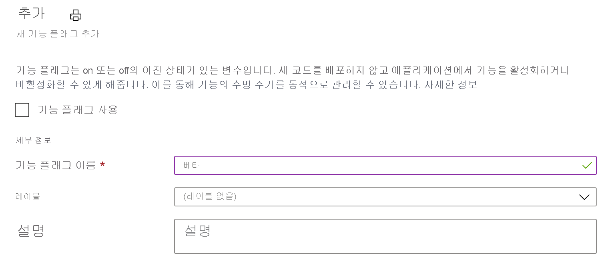
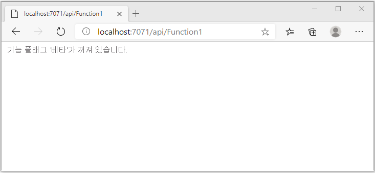
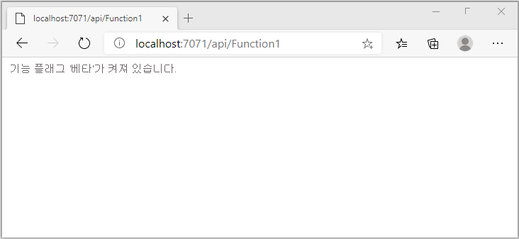

# <a name="quickstart-add-feature-flags-to-an-azure-functions-app"></a>빠른 시작: Azure Functions 앱에 기능 플래그 추가

이 빠른 시작에서는 Azure App Configuration을 사용하여 Azure Functions 앱에서 기능 관리 구현을 만듭니다. App Configuration 서비스를 사용하여 중앙에서 모든 기능 플래그를 저장하고 상태를 제어합니다. 

.NET 기능 관리 라이브러리는 기능 플래그 지원을 통해 프레임워크를 확장합니다. 이 라이브러리는 .NET 구성 시스템을 기반으로 빌드됩니다. 해당 .NET 구성 공급자를 통해 App Configuration과 통합됩니다.

## <a name="prerequisites"></a>사전 요구 사항

- Azure 구독 - [체험 구독 만들기](https://azure.microsoft.com/free/)
- **Azure 개발** 워크로드를 사용하는 [Visual Studio 2019](https://visualstudio.microsoft.com/vs)
- [Azure Functions 도구](../azure-functions/functions-develop-vs.md#check-your-tools-version)

## <a name="create-an-app-configuration-store"></a>App Configuration 저장소 만들기

[!INCLUDE [azure-app-configuration-create](../../includes/azure-app-configuration-create.md)]

7. **기능 관리자** >  **+추가**를 선택하여 `Beta`라는 기능 플래그를 추가합니다.

    > [!div class="mx-imgBorder"]
    > 

    지금은 `label` 및 `Description`을 정의하지 않은 상태로 둡니다.

8. **적용**을 선택하여 새 기능 플래그를 저장합니다.

## <a name="create-a-functions-app"></a>Functions 앱 만들기

[!INCLUDE [Create a project using the Azure Functions template](../../includes/functions-vstools-create.md)]

## <a name="connect-to-an-app-configuration-store"></a>App Configuration 저장소에 연결

1. 마우스 오른쪽 단추로 프로젝트를 클릭하고, **NuGet 패키지 관리**를 선택합니다. **찾아보기** 탭에서 다음 NuGet 패키지를 검색하여 프로젝트에 추가합니다. 가장 최근의 안정적인 빌드에 있는지 `Microsoft.Extensions.DependencyInjection`에 대해 확인합니다. 

    ```
    Microsoft.Extensions.DependencyInjection
    Microsoft.Extensions.Configuration
    Microsoft.FeatureManagement
    ```


1. *Function1.cs*를 열고 이러한 패키지의 네임스페이스를 추가합니다.

    ```csharp
    using Microsoft.Extensions.Configuration;
    using Microsoft.FeatureManagement;
    using Microsoft.Extensions.DependencyInjection;
    ```

1. 아래 `Function1` 정적 생성자를 추가하여 Azure App Configuration 공급자를 부트스트랩합니다. 다음으로, 두 개의 `static` 멤버, `ServiceProvider`라는 필드를 추가하여 `ServiceProvider`의 싱글톤 인스턴스를 만들고, `Function1` 아래의 `FeatureManager`라는 속성을 추가하여 `IFeatureManager`의 싱글톤 인스턴스를 만듭니다. 그런 다음, `AddAzureAppConfiguration()`을 호출하여 `Function1`의 App Configuration에 연결합니다. 이 프로세스는 애플리케이션 시작 시 구성을 로드합니다. 이후부터는 모든 Functions 호출에 동일한 구성 인스턴스가 사용됩니다. 

    ```csharp
        // Implements IDisposable, cached for life time of function
        private static ServiceProvider ServiceProvider; 

        static Function1()
        {
            IConfigurationRoot configuration = new ConfigurationBuilder()
                .AddAzureAppConfiguration(options =>
                {
                    options.Connect(Environment.GetEnvironmentVariable("ConnectionString"))
                           .UseFeatureFlags();
                }).Build();

            var services = new ServiceCollection();                                                                             
            services.AddSingleton<IConfiguration>(configuration).AddFeatureManagement();

            ServiceProvider = services.BuildServiceProvider(); 
        }

        private static IFeatureManager FeatureManager => ServiceProvider.GetRequiredService<IFeatureManager>();
    ```

1. `Run` 메서드를 업데이트하여 기능 플래그의 상태에 따라 표시된 메시지의 값을 변경합니다.

    ```csharp
        [FunctionName("Function1")]
        public static async Task<IActionResult> Run(
                [HttpTrigger(AuthorizationLevel.Anonymous, "get", "post", Route = null)] HttpRequest req,
                ILogger log)
            {
                string message = await FeatureManager.IsEnabledAsync("Beta")
                     ? "The Feature Flag 'Beta' is turned ON"
                     : "The Feature Flag 'Beta' is turned OFF";
                
                return (ActionResult)new OkObjectResult(message); 
            }
    ```

## <a name="test-the-function-locally"></a>로컬에서 함수 테스트

1. **ConnectionString**이라는 환경 변수를 설정합니다. 여기서 값은 **액세스 키**의 App Configuration 저장소에서 이전에 검색한 액세스 키입니다. Windows 명령 프롬프트를 사용하는 경우 다음 명령을 실행하고, 명령 프롬프트를 다시 시작하여 변경 내용을 적용합니다.

    ```cmd
        setx ConnectionString "connection-string-of-your-app-configuration-store"
    ```

    Windows PowerShell을 사용하는 경우 다음 명령을 실행합니다.

    ```azurepowershell
        $Env:ConnectionString = "connection-string-of-your-app-configuration-store"
    ```

    macOS 또는 Linux를 사용하는 경우 다음 명령을 실행합니다.

    ```bash
        export ConnectionString='connection-string-of-your-app-configuration-store'
    ```

1. F5를 눌러 함수를 테스트합니다. 메시지가 표시되면 Visual Studio에서 **Azure Functions Core(CLI)** 도구를 다운로드하여 설치하도록 요구하는 요청을 수락합니다. 또한 도구에서 HTTP 요청을 처리할 수 있도록 방화벽 예외를 사용하도록 설정해야 할 수도 있습니다.

1. Azure Functions 런타임 출력에서 함수의 URL을 복사합니다.

    

1. 브라우저의 주소 표시줄에 HTTP 요청에 대한 URL을 붙여 넣습니다. 다음 이미지는 `Beta` 기능 플래그가 비활성화되었음을 나타내는 응답을 보여줍니다. 

    

1. [Azure Portal](https://portal.azure.com)에 로그인합니다. **모든 리소스**를 선택하고 사용자가 만든 App Configuration 저장소 인스턴스를 선택합니다.

1. **기능 관리자**를 선택하고, **Beta** 키의 상태를 **On**으로 변경합니다.

1. 명령 프롬프트로 돌아가서 `Ctrl-C`를 눌러 실행 중인 프로세스를 취소합니다.  F5를 눌러 애플리케이션을 다시 시작합니다. 

1. 3단계와 동일한 프로세스를 사용하여 Azure Functions 런타임 출력에서 함수의 URL을 복사합니다. 브라우저의 주소 표시줄에 HTTP 요청에 대한 URL을 붙여 넣습니다. 브라우저 응답은 아래 이미지에 표시된 것처럼 기능 플래그 `Beta`가 켜져 있음을 나타내도록 변경해야 합니다.
 
    

## <a name="clean-up-resources"></a>리소스 정리

[!INCLUDE [azure-app-configuration-cleanup](../../includes/azure-app-configuration-cleanup.md)]

## <a name="next-steps"></a>다음 단계

이 빠른 시작에서는 기능 플래그를 만들고, [App Configuration 공급자](https://go.microsoft.com/fwlink/?linkid=2074664)를 통해 Azure Functions 앱에서 사용했습니다.

- [기능 관리](./concept-feature-management.md)에 대한 자세한 정보
- [기능 플래그 관리](./manage-feature-flags.md)
- [Azure Functions 앱에서 동적 구성 사용](./enable-dynamic-configuration-azure-functions-csharp.md)
