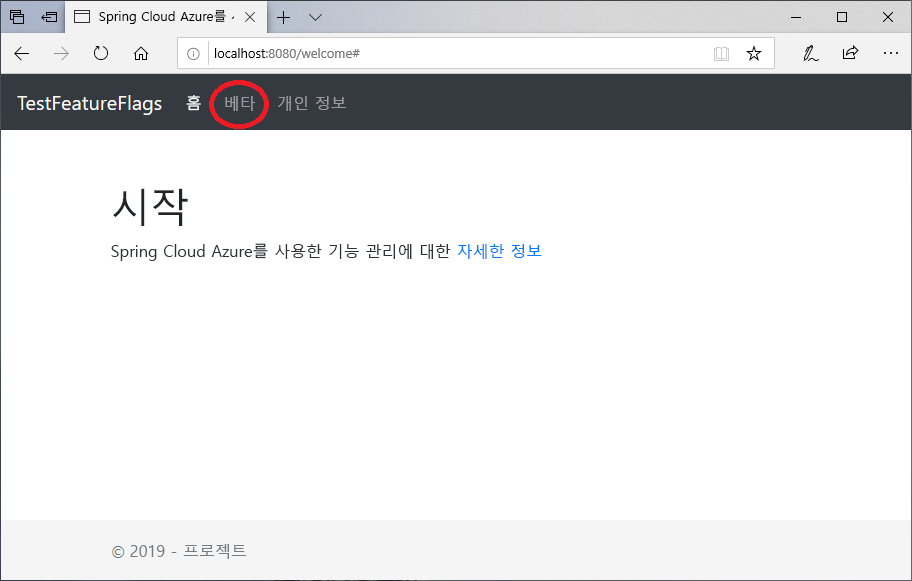

# <a name="quickstart-add-feature-flags-to-a-spring-boot-app"></a>빠른 시작: Spring Boot 앱에 기능 플래그 추가

이 빠른 시작에서는 Azure App Configuration을 Spring Boot 웹앱에 통합하여 엔드투엔드 기능 관리를 구현하는 방법을 보여줍니다. App Configuration 서비스를 사용하여 중앙에서 모든 기능 플래그를 저장하고 상태를 제어할 수 있습니다.

Spring Boot 기능 관리 라이브러리는 포괄적인 기능 플래그 지원을 통해 프레임워크를 확장합니다. 이러한 라이브러리에는 Azure 라이브러리에 대한 종속성이 **없습니다**. 또한 해당 Spring Boot 구성 공급자를 통해 App Configuration과 원활하게 통합됩니다.

## <a name="prerequisites"></a>사전 요구 사항

* Azure 구독 - [체험 구독 만들기](https://azure.microsoft.com/free/)
* 버전 8이 설치된 지원되는 [Java Development Kit SDK](https://docs.microsoft.com/java/azure/jdk)
* [Apache Maven](https://maven.apache.org/download.cgi) 버전 3.0 이상

## <a name="create-an-app-configuration-instance"></a>App Configuration 인스턴스 만들기

[!INCLUDE [azure-app-configuration-create](../../includes/azure-app-configuration-create.md)]

6. **기능 관리자** >  **+추가**를 선택하여 `Beta`라는 기능 플래그를 추가합니다.

    > [!div class="mx-imgBorder"]
    > 

    지금은 `label`을 정의하지 않은 상태로 둡니다.

## <a name="create-a-spring-boot-app"></a>Spring Boot 앱 만들기

[Spring Initializr](https://start.spring.io/)를 사용하여 새 Spring Boot 프로젝트를 만듭니다.

1. [https://www.microsoft.com]\(<https://start.spring.io/>) 로 이동합니다.

1. 다음 옵션을 지정합니다.

   * **Java**를 사용하는 **Maven** 프로젝트를 생성합니다.
   * **Spring Boot** 버전 2.0 이상을 지정합니다.
   * 애플리케이션에 대한 **그룹** 및 **아티팩트** 이름을 지정합니다.  이 문서에서는 `com.example` 및 `demo`를 사용합니다.
   * **Spring Web** 종속성을 추가합니다.

1. 이전 옵션을 지정한 후 **프로젝트 생성**을 선택합니다. 메시지가 표시되면 프로젝트를 로컬 컴퓨터로 다운로드합니다.

## <a name="add-feature-management"></a>기능 관리 추가

1. 로컬 시스템에서 파일의 압축을 풀면 Spring Boot 애플리케이션을 편집할 수 있습니다. 앱의 루트 디렉터리에서 *pom.xml*을 찾습니다.

1. 텍스트 편집기에서 *pom.xml* 파일을 열고 `<dependencies>` 목록에 다음을 추가합니다.

    **Spring Cloud 1.1.x**

    ```xml
    <dependency>
        <groupId>com.microsoft.azure</groupId>
        <artifactId>spring-cloud-azure-appconfiguration-config</artifactId>
        <version>1.1.2</version>
    </dependency>
    <dependency>
        <groupId>com.microsoft.azure</groupId>
        <artifactId>spring-cloud-azure-feature-management-web</artifactId>
        <version>1.1.2</version>
    </dependency>
    <dependency>
        <groupId>org.springframework.boot</groupId>
        <artifactId>spring-boot-starter-thymeleaf</artifactId>
    </dependency>
    ```

    **Spring Cloud 1.2.x**

    ```xml
    <dependency>
        <groupId>com.microsoft.azure</groupId>
        <artifactId>spring-cloud-azure-appconfiguration-config</artifactId>
        <version>1.2.2</version>
    </dependency>
    <dependency>
        <groupId>com.microsoft.azure</groupId>
        <artifactId>spring-cloud-azure-feature-management-web</artifactId>
        <version>1.2.2</version>
    </dependency>
    <dependency>
        <groupId>org.springframework.boot</groupId>
        <artifactId>spring-boot-starter-thymeleaf</artifactId>
    </dependency>
    ```

> [!Note]
> 스프링 웹에 종속되지 않는 비웹 기능 관리 라이브러리가 있습니다. 차이점은 GitHub의 [설명서](https://github.com/microsoft/spring-cloud-azure/tree/master/spring-cloud-azure-feature-management)를 참조하세요.

## <a name="connect-to-an-app-configuration-store"></a>App Configuration 저장소에 연결

1. 앱의 `resources` 디렉터리로 이동하여 `bootstrap.properties`를 엽니다.  파일이 없으면 새로 만듭니다. 파일에 다음 줄을 추가합니다.

    ```properties
    spring.cloud.azure.appconfiguration.stores[0].connection-string= ${APP_CONFIGURATION_CONNECTION_STRING}
    ```

1. 구성 저장소에 대한 App Configuration 포털의 사이드바에서 `Access keys`를 선택합니다. 읽기 전용 키 탭을 선택합니다. 기본 연결 문자열의 값을 복사합니다.

1. 변수 이름 `APP_CONFIGURATION_CONNECTION_STRING`을 사용하여 기본 연결 문자열을 환경 변수로 추가합니다.

1. 기본 애플리케이션 Java 파일을 열고 `@EnableConfigurationProperties`를 추가하여 이 기능을 활성화합니다.

    ```java
    package com.example.demo;

    import org.springframework.boot.SpringApplication;
    import org.springframework.boot.context.properties.ConfigurationProperties;
    import org.springframework.boot.context.properties.EnableConfigurationProperties;
    import org.springframework.boot.autoconfigure.SpringBootApplication;

    @SpringBootApplication
    @EnableConfigurationProperties(MessageProperties.class)
    public class DemoApplication {

        public static void main(String[] args) {
            SpringApplication.run(DemoApplication.class, args);
        }
    }
    ```

1. 앱의 패키지 디렉터리에 *MessageProperties.java*라는 새 Java 파일을 만듭니다.

    ```java
    package com.example.demo;

    import org.springframework.boot.context.properties.ConfigurationProperties;
    import org.springframework.context.annotation.Configuration;

    @Configuration
    @ConfigurationProperties(prefix = "config")
    public class MessageProperties {
        private String message;

        public String getMessage() {
            return message;
        }

        public void setMessage(String message) {
            this.message = message;
        }
    }
    ```

1. 앱의 패키지 디렉터리에 *HelloController.java*라는 새 Java 파일을 만듭니다.

    ```java
    package com.example.demo;

    import org.springframework.boot.context.properties.ConfigurationProperties;
    import org.springframework.stereotype.Controller;
    import org.springframework.ui.Model;

    import com.microsoft.azure.spring.cloud.feature.manager.FeatureManager;
    import org.springframework.web.bind.annotation.GetMapping;


    @Controller
    @ConfigurationProperties("controller")
    public class HelloController {

        private FeatureManager featureManager;

        public HelloController(FeatureManager featureManager) {
            this.featureManager = featureManager;
        }

        @GetMapping("/welcome")
        public String mainWithParam(Model model) {
            model.addAttribute("Beta", featureManager.isEnabledAsync("Beta").block());
            return "welcome";
        }
    }
    ```

1. 앱의 템플릿 디렉터리에 *welcome.html*이라는 새 HTML 파일을 만듭니다.

    ```html
    <!DOCTYPE html>
    <html lang="en" xmlns:th="http://www.thymeleaf.org">
    <head>
        <meta charset="utf-8">
        <meta name="viewport" content="width=device-width, initial-scale=1, shrink-to-fit=no">
        <title>Feature Management with Spring Cloud Azure</title>

        <link rel="stylesheet" href="/css/main.css">
        <link rel="stylesheet" href="https://stackpath.bootstrapcdn.com/bootstrap/4.3.1/css/bootstrap.min.css" integrity="sha384-ggOyR0iXCbMQv3Xipma34MD+dH/1fQ784/j6cY/iJTQUOhcWr7x9JvoRxT2MZw1T" crossorigin="anonymous">

        <script src="https://code.jquery.com/jquery-3.3.1.slim.min.js" integrity="sha384-q8i/X+965DzO0rT7abK41JStQIAqVgRVzpbzo5smXKp4YfRvH+8abtTE1Pi6jizo" crossorigin="anonymous"></script>
        <script src="https://cdnjs.cloudflare.com/ajax/libs/popper.js/1.14.7/umd/popper.min.js" integrity="sha384-UO2eT0CpHqdSJQ6hJty5KVphtPhzWj9WO1clHTMGa3JDZwrnQq4sF86dIHNDz0W1" crossorigin="anonymous"></script>
        <script src="https://stackpath.bootstrapcdn.com/bootstrap/4.3.1/js/bootstrap.min.js" integrity="sha384-JjSmVgyd0p3pXB1rRibZUAYoIIy6OrQ6VrjIEaFf/nJGzIxFDsf4x0xIM+B07jRM" crossorigin="anonymous"></script>

    </head>
    <body>
        <header>
        <!-- Fixed navbar -->
        <nav class="navbar navbar-expand-md navbar-dark fixed-top bg-dark">
            <a class="navbar-brand" href="#">TestFeatureFlags</a>
            <button class="navbar-toggler" aria-expanded="false" aria-controls="navbarCollapse" aria-label="Toggle navigation" type="button" data-target="#navbarCollapse" data-toggle="collapse">
            <span class="navbar-toggler-icon"></span>
            </button>
            <div class="collapse navbar-collapse" id="navbarCollapse">
            <ul class="navbar-nav mr-auto">
                <li class="nav-item active">
                <a class="nav-link" href="#">Home <span class="sr-only">(current)</span></a>
                </li>
                <li class="nav-item" th:if="${Beta}">
                <a class="nav-link" href="#">Beta</a>
                </li>
                <li class="nav-item">
                <a class="nav-link" href="#">Privacy</a>
                </li>
            </ul>
            </div>
        </nav>
        </header>
        <div class="container body-content">
            <h1 class="mt-5">Welcome</h1>
            <p>Learn more about <a href="https://github.com/microsoft/spring-cloud-azure/blob/master/spring-cloud-azure-feature-management/README.md">Feature Management with Spring Cloud Azure</a></p>

        </div>
        <footer class="footer">
            <div class="container">
            <span class="text-muted">&copy; 2019 - Projects</span>
        </div>

        </footer>
    </body>
    </html>

    ```

1. `static` 아래에 CSS라는 새 폴더를 만들고 그 안에 *main.css*라는 새 CSS 파일을 만듭니다.

    ```css
    html {
     position: relative;
     min-height: 100%;
    }
    body {
     margin-bottom: 60px;
    }
    .footer {
     position: absolute;
     bottom: 0;
     width: 100%;
     height: 60px;
     line-height: 60px;
     background-color: #f5f5f5;
    }

    body > .container {
     padding: 60px 15px 0;
    }

    .footer > .container {
     padding-right: 15px;
     padding-left: 15px;
    }

    code {
     font-size: 80%;
    }
    ```

## <a name="build-and-run-the-app-locally"></a>로컬로 앱 빌드 및 실행

1. Maven을 사용하여 Spring Boot 애플리케이션을 빌드하고 실행합니다.

    ```shell
    mvn clean package
    mvn spring-boot:run
    ```

1. 새 브라우저 창을 열고 URL(`http://localhost:8080/welcome`)로 이동합니다.

    

1. App Configuration 포털에서 **기능 관리자**를 선택하고, **Beta** 키의 상태를 다음과 같이 **On**으로 변경합니다.

    | 키 | 시스템 상태 |
    |---|---|
    | 베타 | 설정 |

1. 새 구성 설정을 확인하려면 브라우저 페이지를 새로 고칩니다.

    

## <a name="clean-up-resources"></a>리소스 정리

[!INCLUDE [azure-app-configuration-cleanup](../../includes/azure-app-configuration-cleanup.md)]

## <a name="next-steps"></a>다음 단계

이 빠른 시작에서는 새 App Configuration 저장소를 만든 후 [기능 관리 라이브러리](https://go.microsoft.com/fwlink/?linkid=2074664)를 통해 Spring Boot 웹앱에서 기능을 관리하는 데 사용했습니다.

* [기능 관리](./concept-feature-management.md)에 대한 자세한 정보
* [기능 플래그 관리](./manage-feature-flags.md)
* [Spring Boot Core 앱에서 기능 플래그 사용](./use-feature-flags-spring-boot.md)
