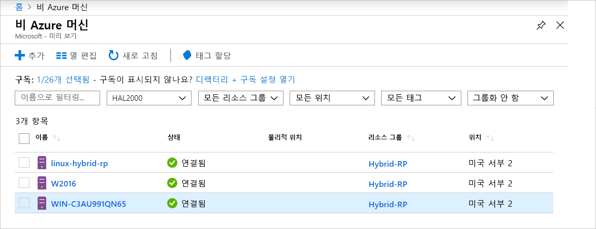

# <a name="what-is-azure-arc-for-servers"></a>서버용 Azure Arc란

서버용 Azure Arc를 사용하면 Azure 외부에 있는 머신을 관리할 수 있습니다.
비 Azure 머신이 Azure에 연결되면 **연결된 머신**이 되어 Azure에서 리소스로 취급됩니다. **연결된 머신**마다 리소스 ID가 있고 구독 내에서 리소스 그룹의 일부로 관리되며 Azure Policy 및 태그 지정과 같은 표준 Azure 구성의 이점을 활용할 수 있습니다.

각 머신에 에이전트 패키지를 설치해야 Azure에 연결할 수 있습니다. 이 문서의 나머지 부분에서 이 프로세스에 대해 자세히 설명합니다.

머신은 에이전트가 체크인한 시간이 얼마나 가까운지에 따라 **연결됨** 또는 **연결 끊김** 상태가 됩니다. 각 체크인은 하트비트라고 합니다. 머신이 지난 5분 이내에 체크인되지 않은 경우, 연결이 복원될 때까지 오프라인으로 표시됩니다.  <!-- For more information on troubleshooting agent connectivity, see [Troubleshooting Azure Arc for servers](troubleshoot/arc-for-servers.md). -->



## <a name="clients"></a>클라이언트

### <a name="supported-operating-systems"></a>지원되는 운영 체제

공개 미리 보기에서는 다음이 지원됩니다.

- Windows Server 2012 R2 이상
- Ubuntu 16.04 및 18.04

공개 미리 보기 릴리스는 평가 목적으로 설계되었으며 중요한 프로덕션 리소스를 관리하는 데 사용해서는 안됩니다.

## <a name="azure-subscription-and-service-limits"></a>Azure 구독 및 서비스 제한

Azure Resource Manager 제한을 읽고 [구독](../../azure-subscription-service-limits.md#subscription-limits---azure-resource-manager) 및 [리소스 그룹](../../azure-subscription-service-limits.md#resource-group-limits)에 대해 나열된 지침에 따라 연결할 머신의 수를 계획하십시오. 특히, 기본적으로 리소스 그룹당 서버 수는 800개로 제한됩니다.

## <a name="networking-configuration"></a>네트워킹 구성

에이전트는 설치 및 런타임 중에 **Azure Arc 서비스 엔드포인트**에 연결되어야 합니다. 방화벽에 의해 아웃바운드 연결이 차단되는 경우 다음 URL은 기본적으로 차단되지 않아야 합니다. 모든 연결은 에이전트에서 Azure로 아웃바운드이며, **SSL**을 통해 보안이 유지됩니다. 모든 트래픽은 **HTTPS** 프록시를 통해 라우팅할 수 있습니다. 서버가 연결할 수 있는 IP 범위 또는 도메인 이름을 허용하는 경우, 다음 서비스 태그 및 DNS 이름에 포트 443 액세스를 허용해야 합니다.

서비스 태그:

* AzureActiveDirectory
* AzureTrafficManager

각 서비스 태그/지역의 IP 주소 목록은 JSON 파일 - [Azure IP 범위 및 서비스 태그 – 퍼블릭 클라우드](https://www.microsoft.com/download/details.aspx?id=56519)를 참조하세요. Microsoft는 각 Azure 서비스 및 여기에 사용되는 IP 범위를 포함하는 주간 업데이트를 게시합니다. 자세한 내용은 [서비스 태그](https://docs.microsoft.com/azure/virtual-network/security-overview#service-tags)를 참조하세요.

대부분의 서비스에는 현재 서비스 태그 등록이 없고 IP가 변경될 수 있기 때문에 이러한 DNS 이름이 서비스 태그 IP 범위 정보 외에 제공됩니다. 방화벽 구성에 IP 범위가 필요한 경우 모든 Azure 서비스에 대한 액세스를 허용하기 위해 **AzureCloud** 서비스 태그를 사용해야 합니다. 이러한 URL의 보안 모니터링 또는 검사를 사용 안 함으로 설정하지 말고 다른 인터넷 트래픽처럼 허용합니다.

| 도메인 환경 | 필수 Azure 서비스 엔드포인트 |
|---------|---------|
|management.azure.com|Azure 리소스 관리자|
|login.windows.net|Azure Active Directory|
|dc.services.visualstudio.com|Application Insights|
|agentserviceapi.azure-automation.net|게스트 구성|
|*-agentservice-prod-1.azure-automation.net|게스트 구성|
|*.his.hybridcompute.azure-automation.net|하이브리드 ID 서비스|

### <a name="installation-network-requirements"></a>설치 네트워크 요구 사항

공식 배포 서버에서 [Azure 연결된 머신 에이전트 패키지](https://aka.ms/AzureConnectedMachineAgent)를 다운로드합니다. 아래 사이트는 사용자 환경에서 액세스할 수 있습니다. 패키지를 파일 공유에 다운로드하고 그 곳에서 에이전트를 설치하도록 선택할 수 있습니다. 이 경우 Azure Portal에서 생성된 온보딩 스크립트를 수정해야 할 수도 있습니다.

Windows:

* `aka.ms`
* `download.microsoft.com`

Linux:

* `aka.ms`
* `packages.microsoft.com`

프록시를 사용하도록 에이전트를 구성하는 방법에 대한 자세한 내용은 [프록시 서버 구성](quickstart-onboard-powershell.md#proxy-server-configuration) 섹션을 참조하세요.

## <a name="register-the-required-resource-providers"></a>필요한 리소스 공급자 등록

서버용 Azure Arc를 사용하려면 필요한 리소스 공급자를 등록해야 합니다.

* **Microsoft.HybridCompute**
* **Microsoft.GuestConfiguration**

다음 명령을 사용하여 리소스 공급자를 등록할 수 있습니다.

Azure PowerShell:

```azurepowershell-interactive
Login-AzAccount
Set-AzContext -SubscriptionId [subscription you want to onboard]
Register-AzResourceProvider -ProviderNamespace Microsoft.HybridCompute
Register-AzResourceProvider -ProviderNamespace Microsoft.GuestConfiguration
```

Azure CLI:

```azurecli-interactive
az account set --subscription "{Your Subscription Name}"
az provider register --namespace 'Microsoft.HybridCompute'
az provider register --namespace 'Microsoft.GuestConfiguration'
```

[Azure Portal](../../azure-resource-manager/resource-manager-supported-services.md#azure-portal)의 단계에 따라 포털을 사용하여 리소스 공급자를 등록할 수도 있습니다.

## <a name="machine-changes-after-installing-the-agent"></a>에이전트 설치 후 머신 변경

변경 내용 추적 솔루션이 환경에 배포되어 있는 경우 아래 목록을 사용하여 **AzCMAgent(Azure Connected Machine Agent)** 설치 패키지에서 변경한 내용을 추적, 식별 및 허용할 수 있습니다.

에이전트가 설치되면 다음과 같은 서버에 대한 변경 내용이 표시됩니다.

### <a name="windows"></a>Windows

설치된 서비스:

* `Himds` - **Azure Connected Machine Agent** 서비스입니다.
* `Dscservice` 또는 `gcd` - **게스트 구성** 서비스입니다.

서버에 추가된 파일:

* `%ProgramFiles%\AzureConnectedMachineAgent\*.*` - **Azure Connected Machine Agent** 파일의 위치입니다.
* `%ProgramData%\GuestConfig\*.*` - **게스트 구성** 로그입니다.

레지스트리 키 위치:

* `HKEY_LOCAL_MACHINE\SOFTWARE\Microsoft\Azure Connected Machine Agent` - **Azure Connected Machine Agent**에 대한 레지스트리 키입니다.

### <a name="linux"></a>Linux

설치된 서비스:

* `Himdsd` - **Azure Connected Machine Agent** 서비스입니다.
* `dscd` 또는 `gcd` - **게스트 구성** 서비스입니다.

서버에 추가된 파일:

* `/var/opt/azcmagent/**` - **Azure Connected Machine Agent** 파일의 위치입니다.
* `/var/lib/GuestConfig/**` - **게스트 구성** 로그입니다.

## <a name="supported-scenarios"></a>지원되는 시나리오

노드를 등록한 후에는 다른 Azure 서비스를 사용하여 노드 관리를 시작할 수 있습니다.

공개 미리 보기에서는 **연결된 머신**에 대해 다음 시나리오가 지원됩니다.

## <a name="guest-configuration"></a>게스트 구성

머신을 Azure에 연결하면, Azure Virtual Machines에 대한 정책 할당과 동일한 환경을 사용하여 Azure 정책을 **연결된 머신**에 할당할 수 있습니다.

자세한 내용은 [Azure Policy 게스트 구성 이해](../../governance/policy/concepts/guest-configuration.md)를 참조하세요.

**연결된 머신**에 대한 게스트 구성 에이전트 로그는 다음 위치에 있습니다.

* Windows - `%ProgramFiles%\AzureConnectedMachineAgent\logs\dsc.log`
* Linux: - `/opt/logs/dsc.log`

## <a name="log-analytics"></a>Log Analytics

이제 [MMA(Microsoft Monitoring Agent)](https://docs.microsoft.com/azure/azure-monitor/log-query/log-query-overview) 에 의해 수집되고 Log Analytics 작업 영역에 저장되는 로그 데이터에, 리소스 중심 로그 액세스에 사용할 수 있는 머신 관련 속성(예: **ResourceId**)이 포함됩니다.

- MMA 에이전트가 이미 설치되어 있는 머신에서는 업데이트된 관리 팩을 통해 **Azure Arc** 기능을 사용할 수 있습니다.
- 서버 통합을 위해 Azure Arc에 [MMA 에이전트 버전 10.20.18011 이상](https://docs.microsoft.com/azure/virtual-machines/extensions/oms-windows#agent-and-vm-extension-version)이 필요합니다.
- [Azure Monitor](https://docs.microsoft.com/azure/azure-monitor/log-query/log-query-overview)에서 로그 데이터를 쿼리하면 반환된 데이터 스키마에 Hybrid **ResourceId**가 `/subscriptions/<SubscriptionId/resourceGroups/<ResourceGroup>/providers/Microsoft.HybridCompute/machines/<MachineName>` 형식으로 포함됩니다.

자세한 내용은 [Azure Monitor에서 Log Analytics 시작](https://docs.microsoft.com/azure/azure-monitor/log-query/get-started-portal)을 참조하세요.

<!-- MMA agent version 10.20.18011 and later -->

## <a name="next-steps"></a>다음 단계

서버용 Azure Arc를 사용하여 머신을 연결하는 방법은 두 가지입니다.

* **대화형** - [포털 빠른 시작](quickstart-onboard-portal.md)에 따라 포털에서 스크립트를 생성하여 머신에서 실행합니다. 한 번에 한 대의 머신을 연결하는 경우 이 방법이 가장 좋습니다.
* **대규모** - [PowerShell 빠른 시작](quickstart-onboard-powershell.md)에 따라 비 대화형으로 머신을 연결하기 위해 서비스 사용자를 만듭니다.
