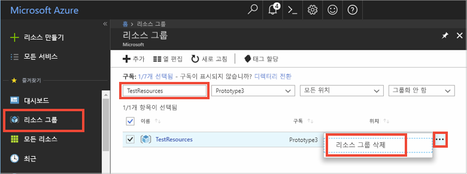

# <a name="quickstart-use-azure-cache-for-redis-in-java"></a>빠른 시작: Java에서 Azure Cache for Redis 사용

이 빠른 시작에서는 Azure 내 모든 애플리케이션에서 액세스할 수 있는 안전한 전용 캐시에 액세스할 수 있도록 [Jedis](https://github.com/xetorthio/jedis) Redis 클라이언트를 사용하여 Azure Cache for Redis를 Java 앱에 통합합니다.

## <a name="skip-to-the-code-on-github"></a>GitHub의 코드로 건너뛰기

코드로 바로 건너뛰려면 GitHub의 [Java 빠른 시작](https://github.com/Azure-Samples/azure-cache-redis-samples/tree/main/quickstart/java)을 참조하세요.

## <a name="prerequisites"></a>필수 구성 요소

- Azure 구독 - [체험 구독 만들기](https://azure.microsoft.com/free/)
- [Apache Maven](https://maven.apache.org/download.cgi)

## <a name="create-an-azure-cache-for-redis"></a>Azure Cache for Redis 만들기

[!INCLUDE [redis-cache-create](../../includes/redis-cache-create.md)]

[!INCLUDE [redis-cache-access-keys](../../includes/redis-cache-access-keys.md)]

## <a name="setting-up-the-working-environment"></a>작업 환경 설정 

운영 체제에 따라 **호스트 이름** 및 **기본 액세스 키** 의 환경 변수를 추가합니다. 명령 프롬프트 또는 터미널 창을 열고 다음 값을 설정합니다.

```CMD 
set REDISCACHEHOSTNAME=<YOUR_HOST_NAME>.redis.cache.windows.net
set REDISCACHEKEY=<YOUR_PRIMARY_ACCESS_KEY>
```

```bash
export REDISCACHEHOSTNAME=<YOUR_HOST_NAME>.redis.cache.windows.net
export REDISCACHEKEY=<YOUR_PRIMARY_ACCESS_KEY>
```

자리 표시자를 다음 값으로 바꿉니다.

- `<YOUR_HOST_NAME>`: Azure Portal에 있는 Azure Cache for Redis 리소스의 *속성* 섹션에서 가져온 DNS 호스트 이름입니다.
- `<YOUR_PRIMARY_ACCESS_KEY>`: Azure Portal에 있는 Azure Cache for Redis 리소스의 *액세스 키* 섹션에서 가져온 기본 액세스 키입니다.

## <a name="create-a-new-java-app"></a>새 Java 앱 만들기

Maven을 사용하여 새 빠른 시작 앱을 생성합니다.

```CMD
mvn archetype:generate -DarchetypeGroupId=org.apache.maven.archetypes -DarchetypeArtifactId=maven-archetype-quickstart -DarchetypeVersion=1.3 -DgroupId=example.demo -DartifactId=redistest -Dversion=1.0
```

새 *redistest* 프로젝트 디렉터리로 변경합니다.

*pom.xml* 파일을 열고 [Jedis](https://github.com/xetorthio/jedis)에 대한 종속성을 추가합니다.

```xml
    <dependency>
        <groupId>redis.clients</groupId>
        <artifactId>jedis</artifactId>
        <version>3.2.0</version>
        <type>jar</type>
        <scope>compile</scope>
    </dependency>
```

*pom.xml* 파일을 저장합니다.

*App.java* 를 열고 코드를 다음 코드로 바꿉니다.

```java
package example.demo;

import redis.clients.jedis.Jedis;
import redis.clients.jedis.JedisShardInfo;

/**
 * Redis test
 *
 */
public class App 
{
    public static void main( String[] args )
    {

        boolean useSsl = true;
        String cacheHostname = System.getenv("REDISCACHEHOSTNAME");
        String cachekey = System.getenv("REDISCACHEKEY");

        // Connect to the Azure Cache for Redis over the TLS/SSL port using the key.
        JedisShardInfo shardInfo = new JedisShardInfo(cacheHostname, 6380, useSsl);
        shardInfo.setPassword(cachekey); /* Use your access key. */
        Jedis jedis = new Jedis(shardInfo);      

        // Perform cache operations using the cache connection object...

        // Simple PING command        
        System.out.println( "\nCache Command  : Ping" );
        System.out.println( "Cache Response : " + jedis.ping());

        // Simple get and put of integral data types into the cache
        System.out.println( "\nCache Command  : GET Message" );
        System.out.println( "Cache Response : " + jedis.get("Message"));

        System.out.println( "\nCache Command  : SET Message" );
        System.out.println( "Cache Response : " + jedis.set("Message", "Hello! The cache is working from Java!"));

        // Demonstrate "SET Message" executed as expected...
        System.out.println( "\nCache Command  : GET Message" );
        System.out.println( "Cache Response : " + jedis.get("Message"));

        // Get the client list, useful to see if connection list is growing...
        System.out.println( "\nCache Command  : CLIENT LIST" );
        System.out.println( "Cache Response : " + jedis.clientList());

        jedis.close();
    }
}
```

이 코드는 캐시 호스트 이름 및 키 환경 변수를 사용하여 Azure Cache for Redis 인스턴스에 연결하는 방법을 보여 줍니다. 코드는 또한 캐시에 문자열 값을 저장하고 검색합니다. 또한 `PING` 및 `CLIENT LIST` 명령을 실행했습니다. 

*App.java* 를 저장합니다.

## <a name="build-and-run-the-app"></a>앱 빌드 및 실행

다음 Maven 명령을 실행하여 앱을 빌드 및 실행합니다.

```CMD
mvn compile
mvn exec:java -D exec.mainClass=example.demo.App
```

아래 예제에서는 이전에 Azure Portal에서 Redis 콘솔을 사용하여 설정된 캐시된 값이 있는 `Message` 키를 볼 수 있습니다. 앱에서 캐시된 값을 업데이트했습니다. 또한 앱에서 `PING` 및 `CLIENT LIST` 명령을 실행했습니다.


## <a name="clean-up-resources"></a>리소스 정리

다음 자습서를 계속 진행하려는 경우 이 빠른 시작에서 만든 리소스를 그대로 두었다가 다시 사용할 수 있습니다.

그렇지 않고, 빠른 시작 샘플 애플리케이션 사용이 끝나면 이 빠른 시작에서 만든 Azure 리소스를 삭제하여 요금이 청구되는 것을 방지할 수 있습니다. 

> [!IMPORTANT]
> 리소스 그룹 삭제는 취소할 수 없으며 해당 리소스 그룹 및 해당 그룹 안에 있는 모든 리소스는 영구적으로 삭제됩니다. 잘못된 리소스 그룹 또는 리소스를 자동으로 삭제하지 않도록 해야 합니다. 유지하려는 리소스가 포함된 기존 리소스 그룹 내에 이 샘플을 호스트하기 위한 리소스를 만든 경우 리소스 그룹을 삭제하는 대신, 해당 블레이드에서 각 리소스를 개별적으로 삭제할 수 있습니다.
>

1. [Azure Portal](https://portal.azure.com)에 로그인하고 **리소스 그룹** 을 선택합니다.

1. **이름을 기준으로 필터링** 텍스트 상자에 리소스 그룹의 이름을 입력합니다. 이 문서의 지침에서는 *TestResources* 라는 리소스 그룹을 사용했습니다. 결과 목록의 리소스 그룹에서 **...** 를 선택한 다음, **리소스 그룹 삭제** 를 선택합니다.

   

1. 리소스 그룹을 삭제할지 확인하는 메시지가 표시됩니다. 확인할 리소스 그룹의 이름을 입력하고 **삭제** 를 선택합니다.

잠시 후, 리소스 그룹 및 해당 그룹에 포함된 모든 리소스가 삭제됩니다.

## <a name="next-steps"></a>다음 단계

이 빠른 시작에서는 Java 애플리케이션에서 Azure Cache for Redis를 사용하는 방법을 알아보았습니다. ASP.NET 웹앱에서 Azure Cache for Redis를 사용하려면 다음 빠른 시작으로 계속 진행하세요.

> [!div class="nextstepaction"]
> [Azure Cache for Redis를 사용하는 ASP.NET 웹앱 만들기](./cache-web-app-howto.md)
