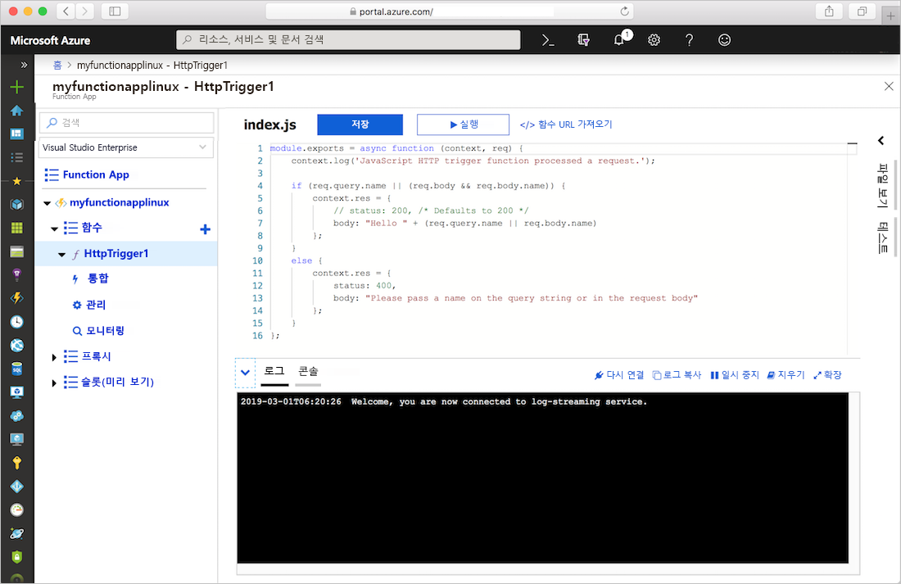
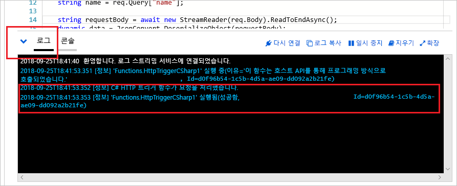

# Azure App Service 계획에서 Linux로 실행되는 함수 앱 만들기

Azure Functions를 사용하면 Linux에서 기본 Azure App Service 컨테이너에 함수를 호스트할 수 있습니다. 이 문서에서는 [Azure Portal](https://portal.azure.com)을 사용하여 [App Service 계획](functions-scale.md#app-service-plan)에서 실행되는 Linux 호스티드 함수 앱을 만드는 방법을 보여 줍니다. [고유한 사용자 지정 컨테이너를 가져올 수도](functions-create-function-linux-custom-image.md) 있습니다.

[!INCLUDE [quickstarts-free-trial-note](../../includes/quickstarts-free-trial-note.md)]

## Azure에 로그인

Azure 계정을 사용하여 <https://portal.azure.com>에서 Azure Portal에 로그인합니다.

## 함수 앱 만들기

Linux에서 함수 실행을 호스트하는 함수 앱이 있어야 합니다. 함수 앱은 함수 코드 실행을 위한 환경을 제공합니다. 이를 통해 함수를 논리 단위로 그룹화하여 더욱 쉽게 리소스를 관리, 배포, 크기 조정 및 공유할 수 있습니다. 이 문서에서는 함수 앱을 만들 때 App Service 계획을 만듭니다.

1. Azure Portal 메뉴 또는 **홈** 페이지에서 **리소스 만들기** 를 선택합니다.

1. **새로 만들기** 페이지에서 **컴퓨팅** > **함수 앱** 을 선택합니다.

    :::image type="content" source="./media/create-function-app-linux-app-service-plan/function-app-create-flow.png" alt-text="Azure Portal에서 함수 앱 만들기":::

1. **기본 사항** 페이지에서 함수 앱 설정을 다음 표에서 지정한 대로 사용합니다.

    | 설정      | 제안 값  | Description |
    | ------------ | ---------------- | ----------- |
    | **구독** | 사용자의 구독 | 이 새 함수 앱이 만들어질 구독입니다. |
    | **[리소스 그룹](../azure-resource-manager/management/overview.md)** |  *myResourceGroup* | 함수 앱을 만들 새 리소스 그룹의 이름입니다. |
    | **함수 앱 이름** | 전역적으로 고유한 이름 | 새 함수 앱을 식별하는 이름입니다. 유효한 문자는 `a-z`(대/소문자 구분 안 함), `0-9`및 `-`입니다.  |
    |**게시**| **코드**(기본값) | 코드 파일 또는 Docker 컨테이너를 게시하는 옵션입니다. |
    | **런타임 스택** | 기본 설정 언어 | 즐겨찾는 함수 프로그래밍 언어를 지원하는 런타임을 선택합니다. C# 및 F# 함수의 경우 **.NET Core** 를 선택합니다. |
    |**버전**| 버전 번호 | 설치된 런타임의 버전을 선택합니다.  |
    |**지역**| 기본 지역 | 사용자 근처 또는 함수가 액세스할 기타 서비스에 가까운 [지역](https://azure.microsoft.com/regions/)을 선택합니다. |

    :::image type="content" source="./media/create-function-app-linux-app-service-plan/function-app-create-basics-linux.png" alt-text="기본 페이지":::

1. **다음: 호스팅** 을 선택합니다. **호스팅** 페이지에서 다음 설정을 입력합니다.

    | 설정      | 제안 값  | Description |
    | ------------ | ---------------- | ----------- |
    | **[Storage 계정](../storage/common/storage-account-create.md)** |  전역적으로 고유한 이름 |  함수 앱에서 사용하는 스토리지 계정을 만듭니다. 스토리지 계정 이름은 3자에서 24자 사이여야 하고 숫자와 소문자만 포함할 수 있습니다. 기존 계정을 사용할 수도 있습니다. 여기서는 [스토리지 계정 요구 사항](../azure-functions/functions-scale.md#storage-account-requirements)을 충족해야 합니다. |
    |**운영 체제**| **Linux** | 운영 체제는 런타임 스택 선택에 따라 미리 선택되지만 필요한 경우 설정을 변경할 수 있습니다. |
    | **[계획](../azure-functions/functions-scale.md)** | **소모량(서버리스)** | 함수 앱에 리소스가 할당되는 방법을 정의하는 호스팅 계획입니다. 기본 **소비** 계획에서 함수의 필요에 따라 리소스가 동적으로 추가됩니다. 이 [서버리스](https://azure.microsoft.com/overview/serverless-computing/) 호스팅에서는 함수가 실행되는 시간 만큼만 요금을 지불하면 됩니다. App Service 계획에서 실행하는 경우 [함수 앱의 크기 조정](../azure-functions/functions-scale.md)을 관리해야 합니다.  |

    :::image type="content" source="./media/create-function-app-linux-app-service-plan/function-app-create-hosting-linux.png" alt-text="호스팅 페이지":::

1. **다음: 모니터링** 을 선택합니다. **모니터링** 페이지에서 다음 설정을 입력합니다.

    | 설정      | 제안 값  | Description |
    | ------------ | ---------------- | ----------- |
    | **[Application Insights](../azure-functions/functions-monitoring.md)** | **예**(기본값) | 가장 가까운 지원 영역에 동일한 *앱 이름* 의 Application Insight 리소스를 만듭니다. 이 설정을 확장하거나 **새로 만들기** 를 선택하면 Application Insights 이름을 변경하거나 데이터를 저장하려는 [Azure 지리적 위치](https://azure.microsoft.com/global-infrastructure/geographies/)에서 다른 지역을 선택할 수 있습니다. |

   :::image type="content" source="./media/create-function-app-linux-app-service-plan/function-app-create-monitoring-linux.png" alt-text="모니터링 페이지":::

1. **검토 + 만들기** 를 선택하여 앱 구성 선택을 검토합니다.

1. **검토 + 만들기** 페이지에서 설정을 검토한 다음, **만들기** 를 선택하여 함수 앱을 프로비저닝하고 배포합니다.

1. 포털의 오른쪽 위 모서리에 있는 **알림** 아이콘을 선택하고 **배포 성공** 메시지를 확인합니다.

1. **리소스로 이동** 을 선택하여 함수 앱을 봅니다. **대시보드에 고정** 을 선택할 수도 있습니다. 고정하면 대시보드에서 이 함수 앱 리소스로 쉽게 돌아올 수 있습니다.

    

    함수 앱을 사용할 수 있게 된 이후에도 완전히 초기화될 때까지 몇 분 정도 걸릴 수 있습니다.

다음으로 새 함수 앱에서 함수를 만듭니다.

## HTTP 트리거 함수 만들기

이 섹션에서는 포털의 새 함수 앱에서 함수를 만드는 방법을 보여 줍니다.

> [!NOTE]
> 포털 개발 환경은 Azure Functions를 사용해 보는 데 유용할 수 있습니다. 대부분의 시나리오에서 [Visual Studio Code](./create-first-function-vs-code-csharp.md#create-an-azure-functions-project) 또는 [Azure Functions Core Tools](functions-run-local.md#create-a-local-functions-project)를 사용하여 함수를 개발하고 함수 앱에 프로젝트를 게시하는 것이 좋습니다.  

1. **Functions** 창의 왼쪽 메뉴에서 **Functions** 를 선택한 다음, 맨 위 메뉴에서 **추가** 를 선택합니다. 
 
1. **새 함수** 창에서 **Http 트리거** 를 선택합니다.

    

1. **새 함수** 창에서 **새 함수** 의 기본 이름을 적용하거나 새 이름을 입력합니다. 

1. **권한 부여 수준** 드롭다운 목록에서 **익명** 을 선택한 다음, **함수 만들기** 를 선택합니다.

    Azure에서 HTTP 트리거 함수를 만듭니다. 이제 HTTP 요청을 전송하여 새 함수를 실행할 수 있습니다.

## 함수 테스트

1. 새 HTTP 트리거 함수의 왼쪽 메뉴에서 **코드 + 테스트** 를 선택한 다음, 상단 메뉴에서 **함수 URL 가져오기** 를 선택합니다.

    ![[함수 URL 가져오기] 선택](./media/create-function-app-linux-app-service-plan/function-app-select-get-function-url.png)

1. **함수 URL 가져오기** 대화 상자의 드롭다운 목록에서 **기본값** 을 선택한 다음, **클립보드에 복사** 아이콘을 선택합니다. 

    

1. 함수 URL을 브라우저의 주소 표시줄에 붙여 넣습니다. `?name=<your_name>` 쿼리 문자열 값을 이 URL의 마지막에 추가하고 Enter 키를 눌러 요청을 실행합니다. 

    다음 예에서는 브라우저의 응답을 보여 줍니다.

    

    요청 URL에는 기본적으로 HTTP를 통해 함수에 액세스하는 데 필요한 키가 포함됩니다.

1. 함수가 실행되면 추적 정보가 로그에 기록됩니다. 추적 출력을 보려면 포털의 **코드 + 테스트** 페이지로 돌아가서 페이지 하단에 있는 **로그** 화살표를 확장합니다.

   

## 리소스 정리

[!INCLUDE [Clean-up resources](../../includes/functions-quickstart-cleanup.md)]

## 다음 단계

간단한 HTTP 트리거 함수가 있는 함수 앱을 만들었습니다.  

[!INCLUDE [Next steps note](../../includes/functions-quickstart-next-steps.md)]

자세한 내용은 [Azure Functions HTTP 바인딩](functions-bindings-http-webhook.md)을 참조하세요.