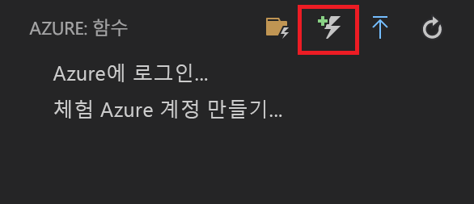

# JavaScript로 첫 번째 지속성 함수 만들기

*Durable Functions*는 서버리스 환경에서 상태 저장 함수를 작성할 수 있게 하는 [Azure Functions](../functions-overview.md)의 확장입니다. 확장은 상태, 검사점 및 다시 시작을 관리합니다.

이 문서에서는 Visual Studio Code Azure Functions를 사용하여 로컬로 “hello world” 지속성 함수를 만들고 테스트하는 방법에 대해 알아봅니다.  이 함수는 다른 함수에 대한 호출을 오케스트레이션하고 함께 연결합니다. 그런 후 함수 코드를 Azure에 게시합니다.

## 필수 조건

이 자습서를 완료하려면 다음이 필요합니다.

* [Visual Studio Code](https://code.visualstudio.com/download)를 설치합니다.

* [최신 Azure Functions 도구](../functions-develop-vs.md#check-your-tools-version)가 있어야 합니다.

* Windows 컴퓨터에서 [Azure Storage 에뮬레이터](../../storage/common/storage-use-emulator.md)가 설치 및 실행되고 있는지 확인합니다. Mac 또는 Linux 컴퓨터에서는 실제 Azure Storage 계정을 사용해야 합니다.

* 버전 8.0 이상 버전의 [Node.js](https://nodejs.org/)가 설치되어 있는지 확인합니다.

[!INCLUDE [quickstarts-free-trial-note](../../../includes/quickstarts-free-trial-note.md)]

[!INCLUDE [functions-install-vs-code-extension](../../../includes/functions-install-vs-code-extension.md)]

[!INCLUDE [functions-create-function-app-vs-code](../../../includes/functions-create-function-app-vs-code.md)]

## Durable Functions npm 패키지 설치

1. 함수 앱의 루트 디렉터리에서 `npm install durable-functions`를 실행하여 `durable-functions` npm 패키지를 설치합니다.

## 시작 함수 만들기

먼저, 지속성 함수 오케스트레이션을 시작하는 HTTP 트리거 함수를 만듭니다.

1. **Azure: Functions**에서 함수 만들기 아이콘을 선택합니다.

    

2. 함수 앱 프로젝트를 사용하여 폴더를 선택하고 **HTTP 트리거** 함수 템플릿을 선택합니다.

    

3. 함수 이름에 `HttpStart`를 입력하고 Enter 키를 누른 다음, **익명** 인증을 선택합니다.

    

    HTTP 트리거 함수에 대한 템플릿을 사용하여 선택한 언어로 함수가 만들어집니다.

4. index.js를 아래 JavaScript로 바꿉니다.

    [!code-javascript[Main](~/samples-durable-functions/samples/javascript/HttpStart/index.js)]

5. function.json을 아래 JSON으로 바꿉니다.

    [!code-json[Main](~/samples-durable-functions/samples/javascript/HttpStart/function.json)]

이제 지속성 함수에 진입점이 생성되었습니다. 오케스트레이터를 추가해 보겠습니다.

## 오케스트레이터 함수 만들기

다음으로, 오케스트레이터가 될 다른 함수를 만듭니다. 편의를 위해 HTTP 트리거 함수 템플릿을 사용합니다. 함수 코드 자체는 오케스트레이터 코드에 의해 대체됩니다.

1. HTTP 트리거 템플릿을 사용하여 두 번째 함수를 만들려면 이전 섹션의 단계를 반복합니다. 이번에는 함수의 이름을 `OrchestratorFunction`이라고 지정합니다.

2. 새 함수에 대한 index.js 파일을 열고 콘텐츠를 다음 코드로 바꿉니다.

    [!code-json[Main](~/samples-durable-functions/samples/javascript/E1_HelloSequence/index.js)]

3. function.json 파일을 열고 다음 JSON으로 바꿉니다.

    [!code-json[Main](~/samples-durable-functions/samples/javascript/E1_HelloSequence/function.json)]

작업 함수를 조정하기 위해 오케스트레이터를 추가했습니다. 참조된 작업 함수를 지금 추가하겠습니다.

## 작업 함수 만들기

1. HTTP 트리거 템플릿을 사용하여 세 번째 함수를 만들려면 이전 섹션의 단계를 반복합니다. 단, 이번에는 함수의 이름을 `E1_SayHello`라고 지정합니다.

2. 새 함수에 대한 index.js 파일을 열고 콘텐츠를 다음 코드로 바꿉니다.

    [!code-javascript[Main](~/samples-durable-functions/samples/javascript/E1_SayHello/index.js)]

3. function.json을 아래 JSON으로 바꿉니다.

    [!code-json[Main](~/samples-durable-functions/samples/csx/E1_SayHello/function.json)]

이제 오케스트레이션을 시작하고 작업 함수를 함께 연결하는 데 필요한 모든 구성 요소를 추가했습니다.

## 로컬에서 함수 테스트

Azure Functions Core Tools를 사용하면 로컬 개발 컴퓨터에서 Azure Functions 프로젝트를 실행할 수 있습니다. Visual Studio Code에서 처음으로 함수를 시작할 때 이러한 도구를 설치하도록 요구하는 메시지가 표시됩니다.  

1. Windows 컴퓨터에서 Azure Storage 에뮬레이터를 시작하고 local.settings.json의 **AzureWebJobsStorage** 속성이 `UseDevelopmentStorage=true`로 설정되어 있는지 확인합니다. Mac 또는 Linux 컴퓨터에서는 **AzureWebJobsStorage** 속성을 기존 Azure Storage 계정의 연결 문자열로 설정해야 합니다. 스토리지 계정은 이 문서의 뒷부분에서 만듭니다.

2. 함수를 테스트하려면 함수 코드에 중단점을 설정하고 F5 키를 눌러 함수 앱 프로젝트를 시작합니다. 핵심 도구의 출력이 **터미널** 패널에 표시됩니다. 처음으로 Durable Functions를 사용하는 경우 Durable Functions 확장이 설치되고 빌드하는 데 몇 초 정도 걸릴 수 있습니다.

    > [!NOTE]
    > JavaScript Durable Functions에는 버전 **1.7.0** 이상의 **Microsoft.Azure.WebJobs.Extensions.DurableTask** 확장이 필요합니다. `extensions.csproj` 파일의 Durable Functions 확장 버전이 이 요구 사항을 충족하는지 확인합니다. 충족하지 않으면 함수 앱을 중지하고 버전을 변경한 다음, F5 키를 눌러 함수 앱을 다시 시작합니다.

3. **터미널** 패널에서 HTTP 트리거 함수의 URL 엔드포인트를 복사합니다.

    

4. `{functionName}`을 `OrchestratorFunction`로 바꿉니다.

5. [Postman](https://www.getpostman.com/) 또는 [cURL](https://curl.haxx.se/)과 같은 도구를 사용하여 HTTP POST 요청을 URL 엔드포인트로 보냅니다.

6. 디버깅을 중지하려면 VS Code에서 Shift+F1을 누릅니다.

함수가 로컬 컴퓨터에서 제대로 실행되는지 확인한 후에 해당 프로젝트를 Azure에 게시해야 합니다.

[!INCLUDE [functions-create-function-app-vs-code](../../../includes/functions-sign-in-vs-code.md)]

[!INCLUDE [functions-publish-project-vscode](../../../includes/functions-publish-project-vscode.md)]

## Azure에서 함수 테스트

1. **출력** 패널에서 HTTP 트리거의 URL을 복사합니다. HTTP 트리거 함수를 호출하는 URL은 다음 형식이어야 합니다.

        http://<functionappname>.azurewebsites.net/orchestrators/<functionname>

2. HTTP 요청에 대한 이러한 새 URL을 브라우저의 주소 표시줄에 붙여넣습니다. 게시된 앱을 사용하는 경우 앞으로 같은 상태 응답을 가져와야 합니다.

## 다음 단계

Visual Studio Code를 사용하여 JavaScript 지속성 함수 앱을 만들고 게시했습니다.

> [!div class="nextstepaction"]
> [일반적인 지속성 함수 패턴에 대해 알아보기](durable-functions-concepts.md)