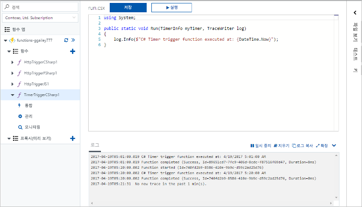
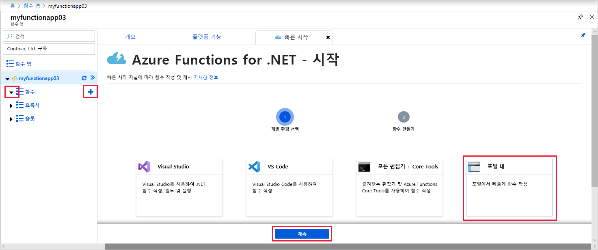

# Azure에서 타이머에 따라 트리거되는 함수 만들기

Azure Functions를 사용하여 정의한 일정에 따라 실행되는 [서버를 사용하지 않는](https://azure.microsoft.com/solutions/serverless/) 함수를 만드는 방법을 알아봅니다.

## 필수 조건

이 자습서를 완료하려면 다음이 필요합니다.

+ Azure 구독이 아직 없는 경우 시작하기 전에 [체험 계정](https://azure.microsoft.com/free/?WT.mc_id=A261C142F)을 만듭니다.

## Azure 함수 앱 만들기

[!INCLUDE [Create function app Azure portal](../../includes/functions-create-function-app-portal.md)]

다음으로 새 함수 앱에서 함수를 만듭니다.

## 타이머 트리거 함수 만들기

1. 함수 앱을 확장한 후 **함수** 옆의 **+** 단추를 클릭합니다. 함수 앱의 첫 번째 함수인 경우 **포털 내**를 선택한 다음, **계속**을 선택합니다. 그렇지 않으면 3단계로 이동합니다.

   

2. **추가 템플릿**, **템플릿 마침 및 보기**를 차례로 선택합니다.

    

3. 검색 필드에서 `timer`를 입력하고 이미지 아래의 테이블에 지정된 설정을 사용하여 새 트리거를 구성합니다.

    

    | 설정 | 제안 값 | 설명 |
    |---|---|---|
    | **Name** | 기본값 | 타이머 트리거 함수의 이름을 정의합니다. |
    | **일정** | 0 \*/1 \* \* \* \* | 1분마다 함수가 실행되도록 예약하는 6개 필드의 [CRON 식](functions-bindings-timer.md#ncrontab-expressions)입니다. |

4. **만들기**를 클릭합니다. 함수는 1분마다 실행되는 선택한 언어로 생성됩니다.

5. 로그에 기록된 추적 정보를 확인하여 실행을 확인합니다.

    

이제 함수의 일정을 변경하여 1분이 아니라 1시간에 한 번 실행되도록 합니다.

## 타이머 일정 업데이트

1. 함수를 확장하고 **통합**을 클릭합니다. 여기서 함수에 대한 입력 및 출력 바인딩을 정의하고 일정도 설정합니다. 

2. `0 0 */1 * * *`의 새 시간 단위 **일정** 값을 입력한 후 **저장**을 클릭합니다.  

함수는 이제 한 시간마다 한 번씩 실행됩니다. 

## 리소스 정리

[!INCLUDE [Next steps note](../../includes/functions-quickstart-cleanup.md)]

## 다음 단계

일정에 따라 실행되는 함수를 만들었습니다. 타이머 트리거에 대한 자세한 내용은 [Azure Functions를 사용하여 코드 실행 예약](functions-bindings-timer.md)을 참조하세요.

[!INCLUDE [Next steps note](../../includes/functions-quickstart-next-steps.md)]
