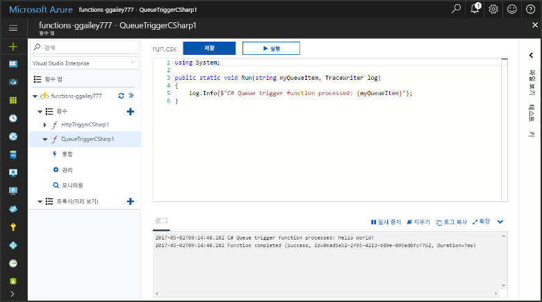
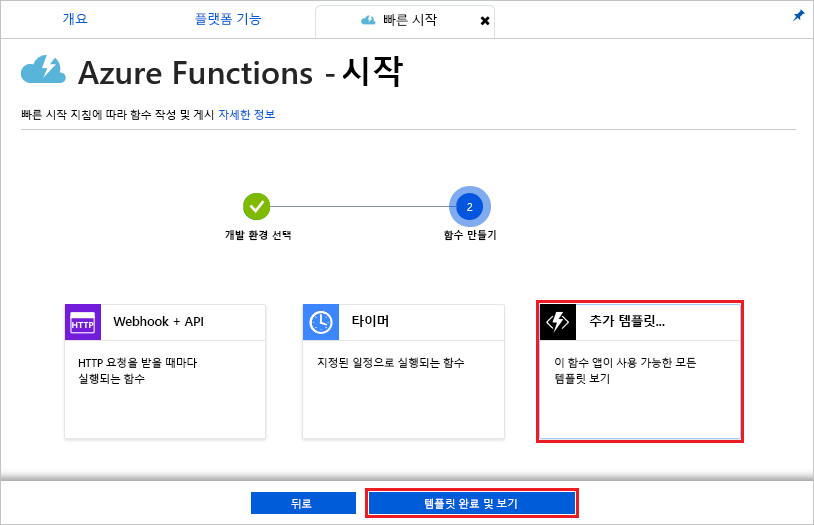
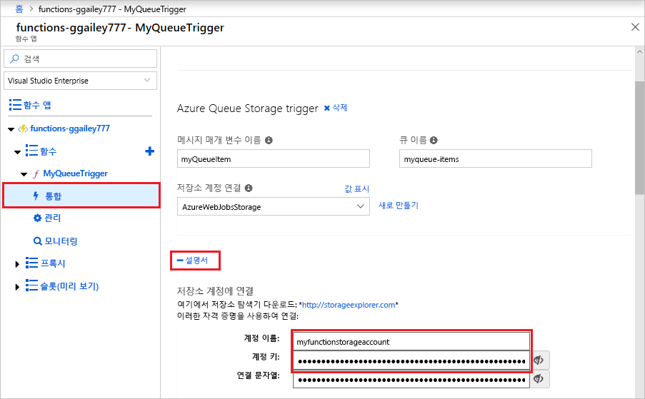
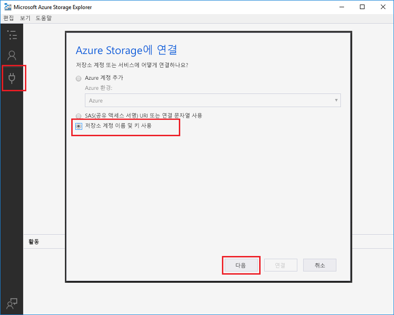
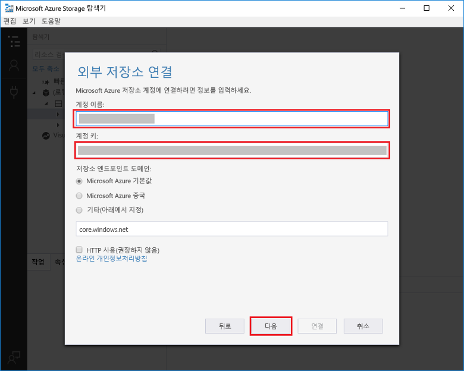
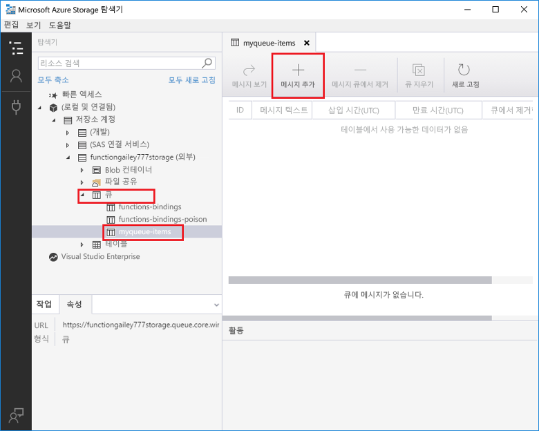

# Azure Queue Storage에 의해 트리거되는 함수 만들기

Azure Storage 큐에 메시지가 제출될 때 트리거되는 함수를 만드는 방법을 알아봅니다.

## 필수 조건

- [Microsoft Azure Storage 탐색기](http://storageexplorer.com/)를 다운로드하고 설치합니다.

- Azure 구독. 구독이 없으면 시작하기 전에 [계정](https://azure.microsoft.com/free/?WT.mc_id=A261C142F)을 만드세요.

## Azure Function 앱 만들기

[!INCLUDE [Create function app Azure portal](../../includes/functions-create-function-app-portal.md)]

다음으로 새 함수 앱에서 함수를 만듭니다.

## 큐 트리거 함수 만들기

1. 함수 앱을 확장한 후 **함수** 옆의 **+** 단추를 클릭합니다. 함수 앱의 첫 번째 함수인 경우 **포털 내**를 선택한 다음, **계속**을 선택합니다. 그렇지 않으면 3단계로 이동합니다.

   

1. **추가 템플릿**, **템플릿 마침 및 보기**를 차례로 선택합니다.

    

1. 검색 필드에서 `queue`를 입력한 다음, **큐 트리거** 템플릿을 선택합니다.

1. 메시지가 표시되면 **설치**를 선택하여 함수 앱에 Azure Storage 확장과 모든 종속성을 설치합니다. 설치가 완료되면 **계속**을 선택합니다.

    

1. 이미지 아래의 표에 지정된 설정을 사용합니다.

    

    | 설정 | 제안 값 | 설명 |
    |---|---|---|
    | **Name** | 함수 앱에서 고유 | 큐 트리거 함수의 이름입니다. |
    | **큐 이름**   | myqueue-items    | Storage 계정에서 연결할 큐의 이름입니다. |
    | **Storage 계정 연결** | AzureWebJobStorage | 함수 앱에 이미 사용된 저장소 계정 연결을 사용하거나 새로 만들 수 있습니다.  |    

1. **만들기**를 클릭하여 사용자의 함수를 만듭니다.

다음으로 Azure Storage 계정에 연결하고 **myqueue-items** 저장소 큐를 만듭니다.

## 큐 만들기

1. 함수에서 **통합**을 클릭하고 **설명서**를 확장하여 **계정 이름** 및 **계정 키**를 모두 복사합니다. 이러한 자격 증명을 사용하여 Azure Storage 탐색기에서 저장소 계정에 연결합니다. 저장소 계정에 이미 연결된 경우 4단계로 건너뜁니다.

    

1. [Microsoft Azure Storage 탐색기](http://storageexplorer.com/) 도구를 실행하고 왼쪽의 연결 아이콘을 클릭하고 **저장소 계정 이름 및 키 사용**을 선택하고 **다음**을 클릭합니다.

    

1. 1단계에서 **계정 이름** 및 **계정 키**를 입력하고 **다음**을 클릭한 후 **연결**을 클릭합니다.

    

1. 연결된 저장소 계정을 확장하고 **큐**를 마우스 오른쪽 단추로 클릭하고 **큐 만들기**를 클릭하고 `myqueue-items`를 입력한 후 Enter 키를 누릅니다.

    

이제 저장소 큐가 있고 메시지를 큐에 추가하여 함수를 테스트할 수 있습니다.

## 함수 테스트

1. Azure Portal로 돌아가서 함수를 찾은 후 페이지 맨 아래에 있는 **로그**를 확장하고 로그 스트리밍이 일시 중지되지 않았는지 확인합니다.

1. Storage 탐색기에서 저장소 계정, **큐** 및 **myqueue-items**를 확장한 후 **메시지 추가**를 클릭합니다.

    

1. "Hello World!" 메시지를 **메시지 텍스트**에 입력하고 **확인**을 클릭합니다.

1. 몇 초 동안 기다린 다음 함수 로그로 돌아가서 새 메시지를 큐에서 읽었는지 확인합니다.

    

1. Storage 탐색기로 돌아가 **새로 고침**을 클릭하고 메시지가 처리되고 더 이상 큐에 없는지 확인합니다.

## 리소스 정리

[!INCLUDE [Next steps note](../../includes/functions-quickstart-cleanup.md)]

## 다음 단계

저장소 큐에 메시지가 추가될 때 실행되는 함수를 만들었습니다.

[!INCLUDE [Next steps note](../../includes/functions-quickstart-next-steps.md)]

Queue Storage 트리거에 대한 자세한 내용은 [Azure Functions Storage 큐 바인딩](functions-bindings-storage-queue.md)을 참조하세요.
