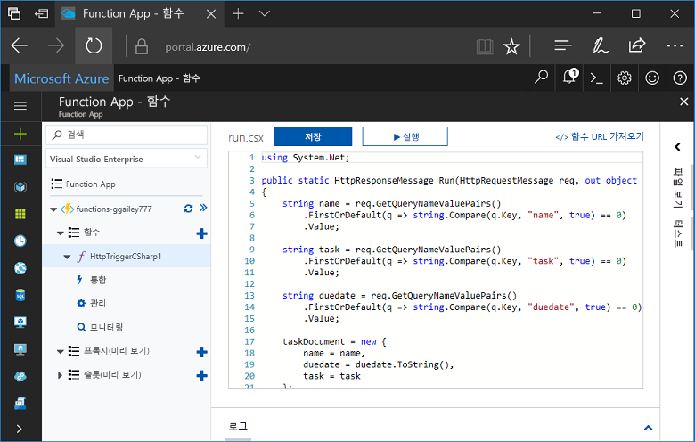
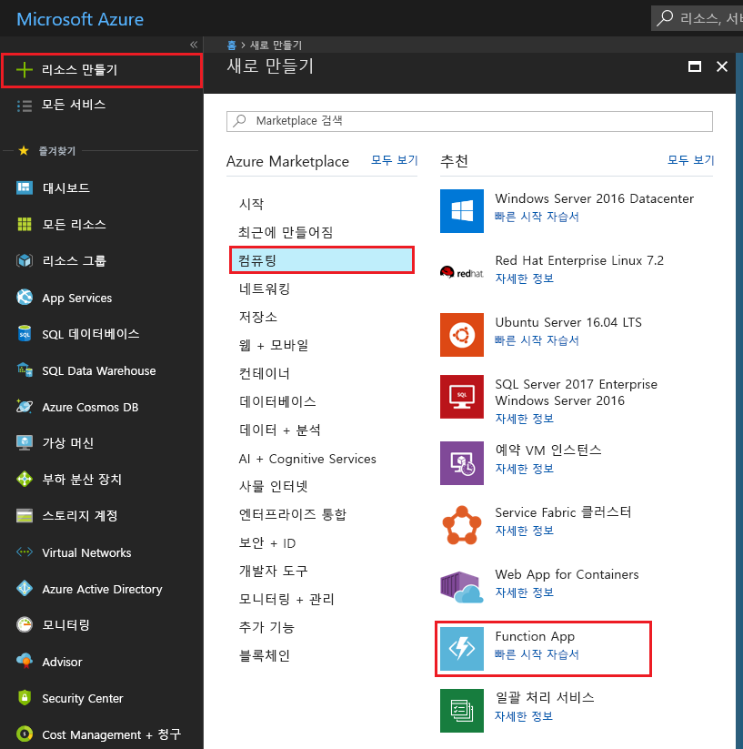
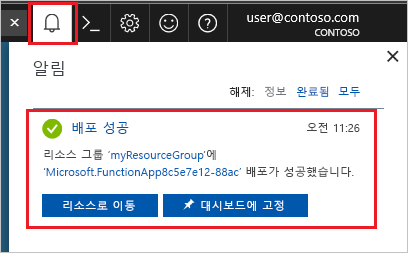

# Azure for Students Starter를 사용하여 함수 만들기

이 자습서에서는 Azure for Students Starter 구독에서 hello world HTTP 함수를 만듭니다. 또한 이 구독 형식의 Azure Functions에서 사용할 수 있는 기능도 알아봅니다.

Microsoft *Azure for Students Starter*를 사용하면 비용을 들이지 않고 클라우드에서 개발하는 데 필요한 Azure 제품을 시작할 수 있습니다. [여기에서 이 제품에 대해 자세히 알아보세요.](https://azure.microsoft.com/offers/ms-azr-0144p/)

Azure Functions를 사용하면 먼저 VM을 만들거나 웹 애플리케이션을 게시하지 않고도 [서버를 사용하지 않는](https://azure.microsoft.com/solutions/serverless/) 환경에서 코드를 실행할 수 있습니다. [여기에서 Functions에 대해 자세히 알아보세요.](./functions-overview.md)

## 함수 만들기

 이 항목에서는 Azure Portal에서 함수를 사용하여 HTTP 트리거 "hello world" 함수를 만드는 방법을 보여 줍니다.

## Azure에 로그인

Azure 계정을 사용하여 <https://portal.azure.com>에서 Azure Portal에 로그인합니다.

## 함수 앱 만들기

함수 실행을 호스트하는 함수 앱이 있어야 합니다. 함수 앱을 통해 함수를 논리 단위로 그룹화하여 더욱 쉽게 관리, 배포 및 리소스 공유할 수 있습니다. 

1. Azure Portal의 왼쪽 위 모서리에 있는 **새로 만들기** 단추를 선택한 다음, **계산** > **함수 앱**을 차례로 선택합니다.

    

2. 이미지 아래 표에 지정된 것처럼 함수 앱 설정을 사용합니다.

    

    | 설정      | 제안 값  | 설명                                        |
    | ------------ |  ------- | -------------------------------------------------- |
    | **앱 이름** | 전역적으로 고유한 이름 | 새 함수 앱을 식별하는 이름입니다. 유효한 문자는 `a-z`, `0-9` 및 `-`입니다.  | 
    | **구독** | 사용자의 구독 | 이 새 함수 앱이 만들어질 구독입니다. | 
    | **[리소스 그룹](../azure-resource-manager/resource-group-overview.md)** |  myResourceGroup | 함수 앱을 만들 새 리소스 그룹의 이름입니다. |
   | **[App Service 계획/위치](./functions-scale.md)** | 새로 만들기 | 함수 앱이 배포되는 지역 및 리소스 밀도를 제어하는 호스팅 계획입니다. 동일한 계획에 배포된 여러 함수 앱은 모두 동일한 단일 무료 인스턴스를 공유합니다. 이러한 측면이 Student Starter 계획의 제한 사항입니다. 전체 호스팅 옵션은 [여기에 설명되어 있습니다.](./functions-scale.md)|
    | **런타임 스택** | 기본 설정 언어 | 즐겨찾는 함수 프로그래밍 언어를 지원하는 런타임을 선택합니다. C# 및 F# 함수의 경우 **.NET**을 선택합니다. |
    |**[Application Insights](./functions-monitoring.md)**| 사용 | Application Insights는 함수 앱의 로그를 저장 및 분석하는 데 사용됩니다. Application Insights를 지원하는 위치를 선택하면 기본적으로 사용하도록 설정됩니다. Application Insights는 Application Insights를 배포할 가까운 지역을 수동으로 선택하여 모든 함수에 사용할 수 있습니다. Application Insights가 없으면 라이브 스트리밍 로그만 볼 수 있습니다.

3. 위의 **App Service 계획/위치**를 선택하여 다른 위치를 선택합니다.

4. **새로 만들기**를 선택한 후 계획에 고유한 이름을 부여합니다.

5. 가장 가까운 위치를 선택합니다. [여기에서 Azure 지역의 전체 지도를 참조하세요.](https://azure.microsoft.com/global-infrastructure/regions/) 

    

6. **만들기**를 선택하여 함수 앱을 프로비전하고 배포합니다.

    

7. 포털의 오른쪽 위 모서리에 있는 [알림] 아이콘을 선택하고 **배포 성공** 메시지가 표시될 때까지 기다립니다.

    

8. **리소스로 이동**을 선택하여 함수 앱을 봅니다.

다음으로 새 함수 앱에서 함수를 만듭니다.

## HTTP 트리거 함수 만들기

1. 새 함수 앱을 펼치고, **Functions** 옆에 있는 **+** 단추를 선택하고, **포털 내**를 선택한 다음, **계속**을 선택합니다.

    

1. **Webhook + API**를 선택한 다음, **만들기**를 선택합니다.

    

HTTP 트리거 함수에 대한 언어별 템플릿을 사용하여 함수가 만들어집니다.

이제 HTTP 요청을 전송하여 새 함수를 실행할 수 있습니다.

## 함수 테스트

1. 새 함수에서 오른쪽 맨 위에 있는 **</> 함수 URL 가져오기**를 클릭하고 **기본값(함수 키)** 를 선택한 후 **복사**를 클릭합니다. 

    

2. 함수 URL을 브라우저의 주소 표시줄에 붙여 넣습니다. `&name=<yourname>` 쿼리 문자열을 이 URL의 마지막에 추가하고 키보드에서 `Enter` 키를 눌러 요청을 실행합니다. 브라우저에 함수에서 반환한 응답이 표시될 것입니다.  

    다음 예에서는 브라우저의 응답을 보여 줍니다.

    

    요청 URL에는 기본적으로 HTTP를 통해 함수에 액세스하는 데 필요한 키가 포함됩니다.

3. 함수가 실행되면 추적 정보가 로그에 기록됩니다. 이전 실행에서 추적 출력을 보려면 포털에서 함수로 돌아가 화면 맨 아래에서 위쪽 화살표를 클릭하여 **로그**를 확장합니다.

   

## 리소스 정리

[!INCLUDE [Clean-up resources](../../includes/functions-quickstart-cleanup.md)]

## Azure for Students Starter의 지원되는 기능

Azure for Student Starter에서는 아래의 주요 제한 사항을 제외하고, Azure Functions 런타임의 기능 대부분에 액세스할 수 있습니다.

* 트리거 유형으로는 HTTP 트리거만 지원됩니다.
    * 모든 입력 및 모든 출력 바인딩이 지원됩니다. [여기에서 전체 목록을 참조하세요.](functions-triggers-bindings.md)
* 지원되는 언어: 
    * C#(.NET Core 2)
    * Javascript(Node.js 8 및 10)
    * F#(.NET Core 2)
    * [여기에서 상위 계획에서 지원되는 언어를 참조하세요.](supported-languages.md)
* Windows는 유일하게 지원되는 운영 체제입니다.
* 확장은 매일 최대 60분 동안 실행되는 [하나의 무료 계층 인스턴스](https://azure.microsoft.com/pricing/details/app-service/windows/)로 제한됩니다. HTTP 트래픽이 수신될 때 서버리스 방식으로 0에서 1개로 인스턴스를 자동으로 확장하게 되지만 추가 확장은 가능하지 않습니다.
* [2.x 런타임](functions-versions.md)만 지원됩니다.
* 모든 개발자 도구는 함수 편집 및 게시를 지원합니다. 여기에는 VS Code, Visual Studio, Azure CLI 및 Azure Portal이 포함됩니다. 포털 이외의 도구를 사용하려는 경우 먼저 포털에서 앱을 만든 후, 기본 설정 도구에서 해당 앱을 배포 대상으로 선택해야 합니다.

## 다음 단계

간단한 HTTP 트리거 함수가 있는 함수 앱을 만들었습니다. 이제 로컬 도구, 추가 언어, 모니터링 및 통합에 대해 알아볼 수 있습니다.

 * [Visual Studio를 사용하여 첫 번째 함수 만들기](./functions-create-your-first-function-visual-studio.md)
 * [Visual Studio Code를 사용하여 첫 번째 함수 만들기](./functions-create-first-function-vs-code.md)
 * [Azure Functions JavaScript 개발자 가이드](./functions-reference-node.md)
 * [Azure Functions를 사용하여 Azure SQL Database에 연결](./functions-scenario-database-table-cleanup.md)
 * [Azure Functions HTTP 바인딩에 대해 자세히 알아보기](./functions-bindings-http-webhook.md)
 * [Azure Functions 모니터링](./functions-monitoring.md)
