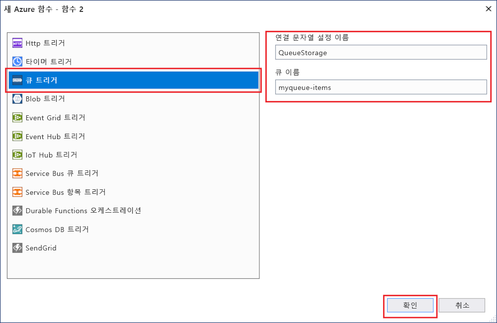

# <a name="azure-functions-tools-for-visual-studio"></a>Azure Functions Tools for Visual Studio  

Azure Functions Tools for Visual Studio 2017은 C# 함수를 Azure에 개발, 테스트 및 배포할 수 있는 Visual Studio에 대한 확장입니다. Azure Functions을 처음으로 접하는 경우라면 [Azure Functions 소개](functions-overview.md)에서 자세한 내용을 확인할 수 있습니다.

Azure Functions 도구는 다음과 같은 이점을 제공합니다. 

* 로컬 개발 컴퓨터에서 함수를 편집, 빌드 및 실행합니다. 
* Azure에 직접 Azure Functions 프로젝트를 게시합니다. 
* 바인딩 정의에 대한 별도 function.json을 유지하는 대신 WebJobs 특성을 사용하여 함수 바인딩을 C# 코드에 직접 선언합니다.
* 미리 컴파일된 C# 함수를 개발하고 배포합니다. 미리 컴파일된 함수는 C# 스크립트 기반 함수보다 더 뛰어난 콜드 부팅 성능을 제공합니다. 
* Visual Studio 개발의 모든 이점을 누리면서 C#에서 함수를 코딩합니다. 

이 토픽에서는 Azure Functions Tools for Visual Studio 2017을 사용하여 C#에서 함수를 개발하는 방법을 보여 줍니다. 또한 .NET 어셈블리로 Azure에 프로젝트를 게시하는 방법도 알아 봅니다.

## <a name="prerequisites"></a>필수 조건

Azure Functions 도구는 [Visual Studio 2017 버전 15.3](https://www.visualstudio.com/vs/) 이상에서 Azure 개발 워크로드의 일부로 제공됩니다. Visual Studio 2017 버전 15.3 설치에 **Azure 개발** 워크로드가 포함되어 있는지 확인합니다.


[!INCLUDE [Create a project using the Azure Functions](../../includes/functions-vstools-install-note.md)] 

함수를 만들고 배포하려면 다음이 필요합니다.

* 활성 Azure 구독. Azure 구독이 아직 없는 경우 [무료 계정](https://azure.microsoft.com/free/?WT.mc_id=A261C142F)을 사용할 수 있습니다.

* Azure 저장소 계정. 저장소 계정을 만들려면 [저장소 계정 만들기](../storage/common/storage-create-storage-account.md#create-a-storage-account)를 참조하세요.  
## <a name="create-an-azure-functions-project"></a>Azure Functions 프로젝트 만들기 

[!INCLUDE [Create a project using the Azure Functions](../../includes/functions-vstools-create.md)]


## <a name="configure-the-project-for-local-development"></a>로컬 개발에 대한 프로젝트 구성

Azure Functions 템플릿을 사용하여 새 프로젝트를 만들 때 다음 파일이 포함된 빈 C# 프로젝트를 가져옵니다.

* **host.json**: 함수 호스트를 구성할 수 있습니다. 이러한 설정은 로컬 및 Azure에서 실행할 때 모두 적용됩니다. 자세한 내용은 [host.json 참조](functions-host-json.md)를 참조하세요.
    
* **local.settings.json**: 함수를 로컬로 실행할 때 사용되는 설정을 유지합니다. 이러한 설정은 Azure에서 사용되지 않으며, [Azure Functions 핵심 도구](functions-run-local.md)에서 사용됩니다. 이 파일을 사용하여 연결 문자열과 같은 설정을 다른 Azure 서비스에 지정합니다. 프로젝트에서 함수에 필요한 각 연결에 대한 **값** 배열에 새 키를 추가합니다. 자세한 내용은 Azure Functions 핵심 도구 토픽의 [로컬 설정 파일](functions-run-local.md#local-settings-file)을 참조하세요.

함수 런타임에서 Azure Storage 계정을 내부적으로 사용합니다. HTTP 및 웹후크 이외의 모든 트리거 형식을 위해 **Values.AzureWebJobsStorage** 키를 유효한 Azure Storage 계정 연결 문자열에 설정해야 합니다.

[!INCLUDE [Note to not use local storage](../../includes/functions-local-settings-note.md)]

 저장소 계정 연결 문자열을 설정하려면 다음을 수행합니다.

1. Visual Studio에서 **클라우드 탐색기**를 열고 **저장소 계정** > **저장소 계정**을 확장한 후 **속성**을 선택하고 **기본 연결 문자열** 값을 복사합니다.   

2. 사용자 프로젝트에서 local.settings.json 프로젝트 파일을 열고 **AzureWebJobsStorage** 키의 값을 복사한 연결 문자열로 설정합니다.

3. 이전 단계를 반복하여 사용자의 함수에 필요한 다른 연결에 대한 **값** 배열에 고유 키를 추가합니다.  

## <a name="create-a-function"></a>함수 만들기

미리 컴파일된 함수에서 함수에 사용된 바인딩은 코드에 특성을 적용함에 따라 정의됩니다. Azure Functions 도구를 사용하여 제공된 템플릿에서 함수를 만들 때 이러한 특성이 적용됩니다. 

1. **솔루션 탐색기**에서 프로젝트 노드를 마우스 오른쪽 단추로 클릭하고 **추가** > **새 항목**을 차례로 선택합니다. **Azure Function**을 선택하고 클래스에 사용할 **이름**을 입력하고 **추가**를 클릭합니다.

2. 사용자의 트리거를 선택하고, 바인딩 속성을 설정한 후, **만들기**를 클릭합니다. 다음 예제에서는 Queue Storage 트리거 함수를 만들 때 설정을 보여 줍니다. 

    
    
    local.settings.json 파일에 정의된 **QueueStorage**라고 명명된 연결 문자열 키가 제공됩니다. 
 
3. 새로 추가된 클래스를 검사합니다. **FunctionName** 특성으로 보이는 정적 **실행** 메서드가 표시됩니다. 이 특성은 메서드가 함수에 대한 진입점임을 나타냅니다. 

    예를 들어 다음 C# 클래스는 기본 Queue Storage 트리거 함수를 나타냅니다.

    ````csharp
    using System;
    using Microsoft.Azure.WebJobs;
    using Microsoft.Azure.WebJobs.Host;
    
    namespace FunctionApp1
    {
        public static class Function1
        {
            [FunctionName("QueueTriggerCSharp")]        
            public static void Run([QueueTrigger("myqueue-items", Connection = "QueueStorage")]string myQueueItem, TraceWriter log)
            {
                log.Info($"C# Queue trigger function processed: {myQueueItem}");
            }
        }
    } 
    ````
 
    바인딩 고유 특성은 진입점 메서드에 적용되는 각 바인딩 매개 변수에 적용됩니다. 특성은 매개 변수로 바인딩 정보를 사용합니다. 이전 예제에서 첫 매개 변수는 큐 트리거 함수를 나타내는 **QueueTrigger** 특성이 적용되었습니다. 큐 이름 및 연결 문자열 설정 이름은 매개 변수로 전달됩니다.  

## <a name="testing-functions"></a>테스팅 함수

Azure Functions Core 도구를 사용하면 로컬 개발 컴퓨터에서 Azure Functions 프로젝트를 실행할 수 있습니다. Visual Studio에서 처음으로 함수를 시작할 때 이 도구를 설치하도록 요구하는 메시지가 표시됩니다.  

함수를 테스트하려면 F5 키를 누릅니다. 메시지가 표시되면 Visual Studio에서 Azure Functions Core(CLI) 도구를 다운로드하여 설치하도록 요구하는 요청을 수락합니다.  또한 도구에서 HTTP 요청을 처리할 수 있도록 방화벽 예외를 사용하도록 설정해야 합니다.

실행 중인 프로젝트와 함께 배포된 함수를 테스트할 때 코드를 테스트할 수 있습니다. 자세한 내용은 [Azure Functions에서 코드를 테스트하기 위한 전략](functions-test-a-function.md)을 참조하세요. 디버그 모드에서 실행할 때 중단점이 예상대로 Visual Studio에서 적중됩니다. 

큐 트리거 함수를 테스트하는 방법에 대한 예제는 [큐 트리거 함수 빠른 시작 자습서](functions-create-storage-queue-triggered-function.md#test-the-function)를 참조하세요.  

Azure Functions 핵심 도구 사용에 대한 자세한 내용은 [Azure Functions를 로컬로 코딩 및 테스트](functions-run-local.md)를 참조하세요.

## <a name="publish-to-azure"></a>Azure에 게시

[!INCLUDE [Publish the project to Azure](../../includes/functions-vstools-publish.md)]

>[!NOTE]  
>local.settings.json에서 추가한 모든 설정을 Azure의 함수 앱에도 추가해야 합니다. 이러한 설정은 자동으로 추가되지 않습니다. 다음 방법 중 하나로 필요한 설정을 함수 앱에 추가할 수 있습니다.
>
>* [Azure Portal 사용](functions-how-to-use-azure-function-app-settings.md#settings)
>* [`--publish-local-settings` Azure Functions 핵심 도구의 게시 옵션](functions-run-local.md#publish) 사용
>* [Azure CLI 사용](/cli/azure/functionapp/config/appsettings#set) 

## <a name="next-steps"></a>다음 단계

Azure Functions 도구에 대한 자세한 내용은 [Azure Functions에 대한 Visual Studio 2017 도구](https://blogs.msdn.microsoft.com/webdev/2017/05/10/azure-function-tools-for-visual-studio-2017/) 블로그 게시물의 일반적인 질문 섹션을 참조하세요.

Azure Functions 핵심 도구에 대한 자세한 내용은 [Azure Functions를 로컬로 코딩 및 테스트](functions-run-local.md)를 참조하세요.  
.NET 클래스 라이브러리로 기능을 개발하는 방법에 대해 자세히 알아보려면 [Azure Functions에서 .NET 클래스 라이브러리 사용](functions-dotnet-class-library.md)을 참조하세요. 이 항목에서는 특성을 사용하여 Azure Functions에서 지원하는 다양한 유형의 바인딩을 선언하는 방법의 예를 제공합니다.    
